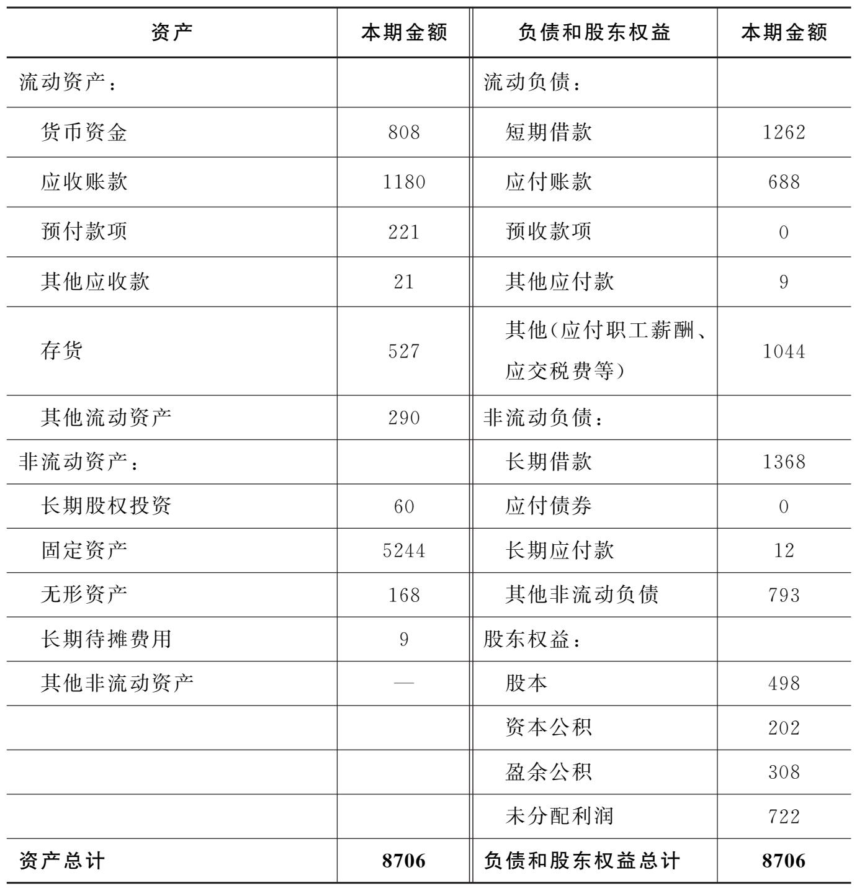

# 《一本书读懂财报》读书笔记

## 资产负债表

1.制作财务报表的目的：用来描述一家企业的经济活动。那么一家企业都会从事哪些经济活动呢？

- 经营活动：企业生产产品、销售产品、回收贷款等。
- 投资活动：企业想到新地区开展业务、想进入新领域、设计新产品，都需要投资。
- 筹资活动：公司缺钱了，必须向银行借钱，或找别人投资自己。

2.资产负债表

资产：

- 流动资产：企业可以**在一年或一个营业周期内变现或运用**的资产。
  - 货币资金：说白了就是钱，放在公司的钱（库存现金）、放在银行的钱（银行存款）、其他货币资金。
  - 应收账款：在销售产品时出现卖掉产品却收不到钱的情况发生。应收账款是**核算企业因销售商品、提供劳务等经营活动应收取的款项。**
  - 预付款项：暂存在卖方处，买方还没有获得产品。
  - 其他应收款：老板好朋友的公司临时周转不开借钱，这笔钱显然不是投资，实际上是应收款，但不是销售产品所得，区别于”应收账款“。
    - 在实际情况中，某些企业其他应收款高达几十亿，这表面上是”借“的行为，实际上是占用，这是因为企业可能与关联方进行了一些交易。
  - 存货：生产产品原材料、产成品、未完工的在产品。
    - 原材料：产品加工原料
    - 在产品：正在制造尚未完工的产品，包括未加工的和加工完成但未检验的
    - 半成品：已检验合格的中间产品，仍需要进一步加工为成品
    - 产成品：完成生产、验收、入库，以按照合同规定交付的产品
    - 商品：用于销售的商品
    - 周转材料：企业能多次使用、但不符合固定资产定义的材料。比如包装物、工具、玻璃器皿等。
- 非流动性资产
  - 长期股票投资：对被投资单位实施控制或有重大影响的权益性投资。
  - 固定资产：具有下列特征的有形资产：(1)为生产商品、提供劳务、出租或经营管理而持有的；(2)使用寿命超过一个会计年度。
    - 折旧：某些固定资产会逐渐损耗，会计在记账时，需要不断描述这个损耗量。
  - 
