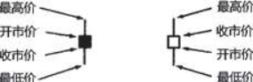
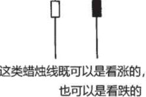
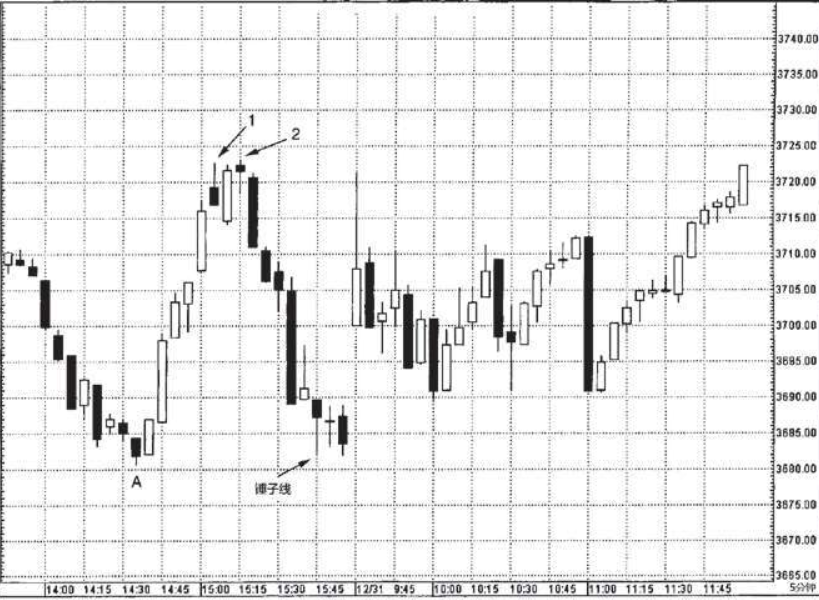
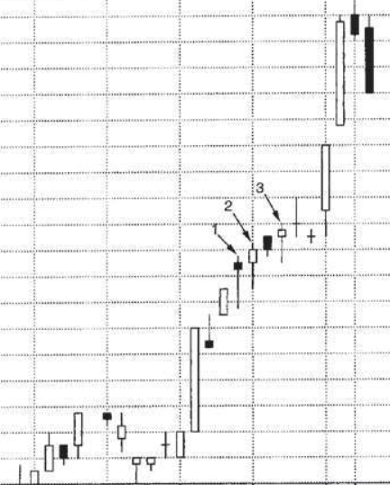
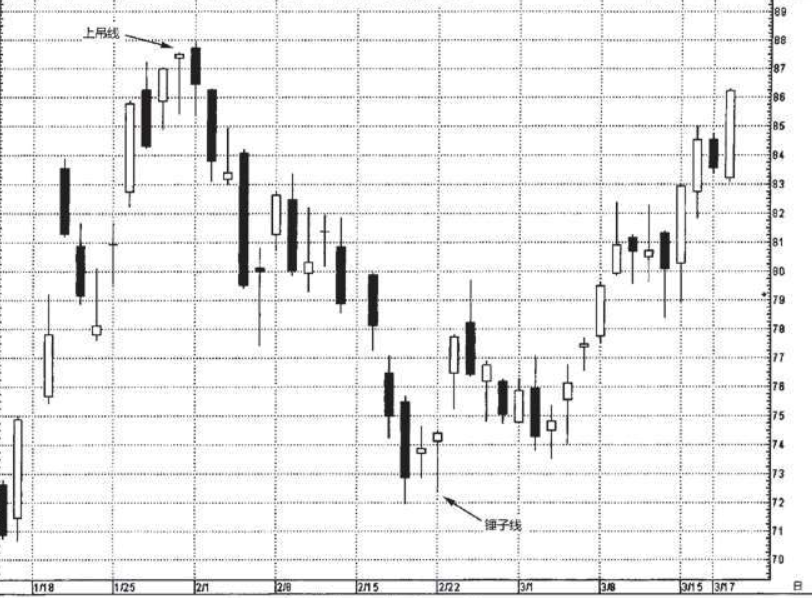
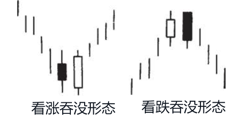

# 《日本蜡烛图技术：古老东方投资术的现代指南 》读书笔记

## 关于本书

> 书名：日本蜡烛图技术：古老东方投资术的现代指南
>
> 作者：史蒂夫·尼森(美)
>
> 自我评分：★★★
>
> 阅读时间：2023年12月

## 读时笔记

### 蜡烛图绘制方法

1.绘制方法：如果实体是黑色的，则代表当日的收市价低于开市价。如果实体是白色的，则表示当日的收市价高于开市价。

2.实体的部分代表了“实质性的价格运动”。这反映了关于实体的核心概念：**通过实体长度和颜色，一眼便能看出当前行情的图形线索，到底多头占上风还是空头占上风。**

3.既然长白线和长黑线代表着一边倒的单边行情，那么**当实体缩小时，我们就能得到线索，之前的行情势头或许正在减缓。**

4.不过事实上，纺锤蜡烛线的上下影线到底是长是短是无关紧要的。正是因为纺锤线的实体非常小，纺锤线才成为纺锤线。

### 反转形态

1.看到趋势反转信号出现，只是说可能反转，不是说一定就反转。

> 确切地说，趋势反转信号的出现，意味着之前的市场趋势可能发生变化，但是市场并不一定就此逆转到相反的方向。弄清楚这一点，是至关重要的。

2.注意反转信号要与市场主要趋势一致。

> 这里有一条重要原则：只有当反转信号所指的方向与市场的主要趋势方向一致时，我们才能依据这个反转信号来开立新头寸。

#### 伞形线

特点：

1. 长下影线，**下影线长度至少为实体的2倍**；
2. 实体较小，并且实体在顶端，颜色无所谓；
3. 不该有上影线，或者上影线非常短；

在下跌趋势中，伞形线（锤子线）的出现代表着下跌趋势即将结束的信号。

在上涨趋势中，伞形线（上吊线）表明之前的市场运动也许已经结束。

区分锤子线和上吊线：

- 趋势：锤子线只能紧接在下跌行情后出现；上吊线必须紧接在上涨行情后出现。
- 蜡烛线出现之前行情运动的区间：锤子线之前即便只有短线下跌也是有效的；但是，上吊线之前必须具备长足的上冲行情，最好是创下行情全历史新高后，方为有效。
- 验证信号：后文还将介绍，上吊线出现后得到验证方为有效；对锤子线则无此要求。

锤子线的含义：当天交易过程中，市场先急剧下挫，后来却完全反弹上来，收盘在最高价处或附近。本身就有看涨的意味。

锤子线作为底部反转的信号，风险小一点儿的方式是利用锤子线作为潜在买进点位，次日在可能接近止损位置建仓。

锤子线要在支撑位上才有效：下图中如果收盘在3680支撑水平以下，那么看涨预期就失效了。

**上吊线出现后，一定要等其他看跌信号证实！**

验证信号：次日收盘价低于上吊线实体。如果次日收盘低于上吊线实体，那么在上吊线开盘、收盘买入的筹码都会亏损，被“吊”在上面。当然如果上吊线处于历史最高价或新高价，那就更好了。

比如下图中：出现了上吊线，但次日收盘价为当前上涨行情创了新高，所以看跌信号不实。

在下图中：

- 1/29：前面是上涨趋势，上吊线创新高了，次日收盘价低于上吊线实体，上吊线当日开盘、收盘买进的都是亏损的。
- 2/22：前面是下跌趋势，锤子线后走势是反转的。

#### 吞没状态

吞没形态属于主要的反转形态，由两根颜色相反的蜡烛线实体构成。

吞没形态的三条判别标准：

1. 在吞没形态前市场**必须处于明确的上涨或下跌趋势**，哪怕趋势只是短期的。
2. 吞没形态由2根蜡烛线组成，第二根实体必须覆盖第一根实体（上下影线可以不吞没）。
3. 第二个实体必须和第一个实体颜色相反。
   1. 特殊情况：吞没第一根是十字线，在长时间下跌趋势下，十字线被巨大白色实体吞没，可能构成底部反转形态。

强势的吞没形态：

- 第一根实体非常小，第二根实体非常大。第一天反映出原有趋势的驱动力正在消退，第二天长实体反映出新趋势的潜在力量在壮大。
- 第二根实体伴有超额交易量。

