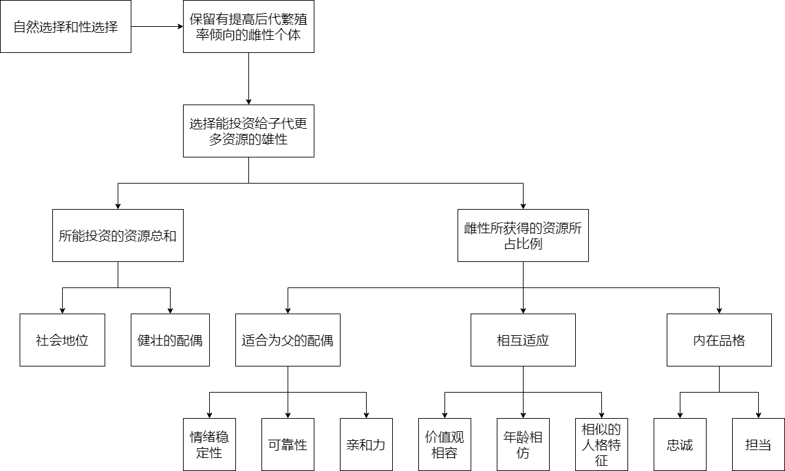
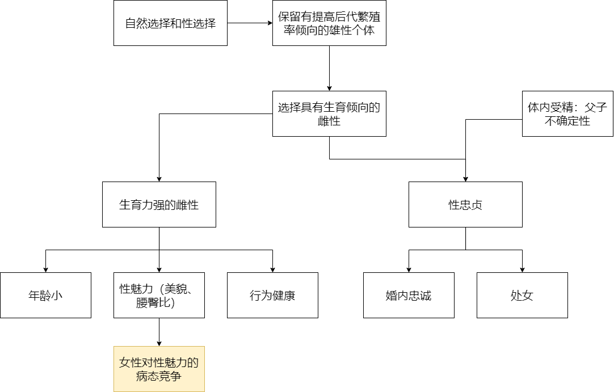
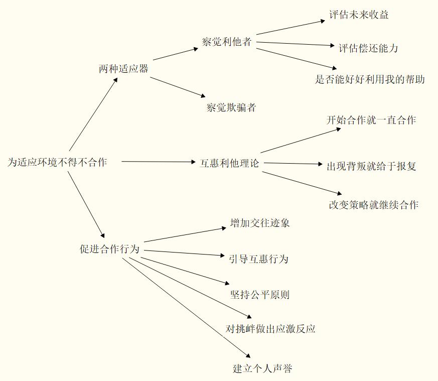

# 《进化心理学》读书笔记
## 关于本书

> 书名：进化心理学
>
> 作者：戴维·巴斯(美)
>
> 自我评分：★★★★★
>
> 阅读时间：2020年11月

## 内容简介

进化心理学的基石是达尔文的进化论和性选择理论，适应环境的策略被保存到今天，这也是男性与女性不仅仅是性别上，更多在思维方式、行为策略上的不同。

## 摘要

### 进化心理学的基石

1.自然选择理论：生物为适应环境而做出的变异、遗传和选择，提高繁殖成功率，扩大生存空间。

性选择理论：

- 同性竞争：指同一性别成员之间的竞争，主要竞争目标在于与异性的交配机会。
- 异性选择：如果某一性别的成员一致认为异性的某些特征正是他们想要的，那么拥有这些特征的异性更有可能获得配偶。而那些不具有这些特征的异性，则得不到配偶。（如孔雀开屏）

2.内含适应性理论：个体行为对遗传亲属的繁殖成功率的影响，它能通过相应的遗传相似度来加权获得。

3.自然选择将倾向于那些能促使有机体的基因得以传播的特性，而不管有机体是否能直接繁殖出后代。亲属身上携带着我们的基因拷贝，所以我们才会对亲属给予照顾，而亲代投资（指对子女的投资）则得到了重新解释——它只不过是照顾亲属的一种特例而已。有机体可以通过帮助他的兄弟姐妹、侄子、外甥等亲属的生存和繁殖来增加他的基因的繁殖成功率，因为上述亲属身上都可能携带着该有机体的基因。

### 女性的长期择偶策略

1.Trivers认为，如果某种性别的个体（通常是雌性，但也有例外）在后代身上投入了更多的资源，那么这种性别的个体在挑选配偶时会表现得更加谨慎和敏锐。相反，投资较少的那种性别将不会如此挑剔，但它们会表现出很强的同性竞争倾向，主要是为了争夺更有价值、投资更多的异性。换句话说，有机体在繁殖上的投资越高，那它选择一个糟糕的配偶所付出的代价也就更高。

2.女性择偶逻辑

3.随着千万世代的更替，女性进化出这样一种偏好，更青睐那些愿意并有能力承诺的男性，就如同雌性织巢鸟倾向于选择善于筑巢的雄鸟。女性往往偏好社会地位较高的男性，这是因为社会地位是判断资源控制量的最通用的线索。较高的地位就伴随着较好的食物、更广袤的领地以及更优越的健康护理。社会地位更高的男性还能给子女提供更多机会。

4.一个很典型的偏好是，二十几岁的女性更愿嫁给比自己稍稍年长又差距不大的男性。而事实上男性的经济实力只有在他们四五十岁时才能达到顶峰。年轻女人不愿直接选择这种“年长许多”的男性的原因之一也许是，更年长的男性死亡的风险更大，一旦他们死亡，就不能继续为子女提供资源和保护了。而且，年龄跨度太大带来的潜在的不相容性可能导致夫妻冲突，从而增加离婚的概率。也许正是由于这些原因，年轻女人更愿意选择仅年长几岁的有发展前景的男性，而不是选择已经位居高职但无甚前途的年长许多的男性。

5.承诺有很多方面，即有很多种分享资源的特殊方式。其中主要的一个方面是忠诚，即分居两地仍忠于对方。忠诚意味着只对单一对象的性的承诺。承诺的另一个方面是，对爱人的物资付出，例如赠与贵重的礼物。这种行为意味着对长期关系的郑重承诺。情绪上的支持是承诺的另一个方面，这表现为一方有困难时另一方能及时赶到并耐心倾听。承诺还意味着时间和精力的投入，牺牲个人目标而尽量满足对方的需求。还有，繁殖行为也代表了对对方的繁殖的直接承诺。所有这些方面都被认为是爱的基本要素，它们分别表明了对另一方在性、经济、情绪以及基因资源上的承诺。

### 男性的长期择偶策略

1.男性之所以愿意给出婚姻的承诺是因为婚姻存在以下五种强大的潜在适应性收益：（1）增加吸引异性的成功概率；（2）有助于吸引一个更迷人的配偶；（3）增加父子关系的可信度；（4）提高子女的存活率；（5）通过亲代投资促进其子女的成功繁殖。

2.那些无法识别忠贞线索的男性也许就无法成功地繁衍后代，因为他用于寻找配偶、开展求爱以及同伴竞争的许多时间精力都付诸东流了。也正因为对忠贞的线索不敏感，他们不仅无法享有配偶对其子女的悉心照料，自己反而在照料其他男人的孩子。就繁衍子孙这一点，也许更具灾难性的意义在于：不能确保妻子的忠贞就意味着把自己的资源白白赠送给了其他男性的子孙。

3.除了善良、可靠性、容易相处等人格特征外，男性对性魅力也十分看重。性魅力的指标与女性的生育力高度相关。本质上，男性对女性外貌的需求解决了寻求有生育能力的女性的问题。然而，仅有生育能力还不够。女性的体内受孕可以确保其母亲身份，而男性却不能，这提出了第二个适应性难题，因此男性十分重视配偶的性忠贞，这部分地解决了父子关系不确定的难题。

4.长期面对这些形象可能导致男性对自己配偶产生不满，降低责任感。同时，美女形象的泛滥也潜在地影响了女性，激起了女性之间病态的疯狂竞争。女人们竞相装扮以博得男人的宠爱。这也许在一定程度上导致了神经性厌食症以及全面整容手术的流行。正是基于男性固有的美的标准以及女性竞争性的择偶机制，美女形象的应用如此泛滥，已经达到了一个空前的甚至是不健康的程度。

5.有三个方面的证据支持了男性偏好影响实际择偶行为这一假设。第一，男性对那些符合其偏好的征婚广告反应更多，例如对年轻貌美的女子反应更多。第二，实际生活中，男性一般娶比自己年轻的女子，而且随着男性年龄增长，夫妻年龄差距也随之拉大。第三，女性择偶的性魅力策略与诋毁对手的方式也刚好与男性长期择偶的偏好一一对应。从所有的这些经验证据中，我们有理由得到这样的结论，即男性的长期择偶偏好不仅影响了他们自身的择偶行为，而且也影响了女性相互竞争的择偶策略。

### 短期性关系策略

短期的性关系策略就是一夜情，性伴侣这种。不详细写了。总的来说，男性有追求啪啪啪的趋势，同时不愿意承诺，并可以为了追求性伴侣降低要求。对于女性来说，她们声称的外遇的原因最常见可能是爱情（77%，PS：男性只有43%）和情感上的亲密 ，即对自己的伴侣不满意，想“更换配偶”。此外，女人有兴趣“和物资充足的人建立长期联系”。对于乐于沾染风流韵事的女性，她们倾向于认为自己外遇不会被发现。此书认为父爱的缺乏、对自己自尊较低的女性更容易采取短期择偶策略（自尊较高的妹子往往采取长期择偶策略）

### 联盟与合作

1.互惠式的利他行为理论：只要利他者能够在将来的某个时刻从受惠者那里获得回馈式的收益，那么促使人类在非亲属之间产生利他行为的心理机制就能够得以进化。

2.Axelrod（1984）认为，以牙还牙策略包含有三个特征，正是这三个特征使得它百战不殆。它们是：（1）从不先出卖对方——开始时总是选择合作，只要对方合作，那就一直合作下去；（2）在对方选择出卖后进行报复——只要对方开始背叛，那就马上也选择背叛；（3）宽恕——如果对方改变策略，愿意重新合作，那就进行互惠式合作，双方关系重新回归到良性循环。

3.根据Axelrod（1984）对以牙还牙这个成功策略的分析，我们可以得出几条能够促进合作行为的实用规则。第一，增强将来交往的迹象（shadow）。如果对方认为你们以后会经常交往，那他（她）的合作动机就会更高。倘若对方知道这是“最后的一次”，双方的关系不久就会终止，那么对方更有可能选择背叛，而不是合作。增强将来交往预兆的方法有：增加现在的交往频率，或者对双方之间的关系作出承诺（比如婚礼中的誓言）。

Axelrod推荐的第二个策略是引导他人的互惠行为。通过引导他人的互惠行为，我们让对方具有更强的合作性，这不仅对我们自己有利，而且让其他的剥削策略难以生存。采用以牙还牙策略的人越多，试图通过背叛来利用他人的人获得成功的可能性就越少。

第三个促进合作行为的策略就是坚持公平原则（equity）。贪婪让很多人相继垮台。

第四个促进合作行为的策略是迅速对挑衅作出反应。如果你的拍档出卖了你，那么一个好的策略就是立刻进行反击。

第五个促进合作行为的策略是建立一种诚信互惠者的个人声誉。在我们所处的社会生活中，别人心中拥有对我们声誉的评价和信念，这决定了别人是对我们以礼相待，还是敬而远之。

4.当前的证据表明人类身上存在两种不同的适应器：一种用于觉察欺骗者（即获得了收益但没有付出代价的人），一种用于觉察利他者（即拥有真正利他动机的人）。这两种适应器都推动了合作行为的进化。

第一，人们应该能够估计出每个受惠者在将来是否愿意偿还他得到的收益。也就是说，这个受惠者是习惯于利用他人，还是对帮助他的人心存感激，并试图给予回报？第二，人们应该能够评估每个受惠者在将来是否有能力偿还他得到的收益。这个人的处境会越来越好，还是会继续糟糕下去？第三，选择帮助这个人是不是对我们有限的帮助能力的最好运用？是否还存在更有吸引力的投资对象？

5.为了成为更有吸引力的投资对象，我们如何提高自己的不可替代性呢？Tooby和Cosmides（1996）大略地列举了下面几种策略：1．提高你的声誉，让别人认识到你拥有某些独一无二的特质；2．认识到你自己拥有的某些个人特征——别人很看重这些特征，但是却很难从其他人那里得到它；3．掌握一些专门化的技能，以此增加自己的不可替代性；4．寻找一个合适的生活圈子。在这个群体中，大多数人都非常看重你所拥有的独一无二的特质，因为很少有人具备这些特质。也就是说，你会因这些特质而倍受尊崇；5．如果一个群体不大看重你拥有的独特品质和能力，或者很容易找到其他人来取代你，那你就不要生活在这个群体中；6．击退那些和你拥有相同特质的竞争者。他们的出现给你带来了威胁，因为之前只有你才能提供的利益，现在他们也能提供。

6.如果你总是希望你的朋友对你所提供的帮助马上给予相似的回馈，那说明你们的友谊非常微弱，因为你们还缺乏真正的信任。Tooby和Cosmides（1996）认为，现代人的社会疏离感之所以如此普遍，主要原因在于现代社会空前地充满了各种外在的临时交换活动，而相对地缺乏象征着真正友谊的深入交往

7.如果你总是希望你的朋友对你所提供的帮助马上给予相似的回馈，那说明你们的友谊非常微弱，因为你们还缺乏真正的信任。

### 两性冲突

1.女性所觊觎的资源正是男性紧紧守护着的，而男性追求的性接触也正是女性吝于给予的。

2.性意向的推断。男性有时会基于女性的部分行为推断出并不存在的性意向（sexual intent），该现象是两性冲突的一个主要心理来源。当女性没有性意向时男性却有可能认为她对自己感兴趣，而女性有时又故意利用男性的这一心理机制，这两者联系在一起就形成了不稳定的组合。男性和女性的性策略的不同导致了对性亲密度的要求水平的冲突，男性觉得女性想让他们这样做，而女性却觉得男性总是太心急。

3.女性进化出了防御骗术的策略。在女性寻求一份可靠的关系的时候，她的第一道防线是增大对方求爱的代价，在同意性请求之前要求对方投入更多的时间和精力以及承诺。时间越长，就越容易试探出对方的心意。在较长的时间内，女性更有可能评估男性，看他是否对自己忠诚或者是否已有妻儿负担。想要欺骗女性的男性一般都会厌倦这种漫长的求爱过程，他们会转而寻找其他更容易受骗的女性。

4.目前，已经发现了两种可能的偏向。第一种是夸大型的性知觉偏向（sexual overperception bias），这是为了使错过性机会的概率达到最小。就像前面讨论过的种种现象，当女性仅仅是微笑、轻拍男性的手臂或者碰巧在酒吧喝饮料，男性都可能错误推断出她对自己有性愿望。第二个偏向是女性怀疑承诺的偏向（commitment skepticism bias）（Haselton & Buss, 2000）。根据假设，女性也进化出了一种推理偏向。在求爱过程中，她们常常低估男性承诺的真实度。因为某些男性可能利用承诺来骗取短期性关系，而女性的怀疑偏向功能就在于使自己上当受骗的代价最小化。

5.总的看来，男性比女性更有可能隐藏配偶，炫耀资源并服从配偶，同时对情敌采用暴力策略以阻止配偶和他人发生感情。女性比男性更多采用美容养颜的策略，以满足男性进化而来的对外貌迷人的伴侣的欲求。女性也更经常地激起配偶的嫉妒——这也许是一种策略，表明自己还有其他的择偶机会，同时也可以交流双方欲求度的信息。无

6.男性使用留住配偶的策略和他们对伴侣性魅力的知觉也存在相关。自认为妻子外貌迷人的男性比自认为妻子外貌平常的男性更多地表现出炫耀资源、改善外形、用言语表现占有权和威胁他人等行为。

### 社会支配

1.支配等级（dominance hierarchy）是指一个群体内的一部分人比其他人拥有更多的机会去获得那些非常关键的资源——即有助于个体的生存和繁衍的资源（Cummins，1998）

2.灵长目动物的支配等级还拥有另外两种非常重要的特征（Cummins, 1998）。第一，这些等级并不是一成不变的。个体总是不停地争夺更高的地位，有时甚至还会篡夺首领的宝座。在某些情况下，被驱逐的雄性有可能重新夺回它们的支配地位。首领的伤亡也会导致群体的不稳定性，因为有很多个体都希望自己能够填补这个诱人的空缺。由于每个个体都想争夺等级更高的位置，所以群体之间的社会组织形式就呈现出一种动态性。第二，灵长目动物的体型大小并不是等级高低的决定性因素。相反，灵长目动物的等级次序更多地取决于个体的社会技能，最重要的就是能否赢得朋友和同盟者的合作和支持。

3.处于支配地位的男性更受女性的青睐（Kenrick et al., 1990）。地位较高的男性能够保护女性，为女性提供更多的资源。这些条件对于女性以及她们的孩子非常重要，因为她们能够获得更好的照料和生活保障（Buss, 1994; Hill & Hurtado, 1996）。在一夫多妻制的社会背景当中，一个女人宁可和其他女性共侍一夫（当然是地位高资源多的男性），也不愿意和一个地位低资源少的男性结婚（Betzig, 1986）。相比之下，采用前一种策略的女性只能分得丈夫的一部分资源，但是采用后一种策略的女性却可以得到丈夫的全部资源。但是即便如此，女性还是更愿意选择前者。所以，处于较高地位的男性拥有一种潜在的收益，那就是他们更受女性的青睐。

4.尽管现代文明和远古文明在结构上已经发生了翻天覆地的变化，但是这种关系——地位较高的男性通常拥有更加年轻、更有吸引力的女性——仍然或多或少地保持了原来的模样。

5.自然选择应该已经在女性身上设计了特定的心理机制，让她们更加青睐SDO较高的男性，因为这样的男性往往可以为她们及其子女提供更多的资源。（SDO：社会支配倾向）

6.一般地，女性更加看重那些亲社会的支配行为（prosocial dominant acts），比如“在会议中掌管某些事务”。截然相反的是，男性往往更加欣赏那些自我中心式的支配行为（egoistic dominant acts），比如“总是想怎么做就怎么做”，“满足于一意孤行”，“抱怨不得不帮某人的忙”，“当事情搞砸后责怪他人”。与女性相比，男性所青睐的支配行为通常以自我为中心。Megargee的研究揭示了一个重要的性别差异。那就是，男性倾向于通过自己的提升行为（比如提高自己的权力和地位）来表达他们的支配特征，但是女性的支配行为通常不是为了让自己的地位获得提升，而是为了实现整个群体的目标。上面的研究都表明，男女两性在追求地位上确实存在性别差异。

7.支配理论包括两个关键性的命题（Cummins, 1998）。第一，该理论认为，人类已经进化了领域特殊性的推理策略，专门用来对有关支配等级的社会规范进行推理。比如说，我们必须理解允许（比如可以和谁结婚）、义务（比如在群体斗争中应该支持谁），以及禁止（比如不能和谁结婚）等。第二，该理论认为，这些推理策略应该先于其他推理策略而出现，并且独立于其他的推理策略。

8.地位和社会推理之间存在非常明显的关联：当检查比自己地位更低的人时，65％的被试找出了潜在的违反规则者；而当检查比自己地位更高的人时，仅有20％的被试找出了潜在的违反规则者。

9.SAHP是指人们投放在某个特定个体身上的注意的质量和数量。根据这种观点，人们相互竞争的目的，是为了获得群体中其他人的注意和重视。当群体成员在某个人身上投放了大量的注意力时，这个人的地位也就上升了。相比之下，那些被忽略的个体则拥有较低的地位。所以，Gilbert的理论认为，地位等级的差异并不是源于个体受到的威胁和控制存在差异，而是在于别人对他们的注意存在差异。Gilbert推测，个体在地位等级获得提升时通常会产生两种反应，一种是变得兴高采烈（elation），另一种是帮助行为的增加。

10.我们可以推测，社会性焦虑的功能恰恰在于激发个体的行为，让个体免于丧失地位。害羞是另一种与之有关的情绪。害羞通常出现在下列情境中：一个人在公共场合成为了别人蔑视和嘲笑的对象，而且地位等级也随之下降。在这种情况下，感到羞愧的个体通常认为自己特别渺小、低贱，甚至是卑鄙。伴随着这种自我评价，他的身体也会表现出相应的变化，比如避免和其他人的眼神交流、低下头、身体向前蜷缩（Wicker, Payne, & Morgan, 1983）。可以推测，羞愧能够激发个体的行为，让他避免成为嘲笑的对象（不管是现在还是以后）。

11.嫉妒是心理学研究得最少的情绪之一，但是SAHP理论认为，这种情绪非常重要。当我们看到其他人拥有我们也想要的资源如房子、配偶和遗产时，我们就会体验到嫉妒情绪。所以，嫉妒通常也和地位等级密切相关。嫉妒可以激发我们去模仿那些拥有我们想要的事物的人。英雄崇拜和理想化形象就是嫉妒情绪的积极表现之一。另一方面，嫉妒也会促使我们去诋毁那些比我们更强的人，比如说毁谤他们的成就、散播有关他们的谣言等等。嫉妒通常促使丈夫小看他们妻子的成就，以此来维护他们在婚姻中的地位（Honing, McCullough, & Sugimoto, 1981）。另外，对于一个组织而言，嫉妒拥有极强的破坏性，比如经理可能会暗中削弱下属的努力，避免下属的光芒盖过了自己（Gilbert, 1990）。