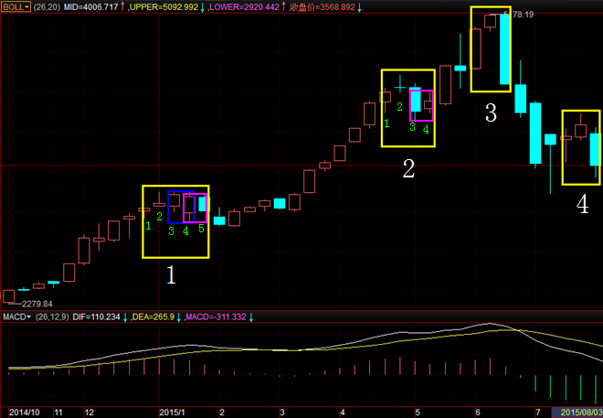
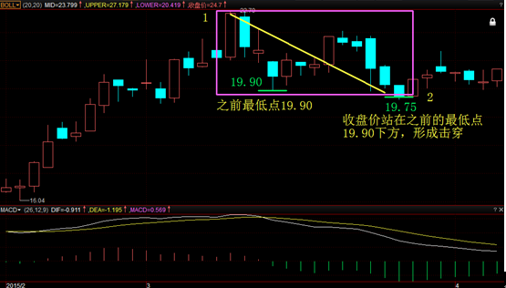
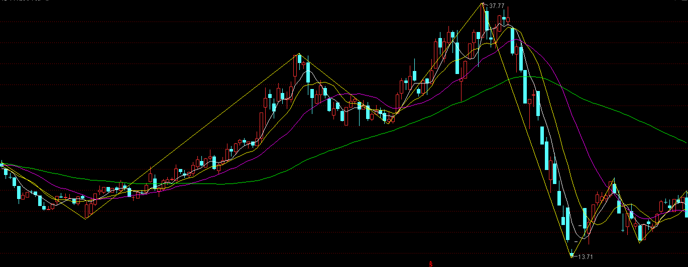

# 半年课问题及答疑

## 1.找出图中顶分型

题目：

答案：

注意包含关系。

## 2.画出张江高科2015/1/1后日线的笔

注意第二段有明显的横盘震荡，因此需要放大观察是否需要打横处理。在对称的上下上结构中，之前最低点是19.90。之后有一根阴线的收盘价站是19.75，站在之前最低点下方，因此1-2的一笔不需要以打横笔处理，而是可以直接成笔。

## 3.画出北纬科技2015/1/1后日线的笔

