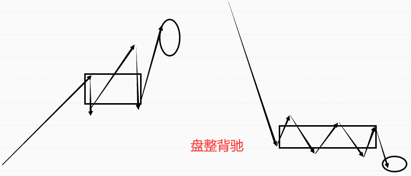
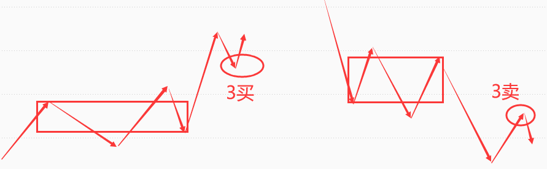
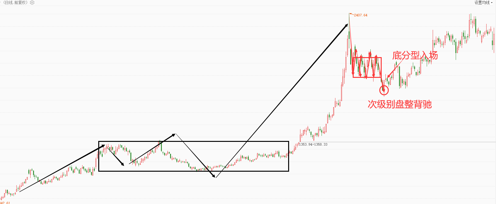
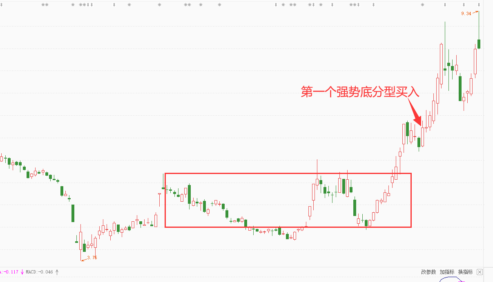

# 白仪缠论基础

## 一、分型

### 分型定义

顶分型：**无包含关系**的3根k线，中间一根k线高点最高，低点也最高。

底分型：**无包含关系**的3根k线，中间一根k线低点最低，高点也最低。


**分型在缠论中的第一个作用就是构筑笔，最重要的是任何转折都从分型开始。**上涨转折从顶分型开始，下跌转折从底分型开始。

### 如何理解分型？

分型的逻辑：**小级别趋势力量衰竭、趋势反转。**

底分型：说明小级别空方力量衰竭，小级别下跌趋势结束。

顶分型：说明小级别多方力量衰竭，小级别上涨趋势结束。

:::tip

一般小2个级别，比如日线底分型，一般是5分钟空方力量衰竭，5分钟下跌趋势结束。

:::


所以，**顶底分型买入，买的其实是小级别趋势的转折点。**

### 包含关系处理

包含处理：将相邻的孕线组合处理成一根K线。

上涨趋势：遵循高高原则，即两个K线相互包含情况下，高点取两根K线最高点，低点也取两根K线最高点。

下跌趋势：遵循低低原则，即两个K线相互包含情况下，高点取两根K线最低点，低点也取两根K线最低点。

包含关系处理中趋势的定义：处理包含关系时候看3根K线，观察前2根是上涨还是下跌趋势。

高高包含处理：


低低包含处理：


:::tip

包含可以是左包含和右包含，它们处理方式都是相同的。


:::

### 分型的强弱

底分型强势的标准：

1. **第3根K线的收盘价大于等于第1根K线的最高价。**
2. 底分型幅度要大于等于这波行情大部分K线的波动幅度。

弱势分型反过来就好了。

下图中1、2、3构成底分型，2号点最低：


### 分型停顿

弱势分型在一种情况下可以当做强势分型处理，那就是弱势分型以后来一根大阳线或者大阴线，我们可以把这种走势称为分型停顿。


### 转折和中继分型

以底分型为例，转折底分型说的是最底部的底分型，中继底分型说的是下跌途中不是真正见底的底分型，我们在实际交易中，要抓的是转折底分型。


## 二、笔

### 笔的定义

定义：相邻顶底分型之间构成一笔。

要点：

1. 处理完包含关系的顶底分型之间**至少有1根非公用K线**。即：从顶分型最高一根K线至底分型的最低一根K线至少有5根不含包含关系的K线。
2. 必须是一顶一底，顶底之间连接成笔。
3. **对于顶，如果后面有个更高的顶，保留后面的；对于底，如果后面有个更低的底，保留后面的。**
4. 下跌笔的部分K线也可以是上涨的。


上面四幅图笔画法如下：

A：0~1不成笔，因此从0划到3，3再到4。

B：本来可以0划到1的，但1~2间不成笔，因此0划到3。

C：0~1不成笔，1~2看似成笔，但先画下跌趋势，因此0划到3，3再到4。

D：注意蓝色的线是错误的，如果按照蓝色线，那么1~4之间有更低的底分型，因此画法是错误的，应该是0到3，3再到4。

### 特殊笔

#### 缺口成笔

某段走势中，出现一个力度很大的缺口，但这个缺口连接的高低点画不出一笔。


前面是上涨行情，在缺口地方快速下跌成笔，之后又是上涨行情。

缺口成笔特征：

- 缺口幅度特别大，大于等于前一段笔的力度
- MACD暴涨暴跌

类似还有一些力度很大的三四根K线，也可以当作一笔：


#### 中枢升级成笔

中枢升级成笔，说的是某段行情中，出现横盘走势，这个横盘的时间较长，对应的macd已经金叉死叉且回到零轴附近，但是按照定义画不出一笔。

走势横盘，其实就是做中枢，小横盘就是做小中枢，大横盘就是做大中枢。横盘到MACD回零轴，其实都可以当做本级别中枢了。而且根据走势生长，次级别3三笔重合就可以当做本级别一笔，次级别9笔重合就可以当做本级别中枢，而这种横盘次级别往往重合都超过9笔了。


## 三、线段

### 线段定义

定义：至少由3笔构成，且前3笔必须有重叠部分，**线段构成必然是奇数条笔**。

### 1+1终结

线段的终结，说的是线段的结束。

- 在上涨趋势中：当某一笔无法创出左侧临近高点的新高，且下一笔创出左侧低点的新低，则意味着上涨线段被终结；
- 在下跌趋势中：当某一笔无法创出左侧临近低点的新低，且下一笔创出左侧高点的新高，则意味着下跌线段被终结；


:::danger

只要是线段就能终结线段，不管上一个线段是几笔。也就是说，3笔构成的基础线段就能终结5笔、7笔、15笔等构成的线段。

:::

### 特殊线段的定位

:::tip

隔山打牛定义终结在实战中是有问题的，这里就不采用了。

:::

这里讲的特殊终结只有一笔，就只有一笔的线段，它是有特定要求的。

1. **上涨或下跌力度接近或大于临近线段的力度。**
2. **本级别一笔等于更大级别一笔。**比如要把日线某一笔当作线段，那么该日线一笔在周线上看也要等同于周线一笔。
3. **该笔之后走势发生转折。**比如上涨走势出现很大一笔下跌，然后走势继续上涨。

:::tip

这种终结方式其实是另类小转大终结。

:::


实图：


## 四、级别

### 级别定义

本级别：就是自己的操作级别或者自己主要看行情的级别，比如你主要做日线，日线就是本级别；再比如你看5分钟为主，那5分钟就是本级别。

次级别：就是比本级别小一个级别的级别。

大级别：一般说的是比本级别大一个级别的级别。

### 大小级别关系

#### 常用级别关系

一般以开盘时间计算，大小级别在4~6倍之间。

股票级别模板：

- `1分钟--->5分钟--->30分钟--->日线`
- `3分钟--->15分钟--->60分钟--->日线`

期货开盘时间比股票长，级别模板：

- `1分钟--->5分钟--->30分钟--->2小时--->日线`
- 如果开盘时间更长，可以是`1分钟--->5分钟--->30分钟--->2小时--->8小时--->日线`
- `3分钟--->15分钟--->60分钟--->4小时--->日线`

:::tip

这个级别是属于大概的去看，而不是严格的去看。有的品种开盘时间很长，不清楚的话，可以去看1小时线段等于4小时一笔还是日线一笔，哪个是一笔哪个就是1小时的更大的一个级别。

:::

#### 递归

定一个最小级别，然后在该级别画出笔得到线段，然后用线段终结得到更大级别一笔，用更大级别一笔组成更大级别线段，再得到更大级别一笔，以此类推。


递归得到的笔就是缠论严格定义上的笔，但这种做法相对麻烦，看任何走势你都需要这样去递归才能得到笔，这种效率太慢。

## 五、中枢

### 中枢定义

某级别走势类型中，被**至少连续前3笔**所覆盖的部分，震荡行情就是中枢。

中枢区域的确定：**取前三笔，极大值取最低，极小值取最高。**


中枢作用：寻找买卖点。

中枢的运用逻辑：

- 中枢是多空博弈的区域，我们可以**通过中枢的波动判断多空力量的强弱**，从而判断买卖点。
- 中枢有引力、压力支撑的作用，我们可以利用中枢引力的作用寻找买卖点。
  - 引力作用（吸引）：中枢会对所有试图离开它的走势产生引力，距离越近的中枢引力越大，级别越大的中枢引力越大。
  - 压力支撑作用（排斥）：当股价自下而上反弹至中枢区间时，中枢提供压力；当股价自上而下跌至中枢区间时，中枢提供阻力。

### 中枢破坏

当走势突破中枢以后回抽一笔不进中枢，那么形成中枢破坏，中枢破坏以后要么形成第二个中枢，要么构成更大的中枢。


### 中枢升级的三种情况

#### 中枢延伸

前三段构成中枢后，继续围绕中枢范围运动，在这个过程中，**没有出现任何第三类买点。**当延伸出9段后，就中枢升级了。如果没有9段，只是5、7段那也是中枢延伸，只是没有升级。延伸后中枢的范围取值还是参考前三段的公共空间。


#### 中枢扩展

前面构筑一个中枢后，形成次级别的第三类买卖点，中枢破坏后又进入中枢。


#### 中枢扩张

某级别同向的两中枢之间有重叠，中枢升级。


#### 扩展和扩张的区别

中枢扩展是在第二个中枢比第一个小情况下，出现了第三类买卖点，又拉回第一个中枢，这时候考虑是不是中枢扩展，看的是第一个中枢的范围。

中枢扩张是两个中枢已经是同级别、同方向情况下，看的是第一个中枢的最高点和第二个中枢的最低点有无重叠部分。

在第二个中枢没有形成同级别前，它只是扩展，这时候不考虑扩张问题，当走势形成了同级别后才是否为考虑扩张。

## 六、背驰

### 背驰定义

价格背驰：以中枢为核心，比较进入中枢和离开中枢的走势，如果**离开中枢走势弱于进入中枢则背驰。**


中枢是多空博弈的区域，也就是买卖双方交战的区域，如果向上突破，说明多方获得胜利，如果向下突破，说明空方战胜多方。

但多空博弈是一直持续的，并不是某方胜利以后这个胜利就可以一直保持的。

上涨背驰为例，第一波a段上涨，说明多方力量强于空方，随后陷入中枢震荡，说明多空双方的博弈陷入胶着状态，但总体来说多方还是占优势的，因为这是在上涨中交战，相当于在空方丢失领地的情况下交战。

随后走势向上突破形成b段，此时还是多方获得胜利，但此时b段的上涨力度没有a段强，说明此时**b段上涨多方力量已经没有第一次强了，已经开始衰竭了。**就好比两军作战，a方深入b方腹地，把战线拉的太长，a方战力不断损失的情况下后勤还供应不上，这时候b方就随时有可能反攻，甚至把a方的先头部队全部吃掉。

回到行情就是多方力量开始衰竭，那空方力量就开始变强了，这是行情可能发生转折的信号。


所以，背驰的核心逻辑其实是多空力量的衰竭，**上涨背驰说明多方力量衰竭，下跌背驰说明空方力量衰竭。**

### 背驰种类

#### 趋势背驰（两中枢背驰）

有两个及以上依次**同向同级别中枢**后形成的背驰。


#### 盘整背驰（一中枢背驰）

只有一个中枢形成的背驰。



#### 类趋势背驰

形态上看就是画不出标准中枢的背驰。


#### 类盘整背驰（三笔背驰）

类盘整背驰就是3笔背驰。


下图就是类盘整背驰例子：


## 七、同级别分解

### 线段的终结方式

线段的终结方式有6种，即上面4中背驰造成的终结，还有小转大终结、另类小转大终结。

#### 趋势背驰终结


#### 盘整背驰终结


#### 类趋势背驰终结

类似于趋势背驰终结的结束方式，这种终结方式和趋势背驰的区别在于，趋势的延续性强，但没有标准的中枢。


#### 类盘整背驰终结


#### 小转大终结

小转大终结，说的是本级别走势没有背驰就直接转折，这个转折是由小级别转折导致的。


小转大终结实例：


#### 另类小转大终结

另类小转大终结就是在线段部分讲过的一笔构成线段。

在一段走势中，**出现了力度很大的反向一笔，随后走势继续按照原有趋势方向运行，同时这个反向一笔等同于更大级别一笔。**比如一个日线上涨线段中，出现一笔力度很大的下跌，这笔日线下跌等同于周线一笔下跌，随后走势又出现了日线上涨线段，那么我们可以认为前面的日线下跌一笔终结了之前的上涨线段，然后我们只需要以当下的上涨线段为主。


另类小转大终结实例：


### 同级别分解运用

前面讲了6种线段的终结方式，这6种线段都是同级别的，所以这6种线段都可以相互连接，连接的点称为同级别分解点。

同时这个同级别分解一般也是缠论第一类买卖点，随后的次高低点一般就是缠论第二类买卖点了。


## 八、辅助工具

### 区间套

利用走势的自相似性，不断使用中枢背驰定位的方法。周期上由大及小，可以从周线到日线再到30分钟，再到5分钟、1分钟，最终将买点定位在1分钟K线上的1、2、3类买点上，理论上可以在买入定位时做到买在一支股票最低点之后的几分钟内。

区间套作用：

1. 通过更小级别读出更多信息。
2. 辅助我们更加精确的操作。

比如我们在日线背驰段想要买入某个股票，那我们可以在日线背驰段的次级别30分钟等背驰，然后在等30分钟背驰段的次级别5分钟等背驰，甚至还可以等5分钟背驰段的次级别1分钟等背驰，这样下去我们几乎可以买在最低点，因为理论上，我们可以利用这个逻辑无限的套下去，直到买在最低点的位置。


当然，前面所讲的只是理论上的，实际中我们不能无限的缩小级别去看，一般情况下，我们缩小一个级别，顶多两个级别就差不多了。

且不说区间套在实际交易中的实战性有多高，但就**区间套的精确逐级确定这个逻辑，我认为都是非常厉害，非常经典的。**

### 分型辅助成笔

分型辅助成笔就是利用本级别的顶底分型，去判断次级别笔，具体是把本级别顶底分型连接起来，就可以看做次级别笔的连接了。


这个方法的**劣势是不太精确**，也就是说本级别顶底分型连起来，有时候不是次级别笔，因为有的分型比较小，次级别可能构不成笔，但在大部分时候是可以用的。

## 九、第一类买卖点

### 第一类买卖点定义

第一类买卖点由背驰产生，**当走势出现趋势背驰或盘整背驰时，我们即可认为第一类买卖点即将出现并找机会入场或离场。**（下跌背驰入场，上涨背驰离场）

第一类买卖点的关键是背驰，而之前关于背驰部分的内容讲过，背驰的逻辑是多空力量的衰弱，所以第一类买卖点的逻辑也是多空力量衰弱。**第一类买点是空方力量的衰弱，第一类卖点是多方力量的衰弱。**

实际中，我们暂时只操作标准的趋势背驰、盘整背驰导致的第一类买点，而类趋势背驰、类盘整背驰不操作。

从成功率的角度看，盘整背驰在日线以上级别或者跌幅很大的情况下出现成功率较高，趋势背驰用在日线及以上级别成功率较高。

### 定位方法

#### 区间套

步骤一：先找到背驰段，比如选择日线，就要先找到日线的趋势背驰或盘整背驰段要创中枢新低。

步骤二：切换到更小级别，30分钟。同样等30分钟出现盘整背驰或30分钟趋势背驰时候建仓。

在买点定位上，可以在走势回到最后一个中枢时候建仓，比如我们在日线的背驰段去看30分钟买，我们可以在30分钟背驰以后走势回到最后一个中枢入场。


#### 分型辅助成笔

步骤一：我们切到背驰段，比如我们做日线的，就切到日线背驰段。

步骤二：在背驰段利用分型辅助成笔，在次级别出现盘整背驰或者趋势背驰后，用底分型建仓。


:::danger

注意：底分型是强势底分型的情况成功率更高。

:::

## 十、第二类买卖点

### 第二类买卖点定义

第二类买卖点，一般来说，就是**第一类买卖点上涨以后回调没有创新低或者新高的次高低点。**

- 从趋势的角度，1买是趋势的转折点，2买是趋势转折进一步确认的点。2卖反过来就是。
- 从多空博弈的角度，1买是空方力量衰竭的点，2买是空方力量进一步衰竭，而多方力量进一步占优势的点。2卖反过来就是。


第二类买卖点选择：

- 从形态看，优先趋势背驰和类趋势背驰的。
- 从强弱看：优先回调力度不超过50%的。
- 从趋势角度看：优先大级别趋势向上的。

### 定位方法

#### 区间套

步骤一：在一买上涨一笔以后回调的时候，我们切到次级别。比如日线一买上涨一笔以后回调，我们切到30分钟。

步骤二：然后在30分钟出现一买的时候开始买入。


#### 分型辅助成笔

步骤一：切换到一买上涨一笔后出现回调一笔。

步骤二：在回调区域利用分型辅助成笔，在次级别出现盘整背驰或者趋势背驰后，用底分型建仓。


### 其他可操作二买

上面讲的都是标准行情下产生的二买，但实际中大部分走势是不标准的，也就是说大部分二买前并不会有标准的一买，如果等着标准一买后再产生二买，很有可能很长时间都等不到，所以就需要了解非标准可操作二买。

非标准二买需要使用MACD辅助，**当MACD第一次向上突破零轴后回抽到零轴附近止跌，就可以二买了。**


### 次级别第二类买卖点

区间套定位：区间套定位的二买卖点，方法和前面讲的判断二买卖点方法是一样的。标准的就等趋势背驰、整盘背驰一买上涨后的二买点，不标准就用MACD第一次向上突破零轴后回抽到零轴附近止跌辅助判断。

分型辅助成笔：一笔下跌后出现的第2个底分型，可以称为验证底分型。**验证底分型就是次级别二买，验证顶分型就是次级别二卖。**


在实际交易中，如果用分型辅助成笔时次级别没有标准背驰，那么就可以在验证底分型入场，**选择强势的验证底分型成功率会更高些。**


## 十一、第三类买卖点

### 第三类买卖点定义

**走势突破中枢以后回抽一笔不进中枢的点。**从形态上看，即突破震荡中枢后回抽不进入中枢的点。



从多空博弈角度看：三买是确定多方力量战胜空方力量的点，3卖反之。

从形态看：三买卖点是确定突破有效的点。

### 三买卖点类型

#### 针对本级别中枢的本级别三买卖点

本级别向上突破本级别中枢以后回抽一笔不进本级别中枢。


#### 针对本级别中枢的次级别三买卖点

次级别向上突破本级别中枢以后回踩一笔不进本级别中枢。


#### 针对本级别中枢的b-A买卖点

次级别向上突破本级别中枢以后，出现一个回踩不进本级别中枢的次级别中枢。


### 定位方法

#### 针对本级别中枢的本级别三买

##### 区间套

步骤一：在一买上涨一笔以后回调的时候，我们切到次级别。比如日线一买上涨一笔以后回调，我们切到30分钟。

步骤二：然后在30分钟出现一买的时候开始买入。


##### 分型辅助成笔

步骤一：切换到一买上涨一笔后出现回调一笔。

步骤二：在回调区域利用分型辅助成笔，在次级别出现盘整背驰或者趋势背驰后，用底分型建仓。



#### 针对本级别中枢的次级别三买

1.操作级别比较小的时候，当走势向上突破中枢以后出现的第一个强势底分型买入。



2.操作级别比较大的时候，在回调时候利用分型辅助成笔等次级别一买或二买时买入。

比如30三十分钟一笔向上突破日线中枢以后，我们在三十分钟一笔回调不进入日线中枢的时候，利用分型辅助成笔判断在30分钟次级别1买2买的时候买入。


#### 针对本级别中枢的b-A买卖点

1.操作级别比较小的时候，当走势向上突破中枢以后，利用分型辅助成笔，在出现次级别中枢的时候买入。


2.操作级别比较大的时候，当次级别一笔向上突破中枢以后出现第一个中枢，在这个中枢回调第三笔的时候利用分型辅助成笔等次级别1买或者2买的时候买入。

比如三十分钟一笔向上突破日线中枢以后出现30分钟中枢，我们在30分钟第三笔回调的时候利用分型辅助成笔判断在30分钟次级别1买2买的时候买入。


## 十二、中枢内买点

### 中枢内买点定义

中枢内买点，说的就是中枢震荡中出现的买点，因为行情大部分时间是处于震荡的，所以中枢震荡内的买点也是值得关注的。


操作逻辑：

- 没跌破中枢时候，有中枢支撑
- 跌破中枢时候又中枢引力作用

### 定位方法

当我们遇到中枢震荡点时候，利用分型辅助成笔，在次级别1买2买入场就可以了。


## 十三、三类买点的卖出方式

### 止损卖出

这些买点，最后都可以用分型辅助成笔买入，包括区间套，所以买入上如果设止损，止损价格是跌破买入分型点时候。


### 加速行情：05均线卖出

这种卖出方式是针对买入以后就立马赚钱，而且赚的比较多，走势呈现脉冲式加速上涨，这种走势容易短期消耗动能过大，出现小转大结束，所以我们可以用05均线来应对。


### 标准行情：次级别卖点卖出

说的是在持仓过程中出现次级别标准背驰或者标准卖点时候卖出，可以利用分型辅助成笔看。


### 到达目标位主动止盈

这是在设置目标位点情况下说的，在设置目标位点情况下，到目标位就可以主动止盈卖出了，此时可以不管有没有卖点。

比如中枢买点买入的，你的目标是中枢上轨，那只要走势走到中枢上轨附近，就算没有卖点，也可以卖出了。


## 十四、选股

### 一买选股

打开通达信，打开问达，输入：

```
5周线小于10周线，10周线小于20周线
```


然后就能找到一大堆周线下跌一笔的，然后再去精选一下就可以了。

精选上，可以利用分型辅助成笔判断次级别（日线）是否处于1买区域。


### 二买、中枢买点选股

打开问达输入：

```
5周均线大于10周均线，周线倾盆大雨
```

这个条件找到的一般是周线上涨一笔，日线回调一笔的股票，里面有可能是做日线类2买的，日线3买的，日线1卖的，日线2买的等等，自己去精选一下就可以。


### 三买选股

因为3买是找向上出中枢的，所以只需要每天在涨停板里找就可以，肯定能找到。


## 十五、影响买点成功率因素

一个买点，本质上是由历史行情通过不同视角总结出的比较有价值参与的一个机会，但一个买点最后能否成功，涉及到点因素很多，任何一个不起眼的因素都能直接决定一个买点是否成功。

**这里注意，这些可以提高成功率点因素对所有买点有效。**

1.趋势

做多点情况下，大级别上涨趋势中的小级别买点成功率更高，如下图所示。


2.股性

股性就是k线波动的活跃程度，k线越饱满，走势越顺畅，股性越活跃，盈利空间和成功率越高。

K线活跃：


反之k线上下影线多，跳空多，走势纠结点像马赛克或者蜈蚣一样，走势就越不活跃，成功率就越低。

K线不活跃：


3.题材

题材就是可以让资金买入点理由，一般包括政策利好、突发事件利好、公司自身利好等，题材越新越多，成功率越高。

4.基本面
