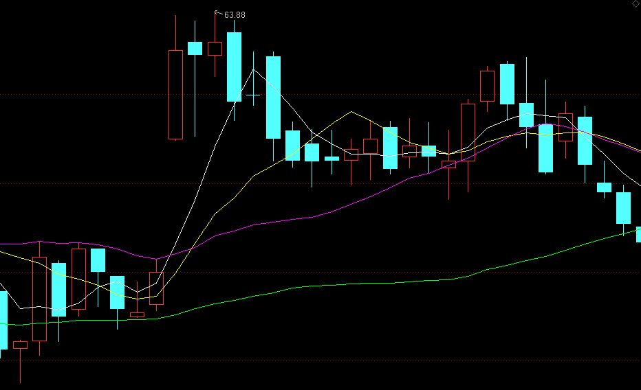

# 白仪野生交易员笔记

## 缠论三买卖点

### 三买卖点的基本说明

三买：**走势向上脱离中枢后回踩一笔不进入中枢。**

中枢：价格重叠的区间，价格重叠代表买卖双方的阵地，即买卖资金，而**资金是推动行情的核心力量**。

三买卖点操作逻辑：

1. **分析多空资金博弈力量，顺应主力资金操作。**三买是经过多空力量博弈后多方力量确定胜利，然后空方力量再次反击，最后多方力量以决定性胜利胜出的阶段拐点。既然多方力量胜出，那么就顺着多方力量做多，成功的概率当然就更高了。
2. 顺应价格走势趋势。趋势具有连续性和惯性，上涨的趋势往往不会一下子停下来，需要缓存一下才能。

三买卖点回踩不进入中枢的原因：

1. 根据强弱原则，突破力度越大，回踩力量越小，行情越强。

2. 根据中枢引力法则，中枢是有引力的，向外突破的点会被吸引回来，而未被吸引回来的点就是确定中枢结束的点。

### 三买卖点操作

#### 针对本级别中枢的次级别三买点

操作条件：

1. 有本级别中枢
2. 行情向上突破本级别中枢

次级别一笔回踩不进入中枢，就是次级别三买。

操作方式：实际操作中可以不看次级别图，根据分型辅助成笔，本级别分型连接起来就是次级别一笔，因此当**行情突破本级别后出现强势底分型**，就相当于次级别三买卖点出来。

止损点：跌破底分型最低点。

#### 针对本级别中枢的本级别三买点

操作条件：

1. 有本级别中枢
2. 行情向上突破本级别中枢
3. 行情回调一笔不进入本级别中枢

操作方式：等分型停顿或验证分型就能入场了。

止损点：突破分型的最低点。

上图中在回调一笔的大阴线就是最低点了，实际操作中不是在这里买，而是等验证分型，直到等到大阳线，它的收盘价高于前面大部分K线的最高价。

#### 针对本级别中枢的b-A买卖点

次级别向上突破本级别中枢以后，出现一个回踩不进本级别中枢的次级别中枢。

### 介入点顶底分型

为什么介入点是顶底分型、分型停顿、验证分型？

顶底分型的介入逻辑：

没有顶分型就没有顶，没有底分型就没有底，任何下跌反转都是从底分型开始，任何上涨反转都是从顶分型开始。

分型背后的形态逻辑：

1. 强势底分型：次级别强势反弹一笔，如果次级别处于买点区域，说明次级别买点成立。
2. 强势顶分型：次级别强势下跌一笔，如果次级别处于卖点区域，说明次级别卖点成立。
3. 强势顶分型停顿：次级别强势一买成立。
4. 强势底分型停顿：次级别强势一卖成立。
5. 强势验证顶分型：次级别强势二买成立。
6. 强势验证底分型：次级别强势二卖成立。

风险背后的多空博弈逻辑：出现顶分型时，小级别上涨趋势发生反转变成下跌走势，空方力量胜利了，底分型相反。

分型操作注意：

1. 为了提高成功率，不在买点区域顶底分型入场，而是买点区域的分型停顿和验证分型入场。
2. 分型停顿和验证分型意义是确认这个买卖点是否强势，而不是有几根。

该方法运用不是死板的，等是为了验证顶底分型强弱，而不是毫无逻辑去数K线，实际中就算10根20根去验证也是可以的。

### 卖出方法

#### 盈亏比+05均线

条件一：

- 极限止损：止损位置必须小于这个止损，不能大于它。
- 底线止盈：平时盈利卖出时必须大于这个底线止盈。

看品种调整，一般在分型停顿或验证分型入场，止损是跌破或突破分型最低点。

**止盈目标最少高于极限止损的2倍**，这样赚一次的钱最少能亏2次呢。

条件二：

为了避免错过急速上涨或下跌的行情，加一个条件，当达到底线盈利目标后，如果走势并没有跌破或突破05均线时，可以按照05均线持有，等何时收盘价破位05均线时再卖出。

#### 一笔结束

介入三买卖点任意一个，主要目标都是本级别一笔。比如一分钟三买介入后，目标只是一分钟上涨的一笔。

在目标一笔情况下，在这笔上涨结束或可能结束时卖出。

判断一笔结束？**次级别趋势背驰或次级别二买卖点成立。**

为何选择二买卖点而不是一买卖点呢？在单边行情中，趋势延续性强，行情背驰后中枢延伸一下容易继续按照原有趋势运行。其次有时候次级别并没有趋势背驰，这时候二买卖点就是最好判断方法。

:::danger

在用验证分型平仓时，一定要选择强势的验证分型才能平仓，而且要等K线快收盘时平仓。

:::

### 品种选择

三买卖点主要是顺应主力资金的一种买卖点，三买卖点在资金情绪达成一致时容易成功。

资金情绪达成一致的情况：

1. 大周期，针对中长期为主：周线以上级别方向出来时，说明中长资金情绪达成一致，这时行情延续性较强。比如周线选择向上，那么这时出现三买成功率较高。
2. 小周期，准对短期为主：成交最活跃的时间段。买卖本身属于多空博弈，在多空博弈最激烈时，一旦走出方向，那么这个方向一般都是真实的。大部分时候，短周期行情最活跃有2个阶段，这时候行情不仅仅延续性强，波动也比平时大：
   1. 刚刚开盘时候
   2. 突发重大消息刺激时候

从日内波动角度看：一般日内波动活跃品种如下：`股指期货>商品期货>外汇`。

股指期货中以开盘实际最长为首先，短为次选，则`美盘>欧盘>亚盘`，商品期货以主流全球化商品为主，其余点为高为次选，`美黄金、原油>美精钢、美白银、沪镍、沪锌、沪铜、沪锡、pp、pta、苹果棉花等>玉米、花生、菜粕、淀粉`。

### 买卖点价值判断

从买点判断：

1. 针对本级别中枢的次级别三买卖点成功后，随后出现针对本级别中枢的本级别三买卖点更容易成功；相反，针对本级别中枢的次级别三买卖点失败后，随后出现针对本级别中枢的本级别三买卖点更容易失败。
2. 针对本级别中枢的本级别三买卖点，要是之前没有出现针对本级别中枢的次级别三买卖点，那么这个三买卖点容易失败。

从品种判断：三买卖点对资金依赖性较高，所以需要资金情绪一致时候成功率才高，因此选择波动活跃的品种上使用三买卖点成功率更高。K线饱满、走势顺畅代表活跃，K线纠结、像蜈蚣一样则不活跃。

从时间判断：成交最活跃的时间段出现的三买卖点成功率更高。成交最活跃时间段一般分别为开盘时间段和突发消息刺激时间段，这两个时间段成交最为密集，出现的三买卖点也比平时出现的更容易成功。

从形态判断：

需要谨慎对待的形态：

1. 大级别趋势背驰段出现的本级别三买卖点。
2. 第二个同向同级别出现的三买卖点。

这种点从定义上来讲其实不是三买点，但广义来看和标准三买点类似，这种点位因为行情超跌或超涨原因很容易失败，如果想做，最好选择趋势性很好的品种，比如美盘股指。

3. 大级别中枢上下轨附近的本级别三买卖点。

大级别中枢上下轨本身就是很强的压力支撑位，这种压力支撑位出现的三买卖点在没有外力刺激的情况很难被真正突破，只有在活跃时间段才可以尝试。

4. 复杂走势出现的三买卖点。

复杂的走势，一般都比较纠结，都偏离理论标准，这种情况是不建议操作的。

5. 普通时间在重要压力支撑位附近出现的三买卖点。

// TODO：P104，没懂

6. 极端行情下出现的三买卖点。

包括复杂走势行情、瞬间急涨急跌行情

7. 弱势行情三买卖点。

- 突破中枢后回抽太强，都快进入中枢的这种三买卖点。
- 突破中枢连中枢震荡的最高点都没有突破后回抽的三买卖点。

8. 缺口回补的三买卖点。

缺口，本身是跳空开盘，这是强势的表现，既然强势，开盘后行情就应该顺缺口方向运行，要是跳空开盘后回补了部分缺口出现的三买卖点，这时候行情就走弱了，这种情况的三买卖点需谨慎。

上海机场，跳空后走弱的例子，63.88就是最高点了：

性价比较高的三买卖点：

1. 成交活跃时间段出现的三买卖点。
2. 离重要支撑压力位较远的三买卖点。
3. 走势简单对称的三买卖点。

格力电器，走势很简单，所有的买点成功率都较高：

### 缠论三买卖点的优势与劣势

优势：

1. 大部分时候行情的暴涨暴跌都对应着三买卖点，针对本级别中枢的次级别三买卖点主要抓类二买卖点后的主升浪或主跌浪，针对本级别中枢的本级别三买点点主要抓趋势延续。
2. 避开弱势行情。三买出现在上涨行情中，那么总体来讲，多头是比较强势的，因为弱势就不会出现上涨行情。
3. 避开中枢震荡，对于趋势交易的人来说，效率更高。

劣势：

1. 缠论三买卖点属于技术分析，实际交易中不可能保证100%正确，所有需要设置止损位，遇到极端行情不止损则会断送自己整个交易生涯。
2. 对资金依赖性高，这也是缠论三买卖点在成交不活跃品种和级别上使用时候容易失败的原因。

## 白仪的交易记录

