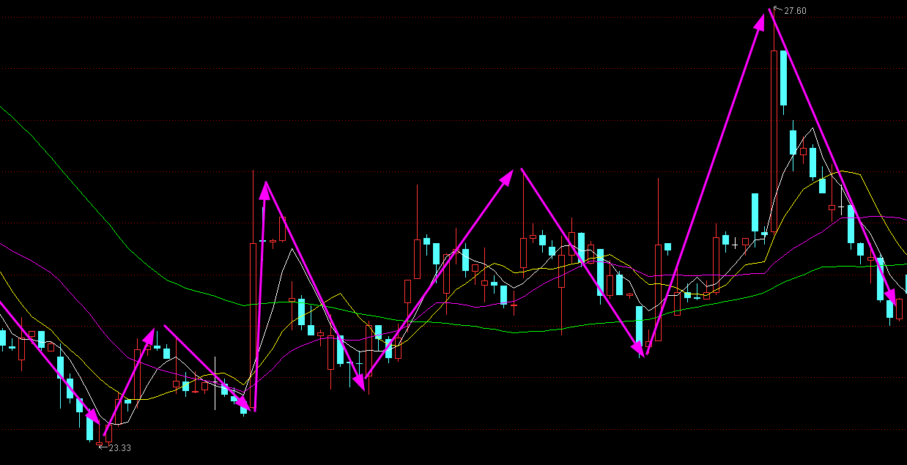

# 白仪野生交易员笔记

## 缠论三买卖点

### 三买卖点的基本说明

三买：**走势向上脱离中枢后回踩一笔不进入中枢。**

中枢：价格重叠的区间，价格重叠代表买卖双方的阵地，即买卖资金，而**资金是推动行情的核心力量**。

三买卖点操作逻辑：

1. **分析多空资金博弈力量，顺应主力资金操作。**三买是经过多空力量博弈后多方力量确定胜利，然后空方力量再次反击，最后多方力量以决定性胜利胜出的阶段拐点。既然多方力量胜出，那么就顺着多方力量做多，成功的概率当然就更高了。
2. 顺应价格走势趋势。趋势具有连续性和惯性，上涨的趋势往往不会一下子停下来，需要缓存一下才能。

三买卖点回踩不进入中枢的原因：

1. 根据强弱原则，突破力度越大，回踩力量越小，行情越强。

2. 根据中枢引力法则，中枢是有引力的，向外突破的点会被吸引回来，而未被吸引回来的点就是确定中枢结束的点。

### 三买卖点操作

#### 针对本级别中枢的次级别三买点

操作条件：

1. 有本级别中枢
2. 行情向上突破本级别中枢

次级别一笔回踩不进入中枢，就是次级别三买。

操作方式：实际操作中可以不看次级别图，根据分型辅助成笔，本级别分型连接起来就是次级别一笔，因此当**行情突破本级别后出现强势底分型**，就相当于次级别三买卖点出来。

止损点：跌破底分型最低点。

#### 针对本级别中枢的本级别三买点

操作条件：

1. 有本级别中枢
2. 行情向上突破本级别中枢
3. 行情回调一笔不进入本级别中枢

操作方式：等分型停顿或验证分型就能入场了。

止损点：突破分型的最低点。

上图中在回调一笔的大阴线就是最低点了，实际操作中不是在这里买，而是等验证分型，直到等到大阳线，它的收盘价高于前面大部分K线的最高价。

#### 针对本级别中枢的b-A买卖点

次级别向上突破本级别中枢以后，出现一个回踩不进本级别中枢的次级别中枢。

### 介入点顶底分型

为什么介入点是顶底分型、分型停顿、验证分型？

顶底分型的介入逻辑：

没有顶分型就没有顶，没有底分型就没有底，任何下跌反转都是从底分型开始，任何上涨反转都是从顶分型开始。

分型背后的形态逻辑：

1. 强势底分型：次级别强势反弹一笔，如果次级别处于买点区域，说明次级别买点成立。
2. 强势顶分型：次级别强势下跌一笔，如果次级别处于卖点区域，说明次级别卖点成立。
3. 强势顶分型停顿：次级别强势一买成立。
4. 强势底分型停顿：次级别强势一卖成立。
5. 强势验证顶分型：次级别强势二买成立。
6. 强势验证底分型：次级别强势二卖成立。

风险背后的多空博弈逻辑：出现顶分型时，小级别上涨趋势发生反转变成下跌走势，空方力量胜利了，底分型相反。

分型操作注意：

1. 为了提高成功率，不在买点区域顶底分型入场，而是买点区域的分型停顿和验证分型入场。
2. 分型停顿和验证分型意义是确认这个买卖点是否强势，而不是有几根。

该方法运用不是死板的，等是为了验证顶底分型强弱，而不是毫无逻辑去数K线，实际中就算10根20根去验证也是可以的。

### 卖出方法

#### 盈亏比+05均线

条件一：

- 极限止损：止损位置必须小于这个止损，不能大于它。
- 底线止盈：平时盈利卖出时必须大于这个底线止盈。

看品种调整，一般在分型停顿或验证分型入场，止损是跌破或突破分型最低点。

**止盈目标最少高于极限止损的2倍**，这样赚一次的钱最少能亏2次呢。

条件二：

为了避免错过急速上涨或下跌的行情，加一个条件，当达到底线盈利目标后，如果走势并没有跌破或突破05均线时，可以按照05均线持有，等何时收盘价破位05均线时再卖出。

#### 一笔结束

介入三买卖点任意一个，主要目标都是本级别一笔。比如一分钟三买介入后，目标只是一分钟上涨的一笔。

在目标一笔情况下，在这笔上涨结束或可能结束时卖出。

判断一笔结束？**次级别趋势背驰或次级别二买卖点成立。**

为何选择二买卖点而不是一买卖点呢？在单边行情中，趋势延续性强，行情背驰后中枢延伸一下容易继续按照原有趋势运行。其次有时候次级别并没有趋势背驰，这时候二买卖点就是最好判断方法。

:::danger

在用验证分型平仓时，一定要选择强势的验证分型才能平仓，而且要等K线快收盘时平仓。

:::

### 品种选择

三买卖点主要是顺应主力资金的一种买卖点，三买卖点在资金情绪达成一致时容易成功。

资金情绪达成一致的情况：

1. 大周期，针对中长期为主：周线以上级别方向出来时，说明中长资金情绪达成一致，这时行情延续性较强。比如周线选择向上，那么这时出现三买成功率较高。
2. 小周期，准对短期为主：成交最活跃的时间段。买卖本身属于多空博弈，在多空博弈最激烈时，一旦走出方向，那么这个方向一般都是真实的。大部分时候，短周期行情最活跃有2个阶段，这时候行情不仅仅延续性强，波动也比平时大：
   1. 刚刚开盘时候
   2. 突发重大消息刺激时候

从日内波动角度看：一般日内波动活跃品种如下：`股指期货>商品期货>外汇`。

股指期货中以开盘实际最长为首先，短为次选，则`美盘>欧盘>亚盘`，商品期货以主流全球化商品为主，其余点为高为次选，`美黄金、原油>美精钢、美白银、沪镍、沪锌、沪铜、沪锡、pp、pta、苹果棉花等>玉米、花生、菜粕、淀粉`。

### 买卖点价值判断

从买点判断：

1. 针对本级别中枢的次级别三买卖点成功后，随后出现针对本级别中枢的本级别三买卖点更容易成功；相反，针对本级别中枢的次级别三买卖点失败后，随后出现针对本级别中枢的本级别三买卖点更容易失败。
2. 针对本级别中枢的本级别三买卖点，要是之前没有出现针对本级别中枢的次级别三买卖点，那么这个三买卖点容易失败。

从品种判断：三买卖点对资金依赖性较高，所以需要资金情绪一致时候成功率才高，因此选择波动活跃的品种上使用三买卖点成功率更高。K线饱满、走势顺畅代表活跃，K线纠结、像蜈蚣一样则不活跃。

从时间判断：成交最活跃的时间段出现的三买卖点成功率更高。成交最活跃时间段一般分别为开盘时间段和突发消息刺激时间段，这两个时间段成交最为密集，出现的三买卖点也比平时出现的更容易成功。

从形态判断：

需要谨慎对待的形态：

1. 大级别趋势背驰段出现的本级别三买卖点。
2. 第二个同向同级别出现的三买卖点。

这种点从定义上来讲其实不是三买点，但广义来看和标准三买点类似，这种点位因为行情超跌或超涨原因很容易失败，如果想做，最好选择趋势性很好的品种，比如美盘股指。

3. 大级别中枢上下轨附近的本级别三买卖点。

大级别中枢上下轨本身就是很强的压力支撑位，这种压力支撑位出现的三买卖点在没有外力刺激的情况很难被真正突破，只有在活跃时间段才可以尝试。

4. 复杂走势出现的三买卖点。

复杂的走势，一般都比较纠结，都偏离理论标准，这种情况是不建议操作的。

5. 普通时间在重要压力支撑位附近出现的三买卖点。

// TODO：P104，没懂

6. 极端行情下出现的三买卖点。

包括复杂走势行情、瞬间急涨急跌行情

7. 弱势行情三买卖点。

- 突破中枢后回抽太强，都快进入中枢的这种三买卖点。
- 突破中枢连中枢震荡的最高点都没有突破后回抽的三买卖点。

8. 缺口回补的三买卖点。

缺口，本身是跳空开盘，这是强势的表现，既然强势，开盘后行情就应该顺缺口方向运行，要是跳空开盘后回补了部分缺口出现的三买卖点，这时候行情就走弱了，这种情况的三买卖点需谨慎。

上海机场，跳空后走弱的例子，63.88就是最高点了：

性价比较高的三买卖点：

1. 成交活跃时间段出现的三买卖点。
2. 离重要支撑压力位较远的三买卖点。
3. 走势简单对称的三买卖点。

格力电器，走势很简单，所有的买点成功率都较高：

### 缠论三买卖点的优势与劣势

优势：

1. 大部分时候行情的暴涨暴跌都对应着三买卖点，针对本级别中枢的次级别三买卖点主要抓类二买卖点后的主升浪或主跌浪，针对本级别中枢的本级别三买点点主要抓趋势延续。
2. 避开弱势行情。三买出现在上涨行情中，那么总体来讲，多头是比较强势的，因为弱势就不会出现上涨行情。
3. 避开中枢震荡，对于趋势交易的人来说，效率更高。

劣势：

1. 缠论三买卖点属于技术分析，实际交易中不可能保证100%正确，所有需要设置止损位，遇到极端行情不止损则会断送自己整个交易生涯。
2. 对资金依赖性高，这也是缠论三买卖点在成交不活跃品种和级别上使用时候容易失败的原因。

## 缠论运用经验技巧

### 本级别中看次级别

1. 本级别3~6根K线重合，一般是次次级别中枢。

如下是南方航空5/25~5/31的日线图，发现有5根K线重合：

如下是南方航空5/25~5/31的5分钟图，发现是走势是中枢震荡的：

:::tip

5~6根K线重合与3根K线重合虽然看到的都是次次级别中枢，但看到的是不一样的。因为级别有多种划分方式：

- `周线--->日线--->30分钟线--->5分钟线`
- `周线--->日线--->60分钟线--->15分钟线`

15根以上重合是60分钟中枢，7~10根重合是30分钟中枢，5~6根重合是15分钟中枢，3根是5分钟中枢。

至于次次次级别，就没必要通过本级别来看了，跨度太大，操作意义不大。

:::

2. 本级别10根以上K线重合，或用分型辅助成笔看3笔重合，是次级别中枢。

如下是汉王科技7/12~8/4的日线图，发现有10多根K线重合：

如下是汉王科技7/12~8/4的30分钟图，发现走势是中枢震荡的：

3.本级别看更大级别

- 递归，本级别一线段等于更大级别一笔
- 中枢扩张

### 共振

如何理解共振？

共振，首先需要有自己的一个核心方法，然后以自己的核心方法为主的同时利用其他方法辅助来看。

#### 缠论看共振

1.最近的各级别中枢

**找各级别中枢的目的就是为了寻找支撑和压力位，从而对未来行情的目标做一个基础的心理预期。**比如当前行情是上涨的，但我们不知道能涨到什么位置，那么我们可以找到前面的中枢，一般前面的中枢都是压力位。

一般来说，只需要找两个级别中枢就足够了，即本级别中枢和次级别中枢。本级别中枢是操作级别中枢，次级别中枢是比操作级别小一个级别的中枢。我们找这两个级别中枢时候，只需要看一个级别走势，即本级别走势。

当本级别做买卖点时候，次级别中枢就是压力支撑位；大级别做买卖点时候，本级别中枢就是压力支撑位。

2.大小级别构筑的买卖点

当大级别构筑买点情况下，本级别买点更容易成功；当大级别构筑卖点情况下，本级别卖点更容易成功。

3.背驰

缠论走势背驰遇到压力上涨容易结束，缠论走势背驰没有受到压力，上涨不容易结束。

既然是共振，那么把上面三个视角结合起来看：

- 做多时候，大小级别都在构筑买点，次级别背驰，同时回调到支撑位，那么买点成功率高。

- 相反，做多时候大级别构筑卖点，次级别没有支撑、背驰，那么即使是本级别买点，失败率较高。

#### 趋势共振

缠论看多时候，均线多头排列，价格受到均线支撑，那就是共振。

#### 股性共振

股性就是股票波动的规律，比如某些股票喜欢冲高一波后就行情结束，有的喜欢震荡上涨，有的股票喜欢类二买启动……

#### 消息共振

缠论做多点，出现利多消息，做空点出现利空消息。消息包括政策消息、事件消息。

#### MACD共振

比如可以用macd来辅助判断强弱，对于做多来讲，macd大幅跌破零轴就是弱势反之就是强势，做空反过来就是。

再比如macd两次回抽零轴一般就是比较对称标准的中枢，变盘率比较高，那macd两次回抽零轴就是和缠论类2买形成共振。

### 背驰合集

**背驰就是背道而驰，一般是两个标的做对比，形容两个标的走的方向完全相反。**

背驰的作用是寻找趋势性的拐点或者阶段性的拐点，逻辑是通过两个标对比后**找到原主力力量衰竭的点，这个点很容易变成转折点**，正所谓物极必反，背驰就是那个极点区域。

:::danger

在实际操作交易中，价格波动会受资金影响，在运用背驰时，就没办法做到100%正确，因为资金的注入可以改变价格，进而改变背驰。

**背驰不代表转折，抄底摸顶不一定会成功。**

:::

#### 价格背驰

通过价格变化（K线图）去判断背驰，见基础篇。

#### MACD背驰

1.传统看法

**股价新高，MACD红柱子和快慢线不能同步新高**（同步新低或几乎持平），形成上涨背驰。

2.缠论视角

当MACD从上往下回抽零轴以后继续上涨创出新高，而相应的MACD红柱子没有之前上涨的一波多，形成上涨背驰，反之没有背驰。

> 这里没懂传统看法和缠论视角的区别？回抽零轴意味着什么？

#### 均线背驰

以两根均线缠绕的区间为核心（缠绕区间最好相交两次以上），等股价新高或者新低以后对比均线**缠绕前后相交的面积大小**。如果后面的均线的相交面积小于前面均线相交的面积，形成背驰，反之不背驰。

在实际操作中，如果级别较大（周线级别以上），出现一次下跌均线背驰就可以入场了；如果级别较小，最好等出现2次缠绕后出现的背驰再入场。

#### 量价背驰

价格和成交量出现背驰，即价格上涨时成交量不涨（缩量或平量）。

常规视角下，量价背驰是走势不健康的表现，代表买入资金变少，价格随时可能见顶，所以持仓的股票出现量价背驰时就要引起关注。

但实际上，把量价背驰当作不健康的走势，逻辑是不对的。价格由资金推动，成交量是资金买卖的表现。**成交量低，说明买的人和卖的人都不多。**有些股票大部分筹码在机构或庄家手里，市场上流动交易筹码很少，只要他们不卖，不需要太多资金买入就能导致股价上涨，所以在一些白马股和庄股里面，经常会出现缩量或平量上涨的情况，因为他们都锁仓。

下面是股票山西汾酒可以看到二买后是上涨趋势的，但成交量是缩量的。

#### 指数和个股

1.指数新低，个股没有新低。这种情况说明个股强于指数，只要指数止跌，个股涨幅一般比指数大。

2.指数长期下跌，个股震荡。这种情况个股非常抗跌，只要指数企稳，个股随时可能启动大级别行情。

3.指数长期上涨，个股震荡。这种情况个股走势比较弱，处于蓄势状态，当第一批主流股票上涨结束以后，这种股票很有可能会补涨。

### 走势终完美

