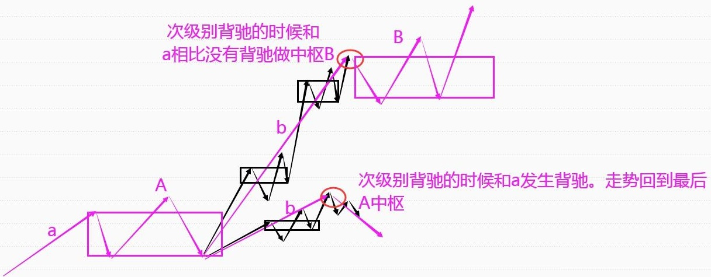
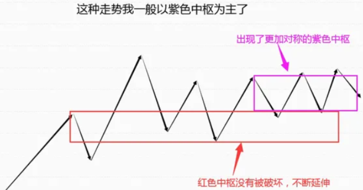
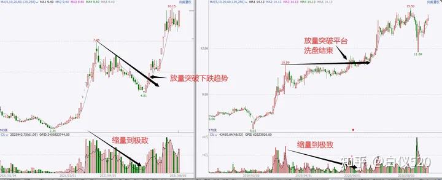
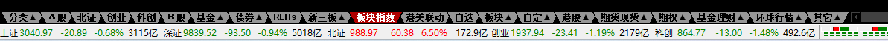
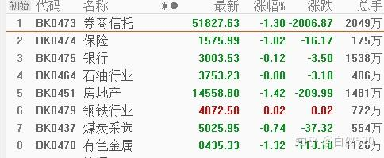

# 白仪野生交易员笔记

## 缠论三买卖点

### 三买卖点的基本说明

三买：**走势向上脱离中枢后回踩一笔不进入中枢。**

中枢：价格重叠的区间，价格重叠代表买卖双方的阵地，即买卖资金，而**资金是推动行情的核心力量**。

三买卖点操作逻辑：

1. **分析多空资金博弈力量，顺应主力资金操作。**三买是经过多空力量博弈后多方力量确定胜利，然后空方力量再次反击，最后多方力量以决定性胜利胜出的阶段拐点。既然多方力量胜出，那么就顺着多方力量做多，成功的概率当然就更高了。
2. 顺应价格走势趋势。趋势具有连续性和惯性，上涨的趋势往往不会一下子停下来，需要缓存一下才能。

三买卖点回踩不进入中枢的原因：

1. 根据强弱原则，突破力度越大，回踩力量越小，行情越强。

2. 根据中枢引力法则，中枢是有引力的，向外突破的点会被吸引回来，而未被吸引回来的点就是确定中枢结束的点。

### 三买卖点操作

#### 针对本级别中枢的次级别三买点

操作条件：

1. 有本级别中枢
2. 行情向上突破本级别中枢

次级别一笔回踩不进入中枢，就是次级别三买。

操作方式：实际操作中可以不看次级别图，根据分型辅助成笔，本级别分型连接起来就是次级别一笔，因此当**行情突破本级别后出现强势底分型**，就相当于次级别三买卖点出来。

止损点：跌破底分型最低点。

#### 针对本级别中枢的本级别三买点

操作条件：

1. 有本级别中枢
2. 行情向上突破本级别中枢
3. 行情回调一笔不进入本级别中枢

操作方式：等分型停顿或验证分型就能入场了。

止损点：突破分型的最低点。

上图中在回调一笔的大阴线就是最低点了，实际操作中不是在这里买，而是等验证分型，直到等到大阳线，它的收盘价高于前面大部分K线的最高价。

#### 针对本级别中枢的b-A买卖点

次级别向上突破本级别中枢以后，出现一个回踩不进本级别中枢的次级别中枢。

### 介入点顶底分型

为什么介入点是顶底分型、分型停顿、验证分型？

顶底分型的介入逻辑：

没有顶分型就没有顶，没有底分型就没有底，任何下跌反转都是从底分型开始，任何上涨反转都是从顶分型开始。

分型背后的形态逻辑：

1. 强势底分型：次级别强势反弹一笔，如果次级别处于买点区域，说明次级别买点成立。
2. 强势顶分型：次级别强势下跌一笔，如果次级别处于卖点区域，说明次级别卖点成立。
3. 强势顶分型停顿：次级别强势一买成立。
4. 强势底分型停顿：次级别强势一卖成立。
5. 强势验证顶分型：次级别强势二买成立。
6. 强势验证底分型：次级别强势二卖成立。

风险背后的多空博弈逻辑：出现顶分型时，小级别上涨趋势发生反转变成下跌走势，空方力量胜利了，底分型相反。

分型操作注意：

1. 为了提高成功率，不在买点区域顶底分型入场，而是买点区域的分型停顿和验证分型入场。
2. 分型停顿和验证分型意义是确认这个买卖点是否强势，而不是有几根。

该方法运用不是死板的，等是为了验证顶底分型强弱，而不是毫无逻辑去数K线，实际中就算10根20根去验证也是可以的。

### 卖出方法

#### 盈亏比+05均线

条件一：

- 极限止损：止损位置必须小于这个止损，不能大于它。
- 底线止盈：平时盈利卖出时必须大于这个底线止盈。

看品种调整，一般在分型停顿或验证分型入场，止损是跌破或突破分型最低点。

**止盈目标最少高于极限止损的2倍**，这样赚一次的钱最少能亏2次呢。

条件二：

为了避免错过急速上涨或下跌的行情，加一个条件，当达到底线盈利目标后，如果走势并没有跌破或突破05均线时，可以按照05均线持有，等何时收盘价破位05均线时再卖出。

#### 一笔结束

介入三买卖点任意一个，主要目标都是本级别一笔。比如一分钟三买介入后，目标只是一分钟上涨的一笔。

在目标一笔情况下，在这笔上涨结束或可能结束时卖出。

判断一笔结束？**次级别趋势背驰或次级别二买卖点成立。**

为何选择二买卖点而不是一买卖点呢？在单边行情中，趋势延续性强，行情背驰后中枢延伸一下容易继续按照原有趋势运行。其次有时候次级别并没有趋势背驰，这时候二买卖点就是最好判断方法。

:::danger

在用验证分型平仓时，一定要选择强势的验证分型才能平仓，而且要等K线快收盘时平仓。

:::

### 品种选择

三买卖点主要是顺应主力资金的一种买卖点，三买卖点在资金情绪达成一致时容易成功。

资金情绪达成一致的情况：

1. 大周期，针对中长期为主：周线以上级别方向出来时，说明中长资金情绪达成一致，这时行情延续性较强。比如周线选择向上，那么这时出现三买成功率较高。
2. 小周期，准对短期为主：成交最活跃的时间段。买卖本身属于多空博弈，在多空博弈最激烈时，一旦走出方向，那么这个方向一般都是真实的。大部分时候，短周期行情最活跃有2个阶段，这时候行情不仅仅延续性强，波动也比平时大：
   1. 刚刚开盘时候
   2. 突发重大消息刺激时候

从日内波动角度看：一般日内波动活跃品种如下：`股指期货>商品期货>外汇`。

股指期货中以开盘实际最长为首先，短为次选，则`美盘>欧盘>亚盘`，商品期货以主流全球化商品为主，其余点为高为次选，`美黄金、原油>美精钢、美白银、沪镍、沪锌、沪铜、沪锡、pp、pta、苹果棉花等>玉米、花生、菜粕、淀粉`。

### 买卖点价值判断

从买点判断：

1. 针对本级别中枢的次级别三买卖点成功后，随后出现针对本级别中枢的本级别三买卖点更容易成功；相反，针对本级别中枢的次级别三买卖点失败后，随后出现针对本级别中枢的本级别三买卖点更容易失败。
2. 针对本级别中枢的本级别三买卖点，要是之前没有出现针对本级别中枢的次级别三买卖点，那么这个三买卖点容易失败。

从品种判断：三买卖点对资金依赖性较高，所以需要资金情绪一致时候成功率才高，因此选择波动活跃的品种上使用三买卖点成功率更高。K线饱满、走势顺畅代表活跃，K线纠结、像蜈蚣一样则不活跃。

从时间判断：成交最活跃的时间段出现的三买卖点成功率更高。成交最活跃时间段一般分别为开盘时间段和突发消息刺激时间段，这两个时间段成交最为密集，出现的三买卖点也比平时出现的更容易成功。

从形态判断：

需要谨慎对待的形态：

1. 大级别趋势背驰段出现的本级别三买卖点。
2. 第二个同向同级别出现的三买卖点。

这种点从定义上来讲其实不是三买点，但广义来看和标准三买点类似，这种点位因为行情超跌或超涨原因很容易失败，如果想做，最好选择趋势性很好的品种，比如美盘股指。

3. 大级别中枢上下轨附近的本级别三买卖点。

大级别中枢上下轨本身就是很强的压力支撑位，这种压力支撑位出现的三买卖点在没有外力刺激的情况很难被真正突破，只有在活跃时间段才可以尝试。

4. 复杂走势出现的三买卖点。

复杂的走势，一般都比较纠结，都偏离理论标准，这种情况是不建议操作的。

5. 普通时间在重要压力支撑位附近出现的三买卖点。

// TODO：P104，没懂

6. 极端行情下出现的三买卖点。

包括复杂走势行情、瞬间急涨急跌行情

7. 弱势行情三买卖点。

- 突破中枢后回抽太强，都快进入中枢的这种三买卖点。
- 突破中枢连中枢震荡的最高点都没有突破后回抽的三买卖点。

8. 缺口回补的三买卖点。

缺口，本身是跳空开盘，这是强势的表现，既然强势，开盘后行情就应该顺缺口方向运行，要是跳空开盘后回补了部分缺口出现的三买卖点，这时候行情就走弱了，这种情况的三买卖点需谨慎。

上海机场，跳空后走弱的例子，63.88就是最高点了：

性价比较高的三买卖点：

1. 成交活跃时间段出现的三买卖点。
2. 离重要支撑压力位较远的三买卖点。
3. 走势简单对称的三买卖点。

格力电器，走势很简单，所有的买点成功率都较高：

### 缠论三买卖点的优势与劣势

优势：

1. 大部分时候行情的暴涨暴跌都对应着三买卖点，针对本级别中枢的次级别三买卖点主要抓类二买卖点后的主升浪或主跌浪，针对本级别中枢的本级别三买点点主要抓趋势延续。
2. 避开弱势行情。三买出现在上涨行情中，那么总体来讲，多头是比较强势的，因为弱势就不会出现上涨行情。
3. 避开中枢震荡，对于趋势交易的人来说，效率更高。

劣势：

1. 缠论三买卖点属于技术分析，实际交易中不可能保证100%正确，所有需要设置止损位，遇到极端行情不止损则会断送自己整个交易生涯。
2. 对资金依赖性高，这也是缠论三买卖点在成交不活跃品种和级别上使用时候容易失败的原因。

### 中枢，价格重叠区间也

> 以股市为基础。缠者，价格重叠区间也，买卖双方阵地战之区域也；禅者，破解之道也。以阵地战为中心，比较前后两段之力度大小，大者，留之，小者，去之。 

只要价格重叠了，就会产生中枢。

**价格重叠看中枢的难点也是重点主要在于判断中枢级别**，**因为中枢级别直接涉及到操作。**

#### 本级别中枢判断

1.本级别3笔重叠为本级别中枢

2.MACD辅助判断，MACD快慢线两次回抽零轴附近且对应区域的K线明显有重叠

#### 次级别中枢判断

1.分型辅助成笔

本级别相邻的顶底分型连起来，可以当做次级别笔，次级别3连续3笔重合就是次级别中枢。

2.10根K线以上重叠，可以当做次级别中枢。

## 缠论运用经验技巧

### 本级别中看次级别

1. 本级别3~6根K线重合，一般是次次级别中枢。

如下是南方航空5/25~5/31的日线图，发现有5根K线重合：

如下是南方航空5/25~5/31的5分钟图，发现是走势是中枢震荡的：

:::tip

5~6根K线重合与3根K线重合虽然看到的都是次次级别中枢，但看到的是不一样的。因为级别有多种划分方式：

- `周线--->日线--->30分钟线--->5分钟线`
- `周线--->日线--->60分钟线--->15分钟线`

15根以上重合是60分钟中枢，7~10根重合是30分钟中枢，5~6根重合是15分钟中枢，3根是5分钟中枢。

至于次次次级别，就没必要通过本级别来看了，跨度太大，操作意义不大。

:::

2. 本级别10根以上K线重合，或用分型辅助成笔看3笔重合，是次级别中枢。

如下是汉王科技7/12~8/4的日线图，发现有10多根K线重合：

如下是汉王科技7/12~8/4的30分钟图，发现走势是中枢震荡的：

3.本级别看更大级别

- 递归，本级别一线段等于更大级别一笔
- 中枢扩张

### 共振

如何理解共振？

共振，首先需要有自己的一个核心方法，然后以自己的核心方法为主的同时利用其他方法辅助来看。

#### 缠论看共振

1.最近的各级别中枢

**找各级别中枢的目的就是为了寻找支撑和压力位，从而对未来行情的目标做一个基础的心理预期。**比如当前行情是上涨的，但我们不知道能涨到什么位置，那么我们可以找到前面的中枢，一般前面的中枢都是压力位。

一般来说，只需要找两个级别中枢就足够了，即本级别中枢和次级别中枢。本级别中枢是操作级别中枢，次级别中枢是比操作级别小一个级别的中枢。我们找这两个级别中枢时候，只需要看一个级别走势，即本级别走势。

当本级别做买卖点时候，次级别中枢就是压力支撑位；大级别做买卖点时候，本级别中枢就是压力支撑位。

2.大小级别构筑的买卖点

当大级别构筑买点情况下，本级别买点更容易成功；当大级别构筑卖点情况下，本级别卖点更容易成功。

3.背驰

缠论走势背驰遇到压力上涨容易结束，缠论走势背驰没有受到压力，上涨不容易结束。

既然是共振，那么把上面三个视角结合起来看：

- 做多时候，大小级别都在构筑买点，次级别背驰，同时回调到支撑位，那么买点成功率高。

- 相反，做多时候大级别构筑卖点，次级别没有支撑、背驰，那么即使是本级别买点，失败率较高。

#### 趋势共振

缠论看多时候，均线多头排列，价格受到均线支撑，那就是共振。

#### 股性共振

股性就是股票波动的规律，比如某些股票喜欢冲高一波后就行情结束，有的喜欢震荡上涨，有的股票喜欢类二买启动……

#### 消息共振

缠论做多点，出现利多消息，做空点出现利空消息。消息包括政策消息、事件消息。

#### MACD共振

比如可以用macd来辅助判断强弱，对于做多来讲，macd大幅跌破零轴就是弱势反之就是强势，做空反过来就是。

再比如macd两次回抽零轴一般就是比较对称标准的中枢，变盘率比较高，那macd两次回抽零轴就是和缠论类2买形成共振。

### 背驰合集

> 原文：[背驰合集，各种类型背驰识别](https://zhuanlan.zhihu.com/p/428705554)

**背驰就是背道而驰，一般是两个标的做对比，形容两个标的走的方向完全相反。**

背驰的作用是寻找趋势性的拐点或者阶段性的拐点，逻辑是通过两个标对比后**找到原主力力量衰竭的点，这个点很容易变成转折点**，正所谓物极必反，背驰就是那个极点区域。

:::danger

在实际操作交易中，价格波动会受资金影响，在运用背驰时，就没办法做到100%正确，因为资金的注入可以改变价格，进而改变背驰。

**背驰不代表转折，抄底摸顶不一定会成功。**

:::

#### 价格背驰

通过价格变化（K线图）去判断背驰，见基础篇。

#### MACD背驰

1.传统看法

**股价新高，MACD红柱子和快慢线不能同步新高**（同步新低或几乎持平），形成上涨背驰。

2.缠论视角

当MACD从上往下回抽零轴以后继续上涨创出新高，而相应的MACD红柱子没有之前上涨的一波多，形成上涨背驰，反之没有背驰。

> 这里没懂传统看法和缠论视角的区别？回抽零轴意味着什么？

#### 均线背驰

以两根均线缠绕的区间为核心（缠绕区间最好相交两次以上），等股价新高或者新低以后对比均线**缠绕前后相交的面积大小**。如果后面的均线的相交面积小于前面均线相交的面积，形成背驰，反之不背驰。

在实际操作中，如果级别较大（周线级别以上），出现一次下跌均线背驰就可以入场了；如果级别较小，最好等出现2次缠绕后出现的背驰再入场。

#### 量价背驰

价格和成交量出现背驰，即价格上涨时成交量不涨（缩量或平量）。

常规视角下，量价背驰是走势不健康的表现，代表买入资金变少，价格随时可能见顶，所以持仓的股票出现量价背驰时就要引起关注。

但实际上，把量价背驰当作不健康的走势，逻辑是不对的。价格由资金推动，成交量是资金买卖的表现。**成交量低，说明买的人和卖的人都不多。**有些股票大部分筹码在机构或庄家手里，市场上流动交易筹码很少，只要他们不卖，不需要太多资金买入就能导致股价上涨，所以在一些白马股和庄股里面，经常会出现缩量或平量上涨的情况，因为他们都锁仓。

下面是股票山西汾酒可以看到二买后是上涨趋势的，但成交量是缩量的。

#### 指数和个股

1.指数新低，个股没有新低。这种情况说明个股强于指数，只要指数止跌，个股涨幅一般比指数大。

2.指数长期下跌，个股震荡。这种情况个股非常抗跌，只要指数企稳，个股随时可能启动大级别行情。

3.指数长期上涨，个股震荡。这种情况个股走势比较弱，处于蓄势状态，当第一批主流股票上涨结束以后，这种股票很有可能会补涨。

### 走势终完美

> 原文：[缠论实际中如何运用走势终完美？](https://zhuanlan.zhihu.com/p/445594848)

#### 简介

走势终完美：**当下的走势都是某个级别的未完成走势类型，所有未完成的走势类型终要完成，完成以后会变成新的走势类型。**

最基本的就是a+A+b的走势，进入段（a）、中枢（A）、离开段（b）

:::caution

上图只是基础走势，实际上**可以有多个中枢，但必须都是同向同级别中枢。**

:::

比如现在是盘整下跌，那么盘整完成后对应的就是盘整上涨趋势：

#### 使用逻辑

运用走势终完美的逻辑，找未完成的走势。所谓未完成的走势，即离开段走势（b），这段就是可以操作的。

我们可以操作的是离开段中的离开段，即b-b段。

b段要完成，那么b段中出现的出A中枢的b-b也要完成。

实际中，b-A可能会出现在A里面，这样就很难判断b-A走势是不是中枢离开段。因此**最好在走势向上突破大中枢A后出现小中枢b-A的时候操作**，因为这个时候已经确定出现b段是出中枢走势了，这个时候走势确定离开了中枢，同时出现小b-A（3买）确定中枢结束，不仅可以保证b-b的出现，还有更大的概率出现大幅上涨。

如下图，b-A出现在A里面，就不要做了：

标准走势，在走势向上突破大中枢A后出现的小中枢b-A时候操作：

:::tip

使用走势终完美思路时，有两个重点：

1. 找中枢。中枢是多空博弈的空间，在实际运用中，不需要搞那么严格，只需要知道这里有个中枢就可以了。如果中枢没有离开段，那就是未完美，可以等机会操作。

2. 找到中枢后只需要等着离开中枢段后出现的b-A，然后等待操作b-b就好了。

:::

#### 注意事项

1. 使用走势终完美时候，A操作级别要大，日线以上。
2. b-A必须出现A中枢上面。
   1. 对各级别买卖点、各种视角很熟悉的可以不要求突破中枢
3. b-A中枢级别要小于A中枢级别。
4. b-A中枢只要级别小于A中枢，都是可以操作的，一般情况下，会看到多个b-A。
   1. 新出现的b-A是未完成的走势，既然要完成，就对应着b-b的上涨。
   2. 新出现的b-A是大A出中枢的走势，属于a+A+b走势中b走势的次级别走势，如果b-A未完成，那么a+A+b也不会完成。

5. b-A级别决定了操作级别，也就是说，需要等到b-A这个级别走势完成后才能卖出。
6. **具体入场点在b-A中枢第三笔下跌结束的点。**

7. b-A在同级别分解视角最好是第一个中枢，如果是第二第三个中枢，容易新高背驰，上涨空间被限制。而如果是第一个中枢，那么b-b则容易形成共振出现大幅度上涨。
8. **具体出场点在b-A中枢上涨背驰或出现二卖时候。**
9. 出中枢有级别，是什么级别出中枢的，就操作什么级别。一般来讲，出中枢级别越小，越发强势。

10. 突破中枢级别的力度不能太大，不能是那种脉冲式一下连续涨一两倍那种，因为这种短期中长线资金和短线资金都会大幅获利，这些资金容易兑现，从而结束中长期上涨趋势，这种行情出现的b-A走势操作价值不大的。

11. 如果有其他上涨因素，效果会更好。其他因素比如个股基本面支撑、板块效应、政策利好等等。

### 走势终完美运用难点

> 原文：[走势终完美实际运用中的难点](https://zhuanlan.zhihu.com/p/447477872)

#### 1.怎样看中枢？

运用走势终完美视角时候，核心在于2个中枢，一个是大A中枢，另一个是b-A小中枢，因为这两个走势都要完成，而在b-A中枢没有完成之前，大A出中枢走势就不会完成。

实际的难点在于这两个中枢怎样确定下来呢？

怎样看都行，只要确定这是一个中枢即可，至于用笔还是中枢扩张或其他视角，都不影响。唯一要求就是A中是盘整里的中枢，B中枢是趋势里的中枢。

比如下图中，**我们需要的是A中枢而不是B中枢**，然后在b段中再找小A中枢。B中枢虽然也是出中枢，但对应c段，c段很容易背驰，风险比b段大：

比如下图中都是A中枢，都是盘整走势，可以预期后面b段上涨。

- 第一个中枢：肉眼可见
- 第二个中枢：明显比第一个大，所有第一个中枢就变成了第二个中枢的进入段，第二个中枢就变成了盘整走势。
- 第三个中枢：中枢扩张的走势，明显比第二个大，那么第二个中枢走势就变成第三个中枢的进入段，第三个中枢就变成的盘整走势。

这三个中枢从大小来看就不是同级别的。

---

**b-A中枢的要求：b-A中枢级别必须小于A中枢**，只有小于A中枢，才能当作b段走势的次级别走势，**只要b-A中枢没有完美，那么b就不会结束，那么A中枢就不会完美。**

确定b-A的级别，可以用出中枢那段走势级别来确定：

- 一字板出中枢，一分钟级别，如果操作那就是操作一分钟了，一分钟上涨结束时候就要走。
- 日线连续大阳线突破，有几根K线重合，那就是5分钟中枢，5分钟上涨结束后就要走人。
- 周线中枢日线突破的，做一个日线中枢，只要日线上涨背驰了就走人。

:::danger

一分钟，这种属于超短线，需要注意，不能涨幅巨大，不能一次涨了一两倍再买，而且一定要有很大的利好消息才能做。

:::

如下是30分钟和日线的，注意看30分钟和看日线的卖点位置：

---

在实际操作中，有一个难点，那就是b-A如何介入以及介入以后走势演化问题。

一般情况下，b-A就是某级别的下上下三笔，**在第三笔下的时候用区间套方法在小级别找背驰点或其他买点。**

#### 2.走势一定完美吗？

理论上是肯定的，因为走势如果不完美，这套方法论就不成立，缠论就不成立了。

当然在股市中，没有谁敢说走势必完美，意思是讲走势终完美这个逻辑理论是存在的，实际运用中总有特殊情况，我们无法根据走势必完美做到100%盈利。

原因如下：

**1.大A出中枢走势要完成，小b-A走势也要完成，但是什么时候完成我们不知道，因为中枢可以不断延伸不断扩张，我们做大A出中枢段的原因就是我们不知道这个大A什么时候会完成，在b-A的时候我们已经确定b段出现了，走势已经处于可以完成但未完成的阶段，这个时候我们去做b-A，原因就是b-A大概率会立马完成，那其实b-A不断延伸也是可以的。**

**2.实际中存在上涨没有标准中枢行情、中枢扩张行情和小转大行情。**

#### 3.操作b-A后的几种情况

操作b-A的目标：目标是b-b，且b-b创b-A的新高。但在实际中，后续走势可能不断扩张延伸甚至回到大A中枢。所以需要对b-A以后可能出现的走势进行分类和应对。

1.b-A后走势没有新高，而是继续下跌。

以小级别3卖为主，如果没出现小级别3卖，就不用出局，出现就止损出局。

如图所示：**出现紫色中枢的三卖的时候可以走一部分，出现针对红色中枢的三卖的时候可以全部走人。**

2.b-A后走势没有新高，反而不断延伸新低，但没有出现3卖，那么可以加仓，预期更大级别的b-b上涨。

:::danger

**这里要注意一点，卖出的时候，因为有第一批仓位、第二批第三批仓位，所以这些仓位卖出的时候也是要遵循相应级别的卖点，比如第一批仓位的1分钟买点入场的，那后面出现一分钟卖点的时候要走人，第二批仓位是5分钟买点入场的，那后面出现5分钟卖点的时候第二批仓位要走人。**

:::

3.b-A后走势没有新高，反而不断延伸新低，出现3卖，止损出局。

4.买入后暴跌

这是最不愿意看到的情况，期货中更常见。其实这种走势后面肯定会有反弹的，而且这种b-A本身也是轻仓操作，一般的操作是在暴跌的这波下跌结束加仓，随后的反弹出局。不过对于新手难度太高，所以建议大家实际中先多研究一下b-A这种走势，然后多复盘多练习，开始不熟悉的时候建议设置一个止损点，比如之前讲过的底分型停顿最低点，验证底分型最低点都可以。

5.买入后新高

这是符合预期的，只要新高不管力度如何都代表这个买点成功了，区别是有的涨的高，有的不高。

#### 4.一些交易经验

1.这种方法尽量使用在股票上，**大A中枢级别尽量不小于日线级别**。如果是期货，也尽量做级别大一些的。

2.**突破大A中枢级别的力度不能太大**，不能是那种脉冲式的一下子就上涨一两倍那种，因为这种短期中长线资金和短线资金都会大幅获利，这些资金容易兑现，从而结束中长期上涨趋势，这种暴涨以后的行情出现的b-A走势操作价值不大的。

3.个股加上缠论以外的因素，效果会更好。

4.b-A弱的尽量不要做，比如变成下上下变成一个下跌线段的。

这种走势变成3买了，但b-A主要操作逻辑不是3买，而是走势终完美，是出中枢，所以这种买点不在这种方法范畴内。

5.**同级别分解视角下，b-A是第一个中枢比较好**。

6.**突破大中枢A时候最好成交量放大，突破b-A时候，成交量最好要缩小**。

因为我们可以把突破当做是启动，既然要启动，就需要量能支撑（白马股和部分庄股例外）；而b-A位置则是洗盘区域，洗盘区域需要缩量，代表浮筹减少，这样才有利于后期拉升，如果这个阶段不能缩量，说明有大量的资金在抛售，那就不得不考虑是不是主力在出货了。

### 盘中判断缠论背驰

> 原文：[盘中判断缠论背驰（运用）详细讲解](https://zhuanlan.zhihu.com/p/449367510)

用缠论看背驰需要注意：

- 不需要macd
- 不需要均线
- 只需要k线

也就是说，**只用k线判断背驰是运用缠论的基础能力，macd、均线这些看背驰在缠论中只是辅助工具，属于可有可无的指标。**

到这里还是要强调一下：**背驰只是代表原有趋势力量的衰竭，不代表走势要反转，反转和背驰是有关系的。**

在大部分时候，行情的反转和背驰是有很大关系的，也就是大部分时候背驰以后行情确实会反转的，即使背驰以后行情不反转，也有一定的操作空间，如果加上其他因素加以辅助，那背驰也是一个比较好的工具，尤其是在判断大级别机会和盈利以后卖出的时候，是一个比较好的工具。

**所以就不要纠结特殊行情时候，明明下跌背驰了还不上涨？明明上涨背驰了还加速上涨？因为行情是由资金推动的。**

如何判断离开中枢段走势是不是会背驰呢？可以通过区间套

- 在更小级别走势背驰的时候，如果大级别也背驰了，那就形成背驰，这个小级别背驰点就可以操作，我们也可以买在转折点附近。
- 如果更小级别的走势背驰的时候大级别没有背驰，那大级别走势就没有背驰，我们就不要操作。

更精确定位前面讲过了，就是**在买点区域出现强势底分型停顿或强势验证底分型时候操作**。

:::tip

判断一个位置是否可按照强势底分型停顿或强势验证底分型操作，需要看大级别（操作级别）是否背驰、小级别买点是否背驰，如果都背驰就可以做了。

至于是从大级别看小级别还是小级别看大级别，都是可以的，一般来说从大到小更方便些。

:::

### 缠论级别定位的三种视角

> 原文：[缠论对应大小级别的定位](https://zhuanlan.zhihu.com/p/450556163)

缠论对应的大小级别定位问题，在股票和期货中是不一样的，因为不同期货品种开盘时间是不一样的，大部分期货品种开盘时间都比股票长。**日线以内的周期，期货的k线大多都比股票多**，**这样的话是不能把股票那套级别定位原封不动的搬到期货上的。**

1.递归

确定一个最小级别，在该级别上画出严格笔，然后得到现代，再把线段进行同级别分解，分解后得到的线段就是更大级别一笔，再用同样方法把更大级别一笔连接成线段，再把更大级别线段进行同级别分解，从而得到更大2个级别的笔，以此递归。

2.分型辅助成笔

3.根据股票的时间周期级别去推算

股票的时间周期级别是1分钟、5分钟、30分钟、日线、周线、月线，我们发现，5分钟是1分钟的5倍，30分钟是5分钟的6倍，周线是日线是5倍，月线是周线是4倍。也就是说大小级别的倍数大概在4-6倍左右。

那对于股票以外的品种，我们也可以按照这个方法去推，1分钟-30分钟可以固定，30分钟的四倍是2小时，那30分钟的更大一个级别就是2小时，2小时的四倍大多数都是日线，那2小时的更大级别可以当做日线。

当然，这种方法是更加粗糙了，因为股票的时间周期本身就是很粗糙的，用本来就粗糙的方法为基础去推算，那肯定是更加粗糙的，不过我觉得不管你怎么看，就那样吧，做不到完美，但是能用。

### 不测而测下的完全分类

> 原文：
>
> [缠论不测而测下的完全分类详细讲解](https://zhuanlan.zhihu.com/p/450075265)
>
> [缠论实际中如何运用不测而测？（2）](https://zhuanlan.zhihu.com/p/451425133)

#### 不测而测

我们常说的预测一般是预测后面是上涨还是下跌，预测到哪个价格会遇到压力支撑，这种预测是根据某种特征对未来做出猜测，即使猜对了，也存在很大偶然性，这种预测充满了不确定性。

缠论说的预测是必然性的，上涨下跌等走势都在预期之内，**缠论的这种必然性预测建立在对市场的完全分类上**。

不测就是不做预测，只做分类，把未来所有出现的走势都分类出来，只要出现对应行情，就知道未来怎么走了，这就是不测中的测。

比如出现走势a+A+b：

这时候对未来可能走势分类：

- b的次级别背驰如果比a力度小，则发生盘整背驰，走势大概率要回到中枢A中。
- b的次级别背驰如果力度比A大，则没有发生背驰，那么后面走势大概率要做B中枢。

:::tip

不测而测的运用是一件综合的事情，因为完全分类就是要求你对市场可能出现的走势做全部的分类，对市场做全部的分类那肯定需要涉及到多维度的视角，比如资金、情绪、人性、政策、行情等视角，涉及这些视角那肯定要求具备相关视角的知识经验的。

:::

通过前面讲的逻辑可知，**不测而测的主要作用就是不管行情怎么走，都在我们的预期之内，那我们就可以做出相应的对策，从而达到顺势交易的目的。**

#### 基础完全分类

走势分类有3大方向：上涨、下跌、横盘。

- 上涨：盘整上涨、趋势上涨。
- 下跌：盘整下跌、趋势下跌。
- 震荡：中枢。

a.盘整分类

1.向上突破中枢

应对：等待三买操作。

2.向下突破中枢

应对：等待三卖操作。

3.中枢不断延续

应对：不操作；或者用中枢逆转思路；或者用次级别买卖点在中枢上下轨附近做差价。

b.盘整上涨

1.上涨没有背驰

应对：没有买入的情况下等待三买操作；多单持有情况下继续持有。

2.上涨背驰

应对：没有仓位情况下准备做空；多单持有情况下准备平仓。

c.趋势上涨

1.上涨没有背驰

应对：没有买入的情况下不操作；多单持有情况下继续持有。

2.上涨背驰

应对：多单情况下卖出，同时空单准备做空。

d.盘整下跌

1.下跌没有背驰

应对：空单持有的继续持有；没有空单的等待三买做空。

2.下跌背驰

应对：没有仓位情况下准备做多；空单持有情况下准备平仓。

e.趋势下跌

1.下跌没有背驰

应对：空单持有的继续持有；没有仓位不要操作。

2.下跌背驰

应对：空单持有的准备平仓；多单准备入场。

#### 进阶完全分类

基础完全分类只对单一级别走势做了分类，而进阶完全分类除此之外还有对多个走势同时进行完全分类，同时还要把走势生长、买卖点、基本面、品种因素、市场人气因素等等结合进去，这是走势的进阶分类。

### 缠论同一个买点在不同状态下有什么不同？

> 原文：[缠论同一个买点在不同状态下有什么不同](https://zhuanlan.zhihu.com/p/463395335)

下面针对本级别中枢的次级别3买为例子。

1. 买点是否在中枢内

特点：

- 受制于中枢的压力，容易在中枢上轨受到压力，如果离中枢上轨比较近，那可预期的上涨空间就是有限的。
- 多空力量博弈处于胶着状态，方向不明朗，确定性相比起已经走出方向的走势更低。

2. 大级别卖点区域

这种次级别2买因为受制于卖点压力和风险，可预期的上涨空间有限而且非常容易失败。

3. 重要压力位附近的3买

压力位的3买容易受压而失败，而突破压力以后的3买因为压力小，上涨更加容易，3买更加容易成功，所以**压力位置的3买没有突破压力以后出现的3买好。**

4. 没有驱动因素的3买

这里说的驱动力是指能让资金追进去的理由，比如业绩大幅增加、突发事件利好、政策利好等。

5. 3买之前涨幅不同的走势

涨幅太高的不要，比如涨连续涨了一两倍甚至五六倍以后的3买不要，即使要操作，也要非常谨慎，只能轻仓快进快出。

因为这种3买会积累大量的盈利巨大的获利盘，3买区域极有可能变成出货区域，这个阶段你入场，那完全可能就是进去接盘的。

6. 3买与中枢最高点

从形态上讲，上面两图都符合三买点，但从力度角度来看，第二种更好。

但第一种能操作吗？是可以的，建议分仓操作：

7. 成交量

**a，构筑3买的时候缩量的比放量的好，3买成功以后放量的比缩量的好。（白马股和主力一字板拉升的除外）**

这是从洗盘的角度出发的，构筑3买可以看成是蓄势，既然是蓄势，那就需要洗盘，洗盘就需要把短线筹码洗出去，留下稳定筹码，那么随着短线资金的离场，成交量就会越来越小，这是构筑3买的时候要缩量的原因。

3买成功以后要放量的原因是，你上涨需要资金，而成交量就能直接体现资金买卖情况下，成交量越多，追进去的人越多，越有利于上涨。

**b，3买之前的出中枢走势，放量的比缩量的好。（白马股和主力锁仓拉升的除外）**

这是从资金关注度和主力资金强弱的角度出发的。

你要上涨，就要接盘获利资金和很早之前套牢资金解套后抛出的筹码，如果资金关注度低或者主力资金实力很弱，那是接不住抛盘的，那股价上涨自然不能持续。

8. 成交活跃的品种出现的3买比成交不活跃的品种出现的3买要好

:::tip

庄家恶意操纵高度控盘的除外。

:::

在股票中短线的3买中，题材股的3买要优于白马股的3买，因为题材股资金关注度高，走势干脆。而白马股大部分都是机构资金，成交不活跃，更纠结一些。

3买本身属于比较急的买点，一旦走势纠结，对于技术交易或者杠杆交易的人来讲，就很容易被频繁止损。

在期货中，高点位的指数期货优于低点位的指数期货；高点位的商品期货优于低点位的商品期货；高点位的指数期货优于高点位的商品期货。

原因都在前面讲了，3买是对资金持续性要求很高的品种，一旦成交不活跃，就容易失败。

9. 回调幅度

回调幅度超过出中枢力度的50%或者大幅突破中枢以后回调都快进中枢的3买没有回调不超过50%的3买好。

### 缠论各类型的买卖点转换

> 原文：[缠论各类型的买卖点转换](https://zhuanlan.zhihu.com/p/474126509)

:::tip

买卖点的转换属于特殊行情之一，理论上属于不符合盈利预期的走势，因为正常的行情一般是买卖点延续、利润延续，而买卖点转换就变成了利润停止甚至利润回吐的走势，所以本文其实是要讲不符合盈利预期走势的分类和应对方法。

:::

买卖点转换，说的是在某个买点入场后，稍微延续一段时间后变成了卖点。在实际操作中，因为走势多变，那么就有概率遇到买点转化为卖点，卖点转换为买点。

#### 盘整背驰1买转3卖

一般来说，大周期（周线、月线）出现的盘整背驰，都可以当作一买，因为大周期出现的盘整背驰不常见；其次就是本级别处于买点区域次级别盘整背驰时候，次级别的这个盘整背驰也是可以当作1买的。

如果出现弱势行情，就会出现盘整背驰1买后稍微反弹一点或横盘，然后变3卖继续下跌。

如何应对？

看级别，如果级别很大，那么就用次级别买卖点操作，以次级别买卖点为主。比如周线盘整背驰，就操作日线买卖点、止损点。

#### 3卖转2买

1. 如果3卖位置MACD向上突破零轴，随后从零轴上面回抽到零轴附近，这时候出现的2买是可以操作的。

2. 如果3卖转2买是弱势的，也就是3卖位置MACD没有向上突破零轴，或2买位置MACD跌破零轴，那么这种3卖转2买，一般是抓不到2买的，**直接放弃就好了，然后等后续的类2买再操作**，这时候的类2买，MACD需要在零轴上面回抽零轴。

#### 3买转2卖

1. 如果操作级别比较大（日线以上）的3买，那么可以利用次级别买卖点来操作，这样就可以避开3买转2卖的风险。

2. 如果是小级别的，那设好止损，该持有就持有，该止损就止损

#### 1卖转类二买

这种走势在盘整背驰中最容易遇到，1卖回调进入中枢后转换为类2买，中枢延续后继续新高，这种走势实际上并没有很好的解决方法，可以直接换一个，后续上涨跟你没关系。

当然，也可以在走势回到中枢次级别背驰时候接回来，随后上涨如果继续背驰，那么就走，如果没有新高出现2卖，还是要走的。

#### 1买转2卖

1. 如果是大级别的盘整背驰，那可以用次级别买卖点应对，有足够的时间和空间避开这个类2卖。

2. 如果是小级别的，那看该止损就止损，不止损的就等着补仓机会。

#### 2卖/类2卖转为2买

本来2卖以后正常的预期应该是类2卖，类2卖以后正常的预期应该是3卖，但这里转为买点了。

这两种走势呢都可以用MACD回抽零轴来辅助判断操作。

所以这两个走势，我们要从做空的思维转换成做多。**这里注意，2买可以用MACD辅助，同时这些走势也可以用另类小转大处理。**

#### 2卖转1买

本来2卖以后正常的是做类2卖出现中枢，但实际上，2卖以后如果来一个新低，且出现3笔背驰，是会出现1买的，尤其是大级别是买点的情况下，次级别经常出现这种情况。

这种走势股票，如果月线是上涨一笔情况下，日线出现2卖转1买是可以操作的，当然更稳健的方式是等2买操作。

#### 2买转1卖

大级别趋势下跌的时候，很多反弹都只有3笔。这3笔结束要先走，后面走一步看一笔再决定要不要继续做。

#### 2买卖点转为3买卖点，3买卖点转为1买卖点

这个走势不是很重要，了解就好了，因为2买卖点赚3买卖点，站在3买卖点的角度，有点弱，可能不会怎么去操作，3买卖点转1买卖点呢，这是合理的走势，背驰买入或者走人就可以了。

### 很多缠论走势都是盘整和小转大

> 原文：[市场的真相，很多缠论走势都是盘整和小转大（看盘经验）](https://zhuanlan.zhihu.com/p/478927303)

很多走势都变成了盘整走势和小转大走势，趋势走势比较少。**市场的真相就是很多走势不标准，都是操作难度比较大的小转大走势，真正的趋势背驰和盘整背驰比较少。**

小转大最典型的特征就是下跌本来好好的，你等着背驰，但它偏偏不背驰，直接涨上去了，你就是等不到最低点，好不容易等到背驰了，你又偏偏遇到了走势很弱的那个，甚至来个买点失败，继续下跌。

**唯一的办法就是权衡利弊，选择自己能接受的。**

**你是能接受小转大利润回吐继续博取后面的收益呢？还是不能接受利润回吐？那你是主动止盈去承担错过后面行情的风险还是继续持有博取后面的收益但是去承担利润回吐的风险？又或者你折中一下先减仓如果跌了再回补？还是说你通过基本面、走势强弱、大小级别买卖点、市场大环境等等因素来辅助自己提高成功率？等等等等，只能你自己慢慢去权衡了。**

这个图很多不敢操作，原因是把这个走势当做趋势上涨，认为后面是背驰段，所以不敢做。实际上呢，你不敢做，这个走势就会一直上涨。

因为两个中枢不一样大的原因，所以就当做盘整走势，**第一个中枢就变成了第二个中枢的进入段走势。**

反过来，如果第二个中枢更小，那第二个中枢的走势就变成了第一个中枢的离开段走势，如下图所示。

正是因为这样看，导致很多走势都是盘整走势和小转大走势：

###  缠论各类型背驰反转概率及风险演化

> 原文：[缠论各类型背驰反转概率及风险演化](https://zhuanlan.zhihu.com/p/479308904)

:::tip

注意：类型反转概率是白仪老师的交易经验，不是绝对正确，只能作为交易辅助视角，不能作为交易依据。

:::

#### 只看一个级别情况下

在只看一个级别的情况下背驰反转概率排名，从大往小：

1. 趋势背驰：经过两个中枢后位置已经很低了，反转概率很高，但也是有风险的，可能继续下跌，比如格力电器2020年时候的走势。
2. 盘整背驰：这种走势虽然背驰，但总体下跌幅度不算多，而且它还有演化成本3卖，或者中枢扩展一下继续下跌。
3. 5段式背驰（类趋势背驰）：反转概率比较大的原因是因为下跌幅度很大，就算再次新低，也大概率会背驰的。
4. 3笔背驰
5. 小转大和另类小转大

#### 大级别是买点情况下

大级别是买点的情况下，本级别反转走势类型概率排名，从大往小：

1. 盘整背驰：为从大级别买点的角度看，一个强势的买点，次级别回调力度是不会很大的，一般就是一个盘整下跌的调整，如果调整力度太大，那这个大级别买点就很难新高。
2. 一笔到位的另类小转大：大级别是买点情况下的本级别另类小转大成功率还是比较高的
3. 趋势背驰和5段式背驰：在大级别是买点的情况下，本级别如果回调太深，这个大级别买点容易失败或者不容易新高。
4. 3笔背驰

### 技术分析的尺度

> 原文：[缠论分析行情要有一个度](https://zhuanlan.zhihu.com/p/486982124)

1. 时间跨度越久的因素，对行情影响越小

10年前的股票价格对今天是没有参考价值的，当时出现某些因素导致的，今天就不必关注了。

2. 级别越大，技术因素越小

周线月线这样大级别的买卖点形成且成功，很多时候并不是因为技术形态符合标准，而是当时出现了一个有利于形成该级别买卖点的因素，比如整个市场见底，比如供需发生变化等等。

如果没有基本面因素的配合，周线月线这样的大级别买点构筑很容易失败。

因为股价是由资金推动的，资金的种类很多，有短线资金、长线资金、机构资金、散户资金等等。大部分资金都是短线资金，而短线资金只能影响短期的价格波动，也就是短线资金只能影响短期买卖点。长期买卖点还需要长期资金意见达成一致以后操作上形成合力，这个长期买卖点才能成功。

3. 复杂的视角+极端的行情，很容易失败。

当下日线是下跌趋势，整个市场环境也不好，但你却用中枢维持、大级别买卖点、支撑等视角得出来未来看涨的观点，很容易失败。

你在走势很明显处于极端波动，例如暴涨暴跌或者毫无波动又或者毫无规律震荡的时候去分析操作，很容易失败。

### 缠论三买大小级别联立、对比图解

> 原文：[缠论三买大小级别联立、对比图解](https://zhuanlan.zhihu.com/p/500257939)

#### 一些例子

例1：

- 黑色圈是次级别2买，同时是针对大A红色中枢的次级别3买，所以是买点共振，这个点可以做。
- 紫色是次级别类2买，同时也是针对大A红色中枢的b-A买点，所以是买点共振，这个点可以做。
- 红色圈是次级别3买，是针对黑色b-A中枢的3买，属于离开红色A中枢的b段上涨延续，没有买点共振，所以性价比没有黑色和紫色位置高，但因为是买点，所以也可以做。
- 绿色圈从次级别看不是买点，从红色a段到红色b段的整段上涨看，都不是买点，所以不能做。

例2：

- 黑色圈是针对红色中枢A的次级别3买，从次级别看是线段3买，属于买点共振，可以做，但是空间可能稍微有限。很多这种走势都是波浪的5浪上涨，后面往往对于反趋势，**只有变成中枢以后延续一下，才有机会继续上涨。**

例3：

- 黑色圈是针对红色A中枢的b-A买点，从次级别看是第一个上涨中枢，属于盘整走势，一般盘整走势有一定的希望走出趋势，所以这个点性价比比较高。

例4：

#### 中枢、大小级别、分型逻辑、3买卖逻辑图

1. 本级别分型和次级别笔的关系**、**本级别笔和更大级别的关系

**本级别顶底分型连起来近似等于次级别一笔，那么次级别一笔近似等于本级别相连分型的连接**，本级别笔约等于等于更大级别分型的连接。

2. 分型辅助成笔

通过分型辅助成笔的方法，通过本级别顶底分型连接判断次级别走势。

3. 通过本级别的顶底分型连接判断次级别买卖点

4. 针对本级别中枢的次级别3买
5. 针对大级别中枢的本级别3买

### 缠论不对称中枢的处理

> 原文：[缠论不对称中枢的处理](https://zhuanlan.zhihu.com/p/500384147)

#### 不标准中枢

基于笔中枢去看对称性：

面对复杂的中枢，我们要么就是不做，要么就是针对性的做出应对策略来操作。

#### 另类小转大走势

另类小转大：一些走势出现某笔上涨或者下跌的力度很大，大到和满足了更大级别一笔，然后我就把这笔走势当做更大级别一笔了。

遇到这种走势时，就按照另类小转大思路定位出新中枢，然后再找买卖点。

#### 原中枢没破坏的情况下出现更加标准对称的中枢

在原来中枢不断延伸，没有出现3买卖点破坏中枢的情况下，走势出现了更加对称的中枢：

为什么我要以紫色中枢为主呢？

**价格，越近的越有效；形态，越标准的越有效。**也就是说，最近3天的价格走势比3个月之前的有效，你分析最近3天的价格实际意义大于你去分析3个月之前的价格。

#### 对称性调整

很明显，这种是中枢升级了。

#### 明显的价格重叠，明显的突破

明显的价格重叠，可以理解为明显的笔重叠或者明显的震荡，也就是说，你一眼看上去就知道这里有一个中枢，但是这个中枢呢，你用笔去画的话又会显得很复杂。

**面对这种走势，我们可以不去画笔，我们只需要知道这里是一个中枢，然等一个明显的突破，就可以操作了。这里注意，明显的突破就是力度很强的突破，最好是跳空突破。**

#### 介于本级别和大一个级别之间的中枢

这种介于本级别和打一个级别之间的中枢，我们不用纠结，只要突破中枢，我们就可以等本级别回抽一笔不进中枢操作，注意，这里需要回抽一笔。

### 缠论二三买合并和常规三买有什么不同？

> 原文：[缠论二三买合并和常规三买有什么不同？](https://zhuanlan.zhihu.com/p/508385319)

#### 买点角度

图一：

- 同级别分解视角：2买
- 中枢延伸视角：3买

图二：常规3买。

因此，从买点角度来看，图一更好，因为兼并2买和3买。

#### 3买的角度

3买，最大的特点就是上涨趋势确定成立，那我们就用趋势的角度来看3买吧。

图一：到达了确定下跌趋势结束的位置。结束下跌趋势后续可能变成震荡趋势或上涨趋势。

图二：上涨趋势中的回调，而且是向上突破震荡中枢后的回踩确认。

因此，从3买角度看，优选选择图二的3买。图一后面的走势可能是上涨或震荡，图二是上涨趋势中的走势，整个走势处于上涨状态，大概率会延续趋势。

#### 力度的角度

还是上面的两个图。

图一：

- 扭转了下跌趋势
- 向上突破了中枢
- 从中枢下面上涨到中枢上面过程幅度较大

从多空博弈角度来看，其实就是空方力量衰竭后多方进行反攻，只是一不小心反攻力度有点大了，空方力量毫无反抗之力。

图二：

- 图一结束了下跌趋势，图二直接是上涨趋势
- 向上突破了中枢
- 图二向上突破中枢的这段幅度没有图一大

上涨力度大，说明多方买入资金多，买入多消耗就大，消耗大了趋势就难以维持。

#### 位置区别

图一：虽然是二三买合并，但有二买的基因，即后续可能会形成中枢。

图二：常规三买，b段基因是可能会变成主升浪。

### 缠论如何应对复杂的走势？

> 原文：[缠论如何应对复杂的走势？](https://zhuanlan.zhihu.com/p/511431396)

复杂走势：画中枢比较纠结、找买点心里没底、走势上蹿下跳的情况。

对于这种复杂走势，可以不做了，当然要做的话也有方法的。

#### 用箱体震荡和三角形震荡是视角找到中枢等突破

- 不画笔、线段、同级别分解，直接找中枢
- 找中枢原则不是次级别3笔，而是以箱体震荡的视角去找。哪个位置有明显的箱体震荡或三角区震荡，就把该区域当作中枢处理。

上图中就是不规则走势，紫色是原中枢，而实际操作中可以用红色中枢为主，用红色中枢为准去找后面可能出现的3买。

为啥这样看？因为分析最近3个月的价格走势意义比3年前更大。

- 如果以紫色中枢为基准，那么就是中枢维持没被破坏，最终该中枢级别就大于当前级别了，后面该等哪个级别的买点呢？
- 如果以更大中枢视角去看，那么后面等待的就是更大级别3买，那么更大级别3买需要一笔回调才有，那么中途上涨就不做了吗？更大级别3买性价比有前面上涨那波高吗？
- 如果要做中枢上涨的这波行情，就需要在前面分解一下。

#### 同级别分解+另类小转大的走势处理

面对纠结的走势，使用同级别分解，就能找到买卖点。

另类小转大，在一段走势中，把力度很大的那波反向笔当作线段处理。

### 时间换空间

#### 时间换空间的逻辑

> 原文：
>
> [不符合预期的走势——时间换空间的运用](https://zhuanlan.zhihu.com/p/520992725)
>
> [时间换空间的行情运用（2）——时间换空间后再换空间](https://zhuanlan.zhihu.com/p/521947230)

按照某个技术买涨，正常情况下，行情应该上涨才对，但它偏偏不涨，而是横盘震荡，用横盘的形式来代替上涨，这就是时间换空间。

按照以往经验来看，上涨概率是较大的，但实际买入后不涨也不跌，就是震荡，这就不符合预期了，这种行情是很容易失败的。

**时间换空间的逻辑就是多空力量博弈以后反向趋势力量占优，趋势逐步扭转。**

比如做多时候，肯定是空方力量衰竭，多方力量战胜空方力量，但买入后，走势不涨，空方开始反攻，多方不给力，慢慢的多方力量被消耗，空方力量开始占优势了，**在走势上的表现为高低不断的降低，重心很明显下降。**

当然，看走势有点模糊，还可以用MACD。

**以做多为例子，我们做多的时候macd一般都是在零轴上面的，当我们买入以后发现走势不涨，反而一直震荡，在走势震荡的这个过程呢macd慢慢的就下跌破位零轴，然后随着股价的反弹，macd无法向上突破零轴，或者最多就是浅破了一点，然后就死叉向下，这个时候我们就可以判断，走势上不去，可能要向下变盘了。**

#### 时间换空间的运用

1. 持仓情况

遇到时间换空间，走势减弱了就出局或减仓。

**以上涨做多为例子，当我们买入以后发现走势不涨不跌，那么不用着急，我们先看多空博弈情况，先看哪方胜出，如果macd经常在零轴下面，甚至macd反弹的时候无法突破零轴还死叉了，那我们要及时止损或者小亏小盈出局，至少也要减仓规避潜在的风险，如下图所示。**

2. 没有持仓

**当走势下跌后出现震荡，按理说震荡以后就应该继续下跌。**

**但我们发现该走势没有下跌，而是一直震荡，走势以时间换空间，以震荡换下跌。这个时候，当macd向上突破零轴以后回抽到零轴附近止跌，就可以买入了，害怕的话可以买一部分。**

:::tip

时间换空间，就是用时间来代替涨幅或者跌幅，用震荡的形式来代替上涨或者下跌。逻辑是多空博弈以后，力量反转导致趋势反转。运用的时候用MACD辅助。

注意：这只是看盘操作经验之一，不能保证绝对正确。

:::

#### 时间换空间后再换空间

以做多为例，在某个位置做多以后，行情没有上涨，而是以震荡为主，这是时间来换取空间，用震荡来换上涨。随后出现变盘信号，你认为行情可能要下跌，但事实是行情并没有下跌或跌的很少，走势再次出乎预料，行情还是继续震荡。

从你认为要跌，但行情不跌而是继续震荡的过程，就是再换取空间，用震荡代替下跌，整个过程两次判断行情都不符合预期，就是时间换空间再换空间，这种行情到最后是容易向上变盘的。

这种行情，一般出现在2种走势中。

1. 本级别背驰

2. 更大级别MACD刚好回抽到零轴止跌

实际中，我们的判断其实很简单。假如我们做多以后看到走势弱了出局了，但后面发现走势还是下不去，或者下跌背驰以后回拉进中枢一直震荡，macd重新向上突破零轴，在零轴上面运行，再回到零轴附近止跌，我们是可以买回来的，因为走势有可能要向上变盘。

或者我们发现更大级别更大级别macd回抽到零轴以后止跌，我们可以在本级别找买点买回来。

### 缠论如何判断中继分型还是转折分型

> 原文：[缠论如何判断中继分型还是转折分型](https://zhuanlan.zhihu.com/p/525353718)

所有的拐点，不管是趋势拐点还是阶段性行情的拐点，一定从分型开始的。上涨结束一定从顶分型开始，下跌结束一定从底分型开始。所以如果我们能判断中继分型和转折分型，那我们就能判断一段行情的转折，这就是判断中继和转折分型的意义。

#### 分型辅助成笔

:::tip

最推荐的方法。

:::

通过本级别一笔，来判断次级别走势，通过判断次级别走势，来判断次级别买卖点，通过次级别买卖点，来判断本级别分型是转折分型概率大还是中继分型概率大。

上涨：

- 次级别是买点区域或买点延续，出现的顶分型是中继分型概率大
- 次级别是卖点区域或卖点延续，出现的顶分型是转折分型概率大

下跌：

- 次级别是卖点区域或卖点延续，出现的底分型是中继分型概率大
- 次级别是买点区域或买点延续，出现的底分型是转折分型概率大

#### 分型停顿

:::danger

只能是作为辅助，有时候判定并不稳定。

:::

这个方法必须在买卖点区域才能使用。**买点区域有趋势背驰以后的1买区域，1买上涨以后回调一笔的2买区域，突破中枢以后回调一笔的3买区域，卖点区域反过来就是。**

运用逻辑：

以买点区域为例，底分型停顿一般是次级别强势反弹一笔成立，这个反弹力度很强，所以次级别一般的出现了强势的1买成立或者可能出现小转大了，这个时候在买点出现的底分型停顿，转折的概率比较大。

因为底分型停顿尽管强势，但只是次级别反弹一笔，那次级别反弹只有一笔，很容易形成次级别卖点或者次级别中枢延伸继续下跌，所以我说只能做为辅助因素。

#### 验证分型

分型以后再来一个低点明显抬高或者高点明显降低的分型，验证分型分为验证底分型和验证顶分型，验证底分型用来判断买点，验证顶分型用来判断卖点，逻辑是验证分型属于次级别2买卖点成立。

**验证底分型，本质上是次级别2买卖点成立，也就是确定反向一笔成立**，所以验证分型一般都是转折分型的进一步确认，也就是说，出现验证分型的时候，我们知道，一笔已经发生转折或者大概率要转折了。

为了我们成功率和盈利空间更高，所以**验证分型也是需要在买卖点区域使用**，买卖点区域就是和分型停顿里讲的是一样的。

### 看背驰的重点是级别

> 原文：[看背驰的重点是级别](https://zhuanlan.zhihu.com/p/530406276)

### 缠论极端行情分解

> 原文：[缠论极端行情分解](https://zhuanlan.zhihu.com/p/532849546)

#### 走势处理的不唯一性

**对走势的处理是没有唯一性的**，什么视角都可以，反正最终的结果都差不多，该是买点还是买点，该是卖点还是卖点。

分解一：

分解二：

分解三：

**交易要知难而退，不要去做高难度的行情，也不要去挑战自己难以驾驭的事情，应该去做自己擅长的事情。**

不过，如果你有能力把复杂的行情简单化，到也算不上是做高难度的事情。

#### 笔破坏段

笔破坏段，意思就是一笔终结了一段，也就是另类小转大。

这种处理方式的好处是什么？好处就是你不需要去纠结中枢扩张扩展，你不需要去纠结这个走势好复杂，不需要去纠结买卖点该怎么找。

#### 缺口终结线段

这种走势，在一些绩优股分红送股的时候除权以后就很容易出现，期货小级别上更是很常见。

最简单的处理方法就是把缺口看作另类小转大。

#### 切掉影响自己判断的走势

1.构建中枢过程中的某笔力度太大，非常不协调

这样做违背理论吗？不违背！

因为我重新看的中枢依旧是中枢，难道我重新看的这个中枢就不是中枢了吗？其次就是围绕这个中枢依旧可以找到符合这个中枢级别的买卖点。

2.当下有更对称简单的走势

3.相邻中枢级别不一样

比如AB两个相邻的中枢，B中枢明显比A中枢小。

这个时候，我们其实可以直接把A中枢切掉不管，只看B中枢，然后把B中枢当做新的A中枢去看就可以了。

### MACD看背驰注意事项

> 原文：[macd看背驰注意事项](https://zhuanlan.zhihu.com/p/534833342)

#### macd快慢线传统运用误区

macd看背驰的传统运用中，存在一个误区,那就是要求背驰的时候快慢线不创新高或者新低。

实际使用macd快慢线，应该是用**两波快慢线相交的面积去做比较**，如果后面一波快慢线相交面积小于前面一波，就形成背驰，反之就是不背驰。

#### 柱状线的运用

**在上涨过程中，当股价新高红柱子没有新高，形成上涨背驰；在下跌过程中，当股价新低，绿柱子却缩小的时候，形成下跌背驰。**

### 如何寻找最有效的支撑压力位

> 原文：[如何寻找最有效的支撑压力位](https://zhuanlan.zhihu.com/p/538150747)

单根均线的运用呢，核心方法就是**找到最近走势出现的几次阶段高低点，上涨趋势就找阶段低点，下跌趋势就找阶段高点。**

找到这些阶段高低点以后把均线调出来，如果是反弹或者回调力度比较大的，就调中长期均线（60、120、200、250、300均线），如果是反弹或者回调力度比较小的，就调中短期均线（5、10、20、30均线）。

调出来以后，**看阶段高低点在哪根均线受到的支撑压力次数最多，那这根均线就是这段时间内主要的支撑压力位，这个支撑压力位具有一定的时效性，未来大概率还是它。**

找到关键的这根均线以后，你就不需要再去看其他均线了，就看盯着这根均线就可以了，未来走势反弹或者回调到这根均线，你就知道有重要的支撑和压力了。

:::tip

这种方式比只盯着看某几根均线更灵活，不再束缚于某几根均线了，完全可以根据目前的走势，找到最适合的那根均线。

:::

均线时效性有多久？

一根均线的支撑压力作用是只能保持一段时间的，并不能永久保持，或者说只能保持一个阶段的趋势。**一般趋势支撑压力均线最少能维持2-3次，有的时候更多。**发现某根均线出现了2次支撑以后，第三次如果还受到支撑，是可以继续考虑买入的。

受到支撑的次数越多，该均线越有效？

不是的，受到支撑次数越多，该均线风险就越大，尤其是4次以上的支撑风险更大。因为趋势只能维持一段时间，趋势就是用来打破的，均线支撑就像地板，股价就像钉子，同一个地方你钉一两次不会穿，但你钉了很多次以后，迟早会被你钉穿的。

:::tip

对于大级别支撑压力线，是允许存在一定的滑动空间的，并不是说一定分毫不差。

:::

### 两种可操作的缠论2买类型（未完）

> 原文：[两种可操作的缠论2买类型](https://zhuanlan.zhihu.com/p/550719065)

**第一种是标准的缠论2买，也就是趋势背驰1买以后没有再次创新低的点。**

**第二种是任何情况下，MACD向上突破零轴以后第一次回抽零轴附近止跌的点。**

**前面的走势应该是很清楚了，只要是macd第一次回抽零轴，都可以当做2买，2买之前可以是任何走势，可以是一笔下跌，可以是一段下跌，可以是背驰，可以是不背驰。**

为什么可以把macd第一次回抽零轴当做2买？

### 缠论形态基础选股逻辑

任何级别的任何一个股票，只有4种情况：

1. 买点构筑
2. 买点延续
3. 卖点构筑
4. 卖点延续

那我们要选的股票，就只需要**选买点构筑中和买点延续中的股票**，买点构筑中的意思就是处于买点区域但是买点还没成功的走势，买点延续中的意思就是买点已经形成且已经上涨的走势。

## 股票

### 缠论在股票中的运用方法（中长线）

 用缠论操作股票，主要分为5个部分：

1. 定位操作级别：股票选择日线级别是最好的
2. 定位目标：可以选择操作日线一笔，或者**日线一段**
3. 定位方向：通过月线笔来确定日线是否有操作价值，**月线的一笔在股票上看就是日线的牛市或熊市**，有足够的盈利空间。
4. 定位买点
5. 定位卖点

#### 第一种：月线下跌一笔可能要结束时候的操作思路

A. 第一种是根据走势生长原则，本级别一笔由次级别线段组成，所以**月线一笔一般由周线构成，那么我们只需要用周线一买二买就可以判断月线下跌一笔结束了。**

周线一买：标准盘整背驰或趋势背驰。

周线二买：周线MACD第一次在零轴上面回抽零轴，就可以当作周线二买。

因为是下跌趋势，所以风险较高，在操作上，**选择稳健的日线二买开始操作**，不要选日线一买，然后这个二买的MACD必须在零轴上面，日线中短期必须是多头趋势。

:::danger

一买的风险之处在于不知道这里是不是底，可能前面完成了两中枢背驰结构，但后续继续下跌，形成第三、四个中枢，见格力电器历史段。

:::

二买精确介入：

- 方式一：直接看日线底分型停顿或日线验证底分型入场，止损点是跌破底分型的时候。
  - 优缺点：要能承受较大止损。
- 方式二：次级别一买区域和二买区域出现底分型停顿或验证底分型时候入场。对应日线，可以看30分钟或60分钟的一买、二买区域的底分型停顿或验证底分型，止损点是跌破底分型最低点。
  - 优缺点：止损更小，但更不稳定

卖出：日线上涨出现盘背就出局。

还可以用周线二买抓月线上涨一笔。

周线二买已经确定方向向上了，所以操作上可以稍微把条件放宽些，可以在日线盘背后出现的一买就开始入场。

精确买入：和第一种类似。

卖出：赚的不多的话，可以选择日线盘背或趋势背驰的时候出局一部分，日线二卖全部出局。

B.判断月线下跌一笔可能结束方法，还可以在月线下跌一笔上用底分型停顿和验证底分型看。

月线下跌一笔出现底分型停顿或验证底分型，只代表可以在日线上找机会做多了，并不代表日线就可以直接买进去了，具体还是要看日线买点为主，日线有买点才做。

月线底分型停顿不代表月线一定回出现上涨一笔，所以操作日线时候，需要设置止损的，防止买在月线中继底分型被套。

#### 第二种：月线上涨一笔过程中的操作思路

顺着月线一笔方向操作，月线是上涨一笔的过程中，日线肯定是牛市状态，此时属于强势的多头市场，日线的任何买点都是能买入的。

#### 第三种：月线上涨一笔种第一次、第二次出现顶分型

月线上涨过程出现的顶分型，其实就是周线上涨过程中出现的回调，其实做的是周线买点。

月线是上涨一笔，大环境是上涨的，此时日线一般是中短期调整。这时候有2个主要买点可以介入：

- 日线一买：可以更激进点，只需要下跌背驰后就入场
- 强势的股票可能日线下跌一笔后就上涨了，这种情况可以在日线MACD上穿零轴后回抽零轴附近出现的底分型停顿或验证底分型入场。

### 笔交易系统

> 原文：
>
> [缠论模糊化运用之判断一笔结束的技巧](https://zhuanlan.zhihu.com/p/478750592)
>
> [第三套笔交易系统构建](https://zhuanlan.zhihu.com/p/543407001)

#### 一笔下跌有三种方式

- 次级别趋势背驰
- 次级别盘整背驰
- 次级别小转大

##### 次级别趋势背驰

介入：**离开第二个中枢的那笔出现次级别背驰，同时离开段和进入段也形成背驰。**

如果离开段底分型没有背驰呢？那就不做，继续等待背驰。

注意：背驰后买入不一定会上涨，很可能继续横盘下跌，所以建议分批次买入。背驰时候买一部分，如果继续下跌就背驰加仓；如果买了赚了，那就立马加仓。

卖出：操作是一笔下跌，因此目标暂时是一笔反弹。

提高成功率：

- 建议使用在大级别上
- 建议在大趋势向上情况下使用
- 建议大级别处于买点区域情况下使用

##### 次级别盘整背驰

看次级别盘整背驰是有风险的：盘整背驰后可能转变为三买暴跌。

注意点：

- 建议使用于大级别买点区域
- 盘整背驰单一的级别尽量用于大级别
- 盘整背驰尽量分批买入

##### 次级别小转大

小转大的走势比较特殊，所以最低点及附近是几乎不可能抓到的。

一般情况下是不建议操作的，如果非要操作，那么要设置好止损位，止损位设在二买低点，如果二买都能跌破，说明该股票走势偏弱，很有可能继续震荡下跌。

#### 涨停板笔交易系统

选股：涨停板、龙头

目标：30分钟一笔

建仓：30分钟一笔回调可能结束（分型辅助成笔）

卖出：30分钟上涨一笔可能结束

仓位：建议50%

亏损：

- 补仓：补仓后反弹一笔可能结束
- 直接止损

:::danger

这是一套针对近期股价波动很活跃的强势股的短线交易系统。

:::

卖出：建议主动止盈，买入后涨停的，如果第二天跌破前一天涨停价的，直接走吧。

### b-A交易系统

> 原文：
>
> [两套股票缠论实战交易系统总结（中短线和中长线）](https://zhuanlan.zhihu.com/p/453012964)
>
> [缠论b-A操作不止损的仓位管理](https://zhuanlan.zhihu.com/p/453737153)

#### 中短线

观察级别：日线

核心形态：b-A

买入：**b-A第三笔刺激吧回调背驰买入。**

卖出：

- b-A上涨背驰时候找次级别背驰卖出
- 买入以后亏损的情况下，如果没有出现针对b-A的3卖的情况，在次级别在次背驰的时候加仓
  - 
- 买入以后出现3卖，止损走人
  - 
- 买入以后如果立马暴跌进入了大中枢A，那直接止损或者等再次反弹的时候次级别背驰止损
  - 

个股考察因素：

- b-A离大中枢A不远是优先于远的
- 龙头股优于普通股
- **涨停板突破优于大阳线突破，大阳线突破优于小阳线突破**
- **放量突破的优于平量或者缩量的，b-A区域缩量的优于放量和平量的**
  - 
- **b-A同级别分解视角下是第一个中枢的优于同级别分解视角下第二个中枢**

注意事项：

- 大中枢A在同级别分解视角下，必须是第一个中枢，但大中枢A是什么级别并不重要
- b-A中枢级别必须小于中枢A
- 我们的操作级别其实是b-A的级别，所以只要b-A这个级别上涨背驰了，我们就要走人

仓位配置：总资金的30%

选股：**在涨停板中寻找潜力股票，然后加入自选观察等待**

#### 长线

观察级别：月线

核心形态：月线下跌笔可能结束或者月线上涨笔延续

其他因素：

- 必要条件
  - 退市风险小
  - 变成st概率小
- 可选条件，重点关注因素
  - 业绩
  - 所属行业长期有政策支持
  - 行业龙头

买入：日线技术买点辅助买入

卖出：赚够以后利用日线卖点辅助卖出

仓位配置：总资金60%，建仓2~4个

#### 操作不止损的仓位管理

1.只操作股票，不操作股票以外的品种，尤其是带杠杆的期货，同时股票不得加杠杆

2.中短线操作不能一次性把仓位买满，建议最少把资金分成3次入场，原因如下：

- 如果买入股票暴雷，那么至少还有一部分资金是安全的
- 在遇到中枢扩张但走势没坏的时候，可以补仓，博取更大级别机会
  - 
- 如果买卖点判断失误，可以补仓拉低成本挽救，等刺激吧再次向上反弹结束时出局

### 热点板块、寻找龙头，判断持续性

> 原文：[热点板块、寻找龙头，判断持续性](https://zhuanlan.zhihu.com/p/549974799)

#### 热点板块

热点板块体现在股市中就是资金关注度最高的板块和个股，那在盘面上最直接的体现就是涨幅最好的板块和个股。所以，我们只需要每天收盘以后打开板块排名，排名前三的就是当下市场的绝对热点板块，比如今早的股市。

#### 热点龙头

龙头分为两种：

- 行业龙头：行业里竞争力最强，市占率最高的公司，这种龙头在行业内有着举足轻重的地位
- 热点龙头：短期被资金关注最多，炒作最厉害的龙头，也就是短期股价上涨最强势的公司

如何找热点板块龙头呢？有两个条件：

1. 涨停板最多（最重要）
2. 最先涨停

筛选方式：打开软件找到预制菜，找到对应股票，然后找3日涨幅或5日涨幅排序，把新股和ST去掉。

比如下面中盖世食品大概率就是这波预制菜行情的龙头。

一个板块的上涨，不可能全部都是由龙头带动的，肯定还有其他强势的同板块跟随上涨，所以板块才能上涨，称为**板块内强势股**，做不了龙头股，也可以做板块强势股。

热点板块的出现一般有两种背景：

1.没有任何事件刺激，市场资金的自然选择。

比如某段时间内**市场情绪低迷，资金不活跃，那么存量资金会转到白酒、家电、银行之类的防御性板块**，这些板块上涨没有政策利好和消息刺激的。

**板块和指数形成一定关系**。指数跌了很多了，某个权重板块在指数跌的时候很抗跌，这时候如果指数反弹，那么这个板块就很可能成为带动指数的力量。

在没有利好消息刺激的情况下，如果该板块涨幅靠前，但只有一两家个股涨停，那该板块的短线机会就不怎么好，可以不关注，或者在涨停那两家里找到龙头小资金参与一下即可；在没有利好消息刺激的情况下，如果该板块涨幅靠前，涨停的股票也很多，有五个以上，同时该板块还能影响指数，且指数有反弹或者上涨的需求，板块走势结构也比较好，那短期会有比较好的短线机会，可以找龙头参与一下。

2.有事件刺激造成的资金炒作。

事件内容：

- 整个国家说话分量大的人或组织、局部地区说话分量大的人或组织，要重点关注
- 普通消息，以媒体身份发布的消息基本没有价值

突发事件，则要分析判断该事件的影响力：

- 该事件能影响哪些行业？
- 该事件对相关行业的影响有多大？
- 该事件是否会发酵？对行业影响的持续性有多久？

能冲击一个行业发展的事件为最高级别，怎么样算是会冲击行业发展呢？比如该行会因为该事件大幅减产，比如该行业会因为该事件导致价格大幅暴跌，而且短期几个月内无法恢复，这就是会冲击一个行业发展。

政策类消息：

- 执行上
  - 模棱两可的话不重要
  - 展望、期望类不重要
  - 有真金白银（贷款、补贴、投资）很重要，有直接措施重要
- 时间上：新出的重要，旧消息就不重要
- 级别上：
  - 整个国家说话分量大的人或组织、局部地区说话分量大的人或组织，要重点关注
  - 其他小地区讲的话就不那么重要了
- 市场反应上
  - 涨停个股很多的，那就是比较好的
  - 如果是期货，暴涨暴跌都算是级别比较高的

如何分析呢？分两方面：

1. 从龙头起涨的那天看相关消息
2. 从板块起涨的那天看相关消息

### 实战选股

> 原文：
>
> [实战选股](https://zhuanlan.zhihu.com/p/377197279)
>
> [白马选股](https://zhuanlan.zhihu.com/p/433997552)

#### 涨停选股

从涨停板中寻找股票。平时复牌时候，要着重去看当天涨停的股票。

看完涨停，应该分析该股涨停的原因，让自己更清晰看懂行情。选完之后到达买点期间，就是等待了。

涨停股票的三种维度：

- 涨停板的强势基因
- 基于自己的买卖技术
- 基本面情况

#### 股东选股

1. 通过股东性质去选取股票。股东分为机构投资者和个人投资者。

- 机构投资者：各种基金、银行保险、券商信托、公募私募、外资等等，它们是市场的主力资金，它们的买入卖出可以影响股价上涨和下跌。可以把机构投资者看作庄家，同时机构比散户专业，那么机构持仓的股票可以参考。
  - 稳定价值投资型：主要有券商自营盘、基金公司、保险基金、养老基金、部分阳光私募等。此类机构喜欢投资的标的主要是一线蓝筹或者二线蓝筹绩优股，追求长期回报。个股盘子往往比较大（流通值300亿以上），换手比较低，筹码锁定良好，**投资周期往往以中线、长线为主**。比如云南白药、宁德时代、五粮液等。
  - 概念题材炒作型：主要有阳光私募、民间私募、地下钱庄、投资公司、上市公司、游资等。此类机构选择的投资标的主要是市场概念题材类个股，追求短期收益为主。个股盘子往往比较小（流通值100亿以内），且背后有炒作故事，换手比较高，**投资周期往往以短线、中线为主**。
- 个人投资者：散户。

2. 从主要股东的增持选股

打开通达信选择风格板块中的：股东增持、拟增持、密集调研、保险新进、社保新进、基金增仓、被举牌、陆股通增等。

3. 精选

遵循以下原则：

1.新进机构越多越好

2.股价处于上涨趋势最好

3.对于主体股东是稳健型机构的，以个股市值比较大，业绩稳步增长的最好

4.对于主体股东是炒作型机构的，个股市值比较小（100亿以内），有炒作题材同时涨停板多、量能漂亮、各种技术都漂亮的最好。

4. 操作思路定位

股东以稳定型机构为主的，操作上以打大级别趋势支撑操作中长线为主。

股东以炒作型为主的，可以在突破筹码密集峰的时候买入，也可以等趋势刚刚形成后股价回调洗盘的时候买入。

**洗盘结束的特征是股价缩量回调，缩到极致后突破放量强势突破。**（突破下跌趋势线或者平台支撑）

5. 庄股辨别技巧补充

通过股东数量变化判断筹码集中从而判断庄股的技巧。

股价涨跌、庄家操盘过程与股东人数、筹码集中度的关系如下。

- 股价止跌过程就是庄家吸筹、筹码开始集中的过程，这个过程股东人数变少。
- 股价见顶，庄家出货，这个时候筹码从低位上移到高位，股东人数开始变多。

:::danger

1.股东户数变化虽然有参考性，但时间大幅滞后，无法作为实际操作依据。

2.机构之间可能是合作关系，也可能是竞争关系，还有可能是一家机构多个子公司，很复杂的。

:::

#### 龙头选股

龙头选股，就是寻找龙头板块和龙头个股。A股市场主要可以分为3大块，指数、板块和个股。指数行情由板块推动，板块行情则由龙头个股带动，可以这样说，指数的每一波行情，不论大小，都是龙头板块和龙头个股带动的。所以寻找龙头板块和龙头个股，就显得尤为重要。

##### 龙头特征

1.分时图

- 龙头股相对敏感，当大盘稍微有反弹异动，龙头往往是第一个快速拉升的，板块内其他个股均跟风拉升。
- 分时图敢逆大盘走势拉升
- 分时走势不纠结，单波拉升幅度大，可以在较短时间内拉升至涨停板
- 成交量放量，堆量明显

2.盘口特征

- 大小单差额较大，且往往有价格空档

- 拉升时往往挂隐蔽单，即直接挂高于卖5价格的买单，拉升时候直接通吃
- 每笔成交量大，成交密集

3.K线特征

- 经常涨停板或放量大阳线
- 大K线上下影线比较短，很强势
- 涨多亏少
- 拉升段K线形态往往比较顺畅，走势干脆美观
- 大盘小涨龙头暴涨，大盘下跌龙头不跌或小跌

4.趋势特征

- 龙头拉升段，一般中长期均线和中短期均线多头排列，最少中短期均线多头排列

5.成交量

- 一般拉升前期都经过强势吸筹，成交量呈现涨放量跌缩量，有时候会出现巨量堆。
- 拉升时一般都是放量拉升，缩量回调洗盘。

##### 龙头选股

:::tip

注意，龙头个股要涨了一波才知道是龙头，没涨之前很难判断，所以我们只能是涨了以后再找出来

:::

通达信操作：

个股：功能--->报价分析--->区间涨跌幅度--->右键选择区间

板块：在选择个股后，选择底部的板块指数

##### 龙头确定

前面讲的是龙头股的特征，但强势股也有的，最终要选择龙头股操作，盈利空间才大。

从两个方面：

1.涨停板最多。

2.最先涨停。龙头是市场风向标，人气最高，关注度最高。

##### 操作

在整体市场非常好的情况下，这些个股是可以追高买的。

行情一般，比如大盘震荡或下跌时候，操作要轻仓，打支撑操作，要谨慎追涨停买。

#### 跌停选股

大部分跌停是利于空头而不利于多头的，在一些特殊情况下，可以关注跌停的股票。

高度活跃的品种，主要在2个阶段可以关注跌停板，第一是吸筹区，第二是洗盘区。

一般情况下，短线庄家吸筹3个月到半年左右就会启动行情，长线庄家吸筹则在半年以上甚至一年。这种股票选出来以后，我们需要等待相当的一段时间才能操作。

最简单的买入方式就是在股价放量突破筹码峰上沿或者突破平台高点后回抽止跌买入，也可以等均线多头排列以后打均线支撑买入。

洗盘，主要是在主力脱离吸筹区以后，出现的跌停洗盘的时候。

我们在复盘跌停个股的时候，当我们发现有股票在一个很明显的上涨趋势中出现跌停板，而该股并没有出现利空消息，此时我们就要关注主力洗盘的行为，一旦确定是主力洗盘行为，就可以及时上车，因为主力是洗盘不是出货，洗盘的目的是为了拉高股价，而且利用跌停板洗盘，速度会非常快，有可能一天就洗好了，如果不及时上车，会错过机会。

:::danger

首先，跌停选股，我们要排除下跌趋势的股票，因为下跌趋势的股票要么主力正在建仓，要么没有主力，反正主力不可能洗盘，所以不需要关注。

:::

洗盘，一般都在震荡或者上涨趋势中出现，一般都在脱离主力吸筹区以后出现，这里主要讲上涨趋势中的洗盘，所以我们只需要关注上涨趋势中出现的跌停板。

一般跌停洗盘，会出现在强势个股中，也就是连续几个涨停以后容易出现，这种洗盘一般持续性不强，1-5天洗盘就会结束。所以买入上需要激进，可以次日逢低就买入，或者盘中打05或者10均线支撑，最多不超过20日均线。

跌停洗盘选出来的股票，一般也是当下市场龙头个股，喜欢瞬间涨停或者跌停，需要胆大心细的人才能操作好，所以操作前需要做好各种心理准备。

#### 高送转选股（未完）

高送转，主要是炒预期，也就是预高送转。

标准：

- 70%的股本在4亿以下（流通股）
- 95%以上的高送转股票价位要高于10元。
- 84%以上的高送转股票每股收益最少0.1元/股以上。
- 80%以上高送转股票每股资本公积金与每股未分配利润之和在2元以上。
- 高送转个股当年平均净利润增长超32% 。

#### 三高三低选股

**三高是指高振幅、高换手、高量比。**

- 高振幅：股价当天从最低价到最高价的幅度最大的个股。（振幅15%以上）
- 高换手：当天个股换手率最高的个股。（换手10%以上）
- 高量比：今天的成交量相比昨天成交量比例最大的个股（2倍量比以上）。

:::tip

吸筹区和出货区的区别是，吸筹区的是在股价经过一大波下跌后产生，出货区是在股价经过一大波上涨后产生。也就是说，我们要关注低位高换手、高振幅的股票，而要抛弃高位高换手、高振幅的股票。

:::

一般股价拉升之前，都是洗盘，洗盘就会呈现缩量的情况，如果突然某天放量突破，这就是主力拉升的信号，一般此时或者次日都是不错的买入机会。

我们只需要在量比排名前30的股票中，就可以去找这种股票了，找到以后大家可以按照自己的方法等着买卖点操作。

**三低就是把三高反过来，分别是低振幅、低换手、低量比。**

主力高度控盘，那么筹码都在主力手中，这就会出现一个很典型的特点，就是走势不活跃，k线上小阴线小阳线非常多，因为筹码大部分都在主力手中，该股成交就少，k线就自然不活跃了。

利用这三低选股，既能选出下跌趋势的股票，也能选出上涨趋势的股票，还能选出震荡行情的股票，我们只能找上涨趋势的股票操作。

因为**在下跌趋势和震荡趋势中出现的三低，很有可能是没人关注的垃圾股，只有上涨趋势中出现的三低，高控盘庄股的概率才比较大。**

#### 白马选股

白马股：

- 业绩信息透明，能维持高业绩增长
- 总市值一般大于200亿
- 最近三年净资产收益率高于15%

如何选出白马股？通达信问达，输入白马股搜索即可。

然后提出净资产收益率大幅波动的股票，虽然净资产收益率越高越好，但如果**净资产收益率大幅波动，会引起资金对业绩预期的变化，造成股价暴涨暴跌，这就失去了白马股的意义。**

**白马股是业绩相对稳定，走势也相对稳定的股票，稳定的净资产收益率能稳定大资金预期，能让大资金安心长期持有，从而稳定股价，行情更容易趋势化。**

如果操作？利用PE估值指标辅助操作。

:::danger

注意：只有白马股才适合用市盈率去看，其他比如炒作型的题材股是不适合用市盈率看的。

:::

白马股不同于题材股，白马股的走势比较慢，我们应该尽量以日线波段以上思路甚至中长线操作思路去看。具体操作上，可以先定位自己的操作级别是中长线，在定位中长线以后，等股价回调的比较多，估值回归到价值区间并出现自己技术买点的时候分批入场。

### 缠论三买选股并跟踪交易

> 原文：[缠论3买选股并跟踪交易](https://zhuanlan.zhihu.com/p/472724390)

有3种情况下可能会出现三买，分别是：

- 正在做中枢
- 刚刚向上突破中枢
- 突破中枢后回调

步骤如下：

1. 按照涨幅排序
2. 打开日线图，一个个看，看股价图形是否符合
3. 精选
4. 放入到自选股中

如何跟踪？

建立3个板块，分别是日线中枢、刚刚突破日线中枢、正在回调构筑3买。

- 日线中枢的：调整时间比较久，不需要一直看，只需要关注什么时候突破中枢，突破以后什么时候出现三买并操作好了
- 刚刚突破日线中枢：关注什么时候回调，只要回调了就变成构筑3买中
- 正在回调构筑3买：看买点是什么级别的，以及买点何时出现和有没有出现

### 股票精选和背驰再讲解

> 原文：[股票精选和背驰再讲解](https://zhuanlan.zhihu.com/p/388807548)

#### 股票精选

1.黑马基因，最近几个月涨停板多的股票优先

2.财务情况，业绩最近几年连续增长的优先

3.如果业绩全部都是稳步增长的，那么增长最快的优先、市场份额大的优先

**不知道加什么条件的，我讲几个供大家参考。**

**1，趋势，大级别股价趋势向上的优先。**

**2，板块，有板块效应的优先，也就是一个板块内有很多同类型买点的优先。**

**3，涨停板，有涨停板的优先。**

**4，业绩，业绩稳增长的优先。**

**5，形态，k线形态对称优美的优先。**

**6，利好，行业和股票有政策利好的优先。**

#### 背驰再解

关于背驰买入的运用上，建议如下：

1.最少结合着2个级别去看，用本级别和大一个级别，本级别就是你的操作级别，比如你的操作级别是日线，那本级别就是日线，大一个级别就是周线。

2.在**周线是1买**区域的情况下，日线以趋势背驰形成的**1买轻仓和2买加仓**买入为主。

3.在**周线是2买**区域的情况下，日线以盘整背驰形成的**1买轻仓和2买加仓**买入为主。

4.在周线**没有形成上涨线段**的情况下处于**类2买**区域的，日线以盘整背驰形成的**1买轻仓和2买加仓**买入为主。

5.在周线**形成上涨线段**的情况下出现的**类2买**区域的，日线以盘整背驰形成的**1买重仓和2买防守**买入为主。

6.在**周线是3买**区域的情况下，日线以盘整背驰形成的**1买重仓和2买防守**买入为主

关于背驰卖出的运用上，建议如下：

1.和买入一样，周线和日线结合看。

2.当周线没有形成上涨线段之前，日线只要线段背驰了就出，防止利润回吐

3.当周线形成上涨线段以后，日线尽量等着趋势背驰或者2卖出局，防止卖丢仓位

#### 背驰比较

两种方法：

1.看本级别操作，比如上涨背驰，出现验证顶分型或顶分型停顿时候就可以比较了。缺点是反应比较慢。

2.看次级别走势比较。比如看上涨背驰，如果次级别出现1卖或2卖时候，再比较日线是不是背驰，

### 股票分析实战

要看一个股票，可以从下面几个方面：

1. 价格趋势
2. 重要支撑压力分析
3. 股性分析
4. 题材分析
5. 流通盘分析
6. 筹码分析
7. 基本面分析

#### 价格趋势

当我们看打开一个股票以后，首先，我们要做的是先把k线图缩到最小，把k线图缩小以后，我们一眼就能看到股价运行情况。

注意关注如下：

- 趋势类型：上涨、下跌、震荡
- 历史位置：低位附近、高位附近、新低、新高

通过均线判断：

- 60日、120日和250日均线多头排列：中长期上涨趋势
- 60日、120日和250日均线空头排列：中长期下跌趋势
- 60日、120日和250日均线粘合缠绕：中长期震荡行情，没有趋势

:::tip

为何选择判断中长期趋势？因为顺应中长期趋势操作成功率和盈利空间会高很多。

:::

判断趋势后，就是筛选了，**尽量选择上涨趋势的股票**，规避长期下跌和震荡的股票。

#### 重要支撑压力分析

:::tip

规避重要压力位，在重要支撑位受到支撑的时候操作了。

:::

##### 历史高低点附近

历史高低点就是该股历史上股价最高或最低点，股价上涨到历史高点附近时候一般都会遇到很大压力，要避免在历史高点买入；同理，当股价跌倒历史低点附近时候，一般会遇到支撑，这时候应随时关注股价反转的可能。

##### 形态

水平线以前高低点为主，判断水平压力支撑；射线以通道为主，判断趋势压力支撑。具体画法就是把最近相同点位碰到的水平线或者射线连起来。

我们在操作的时候，要尽量避免在重要压力位附近操作，在没有重要压力位的情况下，我们可以找到重要支撑位操作。

##### 均线

只需要把10、20、30、60、120、200、250日均线全部调出来，然后看最近几次股价高低点是在哪根均线受到支撑或者压力，那么这根均线就是当下最重要的均线了。

#### 股性分析

- 活跃度：走势的敏感度、波动性。
  - 短期脉冲式上涨：只适合做波段，不适合做中长线。
  - 炒作后妖股式暴涨，暴涨后一地鸡毛。那么该股后期如果被炒作，大概率还是这种走势。
  - 上蹿下跳：短期活跃度高，但行情持续性很差，只适合做短线。
  - 长期震荡上行，没有暴涨暴跌，走势相对稳健，适合做长线。

- 基因
  - 涨停基因：涨停板容易在历史上经常出现涨停板和跌停板的股票中出现。
  - 走势雷同：某个时间段内行情会出现类似的走势。
  - 股东：股东性质长期保持不变。如果机构扎堆的股票，机构会长期扎堆。散户持仓的股票，长期很少会有机构入场。

#### 题材分析

可以让市场资金入场的理由，让市场资金认为有价值买入的理由。

**a，级别分类。**

最高级别：由席大、理大、重大汇益直接宣布的，为最高级别；能影响全世界经济的重大事件或者能颠覆某个行业发展的事件为最高级别。比如雄安新区、一带一路、新冠、刀片电池等。

普通级别：由国大院、各布惟宣布的为普通级别；能影响某个行业供需的突发事件为普通级别。

级别选择上，以最高级别为优选。

**b，新闻新旧分类。**

之前没有出现过，是最新出来的，市场还没有炒作过的为最高级别。

出来的有一段时间了，市场都炒作过了，最近反复提的，为普通级别。

级别选择上，以最高级别为优先。

**c，市场反应。**

被消息刺激以后，相关板块指数涨幅超过5%，涨停股票超过10只为最高级别，消息出来前一天相关板块个股涨停超过4只为最高级别。

被消息刺激以后，相关板块涨幅超过3%，涨停股票超过5只为普通级别。

级别选择上，以最高级别为优选。

我们选的股票，炒作题材的级别越高，盈利空间越大。

#### 流通盘、市值分析

##### 小盘股

小盘股（市值小于100亿的）在2种情况下容易出现行情：

- 有利好消息刺激时候，这个利好消息就是炒作题材。小盘股在有炒作题材的时候，出现买点我们可以考虑，要是没有题材，我们就不要碰。
- 被控盘时候

在自己能确定是庄股且处于吸筹区的时候，可以考虑介入小盘股，否则不建议做小盘股。

##### 中盘股

市值100-500亿的，以业绩良好，行业龙头个股为优选。业绩不好，也不是龙头的就尽量不要选了。

##### 大盘股

500亿以上的，因为大盘股和指数关联很大，而且一般是行业内的龙头，所以最好选择哪些业绩不错，指数行情总体也不错的时候考虑。像指数在熊市，公司也经常亏钱，行业也很成熟，发展空间不大的时候，就尽量不要选了。

#### 基本面

这是个难点，需要专门另外花时间看。

### 庄股识别

> [高控盘庄股识别（股票部分补充）](https://zhuanlan.zhihu.com/p/373768613)
>
> [剖析真相，庄股识别（2）](https://zhuanlan.zhihu.com/p/439222534)

#### 1.国网信通例子

这个股票出现了暴跌，伴随着大股东减持消息，但从大股东持仓位置判断，这里不是。那么是什么原因呢？

最大可能是两种：

- 庄家利用利空消息打压股价
- 出现利空消息散户大量抛盘，庄家接不住被套

不管怎么样，都说明庄家没有出货，后面都会有行情，如果是庄家被套，那么庄家肯定会自救拉升股价；如果是庄家打压股价洗盘，洗完以后，还会继续拉升。

一般急涨急跌的行情，庄家是不可能把货出完的，尤其是上涨幅度不大的情况下。

从图中也看出，最高处的区间换手率也不是特别高，庄家不可能出货完毕。

随后国网信通停牌重组，复牌后一字板暴涨。复牌后，基本可以判断出上市公司和庄家是一伙的，前面的暴跌就是为了打压股价，同时让老鼠仓入场。

#### 2.盛洋科技

在2019年1月24日左右，盛洋科技筹码低位呈高度集中状态，这说明前面的套牢盘已经全部割肉，既然有人割肉，那肯定有资金接盘了，具体是什么资金接盘呢？短期能全部接手套牢盘的，只有庄家。

随后在19年2月13日，股价放量突破筹码峰上沿，获利比例高达97%，说明之前买入的资金97%都赚钱了，这是庄家拉升行情的特征，如果后面压力小，会直接启动，抛压大则会继续洗盘。

随后没有什么抛压压力，行情上涨了40%，一般弱庄第一波都只会拉升30%-60%（弱庄不单单是说资金量弱，胆小谨慎的也算弱）

庄家锁仓拉升，就说明行情持续性会比较好，但同时，行情涨的会相对慢一些，盛洋科技也不例外。

盛洋科技第一波拉升40%以后，庄家进行了洗盘，其实庄家洗了个寂寞，因为这个股票控盘太高，根本就没有太多浮筹可以洗。（只有高度控盘的股票才能做到锁仓拉升）

但是高度控盘就有一个问题，那就是这家公司的流通筹码基本都在你手里，你可以随意的让股价涨跌，你可以随意就把股价拉升几倍，问题是你拉升以后，账面上你赚钱了，但你要把这些筹码卖给谁呢？你要如何变现呢？

所以一般**高度控盘的股票，庄家的难点不在于拉升股价，而在于如何出货。**

一般情况下，庄家拉升股价以后要出货，一般会借利好出货，比如刚好有个政策利好或者公司发布利好等。

在没有政策利好，也没有上市公司配合的情况下，高度控盘的股票庄家如何出货呢？

这就非常考验庄家的操作水平呢，**最常见的就是通过自己对倒制造活跃度来引起散户关注**，然后慢慢的把货出给散户，这个过程会比较慢，盛洋科技就是这种。

这个时候庄家还要继续出货，如何出呢？没有利好消息配合的情况下，当然是只能继续制造大波动，吸引散户关注。

而制造大波动，最好是向上制造，这样会给场外资金该股很强的错觉，而且可以边拉升边出货，出一部分货的同时拉升出其他筹码的出货空间，等大部分筹码都出去以后，就可以不顾一切的砸盘出货，结束操盘。

#### 高度控盘庄股特点

1. 走势独立，该股自身节奏明显，明确区别于指数或同行业个股。
2. K线小阴线小阳线多，上下影线多，盘中容易突然拉升或暴跌。
3. 容易出现缩量或平量上涨。

#### 通过F10资料判断庄家

1.F10打开股票后，找股东研究里面的十大流通股东

:::tip

1.机构扎堆的股票，一般基本面不错，要么业绩稳定，要么是行业龙头，要么成长性较好。

这种类型的股票，能影响股价的最大因素就是机构了，这些机构操作时候基本合法合规受监管，基本不会恶意拉升股价，只是说很多机构意见达成一致一起买入一起锁仓，容易推升股价。

这种股票当大量机构减仓时候，就要考虑卖出了，没有持仓就等待；当股价回调后又有大量机构入场，那就是新的中长期机会，可以找机会入场。

2.个人投资者扎堆，但机构很少的股票，一般基本面不咋地，盘子小，它的上涨只能靠炒作。

:::

2.**查看最近的财报十大流动股东是否有新进或加仓的**

将其换到股价上，可以看到最近一期流通股东的成本区间：

3.可以通过不同季度的财报来判断上一期的持仓情况，如果当前股价低于机构持仓的成本，那么在更低处买入就更安全些。

:::danger

我们只能在财报出来才能看机构持仓，有很长的延时性，但这种股价没有到机构入场的区间的时候，我们完全是来得及的。

:::

4.最新的增减持情况，可以需要通过新闻来判断。

### 行情分析

> [分析行情我主要关注的几个点- - （内容缺）](https://zhuanlan.zhihu.com/p/104588930)

#### 股票

1.大趋势如何？

找两种：

- 大级别跌了特别多的股票，严重超跌的，最好跌倒历史低位附近。
- 大级别趋势向上的股票，走势独立，相对稳健。

2.形态结构如何？

即最近有没有可能出现的买点，找有潜在买点的股票。

3.股性如何？

操作股性活跃的股票，比如题材股中的龙头或板块中的强势股。K线不能像蜈蚣一样，要走势顺畅。

股性活跃的最直接表现就是K线实体大，走势顺畅。其次是成交量，涨放量、跌缩量、量堆很大是判断活跃度的另一个方面。

4.筹码如何？

尽量不要去选有大量套牢盘的股票，上涨压力大，趋势难以持续。

5.题材如何？

题材越新越好，影响力越大越好。

6.指数

指数作用是用来参考、控制仓位的用的，具体还是以个股为主。

#### 期货

1.适合操作什么级别

杠杆越高，操作级别越低；杠杆越低，操作级别越高。

活跃度，股指期货比商品期货、外汇更适合小周期交易。小周期走势活跃的话就有足够的盈利空间。

2.适合操作什么买点

只看一个级别情况下，推荐强势的二买卖点、类二买卖点、三买卖点。

操作估值期货可以多考虑三买卖点，因为股指期货走势活跃容易成功；操作商品期货多用强势的二买卖点，因为商品期货走势比较纠结，相对稳健的买卖点更安全。

### 安科生物技术分析示范

> [安科生物（300009）技术分析示范](https://zhuanlan.zhihu.com/p/149027423)

1.走势情况：刚脱离震荡区间，市场选择向上。

突破2个箱体震荡，方向向上，市场意向做多；处于历史新高，上方没有套牢盘，上涨压力不大，只要做多资金跟上，股价就将不断创新高。

2.趋势分析：大趋势向上，小趋势也向上。

- 日线：从粘合缠绕转为多头排列，多么日线属于多头趋势，但股价突破力度过强，股价和短期均线远离长期均线，乖离过大，短期不适合追进去。
- 月线：月线K线在60均线受到支撑，MACD在零轴上面，属于多头市场。

日线月线都处于多头趋势，处于极强的上涨趋势中，应该做多。但日线短期上涨力度过大，短期乖离过大，不宜追涨，整体上应该逢低做多为主。

3.股性分析：中小盘股票，平时股价波动不大，换手很小，K线比较小，量能不多，说明该股不算活跃，资金关注度不高。种股票要么属于冷门股，要么属于机构抱团的股票，或者庄股。

然后通过公司资料发现，该股票不是机构扎堆的股票，应该是庄股或冷门股。

结论：该股一般，走势稳扎稳打，波动风险较小，具有医疗和成分股题材，属于热门题材中的冷门股。

4.流通盘、流通市值分析：流通股9.5亿，流通市值158亿，属于中盘股。

中盘股选择规则是业绩良好的优先，龙头个股优先。

该公司主营净利润稳步增长，19年大幅降低，主要是原材料价格上涨，终端价格降低，研发投入加大所致，公司针对性的实行了应对措施，其他财务报表也没什么大问题，业绩上暂时不会出现很大的问题。

总结：安科生物属于中小盘股，业绩较为稳定，行业内市场份额不大，不属于龙头，相比起行业内的一二线股票，关注度偏低，位置排名在三四线，大部分时候处于跟随板块的状态。

5.量价分析

股价长期横盘1年，最近突破放量，股价不断上涨，成交量一直放大，关注资金越来越多，量价是健康的。

6.支撑压力位分析

在到达历史高点时，投资者往往会保持谨慎的态度，在这个区间压力是很大的。

7.基础K线分析

- 基础K线：曙光出现、早晨之星、多方炮。
- 切线分析（趋势线）：寻找窃喜支撑压力位
- MACD分析

### 股票筛选条件纳总结

> [股票筛选条件纳总结](https://zhuanlan.zhihu.com/p/403714080)

#### 技术面

股价趋势：60、120、250日均线多头排列为优先。

涨停板数量：多的优选。

股性：顺畅优先，涨放量跌缩量，量价配合优美的优先。

板块效应：同板块涨停家数最多的优先。

公司情况：近几年稳步增长的优先。

趋势：

- 震荡蓄势：**经过长期反复震荡筑底或者蓄势的为优选。**
- 趋势刚刚反转的优先：这时候价位还不太高。

#### 消息面

消息面就是消息刺激，主要分为事件消息和政策消息，我们主要关注如下几点。

**1，消息定位。**

政策消息和事件消息以政策消息为优选。

消息刺激是资金入场的一个很重要的条件，所以需要重点关注。

一般政策消息优于事件消息，因为政策涵盖范围比较广且一般会落实到实处，而事件类的消息一般影响不大，如果影响大那基本都会回到政策上去。

所以以政策类的消息为优选。

**2，政策消息筛选。**

**政策消息以级别最大最新的为优选。**

**最大最新说的是。**

**a，最厉害的人说的。**

**b，第一次提到的。**

**3，事件消息筛选。**

事件消息也是以级别最大最新的为优选。

级别最大说的就是影响非常大，可以影响到一个行业事件。

最新说的是第一次出来的消息。

上面说的这些属于题材股的操作方法，属于中短线的波段交易方法，不知道怎么筛选的大家可以按照上面这个模板去筛选。

至于介入卖出这些东西，不是本文重点，之前文章也讲过太多，就不讲了。

刚开始的时候大家肯定都会不熟悉，不适应，很刻板，效果不好。没关系，耐心点多练多看，不用不了多久变成一种习惯，然后会慢慢找到感觉的，熟练以后就可以灵活运用，就可以根据自己的情况增加一些条件或者删减掉一些自己用不到的东西，真正做到取其精华去其糟粕了，当然，取其精华去其糟粕是建立在你把基础的东西搞懂的情况下的。

### 指数不同阶段的仓位配置比例模板

> [指数不同阶段的仓位配置比例模板（短线、中线和长线）](https://zhuanlan.zhihu.com/p/480766382?utm_id=0)

#### 短线

以大盘日线一笔为主。

仓位管理：

- 处于日线上涨线段
  - 日线上涨一笔
    - 无结束迹象：8成
    - 可能结束：3成
  - 日线下跌一笔：
    - 无结束迹象：3成以下
    - 可能结束：3~5成
- 处于日线下跌线段
  - 日线上涨一笔：
    - 无结束迹象：3~5成
    - 可能结束：3成以下
  - 日线下跌一笔
    - 无结束迹象：3成以下
    - 可能结束：3成

#### 中线

- 处于日线上涨线段
  - 月线上涨一笔：8成
  - 月线下跌一笔：5成
- 处于日线下跌线段
  - 月线上涨一笔：3~5成
  - 月线下跌一笔：3成以下
  - 日线下跌线段可能结束、月线处于上涨一笔：5~8成
  - 日线下跌线段可能结束、月线处于下跌一笔：3~5成

#### 长线

- 月线一笔上涨
  - 无结束迹象：8成
  - 可能结束：5成以下
- 月线一笔下跌
  - 无结束迹象：3成以下
  - 可能结束：3~5成

#### 指数对个股的影响

指数涨跌能一定程度上影响到个股走势，比如个股正在做一个强势的短线买点，那这个时间段如果指数不跌，这个个股买点就很容易成功；如果指数上涨一下，个股上涨空间可能就更大；而如果指数在个股做买点这个时间段内暴跌，那这个个股的买点很有可能会失败。

### 基本面简单分析

#### 公司基本情况分析

1.题材概念分析

公司业务涉及到的领域，一旦市场开始炒作该领域，那么该股票就有可能被炒作到。

> 东方财富F10 ---> 核心题材

2.经营分析

分析公司主营业务，目的是为了确定相关题材概念的有效性，市场炒作一个题材时候需要这家公司实实在在经营相关领域。

看机构和外资持仓：

3.公司在行业的地位

- 龙头、一线公司
- 中庸公司
- 垃圾公司

 看公司财报，公司主营业务的市场份额。

4.个股业绩分析

判断公司属于哪种类型的公司，从而定位出相应的操作思路。

- 扣非净利润
- 营业总收入
- 毛利率和净利率
- 净资产收益率

5.大股东持股

看十大流通股东，前面讲过。

6.公共和财务报表解读。

了解公司发生的重大事件，并从中寻找机会和风险。

公告：

- 利好
  - 大额定增：关注价值在定增额度达到公司总市值的20%的。
  - 资产收购：可以是溢价收购，也有折扣收购。收购金额最好大于公司市场的20%。
  - 股东增持：额度越大越好，最好市值超过1亿或超过总股本的1%。
  - 股权激励：越大越好
  - 股份回购：越大越好
- 利空
  - 大股东减持：需要关注是原始股东、高管减持还是流动股东减持，原始股东和高管基本是公司的创始人，它们减持很有可能背后有利益输送、上市圈钱等。如果是流通股东减持则是非常正常的。
  - 解禁：注意解禁股成本，解禁对象。
  - 质押
  - 财报更正：财务造假公司最多，如果更正很多，这种票要速速远离。

财报：大板块，一两句说不清的。

#### 行业分析

看研报。

### 什么类型的股票可以使用常规的量价关系

> [什么类型的股票可以使用常规的量价关系（成交量常规用法修正）](https://zhuanlan.zhihu.com/p/529587572)

成交金额=成交量\*100股\*股价

成交金额/流通市值=成交量/流通股本=换手率

所以**一般成交量和换手率是成正比的。**

行情由资金推动，即主力资金，一般有如下几种：

- 机构主力（中长线交易为主）：国家队、私募、公募、险资、外资、企业等规模比较大的投资机构。
- 庄家主力（可长可短）：很容易违规操作的那些资金。
- 综合形成的主力（中短线为主）：市场各路资金意见高度一致，大部分一起看空或者看多并操作的，比如某些妖股，游资、散户、大户等等都会买，那这些资金就会一起变成主力资金。

通过十大流动股票看是机构占比多，还是个人的多。

#### 机构型主力资金

机构投资者的特点：持仓时间比较长，锁仓性比较好。机构资金买入以后很多持仓时间比较长，不想散户一样容易频繁的去换股票。因为他们的资金比较大，配置比较多，大多以基本面不错的股票做中长线投资为主，而且他们的资金被监管，很少会去买那些风险比较大的股票。

这样股票大部分在机构手里，市场上流通性就会变少，直接导致成交量变小。同时还有未买入的机构也关注着，甚至源源不断买入。最终，市场上流通股票越来越少，然后因为买入资金不断进来，就会出现缩量上涨或平量上涨的情况。

对于这种走势，看成交量没有看趋势意义大，可以从下面几个角度判断上涨是否可能结束：

1.趋势破位

2.股东数量突然变多

当然公布季报时候才更新，数据有延迟。股东数量突然变多，说明股票开始从比较少的账户转移到更多的账户中了，也就是从机构账户转移到散户账户中了，说明机构在卖出，散户在大量买入。

3.机构持仓

机构持仓变少，说明主力资金走了很多。

4.估值

机构扎堆的公司，如果不是新兴行业，且没有巨大的政策利好，那可以参考估值，**当估值处于历史高位或者最近10年高位的时候，就要担心估值过高的风险了。**

:::danger

再强调一下，常规的量价用法，不适合用在这种类型的股票上。因为这个类型的股票主力资金以机构为主，他们大多是正规的资金，不存在市场上所说那种吸筹、拉升、洗盘、出货等等操纵股价的行为。

:::

#### 庄家型主力资金

##### 高控盘低活跃型的庄股

大连圣亚这支股票，平量拉升。

这是因为大部分筹码在庄家手中，他们只需要很少资金就能把股票拉起来，也就是可以不放量就把股票拉起来。这种股票一般是庄家账户中倒来倒去，成交量完全可以控制。

这类型的主力资金，最难的是出货，会花费很长时间出货。

特点：

1.K线走势非常独立

2.主力资金以个人为主（十大股东）

:::tip

这类股票不适用量价关系分析。

:::

##### 题材股

包括热点龙头，强势股，个人大股东为主的股票等。

题材股，就是有一定利好的，受资金关注度比较高的股票，一般操作题材股的以中短线资金为主（散户、游资、部分机构）。

这里注意，中短线是重点，也就是说，很多资金操作周期短，所以我们要注意上涨空间，也要关注成交量情况。**（操作资金短的原因是因为题材具有时效性，短则几天，长则几个月就会失效，像可以贯穿几年的那种题材，一般会变成机构股）**

在前面的区间，换手高达250%，说明资金都换了一批了，换手很充分，该走的都走了，该入场的也入场了。

后面一字板突破，开板那天，涨幅接近100%，换手高达33%。本身是题材股，大部分是短线资金，短期获利近100%情况下，一定会有大量资金走人的，因为涨幅高，这个阶段要开始担心主力出货了，因为后面天天都是巨量。

主力不是一天一次性出完的，也不是出货就下跌，有很多是边拉升边出货。

当然也可以借助筹码图看，当然也可以不用。换手高成交量大，筹码移动快；换手低成交量小筹码移动慢。

题材股可以使用平时我们看的量价关系，就是放量突破、放量拉升、缩量回调，放量震荡出货之类的常规用法。在操作这些股票的时候，比如用缠论买卖点操作的，你就可以加入成交量的要求，比如你可以要求3买区域要缩量回调，3买突破要放量突破，3买之前涨幅不能太高，因为太高获利盘太多行情容易结束等等。

#### 总结

**成交量的使用要分情况，甚至有的时候成交量这个指标并不重要，或者说常规的使用方法并不重要，尤其是机构扎堆的白马股和庄家高度控盘的庄股里，成交量并不是最好的参考指标；但在指数和普通的题材股中，成交量是一个很重要的指标。**

### 看盘和复盘

> [股票看盘复盘要点](https://zhuanlan.zhihu.com/p/265443238)

看盘，能让自己清晰的掌握当天市场涨跌情况、资金流向情况、板块轮动情况、龙头切换和延续情况、市场情绪情况、突发事件情况、国家、国际局势情况等等，这些对于股票交易来讲是非常重要的。

复盘，则是对当天市场做一个总结，在看盘的基础上做一个更深入的分析，从而更加清晰的看清场，做出更加合理的操作策略。

为什么同样的技术，选出来的股票，有的不涨，有的则成为黑马，而大部分人买到的都是不涨的呢？原因就在于纯技术选股太过单一，考虑的因素太过片面，导致纯技术不容易买到黑马。要知道，黑马是在政策支持、庄家操纵、公司自身实力很强等等综合因素下产生的，是需要内在因素推动的；而不是像表面上受到均线支撑或者突破某个压力位那样简单。

#### 如何看盘

自定义通达信版面：

**热点板块：**把握市场资金最新动向，实时把握热点方向。

**个股排名：**实时把握强势个股情况，结合板块分析，选找机会。

**综合排名：**随时监测各种异动的个股，比如急速拉升，巨幅震荡，量比很高等异动的股票。

**个股日线图：**随时掌握各个股票日线情况，技术情况。

**筹码分布：**观察股票中的资金成本位置及主力操作阶段。

**个股分时：**把握分时买点，观察盘面异动。

**大盘分时：**实时掌握大环境情况。

**盘口信息：**观察支撑压力、观察主力手法，熟悉股性。

**分时成交：**观察成交异动。

#### 集合竞价

1.股票开盘是从集合竞价开始的，集合竞价决定了一天之中的开盘价格，所以集合竞价很重要。

竞价分为集合竞价和连续竞价，集合竞价是指对规定的一段时间内将所有合规的买卖申报一次性集中撮合的竞价方式。连续竞价是指在一段时间内连续不停的对接受的买卖申报进行撮合的竞价方式。

竞价原则：价格优先，时间优先。

2.要点解析

9点15分到9点20分的集合竞价可以撤单，9点20分到9点25分之间的任何挂单都不可撤销，所以9点20分到9点25分的集合竞价表现比较真实。此时，如果这个阶段的价格呈逐级拉升态势，对应的量能成稳步放大，则说明市场抢筹明显，做多情绪高涨，这种形态最为健康。

在集合竞价过程中，要及时观察盘口，一个真实有效的高开集合竞价，往往它的撮合手数（即成交量能）是在不断的放大，并不是时大时小或者越来越小。另外，在9点25分统一撮合成交后，要在分笔成交中看一下撮合成交的手数（极少成交数量的高开有效性低、量大的成交高开有效性高），可结合该个股的流通盘来综合判断。具体如下：

流通盘小于1个亿的，撮合成交要300手以上。

流通盘1个亿-5个亿的，撮合成交要500手以上。

流通盘5个亿-20个亿的，撮合成交要1000手以上。

流通盘20个亿以上的，撮合成交要2000手以上。

3.集合竞价前的准备工作

在交易开始之前，往往必须要了解方方面面的财经信息，特别是会对市场产生重大影响的事件。比如国家产业政策，外围市场涨跌，大宗商品，国际局势，利率调整做详细的了解和分析，以更好的预测和掌控市场。就集合竞价之前，我们需要了解的信息如下：

- 浏览主要财经网站，了解主要市场信息。主要网站有东方财富网，中国财经信息网，上海证券报，中国证券报，慧博投研咨询等。
- 了解隔夜欧美主要市场走势，欧洲主要看德指和英国富时，北美主要看道指，亚洲主要关注日韩走势。
- 了解隔夜大宗商品（有色、煤炭、农产品、原油、黄金等）信息，以上品种信息均可通过文华财经软件或者东方财富看。
- 通过软件主图上的“信息地雷”了解重要标的股或所持个股的行业信息、个股公告等。

4.集合竞价直击黑马（选股）

- 个股的60、120日中长期均线向上，中长期趋势走好，且5、10，20也开始多头排列，整体方向是向上的股票。最好处于上涨初期或者主升浪阶段，用缠论结构看，日线最好处于上涨线段，周线处于买点延续。
- 跳空高开后，在前期（即左侧）的这一价格区间上有没有或者少有结构压力位、筹码密集区，前高点的心理压力位等阻力因素的存在，同时也不要有中长期均线压制，最好有形态真空区或者筹码真空区。因为压力位附近的跳空高开很多是试盘，一旦抛压大会继续吸盘，没有压力的好处一是有拉升空间，二是抛压较小，拉升相对轻松且持续。
- 个股集合竞价的成交金额要大，量比最少要3倍以上，往往要达到10倍以上，有时高达30倍甚至100倍以上。（通达信的虚拟成交量的调出方法，把鼠标放在成交量上右键单击，点击幅图指标，点击选择幅图指标，选择成交量（虚拟））
- 跳空高开之前，最好要经过放量上涨到缩量下跌再开始放量的过程，量是验证，是根本。
- 就跳空高开次数来讲，最好是第一次跳空高开，以求安全性。
- 就股性而言，之前要有大阳线或者涨停板出现，个股有涨停板基因。
- 当个股拉深一波有相对的涨幅后，在高位的高开要谨慎小心，在早盘高开，拉出价格空间，然后向下疯狂出货的嫌疑。
- 跳空高开幅度可以分为3种：高开2%以下为小幅高开；高开2%-5%为大幅高开；高开7%以上的为巨幅高开，高开幅度越大，则多方表现越强，上涨动能越大。但是如果当天高开太多的话当天介入利润空间已经太小，同时如果高开不多的话则多方实力值得商榷。所以正常情况下要选找高开2%-5%的个股进行短线狙击。（当大盘及板块处于牛市行情，且个股形态相对强劲，则可以介入巨幅高开的个股，往往后面会有相对强烈的上涨，比如今年7月份的紫光国微）

5.集合竞价实战选股。（9点25分开始选）

**在进行集合竞价直击涨停板的实战操作中，必须首先要保证大盘处于多头行情中，至少是震荡市，熊市不建议操作。**在此前提下，按照如下几个步骤进行选股。

1. 将沪深两市所有个股行情排列调整为下图所示，涨跌幅排在第一，量比排在第二，涨速排在第三，方便观察个股对应的主要信息。

2. 着重观察高开在2%以上的个股，特别是2%-7%的个股，一般在第一个页面选找即可。

3. 点通达信的板块指数，按照板块的涨跌幅，从高到低排列，选出涨幅在2%-7%之间的股票进行如下操作。点击涨幅2%的第一个股票按住shift键，再点击涨幅7%的最后一个股票，把2%-7%的股票选出来后单击右键，放到自选或者自己新建一个板块中。

图示

然后把自己刚刚选的股票找出来（直接找自选股或者自己新建的板块）做第二次筛选，把量比小于2的股票删掉，剩下的就是高开2%以上且量比大于2的股票了。这个过程也可以和第一步一样把量比大于2的股票移到自己的新建板块中，反正速度要快，因为整个过程只有5分钟时间。

上面步骤选股来的股票不一定会上涨，但是属于集合竞价异动（高开且放量），是有可能上涨的股票。

4. 个股形态筛选，把符合前文d要求的个股选出来（趋势向上，没有压力或者压力被消化过的）。

5. 观察板块相应的板块有没有高开，如果有板块也高开，那极有可能是板块效应，要重点关注，因为个股的强势加上板块效应，非常容易成功。

6. 选优量比最大的和有板块效应的个股打5日、10日或者20日均线支撑操作。

#### 看盘时间

1.开盘第一个10分钟

这是一天的开始，刚开盘时大部分投资者还在观望，参与交易的人不多，此时盘口挂单密度往往比较小，买卖量不是很大，所有机构可以利用不大的成交量（资金）来引爆这一跟风行为，起到四两拨千斤的作用。

2.第二个10分钟

多空双方会进入休整阶段，一般会对第一个10分钟的趋势进行修正。如果多方拉的太猛，空方抛盘则会涌出，如果空方抛盘太猛，多方则会组织反击，这个实际段经常时多空博弈的转折点。

3.第三个10分钟

此时，参与交易的人越来越多，买卖盘变得实在，早盘集合竞价和开盘后第一个十分钟有可能存在的虚假交易成分较少（有的主力机构会在集合竞价和刚开盘的时候进行虚假交易，比如试盘、出货之类的），第三个10分钟时间段内的走势大概可以确立全天的走势方向。

:::tip

在开盘后的前三个10分钟后，若分时走势走出低点抬高，高点创出新高的正向走势，且量能有效放大验证，大盘分时合力向上或者个股白线运行于黄线上方且黄线不断向上，则当天走高的概率较大。反之当天下跌概率较大。（大盘向下或者庄股恶意操纵等非正常运行的除外）

:::

4.开盘后的第二个30分钟

多空双方在经过开盘后第一个30分钟的激烈博弈以后，基本确立了当天的走势，但是仍然需要进一步巩固这一成果。

多方在第一个30分钟顺利的走出上涨走势，则随后的第二个30分钟往往要观察分时的地点是否会破位早盘上涨过程中分时回调的次地点支撑。若股价始终运行在次低点支撑上方，则表明多方在第一个30分钟得到的成果得以巩固，反之表明多方没能巩固前30分钟打下的成果，表明市场依旧存在变数。

5.上午收盘和下午开盘

上午收盘和下午开盘这两个时间点也是多空双方必争的。上午收盘时对上午交易2小时的总结，又称“小收盘”，主力往往会借此时机吸引眼球。而下午开盘也至关重要，在中午短暂休息后，投资会对上午盘面走势做充分的分析和研判，所以在下午开盘时往往会有较为明显的震荡走势，反映的就是多空双方的内心博弈，下午开盘又称“小开盘”。

6.下午14点-14点30分

在经过三个小时的博弈后，在14点-14点30分，散户投资者略有乏意，思想逐步麻痹，此时距离收盘仅有不到一小时时间，主力机构要做出当天想要的结果（阴或阳），往往会出其不意，朝着自己计划的方向强势操盘，或者拉升或者打压，拉升的第二天以上涨居多，打压的第二天以下跌居多。

7.收盘前的异动

每天在收盘前，因为时间紧张，不容许投资者有太多的考虑，主力往往借此机会主动做盘。可以花费较少的资金达到改变股价和技术指标走势的目的。如处于低位拉升，便于第二天崇高快速脱离成本去；处于高位下跌，则有疯狂出货的嫌疑。

#### 开盘性质及分类

1.下跌中高开：不管大盘还是个股，如果其中长期强势和中短期趋势均处于下跌通道中，则往往会高开低走，每次的高开都是出逃时机，此时不要有太多的幻想。

2.拉升过程中的高开：当趋势处于多头拉升过程时，高开表明多头的强势，此多为上升过程中的跳空缺口且会高开高走，此时要敢于狙击主升浪，当然，弱大盘或个股拉升相对涨幅后，在高位的高开要谨慎对待，因为高位的高开有可能是庄家借机拉升出货。

3.震荡市中的高开：若大盘或个股处于震荡区间的下轨，则可考虑短线介入；但若市场高开后，处于震荡区间的上轨压力区间，则要谨慎小心，提防高开低走，此时不妨暂时等待观察，看是否突破在做打算。

4.下跌途中的低开：不管是大盘还是个股，如果中长期趋势和中短期趋势均处于下降通道中，此时低开表明空方力量再次发泄，投资者必须出局以躲避风险。

5.拉升中的低开：不管是大盘还是个股，如果中长期趋势和中短期趋势均处于上涨通道中，低开往往只是暂时的，此时的低开一般是刻意的洗盘所致，市场多头往往会快速入场，走出低开高走的走势。

6.震荡市中的低开：若大盘或个股处于震荡区间的下轨，则低开意味着有可能破位，投资者必须提高警惕；若处于震荡区间的上轨，则低开意味着短线调整的开始，投资者同样要小心规避。

#### 扫描期货与现货指数

大盘是方向，个股是工具。影响个股涨跌的因素有很多，如业绩、庄家操纵、板块、大盘、题材、消息、政策等等，而其中大盘因素是所有因素中最主要的因素，市场中95%以上的个股走势与大盘高度一致，即大盘上涨个股也是上涨，大盘下跌个股也会同步下跌。所以，我们判断个股涨跌首先要判断大盘涨跌。

而**大盘指数又高度受期指期货的影响，因为股指期货具有提前发现价格的功能。所以，为了能更加准确的判断大盘，我们在每天看盘时，必须同时兼顾到股指期货的走势。**

具体目前我国的金融期货标的指数有3个，即沪深300指数（IF300）、上证50（IH50）指数和中证500（IC500）指数，每个标的指数对应4张合约，即当月合约、下月合约及随后两个季度合约。

- 沪深300指数走势代表的是沪深前300支个股（按一定规定选取并每年更换成份股）的走势情况，可以简单的理解为大盘蓝筹股走势；
- 上证50指数走势代表的是上证50成份股的整体走势，可以，可以简单的理解为超级大蓝筹的走势；
- 而中证500代表的是中证500成份股的整体走势，可以简单的理解为中小盘个股走势。

在投资市场中，要想站的高看的远，掌握整个市场走向，把握市场大的格局，必须及时了解上述三大期指标的和四大常规指数，即**IC合约、IH合约、IF合约、上证指数、深证成指、创业板指、中小板指。**我们应该把这七大指数建一个板块，集中观察。

#### 扫描8大权重板块

众所周知，上证市场在中国证券市场中权重占比市比较高的，其主要上市公司为中字头蓝筹股比较多，具有举足轻重的作用（近些年来，由于产业的没落，新经济不断上升，深圳市场的权重在不断同步提升）。所以，预测上证市场走势对操盘的成败起到至关重要。而上证指数传统上由八大权重影响，即：**银行、保险、券商、石油、有色、煤炭、钢铁、地产。**我们应该把这8大权重板块集中在一起分析，因为这8大权重的走势就决定了上证指数。

建立8大权重板块的作用：

- 根据8大权重的走势可以基本判断上证指数走势。
- 根据各8大权重的走势强弱对比，投资者能清楚地寻找强势板块进行狙击，例今年的券商行情。

#### 扫描各板块排行

个股在运作时、其不但处于整个大盘的大环境中，同时还处于整个板块这个小环境中。“板块效应”不但是中国特色，就连发达国家的所谓价值投资市场同样也存在着“板块效应”。在中国炒作之风成风盛行的情况下，板块涨跌的板块效应对个股涨跌的影响是巨大的。如最近的注册制概念、高送转概念、年初的新冠概念、去年的猪肉、华为等概念。

所以，在每天的看盘时，都要及时地了解各行业板块涨跌幅排行，这样才能及时的抓住市场热点，紧跟市场风口。

#### 扫描沪深涨速排行

**具体方法是：当盘中发现某支个股突然直线拉升，进如沪深涨速排列前列，则必定有大资金介入，此时要快速浏览个股技术形态，包括趋势**

均线、量能、板块、概念、消息等（要有深厚的基本功才能够快速的在较短时机内做到正确的判断），若符合要求（买入要求）则可盘中强势狙击（追涨或分时回档即介入，安全起见，最好等分时回档）。若此时个股涨幅较大，如超过7%甚至涨停，则可快速浏览其板块“兄弟个股”，并强势狙击。如果盘中错过了龙头，那选板块内的其他强势个股也是可以的，错过老大，做老二。

#### 扫描龙头个股

为了能更好的“监测”市场，及时把握市场的风向标及人气，需要把市场中的领头羊个股专门建一个板块，命名为“龙头”来集中观测。若在上涨一波后龙头个股集体倒下，则整个市场的上涨就要告一段落；若在市场调整过后，突然众多龙头个股在盘中集体飞舞，则表明市场调整结束，可以快速布局，可以说龙头个股在整个市场中是嗅觉最敏锐的，对我们市场风向的把握有着极其重要的作用。

**注：龙头个股最好兼顾市场中各个题材概念龙头，这样会更具代表性，同时把握市场的最新风向时会更准。**

#### 复盘

##### 股指多空持仓分析

股指期货自2010年4月16日诞生以来，因其“提前发现价格”功能的存在，无时不在影响着指数走势，对现货市场造成了较大影响。所以，我们平时在现货市场操作的时候，必须要对期货市场做到全面的了解，以更好更精确地预测、把握市场，在对期指分析的时候，首先要了解目前期指市场（IH合约、IF合约、IC合约）的多空双方持仓及加减仓情况。

- 我们一般看多头和空头增减仓位情况，分析多头持仓与空头持仓的差值，若多头持仓多于空头，则表明市场做多意愿强烈，反之亦然。
- 分析市场当前多头增减仓与空头增减仓的差值，了解多空力量的变化情况。

经过上述分析后，就掌握了当前期指市场多空双方力量对比情况，虽然此对比结果并非完全与最终多空博弈结果相符合，但是对分析和预测现货市场走势有一定的参照作用。

##### 期指技术分析

除了上述对当天期指多空持仓及多空增减仓的分析外，还要对三大期指当月合约做全面技术分析，了解和掌握如下信息。

- 对各期指当月合约的日线、60分钟、30分钟甚至15分钟技术走势做详细分析，看均线走势如何，macd如何，形态结构如何，是否处于可操作区间，操作与不可操作的标准以自己的操作方法为主。若期指处于可操作区间（针对做多），那么现货市场可以放心做多；若期指处于不可操作区间（针对做多），那么现货市场也大概率处于不可操作区间，需要轻仓或者空仓对待。
- 因我国权重与中小创走势经常分化的特点所致，三大期指走势虽然大体相同，但是有时相差也比较远。在复盘分析时，要注意IH、IC、IF合约的对比，可为我们的投资方向（或规避方向）提前做出预测。例如：若IH合约和IC合约均处于可操作区间，但IH合约表现平平，而IC合约表现强劲，技术上远强于IH合约，此时投资者应该明白市场的方向不在权重，而在中小创题材类个股；反之，若IC合约暴跌，而IH合约逆势上涨，则投资者要明白现货市场要发生“二八现象”，即权重上涨，中小创题材下跌或者不涨，资者要及时规避中小创类个股，而可适当找机会操作权重股。
- 通过对期指近期合约、远期合约做对比，了解投资者对市场未来怎么看。如：若远期合约远远低于近期合约点数，表明投资者不看好未来，则会影响近期合约及现货市场走势；反之，若远期合约高于近期合约点数，表明投资者看好未来，市场在一定时期往往会走高。

##### 各大指数分析

大盘是方向，个股是工具。个股因处于整个大盘的操盘环境中，所以其涨跌往往要看大盘的“脸色”，若大盘向好，则95%的个股全部向好；反之亦然。所以，对大盘的分析就显得尤为重要。

就目前来讲，沪深两市共四大主板，即上证指数，深证成指，创业板指，中小板指。每天盘后复盘时要做详细分析。

- 对各大指数均线、量价、新闻、各周期、macd等做详细全面的分析。看是否处于可操作区间，可操作区间和不可操作区间的标准以自己的操作方法为主。如果处于可操作区间，则放心操作个股；反之则要担心大盘风险，及时在仓位上做出调整，轻仓或者空仓。
- 对四大指数做对比分析，判断市场风向在哪里，及时、精准的确定领航板块。

##### 外围市场分析

随着中国资本市场的壮大和中国经济不断融入全球化进程的加快，中国A股市场与全球其他资本市场关联度逐年提高，所以，想要做好A股，必须还要对外围市场做到了解。鉴于对外国市场信息的匮乏，作为普通投资者，做到粗略的技术分析即可（市场包容一切）。

##### 行业概念板块分析

“着眼大局，着手小处”讲的就是我们在平时研究分析时要从大到小，这样才不会犯方向性的大错误，以确保大方向正确。具体分析顺序是大盘——板块——个股，板块紧随大盘之后，所以板块分析尤为重要。尤其在中国“羊群效应”更为明显的市场中，对板块的选择显得更加重要。在通达信板块总的分类中把板块分为：行业板块，概念板块、风格板块。

具体我们在分析时尤其重视行业板块和概念板块的分析，分析步骤如下：

a，每天把所有行业板块和概念板块按涨幅排列榜排列，一 一分析。

b，通过成交量、均线等技术指标对比各板块强弱和未来潜力，如若近期某一板块持续放量，蓄势充分，且位置不高，则必定要多加关注。

c，通过阶段性涨跌排名对比来分析各板块强弱。

d，把涨幅居前的强势板块中的3-5名个股做详细分析，一般来讲，此类个股均具龙头特征，把此类个股标注放入自建的观察板块中，后期跟踪观察。

##### 形态板块分析

所谓形态板块是指，同一大盘环境下，个股因其所处运作阶段的不同而形成不同的形态，某一批形态类同的个股因其运作阶段类同，所以在股票价格涨跌也出现高度类同的现象，此为所谓形态板块。而这些不同形态的板块在市场中往往会有轮动表现，此即形态板块轮动。

研究形态板块的好处在于能及时的抓住市场形态轮动的方向，比如当某日涨跌幅居前的个股全部是近期底部长期横盘的个股，则表明这是市场的一个方向，作为投资者可立即寻找其它底部长期横盘的个股做潜伏；再比如某日所有高位个股集体暴跌，投资者则要引起警惕，若手中持有高位的个股时，此时下跌也是大概率，可因此提前清仓出局，落袋为安。具体分析的方法很简单，每天把涨幅前100名和跌幅前100名的个股快速翻看一遍，即明白市场的涨跌的基本动向。

##### 板块资金流分析

**市场的涨跌皆因资金的流进流出。**所以，在做市场分析时对资金流的研究也是一个重要的方向。但是资金流的研究切勿周期太短（如一天的上涨资金流进，第二天下跌资金又流出，这种短期的资金流没有太多意义），要研究在一段时间期内资金的总流入（流出）量情况，这样才有实际意义。具体研究资金通过几个途径：

a，通过通达信的“资金驱动力”，查看各板块（行业或概念板块）在当日的资金流入流出情况。（之前的老版本有，新版本不知道在哪里，知道的朋友可以补充一下）

b，东方财富软件点击资金流向。

分析板块的时候，大家可以使用量能潮指标（OBV）辅助分析。

OBV的简单的用法：OBV指标是一段时间内阳量相加减去阴量的结果，OBV指标是分析买卖量的一种指标。一般情况下，如果股价长期横盘，而OBV指标不断抬高，说明股价和OBV指标发生背离，说明不断的有资金在股价横盘直接入场，一般后面股价会上涨，股价横盘从OBV指标看来，就是蓄势的过程。

##### 龙头动向分析

文章中段部分讲了，如何去建立龙头板块以及建立龙头板块的好处。其中讲到通过阶段性涨跌幅度排名、股性强弱、板块带动力等方式建立“龙头板块”，然后密切跟踪关注。而建立龙头板块的好处在于不但为我们的具体操盘建仓服务，还有就是通过龙头板块中的龙头个股动向判断大盘温度。众所周知，市场的每一波行情都必然有几个龙头板块或N支龙头个股带动，若当龙头板块或个股倒下时，往往意味着大盘的一波上涨进入末期，这是判断市场温度的一个重要因素。投资者由此可以“春江水暖鸭先知”，可以提前介入，同时也可以及时提前撤离。

##### 个股精选与制定操盘计划

根据自己的方法选取需要的个股，或者根据文中的一些思路精选个股。然后制定出严格的操作计划，去执行操作。

**投资者每天还应该浏览大量的财经信息，财经信息可以在东方财富，同花顺等渠道看。**

### 趋势理论最简单有效的运用

> [趋势理论最简单有效的运用](https://zhuanlan.zhihu.com/p/102993608)

**所谓趋势为王，意思就是趋势是第一位，上涨趋势就只能做多，下跌趋势就只能做空；量为验证，意思就是成交量是验证趋势有效性最重要的指标，因为成交量代表的是资金的意向，比如上涨趋势中，如果没有成交量，那这个趋势是难以持续的（控盘锁仓的例外）**；其他指标均为辅助，意思就是除了趋势和成交量，其他的指标（比如说kdj、macd等）都是辅助去看，可有可无。

当所有的均线多头排列的时候就是多头趋势，当所有的均线空头排列的时候就是空头趋势。

均线的优点是简单明了，能最直接反应价格走势以及趋势；最大的缺点是具有滞后性，均线周期越强，反应越滞后。

不同均线代表的不同周期的趋势，5、10日均线代表短期趋势，20日、30日均线代表中期趋势，60日、120日均线代表中长期趋势，200日、250日均线代表长期趋势。周期越短，灵敏度越高，周期越长，灵敏度越低。短期趋势以10日均线为主，中期趋势以60日均线为主，长期趋势以250日均线为主，特殊情况可以灵活调整。

可以通过均线看到压力和支撑位：

