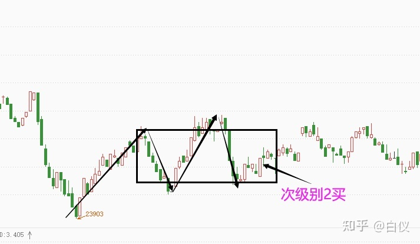
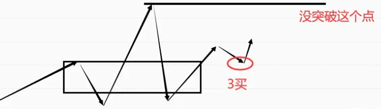
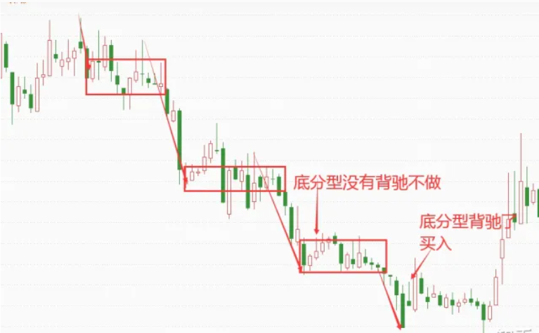
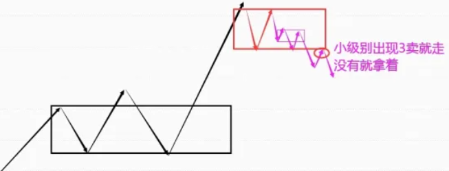

# 白仪野生交易员笔记

## 缠论三买卖点

### 三买卖点的基本说明

三买：**走势向上脱离中枢后回踩一笔不进入中枢。**

中枢：价格重叠的区间，价格重叠代表买卖双方的阵地，即买卖资金，而**资金是推动行情的核心力量**。

三买卖点操作逻辑：

1. **分析多空资金博弈力量，顺应主力资金操作。**三买是经过多空力量博弈后多方力量确定胜利，然后空方力量再次反击，最后多方力量以决定性胜利胜出的阶段拐点。既然多方力量胜出，那么就顺着多方力量做多，成功的概率当然就更高了。
2. 顺应价格走势趋势。趋势具有连续性和惯性，上涨的趋势往往不会一下子停下来，需要缓存一下才能。

三买卖点回踩不进入中枢的原因：

1. 根据强弱原则，突破力度越大，回踩力量越小，行情越强。

2. 根据中枢引力法则，中枢是有引力的，向外突破的点会被吸引回来，而未被吸引回来的点就是确定中枢结束的点。

### 三买卖点操作

#### 针对本级别中枢的次级别三买点

操作条件：

1. 有本级别中枢
2. 行情向上突破本级别中枢

次级别一笔回踩不进入中枢，就是次级别三买。

操作方式：实际操作中可以不看次级别图，根据分型辅助成笔，本级别分型连接起来就是次级别一笔，因此当**行情突破本级别后出现强势底分型**，就相当于次级别三买卖点出来。

止损点：跌破底分型最低点。

#### 针对本级别中枢的本级别三买点

操作条件：

1. 有本级别中枢
2. 行情向上突破本级别中枢
3. 行情回调一笔不进入本级别中枢

操作方式：等分型停顿或验证分型就能入场了。

止损点：突破分型的最低点。

上图中在回调一笔的大阴线就是最低点了，实际操作中不是在这里买，而是等验证分型，直到等到大阳线，它的收盘价高于前面大部分K线的最高价。

#### 针对本级别中枢的b-A买卖点

次级别向上突破本级别中枢以后，出现一个回踩不进本级别中枢的次级别中枢。

### 介入点顶底分型

为什么介入点是顶底分型、分型停顿、验证分型？

顶底分型的介入逻辑：

没有顶分型就没有顶，没有底分型就没有底，任何下跌反转都是从底分型开始，任何上涨反转都是从顶分型开始。

分型背后的形态逻辑：

1. 强势底分型：次级别强势反弹一笔，如果次级别处于买点区域，说明次级别买点成立。
2. 强势顶分型：次级别强势下跌一笔，如果次级别处于卖点区域，说明次级别卖点成立。
3. 强势顶分型停顿：次级别强势一买成立。
4. 强势底分型停顿：次级别强势一卖成立。
5. 强势验证顶分型：次级别强势二买成立。
6. 强势验证底分型：次级别强势二卖成立。

风险背后的多空博弈逻辑：出现顶分型时，小级别上涨趋势发生反转变成下跌走势，空方力量胜利了，底分型相反。

分型操作注意：

1. 为了提高成功率，不在买点区域顶底分型入场，而是买点区域的分型停顿和验证分型入场。
2. 分型停顿和验证分型意义是确认这个买卖点是否强势，而不是有几根。

该方法运用不是死板的，等是为了验证顶底分型强弱，而不是毫无逻辑去数K线，实际中就算10根20根去验证也是可以的。

### 卖出方法

#### 盈亏比+05均线

条件一：

- 极限止损：止损位置必须小于这个止损，不能大于它。
- 底线止盈：平时盈利卖出时必须大于这个底线止盈。

看品种调整，一般在分型停顿或验证分型入场，止损是跌破或突破分型最低点。

**止盈目标最少高于极限止损的2倍**，这样赚一次的钱最少能亏2次呢。

条件二：

为了避免错过急速上涨或下跌的行情，加一个条件，当达到底线盈利目标后，如果走势并没有跌破或突破05均线时，可以按照05均线持有，等何时收盘价破位05均线时再卖出。

#### 一笔结束

介入三买卖点任意一个，主要目标都是本级别一笔。比如一分钟三买介入后，目标只是一分钟上涨的一笔。

在目标一笔情况下，在这笔上涨结束或可能结束时卖出。

判断一笔结束？**次级别趋势背驰或次级别二买卖点成立。**

为何选择二买卖点而不是一买卖点呢？在单边行情中，趋势延续性强，行情背驰后中枢延伸一下容易继续按照原有趋势运行。其次有时候次级别并没有趋势背驰，这时候二买卖点就是最好判断方法。

:::danger

在用验证分型平仓时，一定要选择强势的验证分型才能平仓，而且要等K线快收盘时平仓。

:::

### 品种选择

三买卖点主要是顺应主力资金的一种买卖点，三买卖点在资金情绪达成一致时容易成功。

资金情绪达成一致的情况：

1. 大周期，针对中长期为主：周线以上级别方向出来时，说明中长资金情绪达成一致，这时行情延续性较强。比如周线选择向上，那么这时出现三买成功率较高。
2. 小周期，准对短期为主：成交最活跃的时间段。买卖本身属于多空博弈，在多空博弈最激烈时，一旦走出方向，那么这个方向一般都是真实的。大部分时候，短周期行情最活跃有2个阶段，这时候行情不仅仅延续性强，波动也比平时大：
   1. 刚刚开盘时候
   2. 突发重大消息刺激时候

从日内波动角度看：一般日内波动活跃品种如下：`股指期货>商品期货>外汇`。

股指期货中以开盘实际最长为首先，短为次选，则`美盘>欧盘>亚盘`，商品期货以主流全球化商品为主，其余点为高为次选，`美黄金、原油>美精钢、美白银、沪镍、沪锌、沪铜、沪锡、pp、pta、苹果棉花等>玉米、花生、菜粕、淀粉`。

### 买卖点价值判断

从买点判断：

1. 针对本级别中枢的次级别三买卖点成功后，随后出现针对本级别中枢的本级别三买卖点更容易成功；相反，针对本级别中枢的次级别三买卖点失败后，随后出现针对本级别中枢的本级别三买卖点更容易失败。
2. 针对本级别中枢的本级别三买卖点，要是之前没有出现针对本级别中枢的次级别三买卖点，那么这个三买卖点容易失败。

从品种判断：三买卖点对资金依赖性较高，所以需要资金情绪一致时候成功率才高，因此选择波动活跃的品种上使用三买卖点成功率更高。K线饱满、走势顺畅代表活跃，K线纠结、像蜈蚣一样则不活跃。

从时间判断：成交最活跃的时间段出现的三买卖点成功率更高。成交最活跃时间段一般分别为开盘时间段和突发消息刺激时间段，这两个时间段成交最为密集，出现的三买卖点也比平时出现的更容易成功。

从形态判断：

需要谨慎对待的形态：

1. 大级别趋势背驰段出现的本级别三买卖点。
2. 第二个同向同级别出现的三买卖点。

这种点从定义上来讲其实不是三买点，但广义来看和标准三买点类似，这种点位因为行情超跌或超涨原因很容易失败，如果想做，最好选择趋势性很好的品种，比如美盘股指。

3. 大级别中枢上下轨附近的本级别三买卖点。

大级别中枢上下轨本身就是很强的压力支撑位，这种压力支撑位出现的三买卖点在没有外力刺激的情况很难被真正突破，只有在活跃时间段才可以尝试。

4. 复杂走势出现的三买卖点。

复杂的走势，一般都比较纠结，都偏离理论标准，这种情况是不建议操作的。

5. 普通时间在重要压力支撑位附近出现的三买卖点。

// TODO：P104，没懂

6. 极端行情下出现的三买卖点。

包括复杂走势行情、瞬间急涨急跌行情

7. 弱势行情三买卖点。

- 突破中枢后回抽太强，都快进入中枢的这种三买卖点。
- 突破中枢连中枢震荡的最高点都没有突破后回抽的三买卖点。

8. 缺口回补的三买卖点。

缺口，本身是跳空开盘，这是强势的表现，既然强势，开盘后行情就应该顺缺口方向运行，要是跳空开盘后回补了部分缺口出现的三买卖点，这时候行情就走弱了，这种情况的三买卖点需谨慎。

上海机场，跳空后走弱的例子，63.88就是最高点了：

性价比较高的三买卖点：

1. 成交活跃时间段出现的三买卖点。
2. 离重要支撑压力位较远的三买卖点。
3. 走势简单对称的三买卖点。

格力电器，走势很简单，所有的买点成功率都较高：

### 缠论三买卖点的优势与劣势

优势：

1. 大部分时候行情的暴涨暴跌都对应着三买卖点，针对本级别中枢的次级别三买卖点主要抓类二买卖点后的主升浪或主跌浪，针对本级别中枢的本级别三买点点主要抓趋势延续。
2. 避开弱势行情。三买出现在上涨行情中，那么总体来讲，多头是比较强势的，因为弱势就不会出现上涨行情。
3. 避开中枢震荡，对于趋势交易的人来说，效率更高。

劣势：

1. 缠论三买卖点属于技术分析，实际交易中不可能保证100%正确，所有需要设置止损位，遇到极端行情不止损则会断送自己整个交易生涯。
2. 对资金依赖性高，这也是缠论三买卖点在成交不活跃品种和级别上使用时候容易失败的原因。

## 缠论运用经验技巧

### 本级别中看次级别

1. 本级别3~6根K线重合，一般是次次级别中枢。

如下是南方航空5/25~5/31的日线图，发现有5根K线重合：

如下是南方航空5/25~5/31的5分钟图，发现是走势是中枢震荡的：

:::tip

5~6根K线重合与3根K线重合虽然看到的都是次次级别中枢，但看到的是不一样的。因为级别有多种划分方式：

- `周线--->日线--->30分钟线--->5分钟线`
- `周线--->日线--->60分钟线--->15分钟线`

15根以上重合是60分钟中枢，7~10根重合是30分钟中枢，5~6根重合是15分钟中枢，3根是5分钟中枢。

至于次次次级别，就没必要通过本级别来看了，跨度太大，操作意义不大。

:::

2. 本级别10根以上K线重合，或用分型辅助成笔看3笔重合，是次级别中枢。

如下是汉王科技7/12~8/4的日线图，发现有10多根K线重合：

如下是汉王科技7/12~8/4的30分钟图，发现走势是中枢震荡的：

3.本级别看更大级别

- 递归，本级别一线段等于更大级别一笔
- 中枢扩张

### 共振

如何理解共振？

共振，首先需要有自己的一个核心方法，然后以自己的核心方法为主的同时利用其他方法辅助来看。

#### 缠论看共振

1.最近的各级别中枢

**找各级别中枢的目的就是为了寻找支撑和压力位，从而对未来行情的目标做一个基础的心理预期。**比如当前行情是上涨的，但我们不知道能涨到什么位置，那么我们可以找到前面的中枢，一般前面的中枢都是压力位。

一般来说，只需要找两个级别中枢就足够了，即本级别中枢和次级别中枢。本级别中枢是操作级别中枢，次级别中枢是比操作级别小一个级别的中枢。我们找这两个级别中枢时候，只需要看一个级别走势，即本级别走势。

当本级别做买卖点时候，次级别中枢就是压力支撑位；大级别做买卖点时候，本级别中枢就是压力支撑位。

2.大小级别构筑的买卖点

当大级别构筑买点情况下，本级别买点更容易成功；当大级别构筑卖点情况下，本级别卖点更容易成功。

3.背驰

缠论走势背驰遇到压力上涨容易结束，缠论走势背驰没有受到压力，上涨不容易结束。

既然是共振，那么把上面三个视角结合起来看：

- 做多时候，大小级别都在构筑买点，次级别背驰，同时回调到支撑位，那么买点成功率高。

- 相反，做多时候大级别构筑卖点，次级别没有支撑、背驰，那么即使是本级别买点，失败率较高。

#### 趋势共振

缠论看多时候，均线多头排列，价格受到均线支撑，那就是共振。

#### 股性共振

股性就是股票波动的规律，比如某些股票喜欢冲高一波后就行情结束，有的喜欢震荡上涨，有的股票喜欢类二买启动……

#### 消息共振

缠论做多点，出现利多消息，做空点出现利空消息。消息包括政策消息、事件消息。

#### MACD共振

比如可以用macd来辅助判断强弱，对于做多来讲，macd大幅跌破零轴就是弱势反之就是强势，做空反过来就是。

再比如macd两次回抽零轴一般就是比较对称标准的中枢，变盘率比较高，那macd两次回抽零轴就是和缠论类2买形成共振。

### 背驰合集

> 原文：[背驰合集，各种类型背驰识别](https://zhuanlan.zhihu.com/p/428705554)

**背驰就是背道而驰，一般是两个标的做对比，形容两个标的走的方向完全相反。**

背驰的作用是寻找趋势性的拐点或者阶段性的拐点，逻辑是通过两个标对比后**找到原主力力量衰竭的点，这个点很容易变成转折点**，正所谓物极必反，背驰就是那个极点区域。

:::danger

在实际操作交易中，价格波动会受资金影响，在运用背驰时，就没办法做到100%正确，因为资金的注入可以改变价格，进而改变背驰。

**背驰不代表转折，抄底摸顶不一定会成功。**

:::

#### 价格背驰

通过价格变化（K线图）去判断背驰，见基础篇。

#### MACD背驰

1.传统看法

**股价新高，MACD红柱子和快慢线不能同步新高**（同步新低或几乎持平），形成上涨背驰。

2.缠论视角

当MACD从上往下回抽零轴以后继续上涨创出新高，而相应的MACD红柱子没有之前上涨的一波多，形成上涨背驰，反之没有背驰。

> 这里没懂传统看法和缠论视角的区别？回抽零轴意味着什么？

#### 均线背驰

以两根均线缠绕的区间为核心（缠绕区间最好相交两次以上），等股价新高或者新低以后对比均线**缠绕前后相交的面积大小**。如果后面的均线的相交面积小于前面均线相交的面积，形成背驰，反之不背驰。

在实际操作中，如果级别较大（周线级别以上），出现一次下跌均线背驰就可以入场了；如果级别较小，最好等出现2次缠绕后出现的背驰再入场。

#### 量价背驰

价格和成交量出现背驰，即价格上涨时成交量不涨（缩量或平量）。

常规视角下，量价背驰是走势不健康的表现，代表买入资金变少，价格随时可能见顶，所以持仓的股票出现量价背驰时就要引起关注。

但实际上，把量价背驰当作不健康的走势，逻辑是不对的。价格由资金推动，成交量是资金买卖的表现。**成交量低，说明买的人和卖的人都不多。**有些股票大部分筹码在机构或庄家手里，市场上流动交易筹码很少，只要他们不卖，不需要太多资金买入就能导致股价上涨，所以在一些白马股和庄股里面，经常会出现缩量或平量上涨的情况，因为他们都锁仓。

下面是股票山西汾酒可以看到二买后是上涨趋势的，但成交量是缩量的。

#### 指数和个股

1.指数新低，个股没有新低。这种情况说明个股强于指数，只要指数止跌，个股涨幅一般比指数大。

2.指数长期下跌，个股震荡。这种情况个股非常抗跌，只要指数企稳，个股随时可能启动大级别行情。

3.指数长期上涨，个股震荡。这种情况个股走势比较弱，处于蓄势状态，当第一批主流股票上涨结束以后，这种股票很有可能会补涨。

### 走势终完美

> 原文：[缠论实际中如何运用走势终完美？](https://zhuanlan.zhihu.com/p/445594848)

#### 简介

走势终完美：**当下的走势都是某个级别的未完成走势类型，所有未完成的走势类型终要完成，完成以后会变成新的走势类型。**

最基本的就是a+A+b的走势，进入段（a）、中枢（A）、离开段（b）

:::caution

上图只是基础走势，实际上**可以有多个中枢，但必须都是同向同级别中枢。**

:::

比如现在是盘整下跌，那么盘整完成后对应的就是盘整上涨趋势：

#### 使用逻辑

运用走势终完美的逻辑，找未完成的走势。所谓未完成的走势，即离开段走势（b），这段就是可以操作的。

我们可以操作的是离开段中的离开段，即b-b段。

b段要完成，那么b段中出现的出A中枢的b-b也要完成。

实际中，b-A可能会出现在A里面，这样就很难判断b-A走势是不是中枢离开段。因此**最好在走势向上突破大中枢A后出现小中枢b-A的时候操作**，因为这个时候已经确定出现b段是出中枢走势了，这个时候走势确定离开了中枢，同时出现小b-A（3买）确定中枢结束，不仅可以保证b-b的出现，还有更大的概率出现大幅上涨。

如下图，b-A出现在A里面，就不要做了：

标准走势，在走势向上突破大中枢A后出现的小中枢b-A时候操作：

:::tip

使用走势终完美思路时，有两个重点：

1. 找中枢。中枢是多空博弈的空间，在实际运用中，不需要搞那么严格，只需要知道这里有个中枢就可以了。如果中枢没有离开段，那就是未完美，可以等机会操作。

2. 找到中枢后只需要等着离开中枢段后出现的b-A，然后等待操作b-b就好了。

:::

#### 注意事项

1. 使用走势终完美时候，A操作级别要大，日线以上。
2. b-A必须出现A中枢上面。
   1. 对各级别买卖点、各种视角很熟悉的可以不要求突破中枢
3. b-A中枢级别要小于A中枢级别。
4. b-A中枢只要级别小于A中枢，都是可以操作的，一般情况下，会看到多个b-A。
   1. 新出现的b-A是未完成的走势，既然要完成，就对应着b-b的上涨。
   2. 新出现的b-A是大A出中枢的走势，属于a+A+b走势中b走势的次级别走势，如果b-A未完成，那么a+A+b也不会完成。

5. b-A级别决定了操作级别，也就是说，需要等到b-A这个级别走势完成后才能卖出。
6. **具体入场点在b-A中枢第三笔下跌结束的点。**

7. b-A在同级别分解视角最好是第一个中枢，如果是第二第三个中枢，容易新高背驰，上涨空间被限制。而如果是第一个中枢，那么b-b则容易形成共振出现大幅度上涨。
8. **具体出场点在b-A中枢上涨背驰或出现二卖时候。**
9. 出中枢有级别，是什么级别出中枢的，就操作什么级别。一般来讲，出中枢级别越小，越发强势。

10. 突破中枢级别的力度不能太大，不能是那种脉冲式一下连续涨一两倍那种，因为这种短期中长线资金和短线资金都会大幅获利，这些资金容易兑现，从而结束中长期上涨趋势，这种行情出现的b-A走势操作价值不大的。

11. 如果有其他上涨因素，效果会更好。其他因素比如个股基本面支撑、板块效应、政策利好等等。

### 走势终完美运用难点

> 原文：[走势终完美实际运用中的难点](https://zhuanlan.zhihu.com/p/447477872)

#### 1.怎样看中枢？

运用走势终完美视角时候，核心在于2个中枢，一个是大A中枢，另一个是b-A小中枢，因为这两个走势都要完成，而在b-A中枢没有完成之前，大A出中枢走势就不会完成。

实际的难点在于这两个中枢怎样确定下来呢？

怎样看都行，只要确定这是一个中枢即可，至于用笔还是中枢扩张或其他视角，都不影响。唯一要求就是A中是盘整里的中枢，B中枢是趋势里的中枢。

比如下图中，**我们需要的是A中枢而不是B中枢**，然后在b段中再找小A中枢。B中枢虽然也是出中枢，但对应c段，c段很容易背驰，风险比b段大：

比如下图中都是A中枢，都是盘整走势，可以预期后面b段上涨。

- 第一个中枢：肉眼可见
- 第二个中枢：明显比第一个大，所有第一个中枢就变成了第二个中枢的进入段，第二个中枢就变成了盘整走势。
- 第三个中枢：中枢扩张的走势，明显比第二个大，那么第二个中枢走势就变成第三个中枢的进入段，第三个中枢就变成的盘整走势。

这三个中枢从大小来看就不是同级别的。

---

**b-A中枢的要求：b-A中枢级别必须小于A中枢**，只有小于A中枢，才能当作b段走势的次级别走势，**只要b-A中枢没有完美，那么b就不会结束，那么A中枢就不会完美。**

确定b-A的级别，可以用出中枢那段走势级别来确定：

- 一字板出中枢，一分钟级别，如果操作那就是操作一分钟了，一分钟上涨结束时候就要走。
- 日线连续大阳线突破，有几根K线重合，那就是5分钟中枢，5分钟上涨结束后就要走人。
- 周线中枢日线突破的，做一个日线中枢，只要日线上涨背驰了就走人。

:::danger

一分钟，这种属于超短线，需要注意，不能涨幅巨大，不能一次涨了一两倍再买，而且一定要有很大的利好消息才能做。

:::

如下是30分钟和日线的，注意看30分钟和看日线的卖点位置：

---

在实际操作中，有一个难点，那就是b-A如何介入以及介入以后走势演化问题。

一般情况下，b-A就是某级别的下上下三笔，**在第三笔下的时候用区间套方法在小级别找背驰点或其他买点。**

#### 2.走势一定完美吗？

理论上是肯定的，因为走势如果不完美，这套方法论就不成立，缠论就不成立了。

当然在股市中，没有谁敢说走势必完美，意思是讲走势终完美这个逻辑理论是存在的，实际运用中总有特殊情况，我们无法根据走势必完美做到100%盈利。

原因如下：

**1.大A出中枢走势要完成，小b-A走势也要完成，但是什么时候完成我们不知道，因为中枢可以不断延伸不断扩张，我们做大A出中枢段的原因就是我们不知道这个大A什么时候会完成，在b-A的时候我们已经确定b段出现了，走势已经处于可以完成但未完成的阶段，这个时候我们去做b-A，原因就是b-A大概率会立马完成，那其实b-A不断延伸也是可以的。**

**2.实际中存在上涨没有标准中枢行情、中枢扩张行情和小转大行情。**

#### 3.操作b-A后的几种情况

操作b-A的目标：目标是b-b，且b-b创b-A的新高。但在实际中，后续走势可能不断扩张延伸甚至回到大A中枢。所以需要对b-A以后可能出现的走势进行分类和应对。

1.b-A后走势没有新高，而是继续下跌。

以小级别3卖为主，如果没出现小级别3卖，就不用出局，出现就止损出局。

如图所示：**出现紫色中枢的三卖的时候可以走一部分，出现针对红色中枢的三卖的时候可以全部走人。**

2.b-A后走势没有新高，反而不断延伸新低，但没有出现3卖，那么可以加仓，预期更大级别的b-b上涨。

:::danger

**这里要注意一点，卖出的时候，因为有第一批仓位、第二批第三批仓位，所以这些仓位卖出的时候也是要遵循相应级别的卖点，比如第一批仓位的1分钟买点入场的，那后面出现一分钟卖点的时候要走人，第二批仓位是5分钟买点入场的，那后面出现5分钟卖点的时候第二批仓位要走人。**

:::

3.b-A后走势没有新高，反而不断延伸新低，出现3卖，止损出局。

4.买入后暴跌

这是最不愿意看到的情况，期货中更常见。其实这种走势后面肯定会有反弹的，而且这种b-A本身也是轻仓操作，一般的操作是在暴跌的这波下跌结束加仓，随后的反弹出局。不过对于新手难度太高，所以建议大家实际中先多研究一下b-A这种走势，然后多复盘多练习，开始不熟悉的时候建议设置一个止损点，比如之前讲过的底分型停顿最低点，验证底分型最低点都可以。

5.买入后新高

这是符合预期的，只要新高不管力度如何都代表这个买点成功了，区别是有的涨的高，有的不高。

#### 4.一些交易经验

1.这种方法尽量使用在股票上，**大A中枢级别尽量不小于日线级别**。如果是期货，也尽量做级别大一些的。

2.**突破大A中枢级别的力度不能太大**，不能是那种脉冲式的一下子就上涨一两倍那种，因为这种短期中长线资金和短线资金都会大幅获利，这些资金容易兑现，从而结束中长期上涨趋势，这种暴涨以后的行情出现的b-A走势操作价值不大的。

3.个股加上缠论以外的因素，效果会更好。

4.b-A弱的尽量不要做，比如变成下上下变成一个下跌线段的。

这种走势变成3买了，但b-A主要操作逻辑不是3买，而是走势终完美，是出中枢，所以这种买点不在这种方法范畴内。

5.**同级别分解视角下，b-A是第一个中枢比较好**。

6.**突破大中枢A时候最好成交量放大，突破b-A时候，成交量最好要缩小**。

因为我们可以把突破当做是启动，既然要启动，就需要量能支撑（白马股和部分庄股例外）；而b-A位置则是洗盘区域，洗盘区域需要缩量，代表浮筹减少，这样才有利于后期拉升，如果这个阶段不能缩量，说明有大量的资金在抛售，那就不得不考虑是不是主力在出货了。

### 盘中判断缠论背驰

> 原文：[盘中判断缠论背驰（运用）详细讲解](https://zhuanlan.zhihu.com/p/449367510)

用缠论看背驰需要注意：

- 不需要macd
- 不需要均线
- 只需要k线

也就是说，**只用k线判断背驰是运用缠论的基础能力，macd、均线这些看背驰在缠论中只是辅助工具，属于可有可无的指标。**

到这里还是要强调一下：**背驰只是代表原有趋势力量的衰竭，不代表走势要反转，反转和背驰是有关系的。**

在大部分时候，行情的反转和背驰是有很大关系的，也就是大部分时候背驰以后行情确实会反转的，即使背驰以后行情不反转，也有一定的操作空间，如果加上其他因素加以辅助，那背驰也是一个比较好的工具，尤其是在判断大级别机会和盈利以后卖出的时候，是一个比较好的工具。

**所以就不要纠结特殊行情时候，明明下跌背驰了还不上涨？明明上涨背驰了还加速上涨？因为行情是由资金推动的。**

如何判断离开中枢段走势是不是会背驰呢？可以通过区间套

- 在更小级别走势背驰的时候，如果大级别也背驰了，那就形成背驰，这个小级别背驰点就可以操作，我们也可以买在转折点附近。
- 如果更小级别的走势背驰的时候大级别没有背驰，那大级别走势就没有背驰，我们就不要操作。

更精确定位前面讲过了，就是**在买点区域出现强势底分型停顿或强势验证底分型时候操作**。

:::tip

判断一个位置是否可按照强势底分型停顿或强势验证底分型操作，需要看大级别（操作级别）是否背驰、小级别买点是否背驰，如果都背驰就可以做了。

至于是从大级别看小级别还是小级别看大级别，都是可以的，一般来说从大到小更方便些。

:::

### 缠论级别定位的三种视角

> 原文：[缠论对应大小级别的定位](https://zhuanlan.zhihu.com/p/450556163)

缠论对应的大小级别定位问题，在股票和期货中是不一样的，因为不同期货品种开盘时间是不一样的，大部分期货品种开盘时间都比股票长。**日线以内的周期，期货的k线大多都比股票多**，**这样的话是不能把股票那套级别定位原封不动的搬到期货上的。**

1.递归

确定一个最小级别，在该级别上画出严格笔，然后得到现代，再把线段进行同级别分解，分解后得到的线段就是更大级别一笔，再用同样方法把更大级别一笔连接成线段，再把更大级别线段进行同级别分解，从而得到更大2个级别的笔，以此递归。

2.分型辅助成笔

3.根据股票的时间周期级别去推算

股票的时间周期级别是1分钟、5分钟、30分钟、日线、周线、月线，我们发现，5分钟是1分钟的5倍，30分钟是5分钟的6倍，周线是日线是5倍，月线是周线是4倍。也就是说大小级别的倍数大概在4-6倍左右。

那对于股票以外的品种，我们也可以按照这个方法去推，1分钟-30分钟可以固定，30分钟的四倍是2小时，那30分钟的更大一个级别就是2小时，2小时的四倍大多数都是日线，那2小时的更大级别可以当做日线。

当然，这种方法是更加粗糙了，因为股票的时间周期本身就是很粗糙的，用本来就粗糙的方法为基础去推算，那肯定是更加粗糙的，不过我觉得不管你怎么看，就那样吧，做不到完美，但是能用。

### 不测而测下的完全分类

> 原文：
>
> [缠论不测而测下的完全分类详细讲解](https://zhuanlan.zhihu.com/p/450075265)
>
> [缠论实际中如何运用不测而测？（2）](https://zhuanlan.zhihu.com/p/451425133)

#### 不测而测

我们常说的预测一般是预测后面是上涨还是下跌，预测到哪个价格会遇到压力支撑，这种预测是根据某种特征对未来做出猜测，即使猜对了，也存在很大偶然性，这种预测充满了不确定性。

缠论说的预测是必然性的，上涨下跌等走势都在预期之内，**缠论的这种必然性预测建立在对市场的完全分类上**。

不测就是不做预测，只做分类，把未来所有出现的走势都分类出来，只要出现对应行情，就知道未来怎么走了，这就是不测中的测。

比如出现走势a+A+b：

这时候对未来可能走势分类：

- b的次级别背驰如果比a力度小，则发生盘整背驰，走势大概率要回到中枢A中。
- b的次级别背驰如果力度比A大，则没有发生背驰，那么后面走势大概率要做B中枢。

:::tip

不测而测的运用是一件综合的事情，因为完全分类就是要求你对市场可能出现的走势做全部的分类，对市场做全部的分类那肯定需要涉及到多维度的视角，比如资金、情绪、人性、政策、行情等视角，涉及这些视角那肯定要求具备相关视角的知识经验的。

:::

通过前面讲的逻辑可知，**不测而测的主要作用就是不管行情怎么走，都在我们的预期之内，那我们就可以做出相应的对策，从而达到顺势交易的目的。**

#### 基础完全分类

走势分类有3大方向：上涨、下跌、横盘。

- 上涨：盘整上涨、趋势上涨。
- 下跌：盘整下跌、趋势下跌。
- 震荡：中枢。

a.盘整分类

1.向上突破中枢

应对：等待三买操作。

2.向下突破中枢

应对：等待三卖操作。

3.中枢不断延续

应对：不操作；或者用中枢逆转思路；或者用次级别买卖点在中枢上下轨附近做差价。

b.盘整上涨

1.上涨没有背驰

应对：没有买入的情况下等待三买操作；多单持有情况下继续持有。

2.上涨背驰

应对：没有仓位情况下准备做空；多单持有情况下准备平仓。

c.趋势上涨

1.上涨没有背驰

应对：没有买入的情况下不操作；多单持有情况下继续持有。

2.上涨背驰

应对：多单情况下卖出，同时空单准备做空。

d.盘整下跌

1.下跌没有背驰

应对：空单持有的继续持有；没有空单的等待三买做空。

2.下跌背驰

应对：没有仓位情况下准备做多；空单持有情况下准备平仓。

e.趋势下跌

1.下跌没有背驰

应对：空单持有的继续持有；没有仓位不要操作。

2.下跌背驰

应对：空单持有的准备平仓；多单准备入场。

#### 进阶完全分类

基础完全分类只对单一级别走势做了分类，而进阶完全分类除此之外还有对多个走势同时进行完全分类，同时还要把走势生长、买卖点、基本面、品种因素、市场人气因素等等结合进去，这是走势的进阶分类。

### 缠论同一个买点在不同状态下有什么不同？

> 原文：[缠论同一个买点在不同状态下有什么不同](https://zhuanlan.zhihu.com/p/463395335)

下面针对本级别中枢的次级别3买为例子。

1. 买点是否在中枢内

特点：

- 受制于中枢的压力，容易在中枢上轨受到压力，如果离中枢上轨比较近，那可预期的上涨空间就是有限的。
- 多空力量博弈处于胶着状态，方向不明朗，确定性相比起已经走出方向的走势更低。

2. 大级别卖点区域

这种次级别2买因为受制于卖点压力和风险，可预期的上涨空间有限而且非常容易失败。

3. 重要压力位附近的3买

压力位的3买容易受压而失败，而突破压力以后的3买因为压力小，上涨更加容易，3买更加容易成功，所以**压力位置的3买没有突破压力以后出现的3买好。**

4. 没有驱动因素的3买

这里说的驱动力是指能让资金追进去的理由，比如业绩大幅增加、突发事件利好、政策利好等。

5. 3买之前涨幅不同的走势

涨幅太高的不要，比如涨连续涨了一两倍甚至五六倍以后的3买不要，即使要操作，也要非常谨慎，只能轻仓快进快出。

因为这种3买会积累大量的盈利巨大的获利盘，3买区域极有可能变成出货区域，这个阶段你入场，那完全可能就是进去接盘的。

6. 3买与中枢最高点

从形态上讲，上面两图都符合三买点，但从力度角度来看，第二种更好。

但第一种能操作吗？是可以的，建议分仓操作：

7. 成交量

**a，构筑3买的时候缩量的比放量的好，3买成功以后放量的比缩量的好。（白马股和主力一字板拉升的除外）**

这是从洗盘的角度出发的，构筑3买可以看成是蓄势，既然是蓄势，那就需要洗盘，洗盘就需要把短线筹码洗出去，留下稳定筹码，那么随着短线资金的离场，成交量就会越来越小，这是构筑3买的时候要缩量的原因。

3买成功以后要放量的原因是，你上涨需要资金，而成交量就能直接体现资金买卖情况下，成交量越多，追进去的人越多，越有利于上涨。

**b，3买之前的出中枢走势，放量的比缩量的好。（白马股和主力锁仓拉升的除外）**

这是从资金关注度和主力资金强弱的角度出发的。

你要上涨，就要接盘获利资金和很早之前套牢资金解套后抛出的筹码，如果资金关注度低或者主力资金实力很弱，那是接不住抛盘的，那股价上涨自然不能持续。

8. 成交活跃的品种出现的3买比成交不活跃的品种出现的3买要好

:::tip

庄家恶意操纵高度控盘的除外。

:::

在股票中短线的3买中，题材股的3买要优于白马股的3买，因为题材股资金关注度高，走势干脆。而白马股大部分都是机构资金，成交不活跃，更纠结一些。

3买本身属于比较急的买点，一旦走势纠结，对于技术交易或者杠杆交易的人来讲，就很容易被频繁止损。

在期货中，高点位的指数期货优于低点位的指数期货；高点位的商品期货优于低点位的商品期货；高点位的指数期货优于高点位的商品期货。

原因都在前面讲了，3买是对资金持续性要求很高的品种，一旦成交不活跃，就容易失败。

9. 回调幅度

回调幅度超过出中枢力度的50%或者大幅突破中枢以后回调都快进中枢的3买没有回调不超过50%的3买好。

### 缠论各类型的买卖点转换

> 原文：[缠论各类型的买卖点转换](https://zhuanlan.zhihu.com/p/474126509)

:::tip

买卖点的转换属于特殊行情之一，理论上属于不符合盈利预期的走势，因为正常的行情一般是买卖点延续、利润延续，而买卖点转换就变成了利润停止甚至利润回吐的走势，所以本文其实是要讲不符合盈利预期走势的分类和应对方法。

:::

买卖点转换，说的是在某个买点入场后，稍微延续一段时间后变成了卖点。在实际操作中，因为走势多变，那么就有概率遇到买点转化为卖点，卖点转换为买点。

#### 盘整背驰1买转3卖

一般来说，大周期（周线、月线）出现的盘整背驰，都可以当作一买，因为大周期出现的盘整背驰不常见；其次就是本级别处于买点区域次级别盘整背驰时候，次级别的这个盘整背驰也是可以当作1买的。

如果出现弱势行情，就会出现盘整背驰1买后稍微反弹一点或横盘，然后变3卖继续下跌。

如何应对？

看级别，如果级别很大，那么就用次级别买卖点操作，以次级别买卖点为主。比如周线盘整背驰，就操作日线买卖点、止损点。

#### 3卖转2买

1. 如果3卖位置MACD向上突破零轴，随后从零轴上面回抽到零轴附近，这时候出现的2买是可以操作的。

2. 如果3卖转2买是弱势的，也就是3卖位置MACD没有向上突破零轴，或2买位置MACD跌破零轴，那么这种3卖转2买，一般是抓不到2买的，**直接放弃就好了，然后等后续的类2买再操作**，这时候的类2买，MACD需要在零轴上面回抽零轴。

#### 3买转2卖

1. 如果操作级别比较大（日线以上）的3买，那么可以利用次级别买卖点来操作，这样就可以避开3买转2卖的风险。

2. 如果是小级别的，那设好止损，该持有就持有，该止损就止损

#### 1卖转类二买

这种走势在盘整背驰中最容易遇到，1卖回调进入中枢后转换为类2买，中枢延续后继续新高，这种走势实际上并没有很好的解决方法，可以直接换一个，后续上涨跟你没关系。

当然，也可以在走势回到中枢次级别背驰时候接回来，随后上涨如果继续背驰，那么就走，如果没有新高出现2卖，还是要走的。

#### 1买转2卖

1. 如果是大级别的盘整背驰，那可以用次级别买卖点应对，有足够的时间和空间避开这个类2卖。

2. 如果是小级别的，那看该止损就止损，不止损的就等着补仓机会。

#### 2卖/类2卖转为2买

本来2卖以后正常的预期应该是类2卖，类2卖以后正常的预期应该是3卖，但这里转为买点了。

这两种走势呢都可以用MACD回抽零轴来辅助判断操作。

所以这两个走势，我们要从做空的思维转换成做多。**这里注意，2买可以用MACD辅助，同时这些走势也可以用另类小转大处理。**

#### 2卖转1买

本来2卖以后正常的是做类2卖出现中枢，但实际上，2卖以后如果来一个新低，且出现3笔背驰，是会出现1买的，尤其是大级别是买点的情况下，次级别经常出现这种情况。

这种走势股票，如果月线是上涨一笔情况下，日线出现2卖转1买是可以操作的，当然更稳健的方式是等2买操作。

#### 2买转1卖

大级别趋势下跌的时候，很多反弹都只有3笔。这3笔结束要先走，后面走一步看一笔再决定要不要继续做。

#### 2买卖点转为3买卖点，3买卖点转为1买卖点

这个走势不是很重要，了解就好了，因为2买卖点赚3买卖点，站在3买卖点的角度，有点弱，可能不会怎么去操作，3买卖点转1买卖点呢，这是合理的走势，背驰买入或者走人就可以了。

### 很多缠论走势都是盘整和小转大

> 原文：[市场的真相，很多缠论走势都是盘整和小转大（看盘经验）](https://zhuanlan.zhihu.com/p/478927303)

很多走势都变成了盘整走势和小转大走势，趋势走势比较少。**市场的真相就是很多走势不标准，都是操作难度比较大的小转大走势，真正的趋势背驰和盘整背驰比较少。**

小转大最典型的特征就是下跌本来好好的，你等着背驰，但它偏偏不背驰，直接涨上去了，你就是等不到最低点，好不容易等到背驰了，你又偏偏遇到了走势很弱的那个，甚至来个买点失败，继续下跌。

**唯一的办法就是权衡利弊，选择自己能接受的。**

**你是能接受小转大利润回吐继续博取后面的收益呢？还是不能接受利润回吐？那你是主动止盈去承担错过后面行情的风险还是继续持有博取后面的收益但是去承担利润回吐的风险？又或者你折中一下先减仓如果跌了再回补？还是说你通过基本面、走势强弱、大小级别买卖点、市场大环境等等因素来辅助自己提高成功率？等等等等，只能你自己慢慢去权衡了。**

这个图很多不敢操作，原因是把这个走势当做趋势上涨，认为后面是背驰段，所以不敢做。实际上呢，你不敢做，这个走势就会一直上涨。

因为两个中枢不一样大的原因，所以就当做盘整走势，**第一个中枢就变成了第二个中枢的进入段走势。**

反过来，如果第二个中枢更小，那第二个中枢的走势就变成了第一个中枢的离开段走势，如下图所示。

正是因为这样看，导致很多走势都是盘整走势和小转大走势：

###  缠论各类型背驰反转概率及风险演化

> 原文：[缠论各类型背驰反转概率及风险演化](https://zhuanlan.zhihu.com/p/479308904)

:::tip

注意：类型反转概率是白仪老师的交易经验，不是绝对正确，只能作为交易辅助视角，不能作为交易依据。

:::

#### 只看一个级别情况下

在只看一个级别的情况下背驰反转概率排名，从大往小：

1. 趋势背驰：经过两个中枢后位置已经很低了，反转概率很高，但也是有风险的，可能继续下跌，比如格力电器2020年时候的走势。
2. 盘整背驰：这种走势虽然背驰，但总体下跌幅度不算多，而且它还有演化成本3卖，或者中枢扩展一下继续下跌。
3. 5段式背驰（类趋势背驰）：反转概率比较大的原因是因为下跌幅度很大，就算再次新低，也大概率会背驰的。
4. 3笔背驰
5. 小转大和另类小转大

#### 大级别是买点情况下

大级别是买点的情况下，本级别反转走势类型概率排名，从大往小：

1. 盘整背驰：为从大级别买点的角度看，一个强势的买点，次级别回调力度是不会很大的，一般就是一个盘整下跌的调整，如果调整力度太大，那这个大级别买点就很难新高。
2. 一笔到位的另类小转大：大级别是买点情况下的本级别另类小转大成功率还是比较高的
3. 趋势背驰和5段式背驰：在大级别是买点的情况下，本级别如果回调太深，这个大级别买点容易失败或者不容易新高。
4. 3笔背驰

### 技术分析的尺度

> 原文：[缠论分析行情要有一个度](https://zhuanlan.zhihu.com/p/486982124)

1. 时间跨度越久的因素，对行情影响越小

10年前的股票价格对今天是没有参考价值的，当时出现某些因素导致的，今天就不必关注了。

2. 级别越大，技术因素越小

周线月线这样大级别的买卖点形成且成功，很多时候并不是因为技术形态符合标准，而是当时出现了一个有利于形成该级别买卖点的因素，比如整个市场见底，比如供需发生变化等等。

如果没有基本面因素的配合，周线月线这样的大级别买点构筑很容易失败。

因为股价是由资金推动的，资金的种类很多，有短线资金、长线资金、机构资金、散户资金等等。大部分资金都是短线资金，而短线资金只能影响短期的价格波动，也就是短线资金只能影响短期买卖点。长期买卖点还需要长期资金意见达成一致以后操作上形成合力，这个长期买卖点才能成功。

3. 复杂的视角+极端的行情，很容易失败。

当下日线是下跌趋势，整个市场环境也不好，但你却用中枢维持、大级别买卖点、支撑等视角得出来未来看涨的观点，很容易失败。

你在走势很明显处于极端波动，例如暴涨暴跌或者毫无波动又或者毫无规律震荡的时候去分析操作，很容易失败。

### 缠论三买大小级别联立、对比图解

> 原文：[缠论三买大小级别联立、对比图解](https://zhuanlan.zhihu.com/p/500257939)

#### 一些例子

例1：

- 黑色圈是次级别2买，同时是针对大A红色中枢的次级别3买，所以是买点共振，这个点可以做。
- 紫色是次级别类2买，同时也是针对大A红色中枢的b-A买点，所以是买点共振，这个点可以做。
- 红色圈是次级别3买，是针对黑色b-A中枢的3买，属于离开红色A中枢的b段上涨延续，没有买点共振，所以性价比没有黑色和紫色位置高，但因为是买点，所以也可以做。
- 绿色圈从次级别看不是买点，从红色a段到红色b段的整段上涨看，都不是买点，所以不能做。

例2：

- 黑色圈是针对红色中枢A的次级别3买，从次级别看是线段3买，属于买点共振，可以做，但是空间可能稍微有限。很多这种走势都是波浪的5浪上涨，后面往往对于反趋势，**只有变成中枢以后延续一下，才有机会继续上涨。**

例3：

- 黑色圈是针对红色A中枢的b-A买点，从次级别看是第一个上涨中枢，属于盘整走势，一般盘整走势有一定的希望走出趋势，所以这个点性价比比较高。

例4：

#### 中枢、大小级别、分型逻辑、3买卖逻辑图

1. 本级别分型和次级别笔的关系**、**本级别笔和更大级别的关系

**本级别顶底分型连起来近似等于次级别一笔，那么次级别一笔近似等于本级别相连分型的连接**，本级别笔约等于等于更大级别分型的连接。

2. 分型辅助成笔

通过分型辅助成笔的方法，通过本级别顶底分型连接判断次级别走势。

3. 通过本级别的顶底分型连接判断次级别买卖点

4. 针对本级别中枢的次级别3买
5. 针对大级别中枢的本级别3买

### 缠论不对称中枢的处理

> 原文：[缠论不对称中枢的处理](https://zhuanlan.zhihu.com/p/500384147)

#### 不标准中枢

基于笔中枢去看对称性：

面对复杂的中枢，我们要么就是不做，要么就是针对性的做出应对策略来操作。

#### 另类小转大走势

另类小转大：一些走势出现某笔上涨或者下跌的力度很大，大到和满足了更大级别一笔，然后我就把这笔走势当做更大级别一笔了。

遇到这种走势时，就按照另类小转大思路定位出新中枢，然后再找买卖点。

#### 原中枢没破坏的情况下出现更加标准对称的中枢

在原来中枢不断延伸，没有出现3买卖点破坏中枢的情况下，走势出现了更加对称的中枢：

为什么我要以紫色中枢为主呢？

**价格，越近的越有效；形态，越标准的越有效。**也就是说，最近3天的价格走势比3个月之前的有效，你分析最近3天的价格实际意义大于你去分析3个月之前的价格。

#### 对称性调整

很明显，这种是中枢升级了。

#### 明显的价格重叠，明显的突破

明显的价格重叠，可以理解为明显的笔重叠或者明显的震荡，也就是说，你一眼看上去就知道这里有一个中枢，但是这个中枢呢，你用笔去画的话又会显得很复杂。

**面对这种走势，我们可以不去画笔，我们只需要知道这里是一个中枢，然等一个明显的突破，就可以操作了。这里注意，明显的突破就是力度很强的突破，最好是跳空突破。**

#### 介于本级别和大一个级别之间的中枢

这种介于本级别和打一个级别之间的中枢，我们不用纠结，只要突破中枢，我们就可以等本级别回抽一笔不进中枢操作，注意，这里需要回抽一笔。

### 缠论二三买合并和常规三买有什么不同？

> 原文：[缠论二三买合并和常规三买有什么不同？](https://zhuanlan.zhihu.com/p/508385319)

#### 买点角度

图一：

- 同级别分解视角：2买
- 中枢延伸视角：3买

图二：常规3买。

因此，从买点角度来看，图一更好，因为兼并2买和3买。

#### 3买的角度

3买，最大的特点就是上涨趋势确定成立，那我们就用趋势的角度来看3买吧。

图一：到达了确定下跌趋势结束的位置。结束下跌趋势后续可能变成震荡趋势或上涨趋势。

图二：上涨趋势中的回调，而且是向上突破震荡中枢后的回踩确认。

因此，从3买角度看，优选选择图二的3买。图一后面的走势可能是上涨或震荡，图二是上涨趋势中的走势，整个走势处于上涨状态，大概率会延续趋势。

#### 力度的角度

还是上面的两个图。

图一：

- 扭转了下跌趋势
- 向上突破了中枢
- 从中枢下面上涨到中枢上面过程幅度较大

从多空博弈角度来看，其实就是空方力量衰竭后多方进行反攻，只是一不小心反攻力度有点大了，空方力量毫无反抗之力。

图二：

- 图一结束了下跌趋势，图二直接是上涨趋势
- 向上突破了中枢
- 图二向上突破中枢的这段幅度没有图一大

上涨力度大，说明多方买入资金多，买入多消耗就大，消耗大了趋势就难以维持。

#### 位置区别

图一：虽然是二三买合并，但有二买的基因，即后续可能会形成中枢。

图二：常规三买，b段基因是可能会变成主升浪。

### 缠论如何应对复杂的走势？

> 原文：[缠论如何应对复杂的走势？](https://zhuanlan.zhihu.com/p/511431396)

复杂走势：画中枢比较纠结、找买点心里没底、走势上蹿下跳的情况。

对于这种复杂走势，可以不做了，当然要做的话也有方法的。

#### 用箱体震荡和三角形震荡是视角找到中枢等突破

- 不画笔、线段、同级别分解，直接找中枢
- 找中枢原则不是次级别3笔，而是以箱体震荡的视角去找。哪个位置有明显的箱体震荡或三角区震荡，就把该区域当作中枢处理。

上图中就是不规则走势，紫色是原中枢，而实际操作中可以用红色中枢为主，用红色中枢为准去找后面可能出现的3买。

为啥这样看？因为分析最近3个月的价格走势意义比3年前更大。

- 如果以紫色中枢为基准，那么就是中枢维持没被破坏，最终该中枢级别就大于当前级别了，后面该等哪个级别的买点呢？
- 如果以更大中枢视角去看，那么后面等待的就是更大级别3买，那么更大级别3买需要一笔回调才有，那么中途上涨就不做了吗？更大级别3买性价比有前面上涨那波高吗？
- 如果要做中枢上涨的这波行情，就需要在前面分解一下。

#### 同级别分解+另类小转大的走势处理

面对纠结的走势，使用同级别分解，就能找到买卖点。

另类小转大，在一段走势中，把力度很大的那波反向笔当作线段处理。

### 时间换空间

#### 时间换空间的逻辑

> 原文：
>
> [不符合预期的走势——时间换空间的运用](https://zhuanlan.zhihu.com/p/520992725)
>
> [时间换空间的行情运用（2）——时间换空间后再换空间](https://zhuanlan.zhihu.com/p/521947230)

按照某个技术买涨，正常情况下，行情应该上涨才对，但它偏偏不涨，而是横盘震荡，用横盘的形式来代替上涨，这就是时间换空间。

按照以往经验来看，上涨概率是较大的，但实际买入后不涨也不跌，就是震荡，这就不符合预期了，这种行情是很容易失败的。

**时间换空间的逻辑就是多空力量博弈以后反向趋势力量占优，趋势逐步扭转。**

比如做多时候，肯定是空方力量衰竭，多方力量战胜空方力量，但买入后，走势不涨，空方开始反攻，多方不给力，慢慢的多方力量被消耗，空方力量开始占优势了，**在走势上的表现为高低不断的降低，重心很明显下降。**

当然，看走势有点模糊，还可以用MACD。

**以做多为例子，我们做多的时候macd一般都是在零轴上面的，当我们买入以后发现走势不涨，反而一直震荡，在走势震荡的这个过程呢macd慢慢的就下跌破位零轴，然后随着股价的反弹，macd无法向上突破零轴，或者最多就是浅破了一点，然后就死叉向下，这个时候我们就可以判断，走势上不去，可能要向下变盘了。**

#### 时间换空间的运用

1. 持仓情况

遇到时间换空间，走势减弱了就出局或减仓。

**以上涨做多为例子，当我们买入以后发现走势不涨不跌，那么不用着急，我们先看多空博弈情况，先看哪方胜出，如果macd经常在零轴下面，甚至macd反弹的时候无法突破零轴还死叉了，那我们要及时止损或者小亏小盈出局，至少也要减仓规避潜在的风险，如下图所示。**

2. 没有持仓

**当走势下跌后出现震荡，按理说震荡以后就应该继续下跌。**

**但我们发现该走势没有下跌，而是一直震荡，走势以时间换空间，以震荡换下跌。这个时候，当macd向上突破零轴以后回抽到零轴附近止跌，就可以买入了，害怕的话可以买一部分。**

:::tip

时间换空间，就是用时间来代替涨幅或者跌幅，用震荡的形式来代替上涨或者下跌。逻辑是多空博弈以后，力量反转导致趋势反转。运用的时候用MACD辅助。

注意：这只是看盘操作经验之一，不能保证绝对正确。

:::

#### 时间换空间后再换空间

以做多为例，在某个位置做多以后，行情没有上涨，而是以震荡为主，这是时间来换取空间，用震荡来换上涨。随后出现变盘信号，你认为行情可能要下跌，但事实是行情并没有下跌或跌的很少，走势再次出乎预料，行情还是继续震荡。

从你认为要跌，但行情不跌而是继续震荡的过程，就是再换取空间，用震荡代替下跌，整个过程两次判断行情都不符合预期，就是时间换空间再换空间，这种行情到最后是容易向上变盘的。

这种行情，一般出现在2种走势中。

1. 本级别背驰

2. 更大级别MACD刚好回抽到零轴止跌

实际中，我们的判断其实很简单。假如我们做多以后看到走势弱了出局了，但后面发现走势还是下不去，或者下跌背驰以后回拉进中枢一直震荡，macd重新向上突破零轴，在零轴上面运行，再回到零轴附近止跌，我们是可以买回来的，因为走势有可能要向上变盘。

或者我们发现更大级别更大级别macd回抽到零轴以后止跌，我们可以在本级别找买点买回来。

### 缠论如何判断中继分型还是转折分型

> 原文：[缠论如何判断中继分型还是转折分型](https://zhuanlan.zhihu.com/p/525353718)

所有的拐点，不管是趋势拐点还是阶段性行情的拐点，一定从分型开始的。上涨结束一定从顶分型开始，下跌结束一定从底分型开始。所以如果我们能判断中继分型和转折分型，那我们就能判断一段行情的转折，这就是判断中继和转折分型的意义。

#### 分型辅助成笔

:::tip

最推荐的方法。

:::

通过本级别一笔，来判断次级别走势，通过判断次级别走势，来判断次级别买卖点，通过次级别买卖点，来判断本级别分型是转折分型概率大还是中继分型概率大。

上涨：

- 次级别是买点区域或买点延续，出现的顶分型是中继分型概率大
- 次级别是卖点区域或卖点延续，出现的顶分型是转折分型概率大

下跌：

- 次级别是卖点区域或卖点延续，出现的底分型是中继分型概率大
- 次级别是买点区域或买点延续，出现的底分型是转折分型概率大

#### 分型停顿

:::danger

只能是作为辅助，有时候判定并不稳定。

:::

这个方法必须在买卖点区域才能使用。**买点区域有趋势背驰以后的1买区域，1买上涨以后回调一笔的2买区域，突破中枢以后回调一笔的3买区域，卖点区域反过来就是。**

运用逻辑：

以买点区域为例，底分型停顿一般是次级别强势反弹一笔成立，这个反弹力度很强，所以次级别一般的出现了强势的1买成立或者可能出现小转大了，这个时候在买点出现的底分型停顿，转折的概率比较大。

因为底分型停顿尽管强势，但只是次级别反弹一笔，那次级别反弹只有一笔，很容易形成次级别卖点或者次级别中枢延伸继续下跌，所以我说只能做为辅助因素。

#### 验证分型

分型以后再来一个低点明显抬高或者高点明显降低的分型，验证分型分为验证底分型和验证顶分型，验证底分型用来判断买点，验证顶分型用来判断卖点，逻辑是验证分型属于次级别2买卖点成立。

**验证底分型，本质上是次级别2买卖点成立，也就是确定反向一笔成立**，所以验证分型一般都是转折分型的进一步确认，也就是说，出现验证分型的时候，我们知道，一笔已经发生转折或者大概率要转折了。

为了我们成功率和盈利空间更高，所以**验证分型也是需要在买卖点区域使用**，买卖点区域就是和分型停顿里讲的是一样的。

### 看背驰的重点是级别

> 原文：[看背驰的重点是级别](https://zhuanlan.zhihu.com/p/530406276)

### 缠论极端行情分解

> 原文：[缠论极端行情分解](https://zhuanlan.zhihu.com/p/532849546)

#### 走势处理的不唯一性

**对走势的处理是没有唯一性的**，什么视角都可以，反正最终的结果都差不多，该是买点还是买点，该是卖点还是卖点。

分解一：

分解二：

分解三：

**交易要知难而退，不要去做高难度的行情，也不要去挑战自己难以驾驭的事情，应该去做自己擅长的事情。**

不过，如果你有能力把复杂的行情简单化，到也算不上是做高难度的事情。

#### 笔破坏段

笔破坏段，意思就是一笔终结了一段，也就是另类小转大。

这种处理方式的好处是什么？好处就是你不需要去纠结中枢扩张扩展，你不需要去纠结这个走势好复杂，不需要去纠结买卖点该怎么找。

#### 缺口终结线段

这种走势，在一些绩优股分红送股的时候除权以后就很容易出现，期货小级别上更是很常见。

最简单的处理方法就是把缺口看作另类小转大。

#### 切掉影响自己判断的走势

1.构建中枢过程中的某笔力度太大，非常不协调

这样做违背理论吗？不违背！

因为我重新看的中枢依旧是中枢，难道我重新看的这个中枢就不是中枢了吗？其次就是围绕这个中枢依旧可以找到符合这个中枢级别的买卖点。

2.当下有更对称简单的走势

3.相邻中枢级别不一样

比如AB两个相邻的中枢，B中枢明显比A中枢小。

这个时候，我们其实可以直接把A中枢切掉不管，只看B中枢，然后把B中枢当做新的A中枢去看就可以了。

### MACD看背驰注意事项

> 原文：[macd看背驰注意事项](https://zhuanlan.zhihu.com/p/534833342)

#### macd快慢线传统运用误区

macd看背驰的传统运用中，存在一个误区,那就是要求背驰的时候快慢线不创新高或者新低。

实际使用macd快慢线，应该是用**两波快慢线相交的面积去做比较**，如果后面一波快慢线相交面积小于前面一波，就形成背驰，反之就是不背驰。

#### 柱状线的运用

**在上涨过程中，当股价新高红柱子没有新高，形成上涨背驰；在下跌过程中，当股价新低，绿柱子却缩小的时候，形成下跌背驰。**

### 如何寻找最有效的支撑压力位

> 原文：[如何寻找最有效的支撑压力位](https://zhuanlan.zhihu.com/p/538150747)

单根均线的运用呢，核心方法就是**找到最近走势出现的几次阶段高低点，上涨趋势就找阶段低点，下跌趋势就找阶段高点。**

找到这些阶段高低点以后把均线调出来，如果是反弹或者回调力度比较大的，就调中长期均线（60、120、200、250、300均线），如果是反弹或者回调力度比较小的，就调中短期均线（5、10、20、30均线）。

调出来以后，**看阶段高低点在哪根均线受到的支撑压力次数最多，那这根均线就是这段时间内主要的支撑压力位，这个支撑压力位具有一定的时效性，未来大概率还是它。**

找到关键的这根均线以后，你就不需要再去看其他均线了，就看盯着这根均线就可以了，未来走势反弹或者回调到这根均线，你就知道有重要的支撑和压力了。

:::tip

这种方式比只盯着看某几根均线更灵活，不再束缚于某几根均线了，完全可以根据目前的走势，找到最适合的那根均线。

:::

均线时效性有多久？

一根均线的支撑压力作用是只能保持一段时间的，并不能永久保持，或者说只能保持一个阶段的趋势。**一般趋势支撑压力均线最少能维持2-3次，有的时候更多。**发现某根均线出现了2次支撑以后，第三次如果还受到支撑，是可以继续考虑买入的。

受到支撑的次数越多，该均线越有效？

不是的，受到支撑次数越多，该均线风险就越大，尤其是4次以上的支撑风险更大。因为趋势只能维持一段时间，趋势就是用来打破的，均线支撑就像地板，股价就像钉子，同一个地方你钉一两次不会穿，但你钉了很多次以后，迟早会被你钉穿的。

:::tip

对于大级别支撑压力线，是允许存在一定的滑动空间的，并不是说一定分毫不差。

:::

### 两种可操作的缠论2买类型（未完）

> 原文：[两种可操作的缠论2买类型](https://zhuanlan.zhihu.com/p/550719065)

**第一种是标准的缠论2买，也就是趋势背驰1买以后没有再次创新低的点。**

**第二种是任何情况下，MACD向上突破零轴以后第一次回抽零轴附近止跌的点。**

**前面的走势应该是很清楚了，只要是macd第一次回抽零轴，都可以当做2买，2买之前可以是任何走势，可以是一笔下跌，可以是一段下跌，可以是背驰，可以是不背驰。**

为什么可以把macd第一次回抽零轴当做2买？

### 缠论形态基础选股逻辑

任何级别的任何一个股票，只有4种情况：

1. 买点构筑
2. 买点延续
3. 卖点构筑
4. 卖点延续

那我们要选的股票，就只需要**选买点构筑中和买点延续中的股票**，买点构筑中的意思就是处于买点区域但是买点还没成功的走势，买点延续中的意思就是买点已经形成且已经上涨的走势。

## 股票

### 缠论在股票中的运用方法（中长线）

 用缠论操作股票，主要分为5个部分：

1. 定位操作级别：股票选择日线级别是最好的
2. 定位目标：可以选择操作日线一笔，或者**日线一段**
3. 定位方向：通过月线笔来确定日线是否有操作价值，**月线的一笔在股票上看就是日线的牛市或熊市**，有足够的盈利空间。
4. 定位买点
5. 定位卖点

#### 第一种：月线下跌一笔可能要结束时候的操作思路

A. 第一种是根据走势生长原则，本级别一笔由次级别线段组成，所以**月线一笔一般由周线构成，那么我们只需要用周线一买二买就可以判断月线下跌一笔结束了。**

周线一买：标准盘整背驰或趋势背驰。

周线二买：周线MACD第一次在零轴上面回抽零轴，就可以当作周线二买。

因为是下跌趋势，所以风险较高，在操作上，**选择稳健的日线二买开始操作**，不要选日线一买，然后这个二买的MACD必须在零轴上面，日线中短期必须是多头趋势。

:::danger

一买的风险之处在于不知道这里是不是底，可能前面完成了两中枢背驰结构，但后续继续下跌，形成第三、四个中枢，见格力电器历史段。

:::

二买精确介入：

- 方式一：直接看日线底分型停顿或日线验证底分型入场，止损点是跌破底分型的时候。
  - 优缺点：要能承受较大止损。
- 方式二：次级别一买区域和二买区域出现底分型停顿或验证底分型时候入场。对应日线，可以看30分钟或60分钟的一买、二买区域的底分型停顿或验证底分型，止损点是跌破底分型最低点。
  - 优缺点：止损更小，但更不稳定

卖出：日线上涨出现盘背就出局。

还可以用周线二买抓月线上涨一笔。

周线二买已经确定方向向上了，所以操作上可以稍微把条件放宽些，可以在日线盘背后出现的一买就开始入场。

精确买入：和第一种类似。

卖出：赚的不多的话，可以选择日线盘背或趋势背驰的时候出局一部分，日线二卖全部出局。

B.判断月线下跌一笔可能结束方法，还可以在月线下跌一笔上用底分型停顿和验证底分型看。

月线下跌一笔出现底分型停顿或验证底分型，只代表可以在日线上找机会做多了，并不代表日线就可以直接买进去了，具体还是要看日线买点为主，日线有买点才做。

月线底分型停顿不代表月线一定回出现上涨一笔，所以操作日线时候，需要设置止损的，防止买在月线中继底分型被套。

#### 第二种：月线上涨一笔过程中的操作思路

顺着月线一笔方向操作，月线是上涨一笔的过程中，日线肯定是牛市状态，此时属于强势的多头市场，日线的任何买点都是能买入的。

#### 第三种：月线上涨一笔种第一次、第二次出现顶分型

月线上涨过程出现的顶分型，其实就是周线上涨过程中出现的回调，其实做的是周线买点。

月线是上涨一笔，大环境是上涨的，此时日线一般是中短期调整。这时候有2个主要买点可以介入：

- 日线一买：可以更激进点，只需要下跌背驰后就入场
- 强势的股票可能日线下跌一笔后就上涨了，这种情况可以在日线MACD上穿零轴后回抽零轴附近出现的底分型停顿或验证底分型入场。

### 笔交易系统

> 原文：
>
> [缠论模糊化运用之判断一笔结束的技巧](https://zhuanlan.zhihu.com/p/478750592)
>
> [第三套笔交易系统构建](https://zhuanlan.zhihu.com/p/543407001)

#### 一笔下跌有三种方式

- 次级别趋势背驰
- 次级别盘整背驰
- 次级别小转大

##### 次级别趋势背驰

介入：**离开第二个中枢的那笔出现次级别背驰，同时离开段和进入段也形成背驰。**

如果离开段底分型没有背驰呢？那就不做，继续等待背驰。

注意：背驰后买入不一定会上涨，很可能继续横盘下跌，所以建议分批次买入。背驰时候买一部分，如果继续下跌就背驰加仓；如果买了赚了，那就立马加仓。

卖出：操作是一笔下跌，因此目标暂时是一笔反弹。

提高成功率：

- 建议使用在大级别上
- 建议在大趋势向上情况下使用
- 建议大级别处于买点区域情况下使用

##### 次级别盘整背驰

看次级别盘整背驰是有风险的：盘整背驰后可能转变为三买暴跌。

注意点：

- 建议使用于大级别买点区域
- 盘整背驰单一的级别尽量用于大级别
- 盘整背驰尽量分批买入

##### 次级别小转大

小转大的走势比较特殊，所以最低点及附近是几乎不可能抓到的。

一般情况下是不建议操作的，如果非要操作，那么要设置好止损位，止损位设在二买低点，如果二买都能跌破，说明该股票走势偏弱，很有可能继续震荡下跌。

#### 涨停板笔交易系统

选股：涨停板、龙头

目标：30分钟一笔

建仓：30分钟一笔回调可能结束（分型辅助成笔）

卖出：30分钟上涨一笔可能结束

仓位：建议50%

亏损：

- 补仓：补仓后反弹一笔可能结束
- 直接止损

:::danger

这是一套针对近期股价波动很活跃的强势股的短线交易系统。

:::

卖出：建议主动止盈，买入后涨停的，如果第二天跌破前一天涨停价的，直接走吧。

### b-A交易系统

> 原文：
>
> [两套股票缠论实战交易系统总结（中短线和中长线）](https://zhuanlan.zhihu.com/p/453012964)
>
> [缠论b-A操作不止损的仓位管理](https://zhuanlan.zhihu.com/p/453737153)

#### 中短线

观察级别：日线

核心形态：b-A

买入：**b-A第三笔刺激吧回调背驰买入。**

卖出：

- b-A上涨背驰时候找次级别背驰卖出
- 买入以后亏损的情况下，如果没有出现针对b-A的3卖的情况，在次级别在次背驰的时候加仓
  - 
- 买入以后出现3卖，止损走人
  - 
- 买入以后如果立马暴跌进入了大中枢A，那直接止损或者等再次反弹的时候次级别背驰止损
  - 

个股考察因素：

- b-A离大中枢A不远是优先于远的
- 龙头股优于普通股
- **涨停板突破优于大阳线突破，大阳线突破优于小阳线突破**
- **放量突破的优于平量或者缩量的，b-A区域缩量的优于放量和平量的**
  - 
- **b-A同级别分解视角下是第一个中枢的优于同级别分解视角下第二个中枢**

注意事项：

- 大中枢A在同级别分解视角下，必须是第一个中枢，但大中枢A是什么级别并不重要
- b-A中枢级别必须小于中枢A
- 我们的操作级别其实是b-A的级别，所以只要b-A这个级别上涨背驰了，我们就要走人

仓位配置：总资金的30%

选股：**在涨停板中寻找潜力股票，然后加入自选观察等待**

#### 长线

观察级别：月线

核心形态：月线下跌笔可能结束或者月线上涨笔延续

其他因素：

- 必要条件
  - 退市风险小
  - 变成st概率小
- 可选条件，重点关注因素
  - 业绩
  - 所属行业长期有政策支持
  - 行业龙头

买入：日线技术买点辅助买入

卖出：赚够以后利用日线卖点辅助卖出

仓位配置：总资金60%，建仓2~4个

#### 操作不止损的仓位管理

1.只操作股票，不操作股票以外的品种，尤其是带杠杆的期货，同时股票不得加杠杆

2.中短线操作不能一次性把仓位买满，建议最少把资金分成3次入场，原因如下：

- 如果买入股票暴雷，那么至少还有一部分资金是安全的
- 在遇到中枢扩张但走势没坏的时候，可以补仓，博取更大级别机会
  - 
- 如果买卖点判断失误，可以补仓拉低成本挽救，等刺激吧再次向上反弹结束时出局

### 热点板块、寻找龙头，判断持续性

> 原文：[热点板块、寻找龙头，判断持续性](https://zhuanlan.zhihu.com/p/549974799)

#### 热点板块

热点板块体现在股市中就是资金关注度最高的板块和个股，那在盘面上最直接的体现就是涨幅最好的板块和个股。所以，我们只需要每天收盘以后打开板块排名，排名前三的就是当下市场的绝对热点板块，比如今早的股市。

#### 热点龙头

龙头分为两种：

- 行业龙头：行业里竞争力最强，市占率最高的公司，这种龙头在行业内有着举足轻重的地位
- 热点龙头：短期被资金关注最多，炒作最厉害的龙头，也就是短期股价上涨最强势的公司

如何找热点板块龙头呢？有两个条件：

1. 涨停板最多（最重要）
2. 最先涨停

筛选方式：打开软件找到预制菜，找到对应股票，然后找3日涨幅或5日涨幅排序，把新股和ST去掉。

比如下面中盖世食品大概率就是这波预制菜行情的龙头。

一个板块的上涨，不可能全部都是由龙头带动的，肯定还有其他强势的同板块跟随上涨，所以板块才能上涨，称为**板块内强势股**，做不了龙头股，也可以做板块强势股。

热点板块的出现一般有两种背景：

1.没有任何事件刺激，市场资金的自然选择。

比如某段时间内**市场情绪低迷，资金不活跃，那么存量资金会转到白酒、家电、银行之类的防御性板块**，这些板块上涨没有政策利好和消息刺激的。

**板块和指数形成一定关系**。指数跌了很多了，某个权重板块在指数跌的时候很抗跌，这时候如果指数反弹，那么这个板块就很可能成为带动指数的力量。

在没有利好消息刺激的情况下，如果该板块涨幅靠前，但只有一两家个股涨停，那该板块的短线机会就不怎么好，可以不关注，或者在涨停那两家里找到龙头小资金参与一下即可；在没有利好消息刺激的情况下，如果该板块涨幅靠前，涨停的股票也很多，有五个以上，同时该板块还能影响指数，且指数有反弹或者上涨的需求，板块走势结构也比较好，那短期会有比较好的短线机会，可以找龙头参与一下。

2.有事件刺激造成的资金炒作。

事件内容：

- 整个国家说话分量大的人或组织、局部地区说话分量大的人或组织，要重点关注
- 普通消息，以媒体身份发布的消息基本没有价值

突发事件，则要分析判断该事件的影响力：

- 该事件能影响哪些行业？
- 该事件对相关行业的影响有多大？
- 该事件是否会发酵？对行业影响的持续性有多久？

能冲击一个行业发展的事件为最高级别，怎么样算是会冲击行业发展呢？比如该行会因为该事件大幅减产，比如该行业会因为该事件导致价格大幅暴跌，而且短期几个月内无法恢复，这就是会冲击一个行业发展。

政策类消息：

- 执行上
  - 模棱两可的话不重要
  - 展望、期望类不重要
  - 有真金白银（贷款、补贴、投资）很重要，有直接措施重要
- 时间上：新出的重要，旧消息就不重要
- 级别上：
  - 整个国家说话分量大的人或组织、局部地区说话分量大的人或组织，要重点关注
  - 其他小地区讲的话就不那么重要了
- 市场反应上
  - 涨停个股很多的，那就是比较好的
  - 如果是期货，暴涨暴跌都算是级别比较高的

如何分析呢？分两方面：

1. 从龙头起涨的那天看相关消息
2. 从板块起涨的那天看相关消息

### 实战选股

> 原文：
>
> [实战选股](https://zhuanlan.zhihu.com/p/377197279)
>
> [白马选股](https://zhuanlan.zhihu.com/p/433997552)

#### 涨停选股

从涨停板中寻找股票。平时复牌时候，要着重去看当天涨停的股票。

看完涨停，应该分析该股涨停的原因，让自己更清晰看懂行情。选完之后到达买点期间，就是等待了。

涨停股票的三种维度：

- 涨停板的强势基因
- 基于自己的买卖技术
- 基本面情况

#### 股东选股

1. 通过股东性质去选取股票。股东分为机构投资者和个人投资者。

- 机构投资者：各种基金、银行保险、券商信托、公募私募、外资等等，它们是市场的主力资金，它们的买入卖出可以影响股价上涨和下跌。可以把机构投资者看作庄家，同时机构比散户专业，那么机构持仓的股票可以参考。
  - 稳定价值投资型：主要有券商自营盘、基金公司、保险基金、养老基金、部分阳光私募等。此类机构喜欢投资的标的主要是一线蓝筹或者二线蓝筹绩优股，追求长期回报。个股盘子往往比较大（流通值300亿以上），换手比较低，筹码锁定良好，**投资周期往往以中线、长线为主**。比如云南白药、宁德时代、五粮液等。
  - 概念题材炒作型：主要有阳光私募、民间私募、地下钱庄、投资公司、上市公司、游资等。此类机构选择的投资标的主要是市场概念题材类个股，追求短期收益为主。个股盘子往往比较小（流通值100亿以内），且背后有炒作故事，换手比较高，**投资周期往往以短线、中线为主**。
- 个人投资者：散户。

2. 从主要股东的增持选股

打开通达信选择风格板块中的：股东增持、拟增持、密集调研、保险新进、社保新进、基金增仓、被举牌、陆股通增等。

3. 精选

遵循以下原则：

1.新进机构越多越好

2.股价处于上涨趋势最好

3.对于主体股东是稳健型机构的，以个股市值比较大，业绩稳步增长的最好

4.对于主体股东是炒作型机构的，个股市值比较小（100亿以内），有炒作题材同时涨停板多、量能漂亮、各种技术都漂亮的最好。

4. 操作思路定位

股东以稳定型机构为主的，操作上以打大级别趋势支撑操作中长线为主。

股东以炒作型为主的，可以在突破筹码密集峰的时候买入，也可以等趋势刚刚形成后股价回调洗盘的时候买入。

**洗盘结束的特征是股价缩量回调，缩到极致后突破放量强势突破。**（突破下跌趋势线或者平台支撑）

5. 庄股辨别技巧补充

通过股东数量变化判断筹码集中从而判断庄股的技巧。

股价涨跌、庄家操盘过程与股东人数、筹码集中度的关系如下。

- 股价止跌过程就是庄家吸筹、筹码开始集中的过程，这个过程股东人数变少。
- 股价见顶，庄家出货，这个时候筹码从低位上移到高位，股东人数开始变多。

:::danger

1.股东户数变化虽然有参考性，但时间大幅滞后，无法作为实际操作依据。

2.机构之间可能是合作关系，也可能是竞争关系，还有可能是一家机构多个子公司，很复杂的。

:::

#### 龙头选股

龙头选股，就是寻找龙头板块和龙头个股。A股市场主要可以分为3大块，指数、板块和个股。指数行情由板块推动，板块行情则由龙头个股带动，可以这样说，指数的每一波行情，不论大小，都是龙头板块和龙头个股带动的。所以寻找龙头板块和龙头个股，就显得尤为重要。

##### 龙头特征

1.分时图

- 龙头股相对敏感，当大盘稍微有反弹异动，龙头往往是第一个快速拉升的，板块内其他个股均跟风拉升。
- 分时图敢逆大盘走势拉升
- 分时走势不纠结，单波拉升幅度大，可以在较短时间内拉升至涨停板
- 成交量放量，堆量明显

2.盘口特征

- 大小单差额较大，且往往有价格空档

- 拉升时往往挂隐蔽单，即直接挂高于卖5价格的买单，拉升时候直接通吃
- 每笔成交量大，成交密集

3.K线特征

- 经常涨停板或放量大阳线
- 大K线上下影线比较短，很强势
- 涨多亏少
- 拉升段K线形态往往比较顺畅，走势干脆美观
- 大盘小涨龙头暴涨，大盘下跌龙头不跌或小跌

4.趋势特征

- 龙头拉升段，一般中长期均线和中短期均线多头排列，最少中短期均线多头排列

5.成交量

- 一般拉升前期都经过强势吸筹，成交量呈现涨放量跌缩量，有时候会出现巨量堆。
- 拉升时一般都是放量拉升，缩量回调洗盘。

##### 龙头选股

:::tip

注意，龙头个股要涨了一波才知道是龙头，没涨之前很难判断，所以我们只能是涨了以后再找出来

:::

通达信操作：

个股：功能--->报价分析--->区间涨跌幅度--->右键选择区间

板块：在选择个股后，选择底部的板块指数

##### 龙头确定

前面讲的是龙头股的特征，但强势股也有的，最终要选择龙头股操作，盈利空间才大。

从两个方面：

1.涨停板最多。

2.最先涨停。龙头是市场风向标，人气最高，关注度最高。

##### 操作

在整体市场非常好的情况下，这些个股是可以追高买的。

行情一般，比如大盘震荡或下跌时候，操作要轻仓，打支撑操作，要谨慎追涨停买。

#### 跌停选股

大部分跌停是利于空头而不利于多头的，在一些特殊情况下，可以关注跌停的股票。

高度活跃的品种，主要在2个阶段可以关注跌停板，第一是吸筹区，第二是洗盘区。

一般情况下，短线庄家吸筹3个月到半年左右就会启动行情，长线庄家吸筹则在半年以上甚至一年。这种股票选出来以后，我们需要等待相当的一段时间才能操作。

最简单的买入方式就是在股价放量突破筹码峰上沿或者突破平台高点后回抽止跌买入，也可以等均线多头排列以后打均线支撑买入。

洗盘，主要是在主力脱离吸筹区以后，出现的跌停洗盘的时候。

我们在复盘跌停个股的时候，当我们发现有股票在一个很明显的上涨趋势中出现跌停板，而该股并没有出现利空消息，此时我们就要关注主力洗盘的行为，一旦确定是主力洗盘行为，就可以及时上车，因为主力是洗盘不是出货，洗盘的目的是为了拉高股价，而且利用跌停板洗盘，速度会非常快，有可能一天就洗好了，如果不及时上车，会错过机会。

:::danger

首先，跌停选股，我们要排除下跌趋势的股票，因为下跌趋势的股票要么主力正在建仓，要么没有主力，反正主力不可能洗盘，所以不需要关注。

:::

洗盘，一般都在震荡或者上涨趋势中出现，一般都在脱离主力吸筹区以后出现，这里主要讲上涨趋势中的洗盘，所以我们只需要关注上涨趋势中出现的跌停板。

一般跌停洗盘，会出现在强势个股中，也就是连续几个涨停以后容易出现，这种洗盘一般持续性不强，1-5天洗盘就会结束。所以买入上需要激进，可以次日逢低就买入，或者盘中打05或者10均线支撑，最多不超过20日均线。

跌停洗盘选出来的股票，一般也是当下市场龙头个股，喜欢瞬间涨停或者跌停，需要胆大心细的人才能操作好，所以操作前需要做好各种心理准备。

#### 高送转选股（未完）

高送转，主要是炒预期，也就是预高送转。

标准：

- 70%的股本在4亿以下（流通股）
- 95%以上的高送转股票价位要高于10元。
- 84%以上的高送转股票每股收益最少0.1元/股以上。
- 80%以上高送转股票每股资本公积金与每股未分配利润之和在2元以上。
- 高送转个股当年平均净利润增长超32% 。

#### 三高三低选股

**三高是指高振幅、高换手、高量比。**

- 高振幅：股价当天从最低价到最高价的幅度最大的个股。（振幅15%以上）
- 高换手：当天个股换手率最高的个股。（换手10%以上）
- 高量比：今天的成交量相比昨天成交量比例最大的个股（2倍量比以上）。

:::tip

吸筹区和出货区的区别是，吸筹区的是在股价经过一大波下跌后产生，出货区是在股价经过一大波上涨后产生。也就是说，我们要关注低位高换手、高振幅的股票，而要抛弃高位高换手、高振幅的股票。

:::

一般股价拉升之前，都是洗盘，洗盘就会呈现缩量的情况，如果突然某天放量突破，这就是主力拉升的信号，一般此时或者次日都是不错的买入机会。

我们只需要在量比排名前30的股票中，就可以去找这种股票了，找到以后大家可以按照自己的方法等着买卖点操作。

**三低就是把三高反过来，分别是低振幅、低换手、低量比。**

主力高度控盘，那么筹码都在主力手中，这就会出现一个很典型的特点，就是走势不活跃，k线上小阴线小阳线非常多，因为筹码大部分都在主力手中，该股成交就少，k线就自然不活跃了。

利用这三低选股，既能选出下跌趋势的股票，也能选出上涨趋势的股票，还能选出震荡行情的股票，我们只能找上涨趋势的股票操作。

因为**在下跌趋势和震荡趋势中出现的三低，很有可能是没人关注的垃圾股，只有上涨趋势中出现的三低，高控盘庄股的概率才比较大。**

#### 白马选股

白马股：

- 业绩信息透明，能维持高业绩增长
- 总市值一般大于200亿
- 最近三年净资产收益率高于15%

如何选出白马股？通达信问达，输入白马股搜索即可。

然后提出净资产收益率大幅波动的股票，虽然净资产收益率越高越好，但如果**净资产收益率大幅波动，会引起资金对业绩预期的变化，造成股价暴涨暴跌，这就失去了白马股的意义。**

**白马股是业绩相对稳定，走势也相对稳定的股票，稳定的净资产收益率能稳定大资金预期，能让大资金安心长期持有，从而稳定股价，行情更容易趋势化。**

如果操作？利用PE估值指标辅助操作。

:::danger

注意：只有白马股才适合用市盈率去看，其他比如炒作型的题材股是不适合用市盈率看的。

:::

白马股不同于题材股，白马股的走势比较慢，我们应该尽量以日线波段以上思路甚至中长线操作思路去看。具体操作上，可以先定位自己的操作级别是中长线，在定位中长线以后，等股价回调的比较多，估值回归到价值区间并出现自己技术买点的时候分批入场。

### 缠论三买选股并跟踪交易

> 原文：[缠论3买选股并跟踪交易](https://zhuanlan.zhihu.com/p/472724390)

有3种情况下可能会出现三买，分别是：

- 正在做中枢
- 刚刚向上突破中枢
- 突破中枢后回调

步骤如下：

1. 按照涨幅排序
2. 打开日线图，一个个看，看股价图形是否符合
3. 精选
4. 放入到自选股中

如何跟踪？

建立3个板块，分别是日线中枢、刚刚突破日线中枢、正在回调构筑3买。

- 日线中枢的：调整时间比较久，不需要一直看，只需要关注什么时候突破中枢，突破以后什么时候出现三买并操作好了
- 刚刚突破日线中枢：关注什么时候回调，只要回调了就变成构筑3买中
- 正在回调构筑3买：看买点是什么级别的，以及买点何时出现和有没有出现

### 股票精选和背驰再讲解

> 原文：[股票精选和背驰再讲解](https://zhuanlan.zhihu.com/p/388807548)

#### 股票精选

1.黑马基因，最近几个月涨停板多的股票优先

2.财务情况，业绩最近几年连续增长的优先

3.如果业绩全部都是稳步增长的，那么增长最快的优先、市场份额大的优先

**不知道加什么条件的，我讲几个供大家参考。**

**1，趋势，大级别股价趋势向上的优先。**

**2，板块，有板块效应的优先，也就是一个板块内有很多同类型买点的优先。**

**3，涨停板，有涨停板的优先。**

**4，业绩，业绩稳增长的优先。**

**5，形态，k线形态对称优美的优先。**

**6，利好，行业和股票有政策利好的优先。**

#### 背驰再解

关于背驰买入的运用上，建议如下：

1.最少结合着2个级别去看，用本级别和大一个级别，本级别就是你的操作级别，比如你的操作级别是日线，那本级别就是日线，大一个级别就是周线。

2.在**周线是1买**区域的情况下，日线以趋势背驰形成的**1买轻仓和2买加仓**买入为主。

3.在**周线是2买**区域的情况下，日线以盘整背驰形成的**1买轻仓和2买加仓**买入为主。

4.在周线**没有形成上涨线段**的情况下处于**类2买**区域的，日线以盘整背驰形成的**1买轻仓和2买加仓**买入为主。

5.在周线**形成上涨线段**的情况下出现的**类2买**区域的，日线以盘整背驰形成的**1买重仓和2买防守**买入为主。

6.在**周线是3买**区域的情况下，日线以盘整背驰形成的**1买重仓和2买防守**买入为主

关于背驰卖出的运用上，建议如下：

1.和买入一样，周线和日线结合看。

2.当周线没有形成上涨线段之前，日线只要线段背驰了就出，防止利润回吐

3.当周线形成上涨线段以后，日线尽量等着趋势背驰或者2卖出局，防止卖丢仓位

#### 背驰比较

两种方法：

1.看本级别操作，比如上涨背驰，出现验证顶分型或顶分型停顿时候就可以比较了。缺点是反应比较慢。

2.看次级别走势比较。比如看上涨背驰，如果次级别出现1卖或2卖时候，再比较日线是不是背驰，

