# 都业华半年课

## 序言：知识点关联

1. 为何要学**包含**关系：因为要寻找顶底分型；
2. 为何要寻找**顶底分型**：因为要画严格笔；
3. 为何要画**严格笔**：因为要画出中枢；因为严格笔还可以用来推笔，构成稳定性更好的结构，使得区间套更易进行；
4. 为何要学**1+1终结**：因为要同级别分解；
5. 为何要**同级别分解**：因为要使得中枢方向确定，行情分析简单；
6. 为何要**中枢方向确定**︰因为要比较是否背驰；
7. 为何要比较**背驰**：因为要定义1、2、3类买卖点；
8. 为何要定义**1、2、3类买卖点**：因为要**实际操作，要盈利**。

## 一、顶底分型

### 分型基础

顶分型定义：**无包含关系**的3根K线，中间一根高点最高，低点也最高。

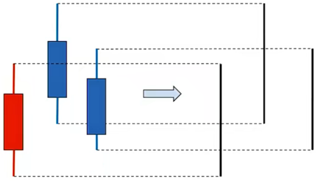

底分型定义：**无包含关系**的3根K线，中间一根高点最低，低点也最低。

顶底分型的含义：如图所示多方与空方的博弈，第一天多方占大优，股价大幅度拉伸；第二天高开，股价一路涨到最高点，紧接着空方占优，股价大幅度下跌，最终收盘时候小幅度拉伸；第三天小高开，股价涨到最高点，但空方占优势，股价下跌，最终小幅度上涨收盘。

从图中可以观察到：

- 3处股票拉伸幅度没有1、2大
- 3处股票拉伸最高值没有2高

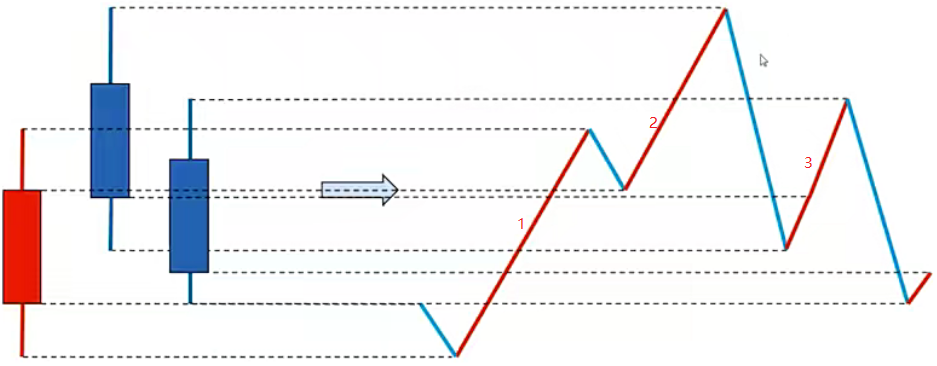

上涨趋势的K线包含关系：高点取最高，低点也取最高。包含关系的两个K线合二为一了。

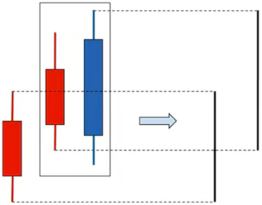

下跌趋势的K线包含关系：高点取最低，低点也取最低。

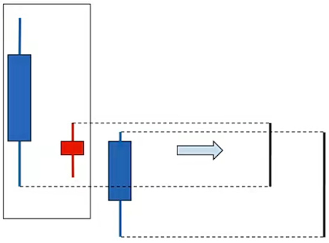

:::danger

注意：**包含关系处理必须从左到右依次处理**，如果有3根以上K线有包含关系，注意要遵守此规则。

:::

### 中继、转折顶底分型区分

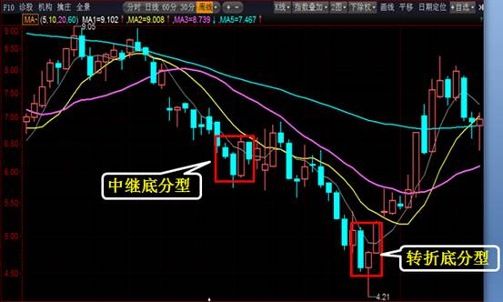

1.典型形态

核心是**第三根：实体饱满有力度，收盘在第二根线极值下（上）方**； 

次核心是第二根：长影线、十字星、低（高）开阳（阴）线佳；

这种情况转折顶分型概率较高。

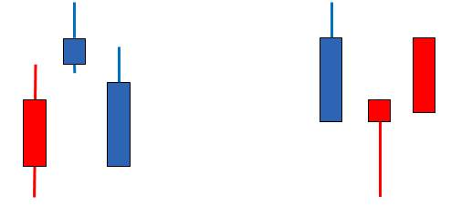

2.非典型形态

大阴大阳之后跟随小阴小阳，**第三根线实体力度不够**，通常是**中继顶底分型**概率高。 

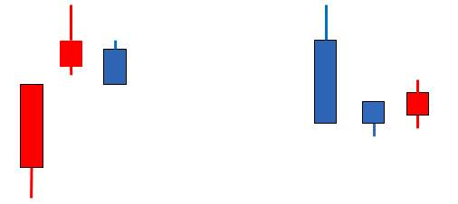

### 分型成笔

#### 看次次级别是否有3卖（买）

:::info

此处超纲，之后需要再回来看看。

:::

如果在日线顶分型出现后，去看这个顶分型中最大的中枢（通常都是5分钟中枢，30分钟时间不够），如果接下去针对这个5分钟中枢形成了第三类卖点，其后成笔的概率很高；

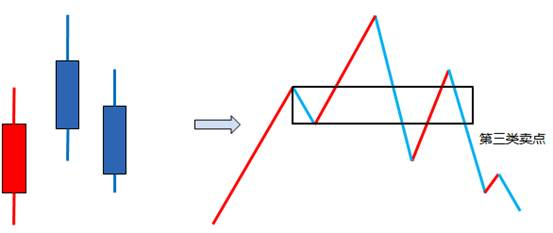

#### 形态预估

1.最有杀伤力的分型

最有杀伤力的分型：一般来说，**非包含关系处理后**的顶分型中，**第三根K线如果跌破第一根K线的底部，且收盘不能收到第一根K线区间一半之上**，属于最强的顶分型，具有较强的杀伤力，底分型反之。

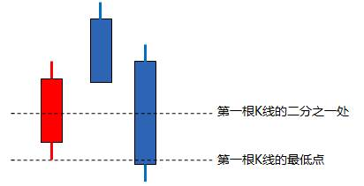

2.较有杀伤力的分型

较有杀伤力的分型：如果**第二根K线是长上影甚至就是直接的长阴，而第三根K线不能以阳线收在第二根K线区间一半之上**，那么该分型的力度就比较大，最终延续成笔的可能性就较大，如果其中有包含关系，是直接长阴吃掉长阳，是最强的一种包含关系，底分型反之。

附：长阴通常实体部分指大于7%，长上影指上影线幅度大于5%；

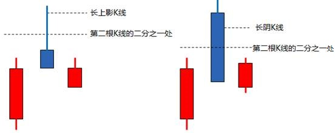

3.中继分型

多为中继型的分型：**如果第一根K线是长阳线，而第二、第三根都是小阴、小阳，无法向下超越第一根K线的二分之一处，那么这种分型结构的意义就不强**，在小级别上一定显现出小级别中枢上移后小级别新中枢的形成。一般来说，这种顶分型成为真正顶的可能性很小，绝大多数都是中继型的。

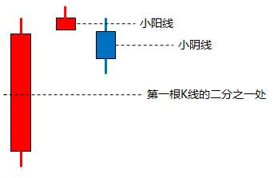

## 二、笔

### 笔的定义

定义：相邻的顶底分型之间构成一笔。

要点：

1. 处理完包含关系的顶底分型之间**至少有1根非公用K线**。即：从顶分型最高一根K线至底分型的最低一根K线至少有5根不含包含关系的K线。
2. 必须是一顶一底，顶底之间连接成笔。
3. 对于顶，如果后面有个更高的顶，保留后面的；对于底，如果后面有个更低的底，保留后面的。

画笔的顺序：

1. 找图中明显高低点，目测高低点之间K线是否有5根。
2. 没有就略过，不需要画顶底分型及及包含关系。
3. 如有，则开始画顶底分型处理包含关系，处理完毕后再观察高低点是否有5根K线，如没有则略过，如有则画为一笔。
4. 修正，如果之前的笔已经画好，但之后出现新的高低点了，同时又无法满足构成新笔的条件，则需要对原笔进行调整。 

下面三幅图都是成笔的，注意B、C图中，**成笔的部分K线也是可以上涨的**。

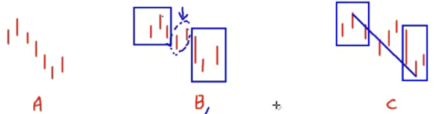

下面四幅图笔画法如下：

A：0~1不成笔，因此从0划到3，3再到4

B：本来可以0划到1的，但1~2间不成笔，因此0划到3

C：0~1不成笔，1~2看似成笔，但先画下跌趋势，因此0划到3，3再到4

D：注意蓝色的线是错误的，如果按照蓝色线，那么1~4之间有更低的底分型，因此画法是错误的，应该是0到3，3再到4

### 特殊笔

#### 次高（低）点成笔

满足条件：

1. 去除包含关系后高低点**至少有4根K线**
2. 最高（低）点与次高（低）点之间的幅度**不能超过之前波幅的50%**

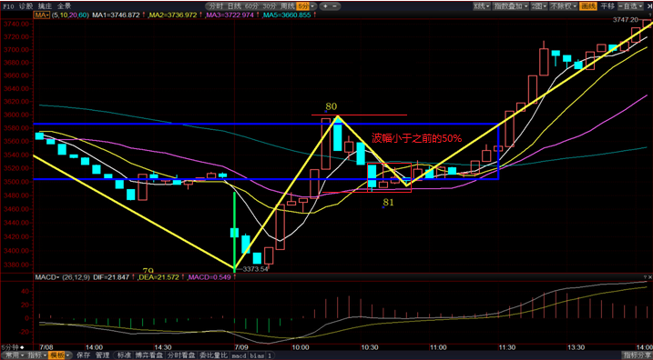

:::danger

注意：是先出最低点，后出次低点！

:::

#### 修正笔

行情出现变化，使得之前的笔画法需要进行改变来符合当前行情的特点。

下图中，如果没有6号点的跳空缺口，那么正常情况下是黄色线为笔。当低于4号点的6号点出现时候，发现原先的画法无法满足笔的定义，这时候就要修正笔了。

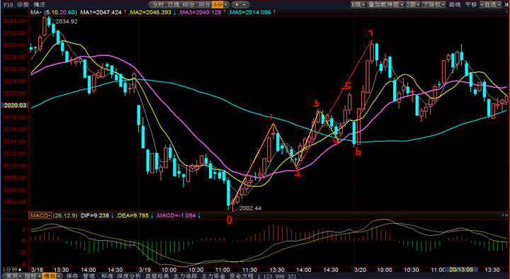

#### 打横笔

按照严格笔定义画出来，但实际走势能看出明显是横盘震荡，次级别能看出有对称的上下结构，表现为中枢震荡。特此规定：在对称的上下上结构中，如果有某一根K线的**收盘价**站在**之前最低（高）点的下（上）放**，则意味着不再以打横笔处理，而是可以直接成笔。

#### 缺口成笔

1. 规定：日线级别的缺口均无法成笔，必须按照严格笔的定义来画，允许次高低点成笔。
2. 针对指数（缺口须超过3根K线以上不回补）
   1. 30分钟级别：超过2%的缺口可成笔。
   2. 5分钟级别：超过1%可成笔。
3. 针对个股（缺口须超过3根K线以上不回补）
   1. 30分钟级别：超过5%以上的缺口可成笔。
   2. 5分钟级别超过2.5%可成笔。

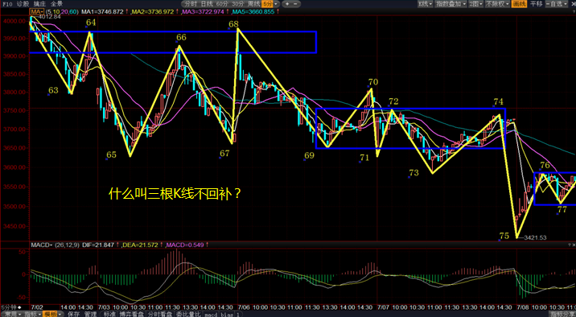

在67点后出现缺口，紧接着后面三天并没有把这个缺口补回来，这就叫做三根K线不回补。这里不用看包含关系，看天数。

:::tip

另：如果看其它周期，可以根据周期倍数来调整，如1分钟为5分钟一半，15分钟可以等同于5分钟，60分钟可以等同于30分钟。

:::

## 三、线段

