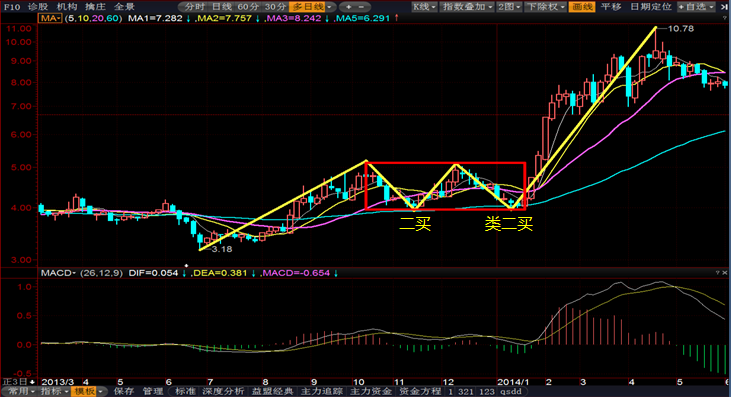

# 都业华半年课

## 序言：知识点关联

1. 为何要学**包含**关系：因为要寻找顶底分型；
2. 为何要寻找**顶底分型**：因为要画严格笔；
3. 为何要画**严格笔**：因为要画出中枢；因为严格笔还可以用来推笔，构成稳定性更好的结构，使得区间套更易进行；
4. 为何要学**1+1终结**：因为要同级别分解；
5. 为何要**同级别分解**：因为要使得中枢方向确定，行情分析简单；
6. 为何要**中枢方向确定**︰因为要比较是否背驰；
7. 为何要比较**背驰**：因为要定义1、2、3类买卖点；
8. 为何要定义**1、2、3类买卖点**：因为要**实际操作，要盈利**。

## 一、顶底分型

### 分型基础

顶分型定义：**无包含关系**的3根K线，中间一根高点最高，低点也最高。

底分型定义：**无包含关系**的3根K线，中间一根高点最低，低点也最低。

顶底分型的含义：如图所示多方与空方的博弈，第一天多方占大优，股价大幅度拉伸；第二天高开，股价一路涨到最高点，紧接着空方占优，股价大幅度下跌，最终收盘时候小幅度拉伸；第三天小高开，股价涨到最高点，但空方占优势，股价下跌，最终小幅度上涨收盘。

从图中可以观察到：

- 3处股票拉伸幅度没有1、2大
- 3处股票拉伸最高值没有2高

上涨趋势的K线包含关系：高点取最高，低点也取最高。包含关系的两个K线合二为一了。

下跌趋势的K线包含关系：高点取最低，低点也取最低。

:::danger

注意：**包含关系处理必须从左到右依次处理**，如果有3根以上K线有包含关系，注意要遵守此规则。

:::

### 中继、转折顶底分型区分

1.典型形态

核心是**第三根：实体饱满有力度，收盘在第二根线极值下（上）方**； 

次核心是第二根：长影线、十字星、低（高）开阳（阴）线佳；

这种情况转折顶分型概率较高。

2.非典型形态

大阴大阳之后跟随小阴小阳，**第三根线实体力度不够**，通常是**中继顶底分型**概率高。 

### 分型成笔

#### 看次次级别是否有3卖（买）

:::info

此处超纲，之后需要再回来看看。

:::

如果在日线顶分型出现后，去看这个顶分型中最大的中枢（通常都是5分钟中枢，30分钟时间不够），如果接下去针对这个5分钟中枢形成了第三类卖点，其后成笔的概率很高；

#### 形态预估

1.最有杀伤力的分型

最有杀伤力的分型：一般来说，**非包含关系处理后**的顶分型中，**第三根K线如果跌破第一根K线的底部，且收盘不能收到第一根K线区间一半之上**，属于最强的顶分型，具有较强的杀伤力，底分型反之。

2.较有杀伤力的分型

较有杀伤力的分型：如果**第二根K线是长上影甚至就是直接的长阴，而第三根K线不能以阳线收在第二根K线区间一半之上**，那么该分型的力度就比较大，最终延续成笔的可能性就较大，如果其中有包含关系，是直接长阴吃掉长阳，是最强的一种包含关系，底分型反之。

附：长阴通常实体部分指大于7%，长上影指上影线幅度大于5%；

3.中继分型

多为中继型的分型：**如果第一根K线是长阳线，而第二、第三根都是小阴、小阳，无法向下超越第一根K线的二分之一处，那么这种分型结构的意义就不强**，在小级别上一定显现出小级别中枢上移后小级别新中枢的形成。一般来说，这种顶分型成为真正顶的可能性很小，绝大多数都是中继型的。

## 二、笔

### 笔的定义

定义：相邻的顶底分型之间构成一笔。

要点：

1. 处理完包含关系的顶底分型之间**至少有1根非公用K线**。即：从顶分型最高一根K线至底分型的最低一根K线至少有5根不含包含关系的K线。
2. 必须是一顶一底，顶底之间连接成笔。
3. 对于顶，如果后面有个更高的顶，保留后面的；对于底，如果后面有个更低的底，保留后面的。

画笔的顺序：

1. 找图中明显高低点，目测高低点之间K线是否有5根。
2. 没有就略过，不需要画顶底分型及及包含关系。
3. 如有，则开始画顶底分型处理包含关系，处理完毕后再观察高低点是否有5根K线，如没有则略过，如有则画为一笔。
4. 修正，如果之前的笔已经画好，但之后出现新的高低点了，同时又无法满足构成新笔的条件，则需要对原笔进行调整。 

下面三幅图都是成笔的，注意B、C图中，**成笔的部分K线也是可以上涨的**。

下面四幅图笔画法如下：

A：0~1不成笔，因此从0划到3，3再到4

B：本来可以0划到1的，但1~2间不成笔，因此0划到3

C：0~1不成笔，1~2看似成笔，但先画下跌趋势，因此0划到3，3再到4

D：注意蓝色的线是错误的，如果按照蓝色线，那么1~4之间有更低的底分型，因此画法是错误的，应该是0到3，3再到4

### 特殊笔

#### 次高（低）点成笔

满足条件：

1. 去除包含关系后高低点**至少有4根K线**
2. 最高（低）点与次高（低）点之间的幅度**不能超过之前波幅的50%**

:::danger

注意：是先出最低点，后出次低点！

:::

#### 修正笔

行情出现变化，使得之前的笔画法需要进行改变来符合当前行情的特点。

下图中，如果没有6号点的跳空缺口，那么正常情况下是黄色线为笔。当低于4号点的6号点出现时候，发现原先的画法无法满足笔的定义，这时候就要修正笔了。

#### 打横笔

按照严格笔定义画出来，但实际走势能看出明显是横盘震荡，次级别能看出有对称的上下结构，表现为中枢震荡。特此规定：在对称的上下上结构中，如果有某一根K线的**收盘价**站在**之前最低（高）点的下（上）放**，则意味着不再以打横笔处理，而是可以直接成笔。

#### 缺口成笔

1. 规定：日线级别的缺口均无法成笔，必须按照严格笔的定义来画，允许次高低点成笔。
2. 针对指数（缺口须超过3根K线以上不回补）
   1. 30分钟级别：超过2%的缺口可成笔。
   2. 5分钟级别：超过1%可成笔。
3. 针对个股（缺口须超过3根K线以上不回补）
   1. 30分钟级别：超过5%以上的缺口可成笔。
   2. 5分钟级别超过2.5%可成笔。

在67点后出现缺口，紧接着后面三天并没有把这个缺口补回来，这就叫做三根K线不回补。这里不用看包含关系，看天数。

:::tip

另：如果看其它周期，可以根据周期倍数来调整，如1分钟为5分钟一半，15分钟可以等同于5分钟，60分钟可以等同于30分钟。

:::

### 停顿法

停顿法实质：中继顶底分型往往没有延续性，次级别往往表现为中枢震荡或者多方(空方)第一次反扑，一般额外一根K线可以辅助得出结果.

分型停顿法要求：当分型形成后，等待**后续出现某一根K线的收盘价站住第三根K线的极值**（此处的第三根K线是指形成分型的第三根K线），即可认为满足了停顿法的要求。

:::info

多等一根K线，这样走势更精确，因为有些顶底分型存在欺骗性。

:::

### 分型辅助成笔

大级别分型约等于次级别一笔。

分型辅助成笔在实际操作中的难点：

1. 分型成笔和严格笔的关系：两者不可能百分百相同，理想状态是可以结合使用，平时用严格笔，想快速分析行情时候，只需要分型成笔即可。
2. 特别不明显的分型，如果之前的反向影线比较长，这种分型可以成笔。

## 三、线段

### 线段和有效击穿

定义：至少由3笔构成，且前3笔必须有重叠部分，**线段构成必然是奇数条笔**。

线段初级终结定义：1+1模式。

解释： 

- 在上涨趋势中：当某一笔无法创出左侧临近高点的新高，且下一笔创出左侧低点的新低，则意味着上涨线段被终结；
- 在下跌趋势中：当某一笔无法创出左侧临近低点的新低，且下一笔创出左侧高点的新高，则意味着下跌线段被终结；

有效击穿的定义：**连续3根收盘价站稳，向上终结的确认为阳线，向下终结的确认为阴线。**

上涨线段终结：

2号高点无法创出0号点的新高，反过来3号低点有效击穿1号低点。

下跌线段终结：

2号低点无法创出0号新低，反过来3号高点有效击穿1号高点。

图中共有几条线段，分别是从几号到几号？

使用1+1终结原则，有2条线段，0~9为上涨线段，9以后是下跌线段。

特殊终结：

左图：由于2号点下跌过猛，这里就需要特殊处理了，看下一个低点4是否击穿0，如果击穿，说明1号点是上涨线段终结。

右图：由于2号点上涨过猛，需要特殊处理，看下一个点4是否击穿0，如果击穿，说明1号点是下跌线段终结。

下面哪几幅图是有效击穿？

A：不是。1、2收盘价都在击穿点上面，但3的收盘价在击穿点下面，因此1、2、3作废，从4点后开始看是否击穿。

B：不是。1、2、3收盘价都在击穿点上面，但3为阴线，不是有效击穿。

C：是。1、2、4收盘价都在击穿点下面，是有效击穿。

D：不是。1、2收盘价在击穿点下面，但4收盘价在击穿点上面，因此1、2、3、4作废，从5点后开始看是否击穿。

### 特征序列法解决线段终结

向上线段中，向下笔为该线段的特征序列；向下线段中，向上笔为线段的特征序列。可以把特征序列这一笔当成一根K线。

特征序列法解释了为何当6击穿4点后，要看8点是否击穿4点。在上图中3~4和5~6有上涨包含关系，包含处理后高点为5低点为4，因此只要8点击穿4点后构成顶分型，这时候才代表线段上涨终结，但图中没有击穿。最终7~12构成顶分型，最高点9为上涨线段终结。

:::danger

注意：和一般K线不同，要判断7~8低于3~4必须要求8点有效击穿4点，注意是**有效击穿**！

:::

### 走势的同级别分解

同级别分解的目标：将行情在某级别上分成一段段上涨与下跌的连接；

同级别分解的目的：简化分析，永远只需要处理一个正在完成的中枢，而无需顾及之前走势的影响；同时为后面的推笔打好基础。

同级别分解的原则：选择1+1终结点之前的阶段最高（低）点作为分解的标杆位。

下面给出一些同级别分解的例子：

上图中，5号点击穿2，因此3是下跌线段终结。然后由于线段最小单位是3条，因此从6开始看，9点击穿5，因此6是上涨线段终结，根据终结画出同级别分解即可。

上图中，5号点击穿2，因此3是下跌线段终结。然后由于线段最小单位是3条，因此从6开始看，7比5低，但9没有击穿5，因此还是上涨趋势，最终该图只有一条同级别分解线。

### 指数与个股仓位关系

**观点：个股操作根据个股的买卖点进行，指数作为控制总体仓位的开关。**

将指数分为：5分钟线段、30分钟线段、日线线段，由这三个参数间的相互关系来决定总体仓位。

针对短线操作的同学（操作周期通常在1-5个交易日）：

1. 如果指数5分钟线段及30分钟线段均处在上涨线段(即:未出现向下1+1终结)时，可以考虑100%仓位；
2. 如果指数5分钟线段是下跌线段而30分钟线段处在上涨线段，可以考虑70%仓位；
3. 如果指数5分钟线段是上涨跌线段而30分钟线段处在下跌线段,可以考虑.40%仓位；
4. 如果指数5分钟线段及30分钟线段均处在下跌线段，可以考虑10%仓位。

针对中线波段操作的同学（操作周期通常在6-20个交易日或以上):

1. 如果指数30分钟线段及日线线段均处在上涨线段时，可以考虑100%仓位；
2. 如果指数30分钟线段是下跌线段而日线线段处在上涨线段，可以考虑70%仓位；
3. 如果指数30分钟线段是上涨跌线段而日线线段处在下跌线段，可以考虑40%仓位；
4. 如果指数30分钟线段及日线线段均处在下跌线段，可以考虑10%仓位。

:::danger

注意：此仓位管理原则并不表示个股出现卖点时不全部卖出，还保持对应的仓位比例，切记！

另：此仓位管理原则并不涉及倒差价操作者。

:::

## 四、中枢

### 中枢的定义及性质

中枢作用：

1. 中枢是一切当下走势的分析基础。
2. 70%以上的快速上涨都源自中枢震荡的结束。

中枢定义：某级别走势类型中，被**至少连续前3笔**所覆盖的部分。

下面两幅图中，中枢到底应该画在哪里？

根据中枢的定义，连续前3笔，左图不满足**前**，因此左图画法是错误的，右图才是中枢。

中枢区域的确定：极大值取最低，极小值取最高。

中枢的另一种构成方式：本级别画不出笔或画笔很困难，由小级别延申而成。

中枢的性质：

1. 引力作用（吸引）：中枢会对所有试图离开它的走势产生引力，距离越近的中枢引力越大，级别越大的中枢引力越大。
2. 压力支撑作用（排斥）：当股价自下而上反弹至中枢区间时，中枢提供压力；当股价自上而下跌至中枢区间时，中枢提供阻力。

次级别中枢：本级别中6根及6根以上横向重叠K线。

次次级别中枢：本级别中3~6根横向重叠K线。

### 股票生命周期

上涨：

下跌：

在看背驰的时候可以结合MACD指标，如果没有回抽过零轴，通常都不是本级别真正意义的背驰，可能只是次级别或次次级别的背驰，卖完之后要注意回补。反之，若是完整走完上涨、下跌一生的股票则可以等待轮回。

中枢级别就像钓鱼时的量尺，符合长度(自己的操作级别)的可以留下(操作），不符合长度的要放掉（不参与操作)。

## 五、背驰

### 背驰的两种基本形式

1.盘整背驰

b段力度小于a段，形成盘整背驰；若未小于，则不背驰。

2.中枢背驰

d段力度小于a段，形成了中枢背驰；若未小于，则不背驰。

区别：前者未经过中枢，后者经过中枢。

### 背驰的力度

力度：长度与速度的结合，通常可以笔长度代替。

判断力度大小：可以**参考MACD指标的黄白线及红绿柱面积。**

一般情况看黄白线高度就行，背驰线段的黄白线往往更接近零轴。但也有特殊情况，如下所示，可以看红绿柱的面积。当小级别红绿柱面积不好计算时，可以放大一个级别，这样就明显了。

### 买点的衡量指标

#### R比率

R=RISK，即风险，就是你每次进场交易时有可能产生的最大亏损。

不考虑连续跌停及长期停牌等特殊情况，计算方式如下：
$$
R=\frac{（买入价-止损价）}{买入价} \\
R比率=\frac{潜在获利比率}{R}
$$
止损价必须是入场前设置好的，且R只与买入价与最初设定的止损价相关，潜在获利比率可事先估计。

#### 风险收益比

短线选股以5日风险收益比衡量，中线选股以20日风险收益比衡量。
$$
5日风险收益比=\frac{5日最大涨幅}{5日最大跌幅}
$$
从买点开始算，往后推5个交易日。

:::danger

R比率用来衡量买入点的合理程度，平均大于3为优秀。风险收益比衡量短线选股水平，平均大于3为优秀。

:::

在实际操作中，可以做一个股票操作记录表做反馈：

## 六、第一类买点

### 定义

:::info

缠者，价格重叠区间也，买卖双方阵地战之区域也；禅者，破解之道也，以阵地战为中心，比较前后两段之力大小，大者，留之，小者，去之。

:::

左图：b大于a，力度没有背驰，随后经过一个中枢，之后c小于b，发生背驰。对于第一个中枢，a为进入中枢一笔，b为离开中枢一笔；对于第二个中枢，b为进入中枢一笔，c为离开中枢一笔。

右图：b小于a，发生背驰。a为进入中枢一笔，b为离开中枢一笔。

**一买为下跌中枢下方，下跌力度较进入中枢段衰竭而形成的买点。**

### 选股

如何选到潜在的一买个股？

1. 海选阶段：准备找哪个周期的潜在一买？如果是30分钟、60分钟级别的，使用20日跌幅排序；跌幅大于15%。如果是日线级别的，使用年跌幅排序；跌幅大于30%

2. 精选阶段：如果选30分钟级别的，保留下来日线至少回抽过10日均线的个股（回抽最多不能超过20日均线）；如果选日线级别的，保留下来周线至少回抽过10周均线的个股；（注意，回抽10日均线时剔除掉高级别已成笔的个股） 

3. 淘汰赛阶段：看下跌之前的股性，只保留下跌前股性活跃，上涨有力的个股。最优为两中枢背驰，其次为一中枢悬殊背驰，特殊情况为中枢背驰后拉回再向下延伸，但是仍旧背驰。

:::tip

在精选阶段，要求横向回抽，形成中枢结构，如果形成的是笔结构，就过滤掉吧。

在淘汰阶段，优先选择两中枢背驰结构，次选力量悬殊的一中枢背驰结构，如果形成一中枢背驰结构但力量不悬殊，选择要慎重。

:::

### 操作

1. 准备工作：寻找到合适的操作周期，将合适的操作周期（注意：就这一个周期就够了，不需要画额外周期）自上一个同级别分解线开始的笔、中枢画出。
2. 寻找背驰段；背驰段含义：有可能产生背驰的、下跌段那最后一笔下跌，图中蓝色笔即为背驰段；（实际操作中，可以等到背驰段创出新低后再开始关注，因为没有新低，也就没有背驰）

3. 寻找底分型。在背驰段创出新低之后，开始寻找背驰段的典型底分型。（可以使用停顿法辅助，还可以观察次级别是否有背驰）
4. 买入：当确认了该底分型后买入。
5. 设立离场规则。推荐止损价1为止损价，当然止损价2也是可以的。

下面是课程中贵州茅台例子，红色上方不要看，是因此红线是前一个最低点。按照时间推移，可以遇到3次底分型，按照停顿法的要求，第1、2次的底分型后的第4根K线收盘价没有超过第3根K线的最高价，因此不买入。但第3次底分型后的第5根K线为大阳线，收盘价大于第3根K线，是买入点。

### 第一类买点的性质特点

1. 是由于下跌力量衰竭而产生的买点，即空方力量衰竭而产生的买点，不是多方力量加入而产生的买点。
   1. 第二类买点属于多空力量逆转的买点，第三类买点属于乘胜追击的买点，类二买属于多方蓄势爆发的买点。
2. 大概率能够反弹回最近一个中枢，但要小心一中枢背驰后有可能做第三类卖点。
3. 需要特别强大的心脏，因为第一类买点基本就是买在最低点旁边一点点，所以买入以后通常是有恐惧的。
4. 道家观点：盛极而衰，否极泰来；第一类买点属于否极，第一类卖点属于盛极。
   1. 否、泰：《周易》中的两个卦名。否：卦不顺利；泰：卦顺利；极：尽头。

5. 如果说一买操作的难点，或者说是如果会吃亏，会吃下跌中枢延伸的亏。

### 盘背抄底

你会在盘背（盘整背驰）的时候去抄底吗？

急跌后的急跌后的盘背：

:::danger

如果想盘背抄底，需要注意两点：

1. **急跌**之后的盘背。
2. 尽量做大周期，即日线以上的盘背。

其他的一概不动，风险太高了。

:::

### 第一类买点失误的归纳

1.第一类失误：买在中继底分型上。

应对方法：及时止损。

2.第二类失误：形成下跌中枢延伸。

应对方法：在成本处设立止损点，使其最差也是平盘出局。

3.第三类失误：下跌背驰后以另一个中枢来替代上涨。

应对方法：一买后一旦发生横向继续震荡，应马上出局，或及时止损。

可出手情况及成功率：

常用周期搭配表：

### 第一类买点走势分类

1.普通走势：一买背驰后演变为上涨的一段。

2.最强走势：一买背驰后演变为上涨的一段。

上涨后超过了中枢，后续回拉后也没有进入中枢。

3.较弱走势：一买背驰后演变为中枢延伸。

演变为中枢延伸后大概率还会跌。

4.最弱走势：一买背驰后演变为三卖

### 走势的四种终结方式

1.概率最高的终结走法：中枢背驰终结。

2.概率次高的终结走法：盘整背驰终结。

3.小转大终结：由于小级别的背驰，导致大级别没有产生相应背驰而直接终结的现象。通常只会在**急涨急跌**中出现。

4.概率最小的终结走法：中枢无背驰直接终结。

## 七、第二类买点

### 定义

第二类买点：**在第一类买点之后第一次空头反抽不创新低的点**，是买入时的第二有利位置，称为第二类买点。

### 与一买的比较

第二类买点与第一类买点的比较∶

第一类买点是下跌过程中由于下跌力度背驰而导致的买点，是下跌过程中第一个最有利的买点，**比第二类买点位置更低**；

第二类买点是产生在第一类买点之后的第一次空头回拉不创新低的位置，位置比第一类买点高，但是**较第一类买点安全性高**，因为它杜绝了中枢延伸直接创新低这种情况。

第一类买点与第二类买点的关系是兄弟关系，既相互依存，又相互竞争。若是作为兄长的第一类买点之后涨势很弱，通常做弟弟的第二类买点力度也会弱；但若是兄长第一类买点涨幅过大，则很可能预示着第二类买点的空间已被耗尽。

第二类买点通常有两个用途：

1. 给寻求安全稳定的投资者准备
2. 为错过第一类买点的投资者提供二次进场的机会（如出现小转大，没有抓到第一类买点）

### 定位买点

方法一：任何买点的本质都是第一类买点，可以将下降笔**放大次级别走势**，使用第一类买点方式进行买入。（建议至少大于5分钟级别）

方法二：到了次级别，周期变小，难度加大，还可以直接使用**本级别的底分型停顿**确认来确认红色一笔调整结束。

#### 二买处理小转大

假如在小转大处没有及时发现，或者出现时比较犹豫没有把握： 

1. 观察本级别一笔后回拉是否创新低，如不创新低，回拉的幅度如何；
2. 如回拉的幅度在可接受范围内，可以选择在本级别这一笔回调结束后买入；（用黄金分割比例衡量回调幅度）

#### 二买处理整盘背驰

### 终结方式买入总结

1. 中枢背驰终结：第一类买点，背驰段底分型停顿法精确定位； 
2. 盘整背驰终结（急跌盘背、大级别盘背）：第一类买点，背驰段底分型停顿法精确定位；
3. 盘整背驰终结（一般型盘被）：第二类买点，回拉笔底分型停顿法精确定位，或次级别放大再次使用第一类或第二类买点定位的方法（区间套）；
4. 小转大终结：
   1. 第一类买点，直接在小周期背驰处使用底分型停顿法精确定位；
   2. 第二类买点，回拉笔底分型停顿法精确定位，或次级别放大再次使用第一类或第二类买点定位的方法（区间套）；
5. 中枢盘整终结买入法：暂空，需要用到第三类买点的知识。 

目前，除了最后一类，其它四类情况的出现我们都有了相应的买入法则；在买的方面，绝大多数走势应该难不住大家了。 

### 二买后的走势情况

1.偏弱走势：二买后延续之前的下跌中枢震荡（创新高）

2.最弱走势：二买后延续之前的下跌中枢震荡（不创新高）

3.最强走势：二买后直接向上突破不背驰

## 八、第三类买点

### 定义

模式一：

在离开第一个上涨中枢之后，**第一次空头反拉不进入中枢的点**，是买入时第三有利的位置，称之为第三类买点，图中紫色圈标示处为第三类买点。

模式二：（二三买合并）

在第一类买点形成后**快速上涨脱离最后一个下跌中枢**，其后空方的第一次反扑不进入最后一个下跌中枢的点，称之为第三类买点。

### 定位买点

方式一：任何买点的本质都是第一类买点，可以将红色的下降笔**放大到次级别走势**，使用第一类买点的方式进行买入。

方式二：还可以直接使用本级别的**底分型停顿**确认来确认红色一笔调整的结束。

判断下图是否是三买？

是的，注意下跌中枢的位置。

判断下图是否是三买？

是的，虽然三买后是下跌趋势，但处于三买买点时候，之后走势是不知道的。

### 第三类买点个股选择

找到第三类买点个股的核心是能够描述红色段**有力度**的上涨。

30分钟、60分钟中枢后的第三类买点：5日涨跌大于15%，20日涨跌大于-5%，小于15%；（若想找到更多标的，可调至5日涨跌10%） 

日线中枢后的第三类买点：20日涨跌大于40%；

挑选要诀：

1. 30分钟、60分钟中枢后的第三类买点上涨段最好有涨停板； 
2. 多翻热门板块个股；（比如最近的强势板块） 

## 九、类二买

### 定义

其定义为：在第二类买点右侧（可略高或略低），**与出现回拉形成二买那一笔共同组成第一个上涨中枢**；类二买可以是多个。

::: tip

类二买作为非标准买点，在上涨图形中不一定会出现。

:::

下图中2、3、4都是类二买点：

### 定位类二买

方法一：任何买点的本质都是第一类买点，可以将红色的下降笔**放大到次级别走势**，使用第一类买点的方式进行买入。 

方法二：到了次级别，周期变小，难度加大，还可以直接使用本级别的底分型停顿确认来确认红色一笔调整的结束。

定位类二买时一定需要注意的：

1. 类二买与其它几类买点不同，它可参考的东西最多； 
2. 类二买往往可以参考二买的低点，通常会比二买略高，如果在二买价格附近有次级别背驰或者底分型确认，可靠性增强；短暂击穿后迅速收回效果佳。
3. 还可以参考MACD，通常成功的类二买出现时往往是在合适的周期上MACD已经从上方向下接近零轴了。 

什么样的类二买最好？收敛型

类二买通常与哪几类个股结合紧密？

1. 小转大的个股
2. 第一类买点后反弹遇到前期下跌中枢阻力的个股 
3. 形成模式二的第三类买点个股

### 类二买后的走势

1.继续中枢震荡

2.向下离开中枢

3.向上离开中枢但是背驰

4.大幅向上离开中枢不背驰

### 类二买止损位

何时使用方法一：买入位置不高、本级别上涨未成笔、震荡区间窄； 

何时使用方法二：本级别已经成笔、震荡区间较宽。

## 十、区间套

### 定义

利用走势的自相似性，不断使用中枢背驰定位的方法。周期上由大及小，可以从周线到日线再到30分钟，再到5分钟、1分钟，最终将买点定位在1分钟K线上的1、2、3类买点上，理论上可以在买入定位时做到买在一支股票最低点之后的几分钟内。

什么情况下使用：在发现本级别上出现潜在1、2、3或类二买时，希望能够买在更低的位置（因为如果不需要买在更低，可以直接使用底分型停顿法）。

### 区间套几种变化形式

1.中枢背驰+中枢背驰

2.中枢背驰+盘整背驰

3.中枢背驰+小转大

4.中枢背驰+中枢盘整终结

### 区间套例子

友利控股60分钟K线图：

从60分钟图中可以看到经过两中枢背驰，现在放大背驰段。

友利控股5分钟K线图：

放大后又能看到5分钟结构有两个中枢，然后放大背驰段。

友利控股1分钟K线图：

放大后通过下面绿色柱子看出，是一中枢背驰，但背驰力度不明显，这时候在1分钟K线上使用底分型停顿法来定位买点。

### 区间套处理原则

1. 不要苛求完美：不需要不停向下进行区间套，一般进行到第二层即可。
   1. 本级别发现背驰段，然后看到次级别即可；
   2. 另一重不苛求完美体现在不要每次都认为每个级别都会有背驰段，都是中枢背驰见底，因为行情终结有四种形式，中枢背驰终结虽然概率最高，但毕竟只是其一；
2. 在区间套时注意和底分型停顿法之间的关联，如果在进行区间套时发现本级别已经出现底分型确认的情况而区间套还没有确认，一般应该先进场，也就是说两种方法只要出现一个就可以进场了，除非是对安全性要求极高，一定要看到每个次级别都终结才进场的同学；
3. 区间套时止损原则：因为不断向下进行定位，理论上出错概率也在增大，如果在某一级别遇到被套住的情况，止损时可以略微放宽一点，比如参照大级别重要的低点，或者是一个固定百分比，因为区间套到最后定位时止损会非常窄。

## 十一、卖点

### 买卖的不同逻辑原则

:::danger

卖出操作要杀伐果断，按照止损点该卖就卖，切忌幻想下跌股票上涨解套！

赚钱不等于正确的操作，错误的操作也许会一次两次赚，但长久来看就有大亏的风险。

:::

买入时手中是没有筹码的，因此没有必须要处理的压力，可选择余力非常大，而且有大量时间可以等待，错过了也没关系，大不了等下一个买点。

卖出时手中有筹码，随着时间变化如果没有及时止损会面临收益受损的风险，卖出必须果断。

早卖和晚卖相比较，早卖对心态的影响更小，晚卖了会经历最高点，后悔自己不该犹豫、卖晚了。但从理性角度考量，早卖晚卖收益是一样的，不同的是对心态影响不同。

卖出的四种层次：

1. 在卖点主动卖出
2. 产生1+1终结时主动卖出
3. 在止损点上被动卖出
4. 忍到最后忍不住了被迫卖出（通常都是亏损的）

**死了都不卖**不在本课题讨论范围内。

### 第一类卖点定义

第一类卖点是在上涨中枢上方，由于**上涨力度较进入中枢段衰竭而形成的卖点**，图中深蓝色圆圈即代表第一类卖点。

### 第一类卖点后的回补

1.一中枢后的一卖：本级别的**一笔**回补。

2.两中枢后的一卖：本级别的**一段**回补。

**下图中都是次级别中枢，应该看次级别走势**，次级别走势中找到回补点。

下图中就不用切换到次级别了，会补点是一卖点后的线段。

### 止损点上移

一买形成后，调整止损点到买入点位置。

二买形成后，上移止损点到二买低点，在未出中枢前不动。如果类二买和二买价格差不多，止损应该不动，仍放在二买点；如果相差很大，移动止损到到类二买低点上。

三买形成后：上移止损点到三买低点。

:::tip

止损点移动的目的是为了保住已有的利润。

:::

### 卖出阶段的小转大

小转大含义：由于**快速上涨中次级别背驰**导致了本级别不再产生中枢背驰终结，而直接以1+1终结的形式终结。

上升阶段的小转大和下跌阶段的小转大有何不同：我们之前在下跌阶段遇到潜在的小转大，策略是可买可不买，后面可以用第二类买点做辅助；现阶段上升阶段潜在的小转大，我们的操作是一定先卖，这里就是卖和买不同的哲学。

如果错过了快速上涨的次级别背驰卖出点，后面可以用第二类卖点弥补。

:::tip

采用这种处理方法的前提是：

1. 已经经历了一个上涨中枢；
2. 出现了快速上涨，没出现这两种情况下无需考虑。

:::

### 第二类卖点

第二类卖点是在第一类卖点出现后多方第一次反扑无法创出新高的点，图中绿色圆圈即代表第二类卖点。

:::danger

能卖在第一类卖点绝不卖在第二、三类卖点。

:::

### 第三类卖点

:::danger

实际操作中不可能用第三类卖点来卖出股票，在三卖点卖股票就死翘翘了！ 

:::

第三类卖点是在针对最后一个上涨中枢回拉不进中枢的点，或者是第一个下跌中枢回拉不进中枢的点，两图中的紫色圆圈即为第三类卖点。

