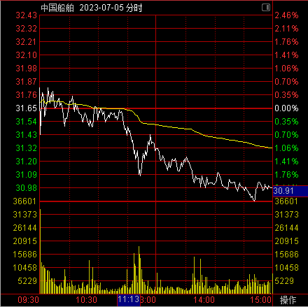

# 技术指标

::: danger

在使用技术指标时候，切忌掉进公式化，比如某个指标符合，那它就一定涨，这种思路是有问题的，应当结合其他手段具体分析。

:::

## MA

### 指标定义

移动平均线（Moving Average）：在统计学中是一种通过创建整个数据集中不同子集的一系列平均数来分析数据点的计算方法。

对于 *n* 天的收盘价样本，简单等权重移动平均是前 *n* 天收盘价的平均值。

如果收盘价为 ${\displaystyle p_{M},p_{M-1},\dots ,p_{M-(n-1)}}$，则公式为：
$$
{\displaystyle {\begin{aligned}{MA(CLOSE, n) = \overline {p}}_{\text{SM}}&={\frac {p_{M}+p_{M-1}+\cdots +p_{M-(n-1)}}{n}}\\&={\frac {1}{n}}\sum _{i=0}^{n-1}p_{M-i}\end{aligned}}}
$$

当计算下一天移动平均时，只需要在求和中加入一个新值，剔除一个旧值，无需再把所有数字再加一遍。

如图所示，白、黄、紫、绿依次为5、10、20、60日均线。

### 作用

1.揭示价格运行趋势方向：均线向下则趋势向下；均线向上则趋势向上。短期均线反映短期趋势，长期均线反映长期趋势。

2.揭示当前市场的平均成本：均线反映市场参与交易者的平均成本，周期越长的均线越靠近真实的交易成本。

3.均线朝上或朝下移动通常需要持续一段时间才能发生反转。在上升趋势中，可以将均线看作多头的防线，具有助涨作用；而下跌趋势中，可以将均线看作空头的防线，具有助跌作用。

## EXPMA

指数平均数指标（Exponential Moving Average）：对价格收盘价进行算术平均，并根据计算结果来进行分析，用于判断价格未来走势的变动趋势。
$$
EXPMA=上日或上期EXPMA + \frac{(当日或当期收盘价-上日或上期EXPMA)}{N}
$$
首次上期EXPMA值为上一期收盘价，Ｎ为天数。新一天的EXPMA是通过今天的收盘价对前一天的EXPMA进行小幅度调整。

:::tip

EXPMA和MA相比，优点在于及时可以看到今天的均线是涨还是跌，只需要和前一天比即可。

:::

## DMA

平行线差指标（Different of Moving Average）：**依据快慢两条移动平均线的差值情况来分析价格趋势**的一种技术分析指标。它主要通过计算两条基准周期不同的移动平均线的差值，来判断当前买入卖出的能量的大小和未来价格走势的趋势。
$$
DMA=短期平均值—长期平均值
$$
以10日和50日为例，可得：
$$
DIF=MA(CLOSE, 10)-MA(CLOSE, 50), \\
DIFMA=MA(DIF, 10)
$$

## VOL

### 指标定义

成交量（Trading Volume）：某一时间段内具体的交易数。成交量是以单边交易来计数的，比如交易为100手，则表示买方实际买入量为100手，卖方实际卖出量也是100手。

成交额（Trading Amount）：某一时间段内参与市场的资金量。

均量线：以成交量做移动平均运算。

成交量反映市场整体或个股的交投情况。

分时成交量用出现在当日分时线下的柱形图表示：

### 作用

1.**真实反映市场供需情况。**当股市筹码供大于求时，股价或指数就以下跌形式来使得多空力量平衡；当股市筹码供小于求时，股价或指数就以上涨形式来使得多空力量平衡。

2.体现市场运行趋势。成交量是动力，价格走势是方向。

|  | 成交量放大 | 成交量萎缩 |
| --- | --- | --- |
| **股价上涨** | 走势会继续向上 | 上涨走势快到头了，是上涨趋势反转信号 |
| **股价下跌** | 走势会继续向下 | 跌势差不多无人敢跟了，是下跌趋势反转信号 |

3.体现主力行为与意图。主力建仓时要大量吸筹，没有适当放量是难以满足主力胃口的；主力欲吸引市场人气，往往都会使用“对倒”手法进行造量，伴随股价大幅波动的同时，又突然出现的巨量，打破原有的交投情况，吸引市场的目光。

### 成交量的基本形态

成交量是市场供需的表现，是一个时间单位对某项交易**成交**的数量。既然是成交，那就有买方和卖方，有人看多，有人看空，造成巨大分歧，然后各取所需，才会成交。

1. 缩量：市场交易极其清淡。
   1. 大部分人都看空后市，造成只有人卖，无人买。
   2. 大部分人都看多后市，造成只有人买，无人卖。
2. 放量：一般发生在趋势转折处。市场各力量对后市分歧逐渐加大，一部分人看空同时另一部分人看多，于是交易量就会增加很多。
   1. 虚假放量：控盘主力利用手中筹码大手笔对敲，左手倒右手，是很简单的时期，这时候也会产生放量。

3. 地量：一段时间内出现的最小交易量。
4. 天量：一段时间内出现的最大交易量。

5. 锯齿量：交易量不规则的放大缩小
   1. 一般是没有突发利好或大局基本稳定情况下，风平浪静时突然放出历史巨量，随后又没后音，一般是实力不强的庄家在吸引市场关注，以便出货。
   2. 主力资金试盘。

6. 堆量
   1. 低位堆量：主力意欲拉升时，会把交易量做得非常漂亮，成交量缓慢放大，价慢慢推高。
   2. 高位对量：相反，主力不想玩了，在大举出货。

## MACD

### 定义

:::tip

MACD吸收了MA、DMA、EXPMA的相关定义思路，综合而成。

:::

平滑异同移动平均线（Moving Average Convergence Divergence）：由一快及一慢指数移动平均指数移动平均（EXPMA）之间的差计算出来。“快”指短时期的EXPMA，而“慢”则指长时期的EXPMA。

$$
DIF（差离值）=EMA(CLOSE, SHORT)-EMA(CLOSE, LONG), \\
DEM（信号线）=EMA(DIF, MID), \\
OSC（柱状图）=DIF-DEM
$$

一般情况下，如下图左上角所示，SHORT为12，LONG为26，MID为9。那么DIF就是计算的以12日收盘价EMA和26日收盘价EMA的差值；DEA是9日DIF计算的EMA；柱状图高度即DEM和DIF的差值。

**DIF是MACD指标的快线，反映短期市场的趋势变化**，它在价格变动较为敏感。DIF上升意味着短期市场趋势向上；DIF下降时，意味着短期市场趋势向下。

**DEM是用于平滑DIF的变化**，以便更清晰观察市场的长期走势。

### 使用

1.位置

DIF和DEA都大于0，且向上移动：近期行情在上涨方向扩展，在股价上就是上涨行情。

DIF和DEA都小于0，且向下移动：近期行情在下跌方向扩展，在股价上就是下跌行情。

DIF和DEA都大于0，但向下移动：近期行情在上涨方向萎缩，在股价上**可能是上涨行情减弱，也可能是开始下跌。**

DIF和DEA都大于0，且向上移动：近期行情在下跌方向萎缩，在股价上**可能是下跌行情减弱，也可能是开始上涨。**

2.交叉：就是DIF和DEA交叉地方，个人觉得按照网上说法把金叉当作买点不一定是正确的，DIF是快线，它其实就已经对应了上涨下跌是扩展还是萎缩行情；DEA是慢线，是平滑后的DIF，变化没有DIF敏感。

3.柱状图

柱高越大，说明DIF和DEA的差值越大，说明当前是扩展行情，当然可以是上涨扩展，也可以是下跌扩展。

MACD指标，通过看线和看柱都是可行的。

:::tip

当大级别看不出来时，建议换成小级别来看，多多用30分钟MACD，能有效把握买点。

:::

## RSI

### 定义

相对强弱指数（Relative Strength Index）：比较一段时期内的**平均收盘涨数和平均收盘跌数**来分析市场买沽盘的意向和实力，从而作出未来市场的走势。

价格上升时：

- U=今日收盘价-昨日收盘价，D=0；
- U=0，D=昨日收盘价-今日收盘价；

$$
{\displaystyle RS={\frac {EMA_{(U,n)}}{EMA_{(D,n)}}}}, \\
{\displaystyle RSI=\left(1-{\frac {1}{1+RS}}\right)\cdot 100\%}=\frac {EMA_{(U,n)}}{EMA_{(U,n)}+EMA_{(D,n)}}\cdot 100\% \\
$$

RSI默认情况下表示6日、12日、24日相对强弱。

**无论价位如何变化，RSI的值在0~100内。**

:::danger

其实在通达信中使用的不是EMA来计算的，而是简单移动平均法（SMA）来计算，道理是相通的。

:::

### 使用

1.RSI=50为强势市场和弱势市场的分界点。根据公式定义，大于50说明在指标时间内大部分情况是上涨的，反之是下跌的。

2.为了确认RSI是否今日超买区或超卖区，或是否穿越50中界限，应尽量时使用长期RSI，以减少被骗钱的发生。

## BOLL

布林带（Bollinger Bands）：展示**价格如何随着时间而波动。**布林线开口越大，说明近期股价振幅越大；开口越小，说明近期股价振幅越小。

中轨线（MID）=N日的移动平均线MA

上轨线（UPER）=中轨线+K*N时间段的标准差

下轨线（LOWER）=中轨线-K*N时间段的标准差

一般情况下，K为2，N为20。

中轨是股价的平均成本，上轨和下轨可视为股价的压力线和支撑线。

