# 筹码理论

## 图中指标

1.黄白线

- 白线表示当前股价亏损的筹码
- 黄线表示当前股价盈利的筹码
- 蓝线表示当前股价市场所有持仓筹码的平均成本

2.远期移动成本图

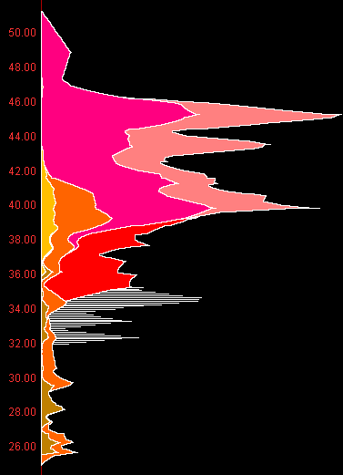

图形长度：当前价格堆积的筹码。

某种颜色面积：某周期筹码比例。

N周期前成本x%：N天前筹码所剩比例。

3.底部文字

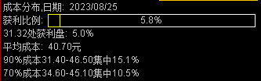

获利比例：**当日收盘价**获利盘比例，比例越高说明越多人获利

31.32处获利盘：**当日在指定价格**获利盘比例

平均成本：当前股价市场所有持仓筹码的平均成本，即黄白线图中的蓝线

成本集中度：

95%获利价格是31.40，5%获利价格是46.5，那么集中度为`(95%获利盘-5%获利盘)/(95%获利盘+5%获利盘) * 100%`

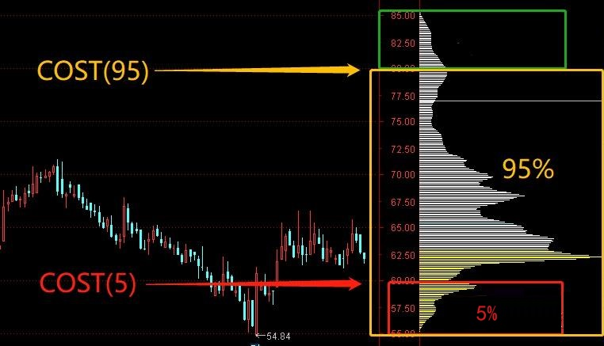

> 成本集中度标准：
>
> - 90%
>   - 10%~15%：一般集中
>   - 5%~9%：高度集中
> - 70%
>   - 8%~12%：一般集中
>   - 3%~7%：高度集中

## 主力筹码计算

筹码峰计算：上沿减下沿区域的获利盘，得到的就是某段价格的筹码占比。

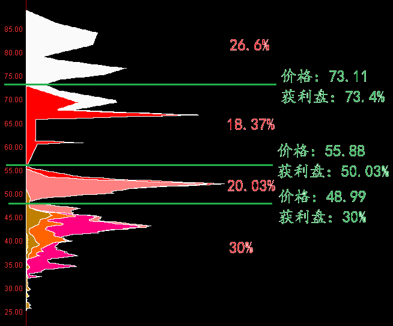

判断主力筹码：

1. 获利不抛的筹码是主力筹码
2. 解套不卖的筹码是主力筹码
3. 横盘洗不掉的筹码是主力筹码

中小盘主力建仓成本仓位：30%~45%

**如果底仓保持的30%以上，主力处于锁仓状态；底仓低于20%，主力已经部分出货；底仓低于10%，主力出货坚决。**

## 筹码看支撑位和压力位

### 单峰密集形态

1.底部单峰密集

一般底部单峰密集形态需要长时间横盘整理才能完成。是主力吸筹建仓的重要方法之一，主力建仓的目标价位区，利用横盘震荡洗掉里面的浮筹。

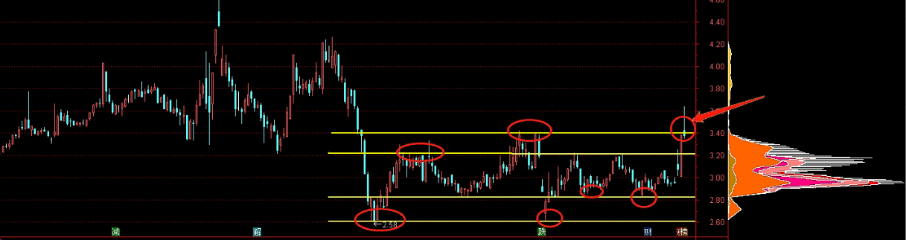

筹码峰上沿会存在多重顶部结构，筹码峰下沿会存在多重底部结构。所以底部单峰密集形态适合中长线布局。

如果能放量突破，那么后市看涨，逢低布局即可。突破后，之前筹码峰的上沿会转换为一道强有力的支撑。

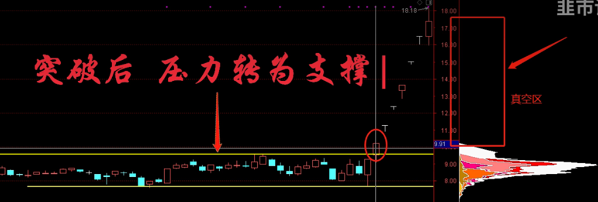

2.高位单峰密集

一般是股价经过一轮大幅度拉升后，然后横盘震荡所形成的在，这种走势一般维持时间相对比较短，主要目的是为了掩护主力出货用的。一旦下方筹码走完，在上方形成的单峰密集形态，下方为真空形态，一旦出现跌破筹码峰下沿情况，那将是非常危险的信号，需要及时止盈或止损。

**这种高位单峰密集形态尽量不要去碰**，虽然有特例。

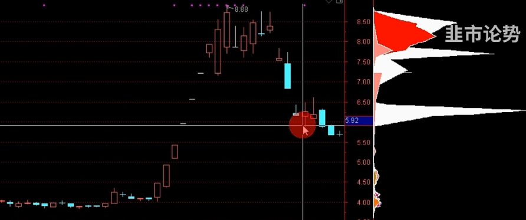

3.下跌途中的单峰密集形态

一般这种形态多半是短线筹码居多，所以股性相对比较活跃。

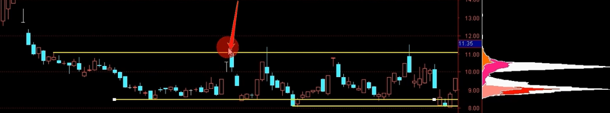

如果拉升，遇到筹码峰上沿不能放量突破，就止盈；

如果下跌，跌破筹码峰下沿情况，就以观望为主。

:::tip

总结：

- 单峰密集形态上沿是压力位，有效突破后将转化为未来的支撑位
- 单峰密集形态下沿是支撑位，跌破后将转化为压力位

:::

### 多峰密集形态

1.下跌过程形成的

下跌过程中有很多套牢盘，这些筹码组成强有力的压力位，股价上涨后，就会有人要解套，再把股价打压下去。

对这类形态，不要参与中长线布局。

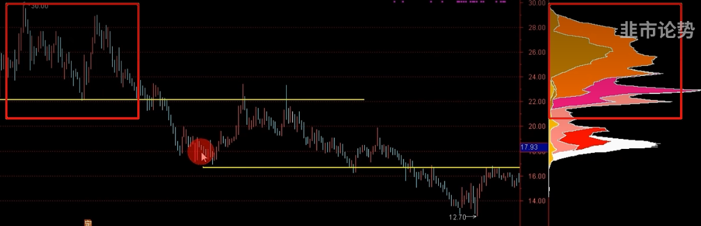

2.上涨过程中形成的

每当拉升无力回踩下来，下方的筹码峰就可以作为一道强有力的支撑位。股价下跌后，一旦跌到下方密集峰的位置，该密集峰筹码将会出现没有钱可赚的情况，没钱赚就不会有人卖，不卖就会止跌，从而支撑股价。

下方密集峰筹码越多，支撑力就越强，如果股价跌破密集峰，那么支撑失效。

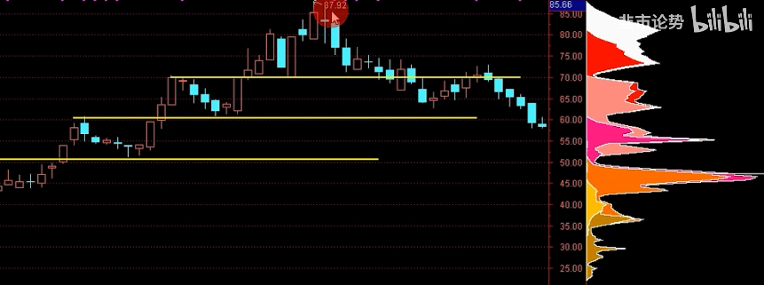

多峰密集形态结论：

- 如果股价在最上方密集峰的位置，中、下方密集峰将是支撑位
- 如果股价在中间位置，上方为压力位，下方为支撑位
- 如果股价在最下方密集峰的位置，中、上方密集峰都将是压力位

## 主力吸筹拉升步骤

1. 确定标的

- 选择跟政策方向有关的板块。
- 标的盘子不能太大，流通盘5亿一下，市值在100亿以内的。

选择游资和主力偏好的情绪周期个股。

2. 建仓

主力永远会选在低位，大跌后捡便宜。主力建仓的整个过程，就是高位散户割肉的过程。

高位筹码绝望割肉离场，不坚定的浮筹清理出局。

洗盘完成：大部分高位筹码都转移到了下方，在下方形成单峰密集形态。

3. 拉升试盘

1. 热点催发在底部形成堆量

2. 股性明显变得活跃，来吸引更多资金入场，形成合力推升股价突破筹码峰上沿，让股价脱离主力成本区

   1. 温和放量突破：主力已经高度控盘，场内没有对手盘来打压股价

   1. 放巨量拉升，并且还冲高回落，那么就证明场内抛压过大，分歧很强，还需要继续洗牌，来增加控盘度

   1. 最好是以涨停方式一阳穿多线突破最佳

3. 一旦发现试盘，并且有热点刺激，就是介入的最佳位置。

:::danger

注意：

- 回踩时候，洗盘周期不能超过10个交易日，否则人气容易流出，如果主力资金流出，那就需要及时走人了。
- 要知道这种票走的是趋势还是情绪
  - 如果走的是趋势，那么股票就会拉升一波后就会进行洗盘调整，然后继续拉升。特征：主力洗完盘后，始终都会在低位保留一部分筹码，以达到控盘目的。当股价突然加速，放巨量上涨，特别是连续涨停，表明该股拉升即将进入尾声，主力已经没有做多意向。
  - 如果走的是情绪，二板确定龙头地位后，主力资金大幅封板。

:::

## 主力高位出货模式

1.高位缓步推升出货模式

当股价经过快速拉升后，主力大部分筹码开始转移至上方，在上方慢慢形成筹码单峰密集形态，然后主力在高位小幅度推升卖出底仓。

优点：既可以让场内资金不流失，又可以吸引场外资金不断参与进来。

2.高位横盘出货模式

当股价经过快速拉升后，主力大部分筹码开始转移至上方，在上方慢慢形成筹码单峰密集形态，然后主力在高位小幅度震荡横盘，卖出大部分存货。

优点：既可以让场内资金不流失，又可以吸引场外资金不断参与进来。

3.高位震荡出货模式

当股价经过快速拉升后，主力大部分筹码开始转移至上方，在上方慢慢形成筹码单峰密集形态，然后主力在高位大幅度震荡，卖出大部分存货。

优点：既可以让场内资金因为方向不明确而持股观望，又让场外的短线交易者觉得有差价可以做，而不断参与进来。

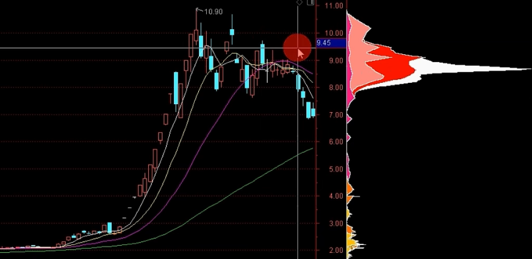

共同特征：底部筹码慢慢消失，高位密集峰的下方没有明显的筹码作为支撑。

## 优秀的筹码结构

**妖股在启动前筹码都非常集中，并且都有一根非常长的顶格筹码。**直到股价拉升无力时，底部的顶格筹码开始松动了，等底仓跑差不多时候，股价就会下跌。

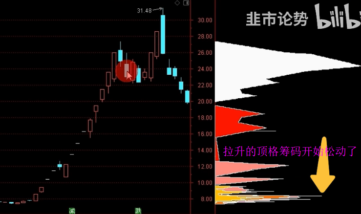

当然并不是说顶格筹码动了，就一定会进行调整，但至少证明底下筹码开始松动了。

比如下面中通客车走势，虽然底部的顶格筹码松动了，且底仓跑完了，但在市场合力的作用下，照样一路高歌猛进。**一旦市场形成合力，那么股票就不只是主力在拉升了，而是散户、游资、主力一起拉升，这种情况再看筹码，意义就不大了。**

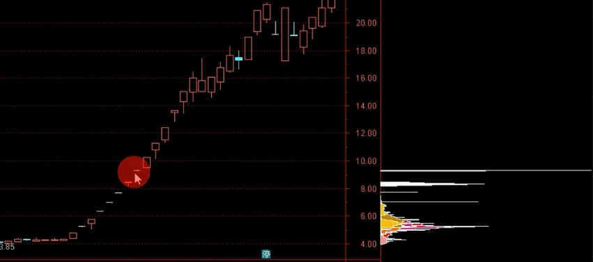

这种标的如何去快速筛选？

低位筹码高度集中，市值在30~50亿之间，股价不超过20元，属于主板。

:::tip

通达信问财：70%成本集中度小于6%；90%成本集中度小于8%；市值小于50亿；除去创业板科创板北交所st股票；股价低于20远；

:::