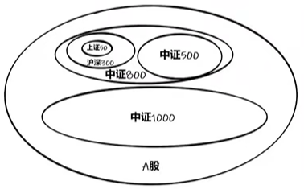

# 股票基础知识

## 交易规则

股票是一种有价证券，是股份公司在筹集资本时向出资人发行的**股份凭证，代表着持有者对股份公司的所有权**。股东以此分享公司成长或交易市场波动带来的利润；但也要共同承担公司运作错误所带来的风险。每支股票背后都有一家上市公司。

### 股票代码

上海：

- 600、601、603、605：A股上海证券交易所主板股票。
- 688：A股上海证券交易所科创板股票。

深圳

- 000、002、003：A股深圳证券交易所主板股票。
- 300、301：A股深圳证券交易所创业板股票。

北京：

- 43、83、87、88：新三板转上来到北交所股票。
  - 基础层43、创新层83、精选层87、新上北交所88。

初始权限：00开头+60开头

进阶权限：

- 3开头创业板：2年交易经验+月均10万资产
- 68开头科创板：2年交易经验+月均50万资产
- 8开头北交所：2年交易经验+月均50万资产，创新层100万

### 交易时间

1. 盘前竞价：9:15~9:25，25分出开盘价

注意：15~20分可挂单可撤单，20~25分可挂单**不可撤单**。

2. 盘中连续交易时间：
   1. 上午：9:30~11:30
   2. 下午：13:00~14:57
3. 尾盘集合竞价时间：14:57~15:00，15:00开出收盘价

注意：这三分钟可挂单**不可撤单**。

4. 盘后交易时间
   1. 沪深两市主板15:00后没有盘后交易
   2. 创业板和科创板有盘后15:05~15:30**以收盘价成交**的交易时间
5. 夜市委托时间：晚上投资者可挂单涨停买入或跌停卖出，挂单时间靠前，可提高成交可能性。具体委托时间不同券商不一样，一般为晚上18:00~22:00。

### 交易规则

1. 数量规则：1手=100股

主板股票买入最少1手及其整数倍，100股，200股，300股……

主板股票卖出，最后一次卖出不可低于100股的零散数量。比如手上130股，如果卖100股剩30股，那么就需要再次买入超过100股才能全部卖出。

2. 回转交易规则

股票：T+1，当天买入，下一交易日可卖出。

可转债：T+0，当天没人，当天就可卖出，无次数限制。

部分场内基金：大部分T+1交易，小部分T+0交易。

3. 资金清算规则

按照T+1原则进行资金清算。账号股票卖出后，资金马上到股票账户，当天可继续使用但不可转出，下一个交易日9:00后可转出至银行卡。

资金转账时间：交易日9:00~16:00。

4. 价格规则：价格优先，时间优先！

连续竞价交易阶段，价格在涨跌区间内有效，当天委托当天有效。在连续竞价交易阶段，不管是买入还卖出，委托价格比别人好就能先成交。同样的价格按照时间排序成交。

涨停价买入，跌停价卖出，都会以实时价成交。

5. 涨跌幅限制

主板股票：上一交易日的±10%。

创业板、科创板：上一交易日的±20%。

ST股、*ST股：上一交易日的±5%。

北交所：上一交易日的±30%。

可转债：不设涨跌幅，有±20%和±30%临时停牌规则。

6. 新股上市首日规则

- 主板股票在集合竞价阶段有效申报价格不得低于发行价的80%，且不能高于发行价的120%。
- 主板股票连续竞价阶段有效的申报价格不能低于发行价格的64%且不得高于发行价格的144%。
- 上市首日深交所设置了临停制度，即：深交所新股当日股价较开盘价上涨至10%时，停盘30分钟；复盘最高涨幅为44%；而上交所的股票可以开盘就上涨到44%。
- 创业板和科创板的股票上市首日不设置涨跌幅限制，但也设有临停制度。即：当日盘中股价较开盘价首次上涨和下跌达到30%时，停牌10分钟；上涨至60%时再次停牌10分钟，两次停牌后就不设置涨跌幅限制。

7. 停牌规则

创业板停牌规则：

- 10个交易日最大偏离值超过100%
- 30个交易日最大偏离值超过200%
- 10个交易日内3次同向异动
- 复牌后10个交易日内触发一次同向异动

:::tip
同向异动：两个交易日涨幅偏离值超过30%

偏离值=股票涨跌幅-创业板综指的涨跌幅
:::

- 停牌时间：首次停牌5个交易日，二次停牌10个交易日。

深市停牌规则：

- 10个交易日内4次同向异动
- 复牌后10个交易日内触发一次同向异动
- 停牌时间：首次停牌5个交易日，二次停牌10个交易日。

上证主板/科创板：无明确停牌规则。

## 炒股术语

### 指数

指数：反映市场的加权平均。

- 上证指数（大盘）
- 深圳综合指数：0和3开头的股票
- 创业板指数：3开头股票
- 沪深300指数：沪深两市市值大、流动性好的300只股票编制而成，每年调整2次成分股。**沪深300能综合反应沪深两市整体走势的跨市场指数。**
- 上证50：从上证180指数样本中选择排名前50位的股票组成样本。
-  中证500：A股中提出**沪深300指数成份股**及总市值排名前300名股票后，总市场排名前500只股票组成，综合反映A股市场中小市值公司的股票价格表现。
- 中证1000：选择中证800外规模较小且流动性好的1000只股票组成，与沪深300和中证500等指数形成互补。

### 其他

#### 股票类型

白马股：长期绩优、回报率高且具有较高投资价值的股票。有关信息公开，业绩较为明朗，同时兼有业绩优良、高成长、低风险的特点，具有较高的投资价值。

蓝筹股：长期稳定增长、大型的、传统工业股及金融股。经营业绩较好，具有稳定较高现金股利支付公司的股票成为“蓝筹股”。

成长股：发行股票时规模不大，但公司业务蒸蒸日上，管理良好，利润丰富，产品在市场上有竞争力的公司股票。

板块：某些公司在股票市场有某些特定的相关要素，以这要素命名的板块。

- 行业板块分类：官方分类，根据行业来分。
- 概念板块分类：比如AI、元宇宙等概念相关股票。

龙头股：某一时期在股票市场炒作中对同行业板块其他股票**具有影响和号召力的股票**。

ST股：Special Treatment缩写，意味”特别处理“，**针对的是出现财务状况或其他状况异常的**。如果加上`*ST`那么该股票就有退市风险，当公司运转正常后，公司向交易所申请撤销特别处理。

#### 市场环境

牛市：股市上扬

熊市：股市下跌

猴市：股市大幅度震荡

利好：刺激股价上涨的信息

利空：促使股价下跌的信息

利空出尽：证券价格因不利消息影响下跌，该趋势持续一段时间跌到一定程度后，投资者就不再被这些”利空“因素所影响，证券价格开始反弹上升。

崩盘：证券市场由于某种利空原因，出现大量抛出现象，导致证券市场价格无限度下跌，不知何种程度止跌。

踏空：股价一直上涨，未能及时买入，因而未能赚到钱。

跳水：股价迅速下滑，幅度很大

阴跌：股价进一步退一步，缓慢下滑的现象，长期不止

平仓：投资者在股票市场卖股票行为

建仓：投资者开始买入看涨的股票

护盘：股市低落、人气不足时，机构投资大户大量购进股票，防止股市继续下滑行为。

割肉：高价买入的股票大势下跌，为避免继续损失，低价赔本卖出股票

套牢：预期股价上涨，不料买入后股价下跌，亏的不想卖了

吃肉：投资赚钱

吃面：投资亏钱

基本面：公司经营状况（财务、盈利、市场占有率）

消息面：突发的利好或利空

技术面：用来观察和预测股票市场走势和内在规律的一些指标和方法

政策面：宏观导向、经济政策、证券市场的政策法规

资金面：货币供应量对金融产品的支持能力以及市场调控政策对金融产品的支持能力，任何行情的动力都来源于资金推动。

#### 投资者团体

散户：股市资金量较小、无能力炒作股票、无组织的个人投资者。

大户：资金实力雄厚、投资额巨大、交易量惊人的投资者。

游资：投机性短期资金，资本市场的游牧民族，炒作热点和妖股的大户。

机构资金：基金、财务公司、证券公司、保险公司等机构的资金。

北上资金：”北“指沪深两市的股票，”南“指香港股票。北上资金就是从香港流入大陆股市的资金。

国家队：中央汇金、证金公司、社保基金、养老基金、国家集成电路产业基金及外管局，国家队既能维稳市场，又要实现资产的资产保值和增值。

主力：主要力量，一般也指股票中的庄家。形容市场或一只股票里有一个或多个操控价格的人或机构，以引导市场或股价向某个方向运行。一般股票主力和股票庄家有很大相似性。

庄家：坐庄某股票，可以影响甚至控制它在二级市场的股价。

:::tip
主力和庄家：小盘股可能存在，大方面不客观存在。
:::

### 交易界面

