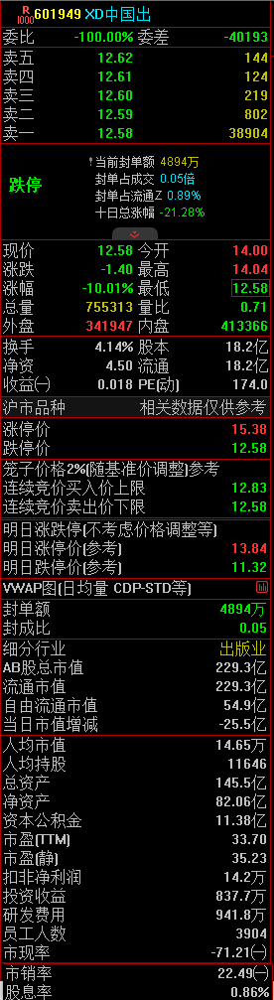
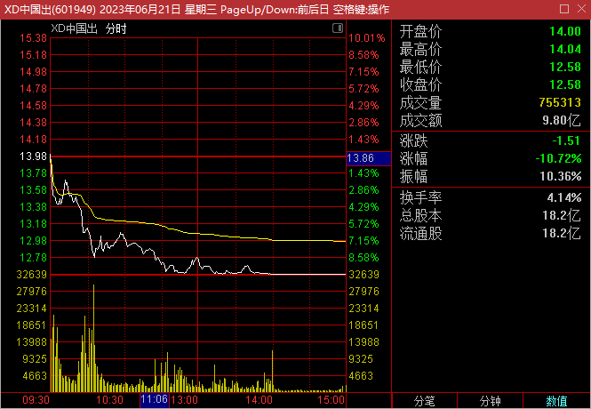
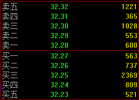

# 股票基础知识

## 交易规则

股票是一种有价证券，是股份公司在筹集资本时向出资人发行的**股份凭证，代表着持有者对股份公司的所有权**。股东以此分享公司成长或交易市场波动带来的利润；但也要共同承担公司运作错误所带来的风险。每支股票背后都有一家上市公司。

### 股票代码

上海：

- 600、601、603、605：A股上海证券交易所主板股票。
- 688：A股上海证券交易所科创板股票。

深圳

- 000、002、003：A股深圳证券交易所主板股票。
- 300、301：A股深圳证券交易所创业板股票。

北京：

- 43、83、87、88：新三板转上来到北交所股票。
  - 基础层43、创新层83、精选层87、新上北交所88。

初始权限：00开头+60开头

进阶权限：

- 3开头创业板：2年交易经验+月均10万资产
- 68开头科创板：2年交易经验+月均50万资产
- 8开头北交所：2年交易经验+月均50万资产，创新层100万

### 交易时间

1. 盘前竞价：9:15~9:25，25分出开盘价

注意：15~20分可挂单可撤单，20~25分可挂单**不可撤单**。

2. 盘中连续交易时间：
   1. 上午：9:30~11:30
   2. 下午：13:00~14:57
3. 尾盘集合竞价时间：14:57~15:00，15:00开出收盘价

注意：这三分钟可挂单**不可撤单**。

4. 盘后交易时间
   1. 沪深两市主板15:00后没有盘后交易
   2. 创业板和科创板有盘后15:05~15:30**以收盘价成交**的交易时间
5. 夜市委托时间：晚上投资者可挂单涨停买入或跌停卖出，挂单时间靠前，可提高成交可能性。具体委托时间不同券商不一样，一般为晚上18:00~22:00。

### 交易规则

1. 数量规则：1手=100股

主板股票买入最少1手及其整数倍，100股，200股，300股……

主板股票卖出，最后一次卖出不可低于100股的零散数量。比如手上130股，如果卖100股剩30股，那么就需要再次买入超过100股才能全部卖出。

2. 回转交易规则

股票：T+1，当天买入，下一交易日可卖出。

可转债：T+0，当天没人，当天就可卖出，无次数限制。

部分场内基金：大部分T+1交易，小部分T+0交易。

3. 资金清算规则

按照T+1原则进行资金清算。账号股票卖出后，资金马上到股票账户，当天可继续使用但不可转出，下一个交易日9:00后可转出至银行卡。

资金转账时间：交易日9:00~16:00。

4. 价格规则：价格优先，时间优先！

连续竞价交易阶段，价格在涨跌区间内有效，当天委托当天有效。在连续竞价交易阶段，不管是买入还卖出，委托价格比别人好就能先成交。同样的价格按照时间排序成交。

涨停价买入，跌停价卖出，都会以实时价成交。

5. 涨跌幅限制

主板股票：上一交易日的±10%。

创业板、科创板：上一交易日的±20%。

ST股、*ST股：上一交易日的±5%。

北交所：上一交易日的±30%。

可转债：不设涨跌幅，有±20%和±30%临时停牌规则。

6. 新股上市首日规则

- 主板股票在集合竞价阶段有效申报价格不得低于发行价的80%，且不能高于发行价的120%。
- 主板股票连续竞价阶段有效的申报价格不能低于发行价格的64%且不得高于发行价格的144%。
- 上市首日深交所设置了临停制度，即：深交所新股当日股价较开盘价上涨至10%时，停盘30分钟；复盘最高涨幅为44%；而上交所的股票可以开盘就上涨到44%。
- 创业板和科创板的股票上市首日不设置涨跌幅限制，但也设有临停制度。即：当日盘中股价较开盘价首次上涨和下跌达到30%时，停牌10分钟；上涨至60%时再次停牌10分钟，两次停牌后就不设置涨跌幅限制。

7. 停牌规则

创业板停牌规则：

- 10个交易日最大偏离值超过100%
- 30个交易日最大偏离值超过200%
- 10个交易日内3次同向异动
- 复牌后10个交易日内触发一次同向异动

:::tip
同向异动：两个交易日涨幅偏离值超过30%

偏离值=股票涨跌幅-创业板综指的涨跌幅
:::

- 停牌时间：首次停牌5个交易日，二次停牌10个交易日。

深市停牌规则：

- 10个交易日内4次同向异动
- 复牌后10个交易日内触发一次同向异动
- 停牌时间：首次停牌5个交易日，二次停牌10个交易日。

上证主板/科创板：无明确停牌规则。

## 炒股术语

### 指数

指数：反映市场的加权平均。

- 上证指数（大盘）
- 深圳综合指数：0和3开头的股票
- 创业板指数：3开头股票
- 沪深300指数：沪深两市市值大、流动性好的300只股票编制而成，每年调整2次成分股。**沪深300能综合反应沪深两市整体走势的跨市场指数。**
- 上证50：从上证180指数样本中选择排名前50位的股票组成样本。
-  中证500：A股中提出**沪深300指数成份股**及总市值排名前300名股票后，总市场排名前500只股票组成，综合反映A股市场中小市值公司的股票价格表现。
- 中证1000：选择中证800外规模较小且流动性好的1000只股票组成，与沪深300和中证500等指数形成互补。

### 其他

#### 股票类型

白马股：长期绩优、回报率高且具有较高投资价值的股票。有关信息公开，业绩较为明朗，同时兼有业绩优良、高成长、低风险的特点，具有较高的投资价值。

蓝筹股：长期稳定增长、大型的、传统工业股及金融股。经营业绩较好，具有稳定较高现金股利支付公司的股票成为“蓝筹股”。

成长股：发行股票时规模不大，但公司业务蒸蒸日上，管理良好，利润丰富，产品在市场上有竞争力的公司股票。

板块：某些公司在股票市场有某些特定的相关要素，以这要素命名的板块。

- 行业板块分类：官方分类，根据行业来分。
- 概念板块分类：比如AI、元宇宙等概念相关股票。

龙头股：某一时期在股票市场炒作中对同行业板块其他股票**具有影响和号召力的股票**。

ST股：Special Treatment缩写，意味”特别处理“，**针对的是出现财务状况或其他状况异常的**。如果加上`*ST`那么该股票就有退市风险，当公司运转正常后，公司向交易所申请撤销特别处理。

#### 市场环境

牛市：股市上扬

熊市：股市下跌

猴市：股市大幅度震荡

利好：刺激股价上涨的信息

利空：促使股价下跌的信息

利空出尽：证券价格因不利消息影响下跌，该趋势持续一段时间跌到一定程度后，投资者就不再被这些”利空“因素所影响，证券价格开始反弹上升。

崩盘：证券市场由于某种利空原因，出现大量抛出现象，导致证券市场价格无限度下跌，不知何种程度止跌。

踏空：股价一直上涨，未能及时买入，因而未能赚到钱。

跳水：股价迅速下滑，幅度很大

阴跌：股价进一步退一步，缓慢下滑的现象，长期不止

平仓：投资者在股票市场卖股票行为

建仓：投资者开始买入看涨的股票

护盘：股市低落、人气不足时，机构投资大户大量购进股票，防止股市继续下滑行为。

割肉：高价买入的股票大势下跌，为避免继续损失，低价赔本卖出股票

套牢：预期股价上涨，不料买入后股价下跌，亏的不想卖了

吃肉：投资赚钱

吃面：投资亏钱

基本面：公司经营状况（财务、盈利、市场占有率）

消息面：突发的利好或利空

技术面：用来观察和预测股票市场走势和内在规律的一些指标和方法

政策面：宏观导向、经济政策、证券市场的政策法规

资金面：货币供应量对金融产品的支持能力以及市场调控政策对金融产品的支持能力，任何行情的动力都来源于资金推动。

#### 投资者团体

散户：股市资金量较小、无能力炒作股票、无组织的个人投资者。

大户：资金实力雄厚、投资额巨大、交易量惊人的投资者。

游资：投机性短期资金，资本市场的游牧民族，炒作热点和妖股的大户。

机构资金：基金、财务公司、证券公司、保险公司等机构的资金。

北上资金：”北“指沪深两市的股票，”南“指香港股票。北上资金就是从香港流入大陆股市的资金。

国家队：中央汇金、证金公司、社保基金、养老基金、国家集成电路产业基金及外管局，国家队既能维稳市场，又要实现资产的资产保值和增值。

主力：主要力量，一般也指股票中的庄家。形容市场或一只股票里有一个或多个操控价格的人或机构，以引导市场或股价向某个方向运行。一般股票主力和股票庄家有很大相似性。

庄家：坐庄某股票，可以影响甚至控制它在二级市场的股价。

:::tip
主力和庄家：小盘股可能存在，大方面不客观存在。
:::

### 交易数值

以下是中国出版的交易数值界面：

成交额：该股票某个交易日的成交金额，同一笔股票买入卖出只计算一次。

均价：一个交易日内平均成交价格，**分时黄线**。

五档盘口：交易股票时买方和卖方给出的价格形成的一种原则。买一和卖一最接近成交价，买二卖二等依次向后排列。

:::tip

价格从`买五--->买一--->卖一--->卖五`依次增高的。如果想买入股票，报价高于等于卖一的任何价位，即可即时成交；如果报价处于买二，那就要和该报价的买入的投资者一起排队等候。

:::

现价：股票当前的价格。

涨跌：股票价格变化。
$$
涨跌=现价-上一个交易日收盘价
$$
涨幅：目前股票的上涨幅度，通常和上一个交易日价格比较，计算出其上涨百分比。
$$
涨幅=\frac{（现价-上一个交易日收盘价）}{上一个交易日收盘价}\times 100\%
$$
今开：当前交易日开盘价，这个价格是当天9:15~9:25集合竞价决定。

最高：当前交易日最高价格。

最低：当前交易日最低价格。

总量：内盘和外盘的交易总和。

内盘：交易中卖方的委托单总量。

外盘：交易中买方的委托单总量。

:::tip

外盘很大意味着多数卖的价位都有人来接，显示买势很强劲；内盘过大意味大多数买入价都有人愿意卖，显示卖方力量较大。

:::

量比：衡量相对成交量的指标，它是开市后每分钟平均成交量与过去5个交易日每分钟平均成交量之比。当量比大于1时，说明当日每分钟平均交易量大于过去5日平均数值，交易比过去5天活跃。

$$
即时每分钟平均成交量=\frac{现成交总手} {当日累计开始时间（分）} \\
量比=\frac{即时每分钟平均成交量} {前五个交易日每分钟平均交易量}
$$
换手率：交易日内该股票的换手率，即股票转手买卖频率。
$$
换手率=\frac{某一段时间内的成交量}{流通股数} \times 100 \%
$$
总资产：上市公司拥有的全部资产，包括流动资产和非流动资产。

净资产：去除公司债务的资产。

净资：公司的每股净资产。
$$
公司净资产=股东权益值=公司总资产-公司债务\\
每股净资产=\frac {净资产数值} {股票数量}
$$
股本：公司发行的全部股票数量。

流通：公司已发行的股票中，可以自由买卖的股票数量。
$$
股本=流通股+未流通股 \\
流通市值=可交易的流通股数 \times 当时股价 \\
总市值=流通市值+未流通市值
$$
自由流通市值：剔除持股在5%以上的股东及一致行动人的持股，以及75%的高管持股。可以简单理解为短期二级市场可以交易的股份。

收益(一)：第一季度每股业绩。
$$
每股业绩=\frac{每个季度净利润}{总股本}
$$
涨停（跌停）价：上一个交易日收盘价格乘以110%（90%）

委比：衡量某一时段买卖盘相对强度的指标。

委差：委买委卖的差值。
$$
委比=\frac{（委买手数-委卖手数）}{（委买手数+委卖手数）} \times 100 \% \\
委差=委买手数-委卖手数
$$
委买手数：所有个股**委托买入下五档的总数量**，即买卖档位里买一到买五的总数量。

委卖手数：所有个股**委托卖出上五档的总数量**，即买卖档位里卖一到买五的总数量。

委比变化范围：-100%到100%，当委比等于-100%时，没有买盘，跌停；委比等于+100%时，没有卖盘，涨停；大于0，买方委托比卖方多。

封单额：涨跌停时封单的金额。

封成比：涨跌停股票收盘时，盘口封单数和成交量的比例。

:::tip

封单：股票交易量暂时达到当日涨跌幅限制，市场的买卖单无法匹配成交成为封单状态。

:::

当日市值增减：股票总市值增减。

人均市值：每股股价乘以人均持股数量。人均持股市值越高，股份越集中。

人均持股：平均持股数量。
$$
人均持股市值=每股股价 \times 人均持股数量
$$
资本公积金：由投入资本本身所引起的各种增值金额，**这种增值一般不是由于公司生产经营活动产生的**，不能用于补充公司经营亏损。主要包括股本溢价、接受现价捐赠、资产重估值增值等。

市盈(静)：静态市盈率，简称PE(静)。
$$
静态市盈率=\frac{每股股价}{去年每股收益}=\frac{总市值}{去年净利润}
$$
市盈(动)：动态市盈率，简称PE(动)。
$$
动态市盈率=\frac{每股股价}{预估全年每股收益}=\frac{总市值}{预估全年净利润}
$$
市盈(TTM)：滚动市盈率，简称PE(TTM)，连续十二个月内。
$$
滚动市盈率=\frac{每股股价}{过去四个季度的每股收益}=\frac{总市值}{过去四个季度净利润总和}
$$
市净率：股票价格和每股净资产之间的比值，**比值越低意味着风险越低**。净资产的多少是由股份公司经营状况决定的，股份公司经营业绩越好，其资产增值越快，股票净值就越高，因此股东所拥有的权益也越多。
$$
市净率=\frac{每股股价}{每股净资产}
$$
市现率：股票价格与每股现金流量的比值，比值越小，表明上市公司的每股现金增加额越多，经营压力越小.
$$
市现率=\frac{每股股价}{每股现金流量} \\
每股现金流量= \frac {（营业业务所带来的净现金流量－优先股股利）}{流通在外的普通股股数}
$$
:::info

比如某公司营业代理的净现金流量为1887.6295万元，优先股股利为零，普通股股数为8600万股，那么每股现金流量=1887.6295万元/8600万股 = 0.22（元/股）

:::

市销率：总市值与主营业业务收入的比值，市销率越低，说明公司股票投资价值越大。
$$
市销率=\frac{每股股价}{每股销售额}=\frac{总市值}{主营业务收入}
$$
股息率：一支股票每年分配的股息与股票市价的比值，股息率可以反映出股票分红的收益率。
$$
股息率=\frac{股息}{每股股价}
$$
扣非净利润：净利润扣除非经常性损益后的利润。提出资本溢价等因素，只看经营利润的高低。

:::tip

非经常性损益：公司发生的与经营业务无直接关系，以及虽然相关但性质影响真实反映公司正常盈利能力的各项收入、支出。

:::

投资收益：企业或个人对我投资所获取的收入。

研发费用：研究与开发某项目所支付的费用。

### 交易原则

当证券交易所电脑主机收到来自不同券商的众多委托买卖之后，系统会自动将买单与卖单分别排队，买单以价格从高到低排列，价格相同的，按进入系统的先后顺序排列，卖单以价格从低到高排列，价格相同的，按进入系统的先后顺序排列，这就是上面提到的**买卖档位**，一般可以看到五档，付费LEVEL2后可以看到更多档。
委托买卖挂单排好队后，证券交易所电脑系统按照**价格优先和时间优先**的原则进行撮合成交。价格优先，指对于委托买入的挂单，价格高的优先成交，对于委托卖出的挂单，价格低的优先成交；时间优先，指对于价格相同的委托买入挂单或委托卖出挂单，按照交易所主机系统接受申报的时间来确定，谁来的早谁优先成交。

撮合成交规则是：

- 最高委托买入价格与最低委托卖出价格相同，则该价格就是成交价。
- 委托买入价格高于即时揭示的最低委托卖出价格时（即**卖一**价格)，以即时揭示的最低委托卖出价格为成交价（以**卖一**的价格成交)
- 委托卖出价格低于即时揭示的最高委托买入价格时（即**买一**价格)，以即时揭示的最高委托买入价格为成交价（以**买一**的价格成交)
- 若是按以上规则不能成交的，则继续在各自的队列中等待成交，若是部分成交，则剩余部分继续等待成交，直至投资者主动撤回该笔委托，或者当日委托失效。而股票的即时价格，就是该股票最后一笔的成交价格，这个价格可能是卖一或买一的价格，也可能是两者中间的一个值。

技巧：想买入一个正在上涨的股票，为了防止该股票价格变化太快来不及买入，可以根据「价格优先原则」挂高价，同理想卖出正下跌股票，挂低价。

### 股票前缀

XD：当日是这只股票的除息日，在除息日这天，股价基准价比前一个交易日的收盘价要低，因为从中扣除了利息这一部分差价。

XR：当日是这只股票的除权日，在除权日这条，股价也比前一交易日收盘价要低，因为股数的扩大，股价被摊低了。

DR：当日是这只股票的除息、除权日。

股票代码旁边的R是融资融券股票的标志，该股可以进行融资融券，融资即加杠杆买入，融券即做空，但一般券商都不会有券源。

名字带N是值新股首日上市，名字带C代表股票正处于上市后次日到第五日之间，名字带U代表公司尚未盈利，如上市后首次实现盈利，则U取消。

:::danger

分红能赚钱吗？

不一定的，比如100块的股票，分红10块，那么就意味着该股的价值会降低10块，10块钱到手，但股价会下跌到90块，不仅如此，得到的10块如果持股期限过短，还需要交红利税。这种操作，类似于拿自己的钱给自己分红。

但如果是好公司，它能慷慨发钱，未来就有更多人买它，价格还是会涨上去的，这个涨上去的过程，叫做填权。所有分红短期内本身不赚钱，填权才赚钱，本质上赚的是公司成长的钱，而不是左手倒右手的钱。

:::

