# 股票指标精讲

## 筹码理论

### 图中指标

1.黄白线

- 白线表示当前股价亏损的筹码
- 黄线表示当前股价盈利的筹码
- 蓝线表示当前股价市场所有持仓筹码的平均成本

2.移动成本图

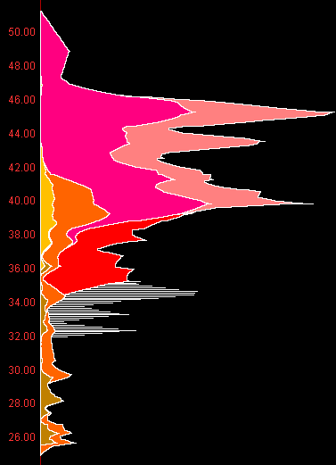

图形长度：当前价格堆积的筹码。

某种颜色面积：某周期筹码比例。

N周期前成本x%：N天前筹码所剩比例。

:::tip

远期移动成本图（火焰图）计算是N天前的成本，近期移动成本图计算的N天内的成本。

:::

3.底部文字

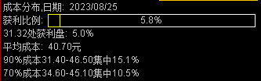

获利比例：**当日收盘价**获利盘比例，比例越高说明越多人获利

31.32处获利盘：**当日在指定价格**获利盘比例

平均成本：当前股价市场所有持仓筹码的平均成本，即黄白线图中的蓝线

成本集中度：

95%获利价格是31.40，5%获利价格是46.5，那么集中度为`(95%获利盘-5%获利盘)/(95%获利盘+5%获利盘) * 100%`

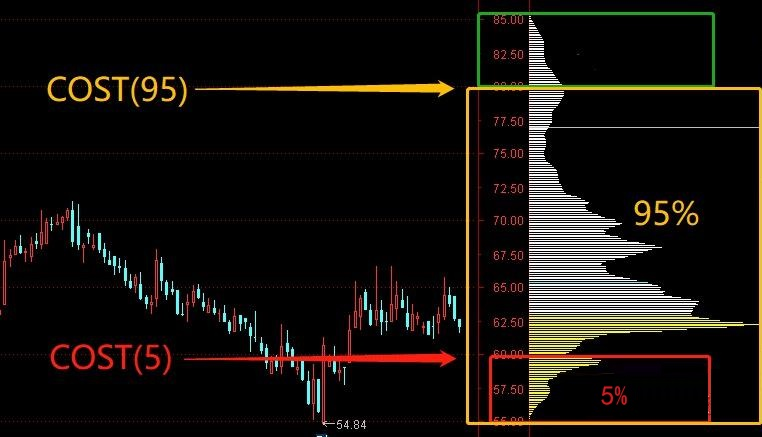

> 成本集中度标准：
>
> - 90%
>   - 10%~15%：一般集中
>   - 5%~9%：高度集中
> - 70%
>   - 8%~12%：一般集中
>   - 3%~7%：高度集中

### 主力筹码计算

筹码峰计算：上沿减下沿区域的获利盘，得到的就是某段价格的筹码占比。

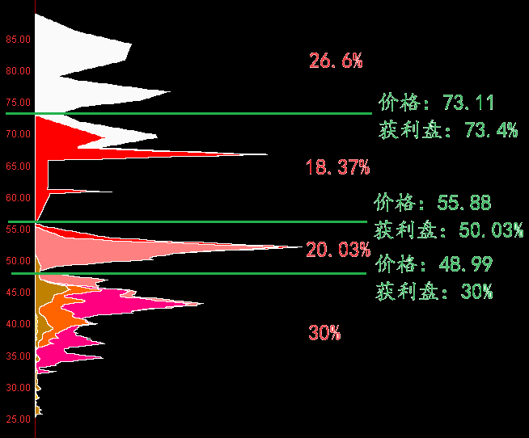

判断主力筹码：

1. 获利不抛的筹码是主力筹码
2. 解套不卖的筹码是主力筹码
3. 横盘洗不掉的筹码是主力筹码

中小盘主力建仓成本仓位：30%~45%

**如果底仓保持的30%以上，主力处于锁仓状态；底仓低于20%，主力已经部分出货；底仓低于10%，主力出货坚决。**

### 筹码看支撑位和压力位

#### 单峰密集形态

1.底部单峰密集

一般底部单峰密集形态需要长时间横盘整理才能完成。是主力吸筹建仓的重要方法之一，主力建仓的目标价位区，利用横盘震荡洗掉里面的浮筹。

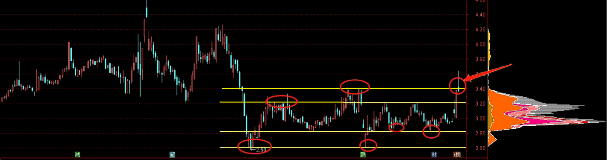

筹码峰上沿会存在多重顶部结构，筹码峰下沿会存在多重底部结构。所以底部单峰密集形态适合中长线布局。

如果能放量突破，那么后市看涨，逢低布局即可。突破后，之前筹码峰的上沿会转换为一道强有力的支撑。

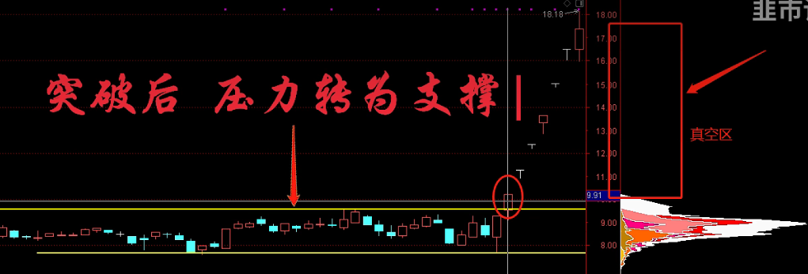

2.高位单峰密集

一般是股价经过一轮大幅度拉升后，然后横盘震荡所形成的在，这种走势一般维持时间相对比较短，主要目的是为了掩护主力出货用的。一旦下方筹码走完，在上方形成的单峰密集形态，下方为真空形态，一旦出现跌破筹码峰下沿情况，那将是非常危险的信号，需要及时止盈或止损。

**这种高位单峰密集形态尽量不要去碰**，虽然有特例。

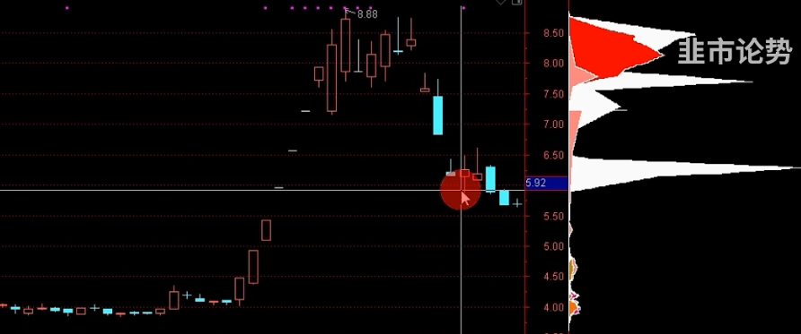

3.下跌途中的单峰密集形态

一般这种形态多半是短线筹码居多，所以股性相对比较活跃。

如果拉升，遇到筹码峰上沿不能放量突破，就止盈；

如果下跌，跌破筹码峰下沿情况，就以观望为主。

:::tip

总结：

- 单峰密集形态上沿是压力位，有效突破后将转化为未来的支撑位
- 单峰密集形态下沿是支撑位，跌破后将转化为压力位

:::

#### 多峰密集形态

1.下跌过程形成的

下跌过程中有很多套牢盘，这些筹码组成强有力的压力位，股价上涨后，就会有人要解套，再把股价打压下去。

对这类形态，不要参与中长线布局。

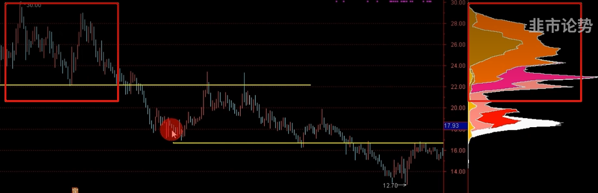

2.上涨过程中形成的

每当拉升无力回踩下来，下方的筹码峰就可以作为一道强有力的支撑位。股价下跌后，一旦跌到下方密集峰的位置，该密集峰筹码将会出现没有钱可赚的情况，没钱赚就不会有人卖，不卖就会止跌，从而支撑股价。

下方密集峰筹码越多，支撑力就越强，如果股价跌破密集峰，那么支撑失效。

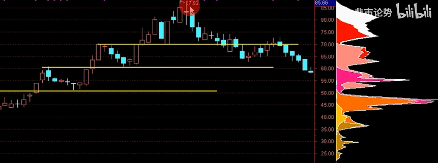

多峰密集形态结论：

- 如果股价在最上方密集峰的位置，中、下方密集峰将是支撑位
- 如果股价在中间位置，上方为压力位，下方为支撑位
- 如果股价在最下方密集峰的位置，中、上方密集峰都将是压力位

### 主力吸筹拉升步骤

1. 确定标的

- 选择跟政策方向有关的板块。
- 标的盘子不能太大，流通盘5亿一下，市值在100亿以内的。

选择游资和主力偏好的情绪周期个股。

2. 建仓

主力永远会选在低位，大跌后捡便宜。主力建仓的整个过程，就是高位散户割肉的过程。

高位筹码绝望割肉离场，不坚定的浮筹清理出局。

洗盘完成：大部分高位筹码都转移到了下方，在下方形成单峰密集形态。

3. 拉升试盘

1. 热点催发在底部形成堆量

2. 股性明显变得活跃，来吸引更多资金入场，形成合力推升股价突破筹码峰上沿，让股价脱离主力成本区

   1. 温和放量突破：主力已经高度控盘，场内没有对手盘来打压股价

   1. 放巨量拉升，并且还冲高回落，那么就证明场内抛压过大，分歧很强，还需要继续洗牌，来增加控盘度

   1. 最好是以涨停方式一阳穿多线突破最佳

3. 一旦发现试盘，并且有热点刺激，就是介入的最佳位置。

:::danger

注意：

- 回踩时候，洗盘周期不能超过10个交易日，否则人气容易流出，如果主力资金流出，那就需要及时走人了。
- 要知道这种票走的是趋势还是情绪
  - 如果走的是趋势，那么股票就会拉升一波后就会进行洗盘调整，然后继续拉升。特征：主力洗完盘后，始终都会在低位保留一部分筹码，以达到控盘目的。当股价突然加速，放巨量上涨，特别是连续涨停，表明该股拉升即将进入尾声，主力已经没有做多意向。
  - 如果走的是情绪，二板确定龙头地位后，主力资金大幅封板。

:::

### 主力高位出货模式

1.高位缓步推升出货模式

当股价经过快速拉升后，主力大部分筹码开始转移至上方，在上方慢慢形成筹码单峰密集形态，然后主力在高位小幅度推升卖出底仓。

优点：既可以让场内资金不流失，又可以吸引场外资金不断参与进来。

2.高位横盘出货模式

当股价经过快速拉升后，主力大部分筹码开始转移至上方，在上方慢慢形成筹码单峰密集形态，然后主力在高位小幅度震荡横盘，卖出大部分存货。

优点：既可以让场内资金不流失，又可以吸引场外资金不断参与进来。

3.高位震荡出货模式

当股价经过快速拉升后，主力大部分筹码开始转移至上方，在上方慢慢形成筹码单峰密集形态，然后主力在高位大幅度震荡，卖出大部分存货。

优点：既可以让场内资金因为方向不明确而持股观望，又让场外的短线交易者觉得有差价可以做，而不断参与进来。

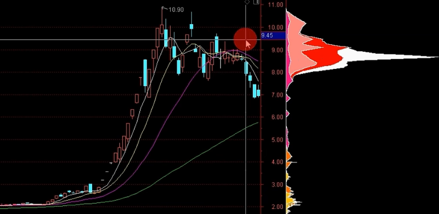

共同特征：底部筹码慢慢消失，高位密集峰的下方没有明显的筹码作为支撑。

### 优秀的筹码结构

**妖股在启动前筹码都非常集中，并且都有一根非常长的顶格筹码。**直到股价拉升无力时，底部的顶格筹码开始松动了，等底仓跑差不多时候，股价就会下跌。

当然并不是说顶格筹码动了，就一定会进行调整，但至少证明底下筹码开始松动了。

比如下面中通客车走势，虽然底部的顶格筹码松动了，且底仓跑完了，但在市场合力的作用下，照样一路高歌猛进。**一旦市场形成合力，那么股票就不只是主力在拉升了，而是散户、游资、主力一起拉升，这种情况再看筹码，意义就不大了。**

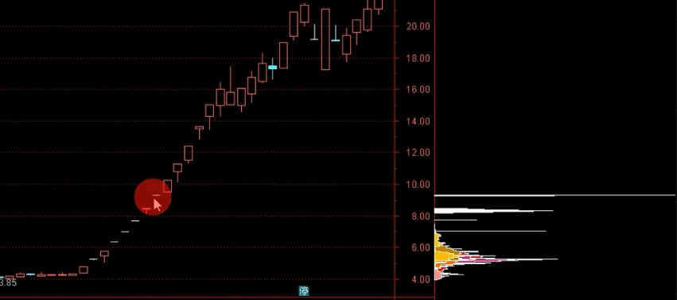

这种标的如何去快速筛选？

低位筹码高度集中，市值在30~50亿之间，股价不超过20元，属于主板。

:::tip

通达信问财：70%成本集中度小于6%；90%成本集中度小于8%；市值小于50亿；除去创业板科创板北交所st股票；股价低于20远；

:::

## MACD

### 基本组成

基本组成：

1.黄白线

白线DIF：快线

黄线DEA：慢线

2.零轴线：零轴以上属于强势区域，零轴以下属于弱势区域。

3.柱

- 红柱越长，证明上升动能越强
- 绿柱越长，证明下跌动能越强

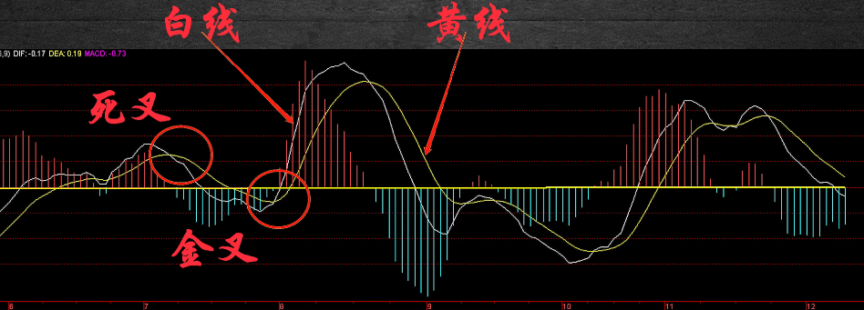

### 金叉与死叉

1.零轴以下的金叉：只代表波段的一种企稳信号，并不能构成一个买入信号。

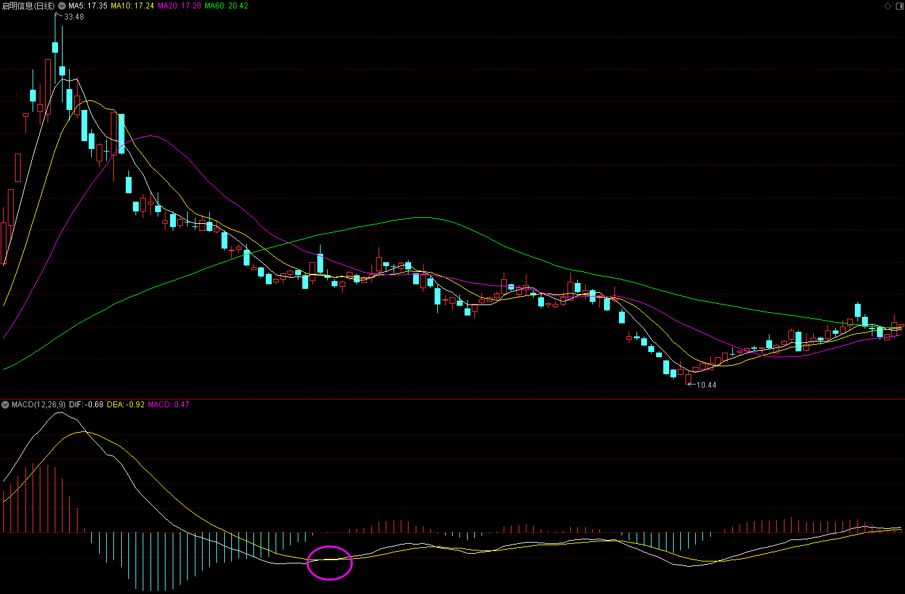

2.零轴以上的金叉：走第二波、第三波行情，可能是一个二波起飞点，也可能是波段的一个顶点。**所以风险和机会是并存的。**

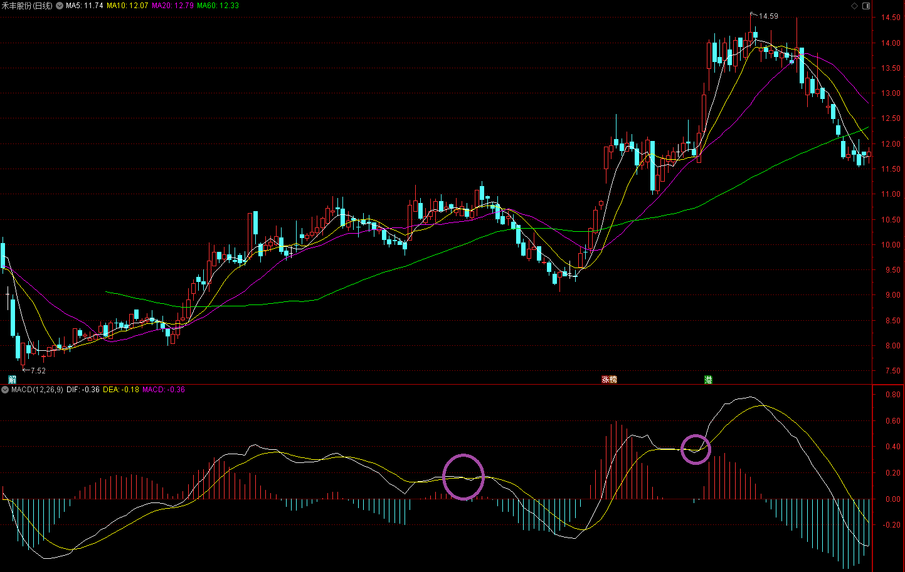

3.零轴附近的金叉

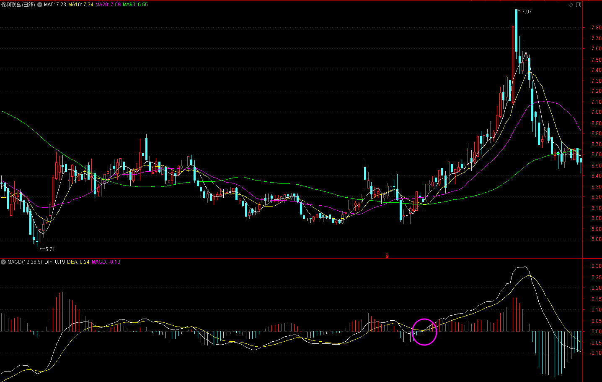

:::tip

当黄白线从零轴下方回到零轴形成金叉，这是一个最佳买点；次一点的买点是零轴以上的金叉。

:::

1.死叉在零轴上方：行情是不好的，代表波段下跌或趋势下跌。

2.死叉在零轴附近：代表着一种下跌中继，即时不下跌，那么这个位置最好形态也只是横盘整理。

3.死叉在零轴下方：可以适当关注，代表着底部即将到来。

### 背离

背离的两种形态：

1.红绿柱背离：柱子高度与走势是相反的

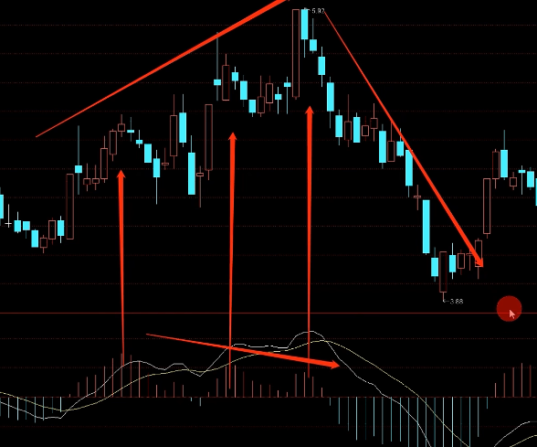

2.黄白柱背离

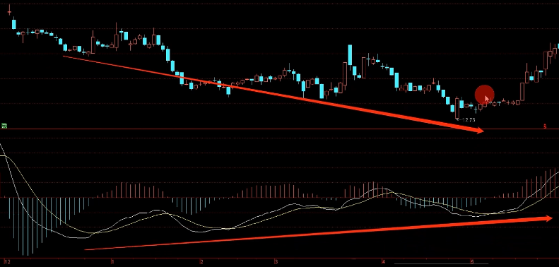

:::tip

背离出现的次数越多越久，主升的行情也会越来越强。

MACD是趋势指标，只适合做趋势票。

:::

### MACD的属性

大周期确定方向，小周期确定操作。

## 内盘和外盘

内盘：从里面出来卖出来的资金，即主动以等于或低于买一价成交的股票数。

外盘：从外面主动进去的资金，即等于或高于卖一价成交的股票数。

比如下图，里面的资金以低于等于47.33价格卖出就构成内盘成交量，外面资金以高于等于47.34价格买入就构成外盘成交量。

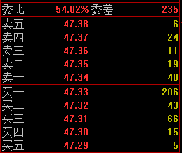

外盘>内盘：买方力量要强于卖方力量。

内盘>外盘：卖方力量要强于买方力量。

## 集合竞价

### 竞价基础

竞价：解读主力资金当日的操作意图。

集合竞价最适合哪些个股？

- 热点板块的题材个股：市值小，股性非常活跃。主力可以花费少量资金实现拉涨停板，并且趁着热点拉高后容易出货。而权重大盘股，布局中长线的筹码多，流通性比较差，收集筹码要花费很长时间，盘子这么大，不是每个机构和游资都能拿出这么多资金。
- 有主力明显运作的个股：经常涨停的个股。

集合竞价的规则：

- 9:15~9:20：开放式竞价，可以撤单。
- 9:20~9:25：不能撤单，都是真实成交量能。

比较猥琐的方式，就是有些主力会在9:15时候开很高的价，然后在9:19时候的50多秒撤单，然后散户来不及反应，撤不了单，被骗追高。

竞价成交原则：

1. 价格优先
2. 同价格，时间优先
3. 同价格，同时间，量大优先

最后集合竞价已经匹配的量是需要等集合竞价结束后，在9:25统一成交。如果挂的单没有匹配上，那么不撤单就会自动延续到开盘，直到撮合成交。

白点：代表一次竞价撮合，白点越多说明竞价活跃度越高。

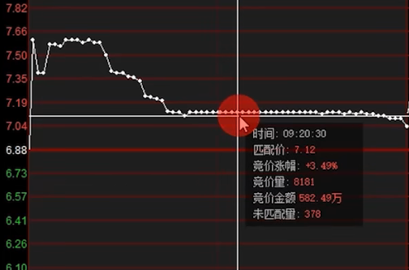

红绿柱：

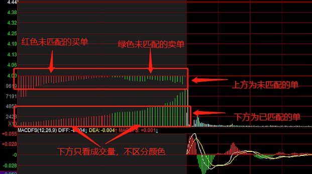

竞价选标的：

- 不是红柱越多越好，因为这么多会造成竞价涨停，缺少买入机会，而且这种竞价一般是主力行为，很有可能盘中砸盘，要小心。**比较好的情况是上方红柱逐步放大。**
- 绿柱越多，说明这个价格想卖的人越多，这时候上方就会形成一道非常强的卖方抛压。因此**尽量选择上方绿柱少，卖出欲望不强烈的票。**

比如下图，竞价开始的5分钟，匹配到了非常多的卖单，主力就知道里面卖盘还是太多了，一般竞价压力大的票主力一般都不会盲目去拉，除非遇到极大的利好。

后5分钟由于不能撤单，看到的都是真实成交量，下方竞价成交量不需要区分颜色。**如果下方量柱逐步放大，股价逐步拉升，这种竞价就是好的。**

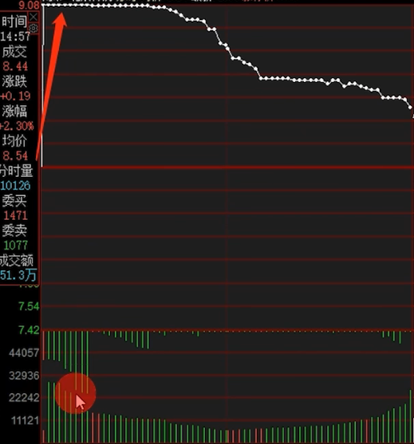

:::danger

竞价强不等于开盘强，因此竞价不建议盲目参与，看看就好，最好等开盘后再上车。

:::

### 利用竞价图判断强弱

1. 集合竞价最强的走势是一字板，开盘后可能还是涨停，但也有可能砸盘。一字板5板以下尽量不要去碰，5板以上可以做一字惯性板，第二天吃溢价下车。
2. 竞价前5分钟有大单试盘封板，这种走势一般出现在二板以上，遇到了一定要重点关注，因为这种竞价走势在首板位置很容易实现封板
3. 竞价尾盘出现抢筹，并且股价跟着抬升，出现量价齐升的走势，放量标准是尾盘的量柱至少是前几分钟的2~3倍。
   1. 开盘跳空高开往上走：竞价强，开盘强。
   2. 开盘后虽然没有出现跳空高开往上走，但还有有大单继续抢筹，实现量价齐升。
   3. 竞价虽然量价齐升，但开盘后直接往下跌，由强转弱，一旦跌破竞价密集区，想上来就非常困难了。
4. 竞价走一条直线，但尾盘又有抢筹情况，量升价不涨，出现放量滞涨的竞价走势。
   1. 开盘跳空高开往上走，快速脱离开盘跳空成本密集区。
   2. 开盘后出现震荡走势，因为分歧大，所以最好是经过多次回踩确认后，抛压得到释放，支撑又依然有效，然后再继续放量往上拉，突破分时箱体区间。
   3. 开盘直接往下走，竞价位置就会成为压力位。
5. 竞价尾盘有抢筹，但股价往下跌，这种走势是最弱的，即时有主力往上拉，抛压也会很大。

竞价弱转强：

- 水上弱转强：竞价走势一直在零轴上。这种走势一般在上方抛压不大的情况下，拉升概率还是非常大的。
  - 开盘不能跌破竞价密集区或不能去回补下方缺口。
  - 不能大幅高开，高开太高，就容易出现诱多走势。
- 水下弱转强：竞价开始时候出现大幅度低开，看起来非常弱，随后竞价由弱转强，慢慢向零轴靠近。
  - 必须要回补缺口，分时走势能站在零轴之上。

竞价强转弱：

- 有些票没有出现大幅高开，那么它的抛压就集中在那一块了，开盘后就一旦突破竞价最高点，那么之前竞价没有匹配的卖点自然就全部吃掉了。
- 股价一步步走弱，每步都将形成抛压，这条就不用做了。

### 集合竞价抓首板

涨停是资金运作的结果，主力单独做需要资金量大、风险大，吸引场外资金合力做则事半功倍，风险分散。

比如有些股票，集合竞价开始会拉到涨停，然后快9:20时候回落，这样做的目的是啥？【大单试盘】

- 看股价回落的力度：如果回落的比较多，那么代表抛压就比较大，可能今天去拉升就不合适。如果抛压不大，只是回落几个点，那么开盘去拉涨停就相对更轻松些。
- 看跟风盘多少：如果跟风盘不是，那么证明很多场外资金还是比较看好这个标的的；如果跟风盘较少，甚至出现卖盘，证明这个标的既没有引起场外资金关注，而且分歧还很大。

后5分钟主力怎么吸引场外资金？【竞价抢筹】

在竞价最后阶段去抢筹，用大资金先把股价抬上去一点，实现量价齐升的假象。

为什么这样做？

- 留住场内资金：让场内资金觉得今天很强势，留下了观望观望，那么开盘时候就不会急着去卖。
- 吸引场外资金关注：因为竞价强势被吸引过来，这时候很容易造成买方力量大于卖方。主力点火，散户抢筹，股票上涨；如果没有反响，说明分歧很大，那么就继续洗盘。

:::tip

竞价放量往下走，开盘直接往下走，跌破零轴的标的，就可以暂时不关注了。

:::

