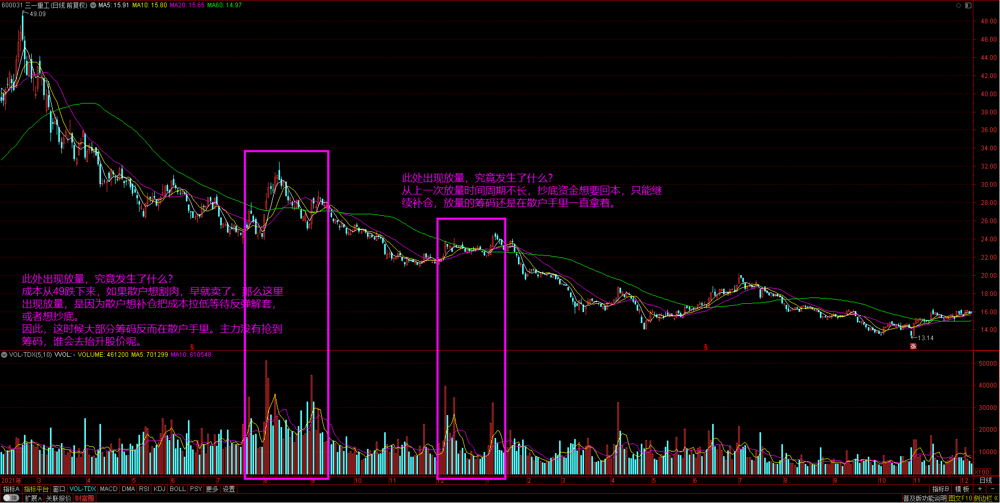
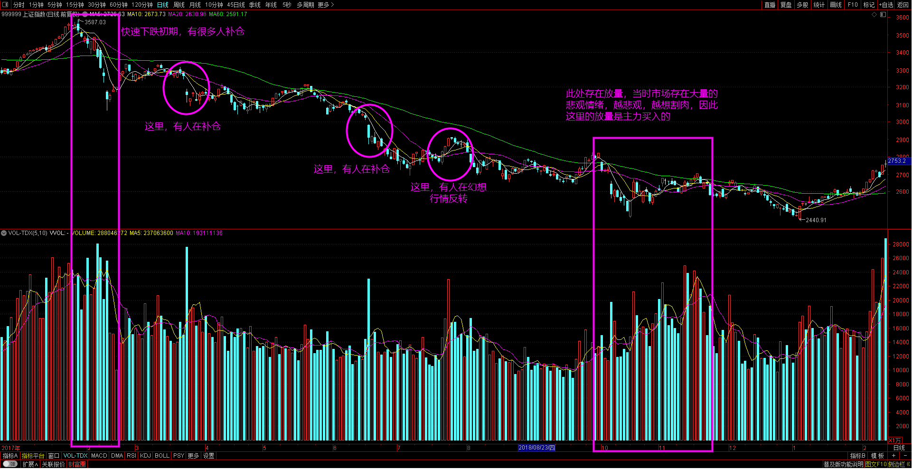
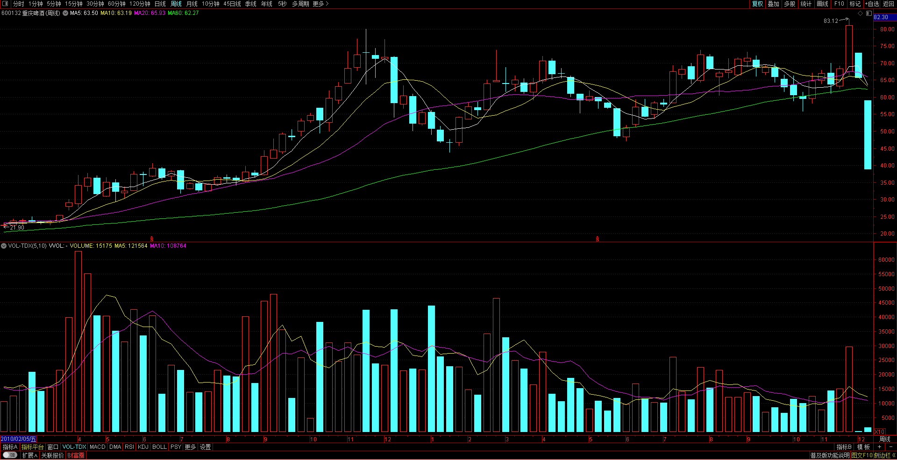
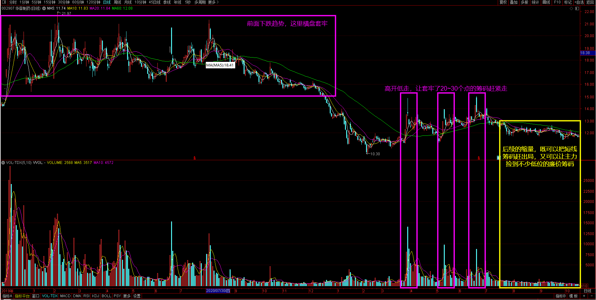
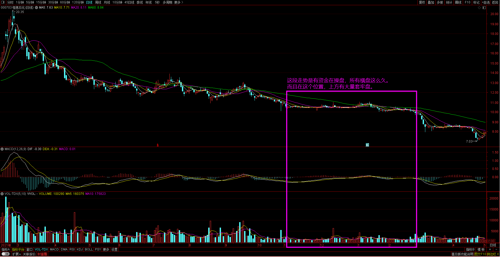
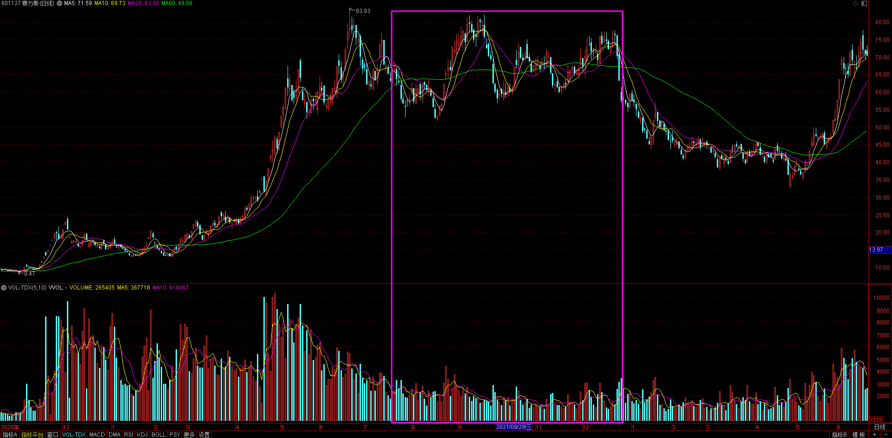
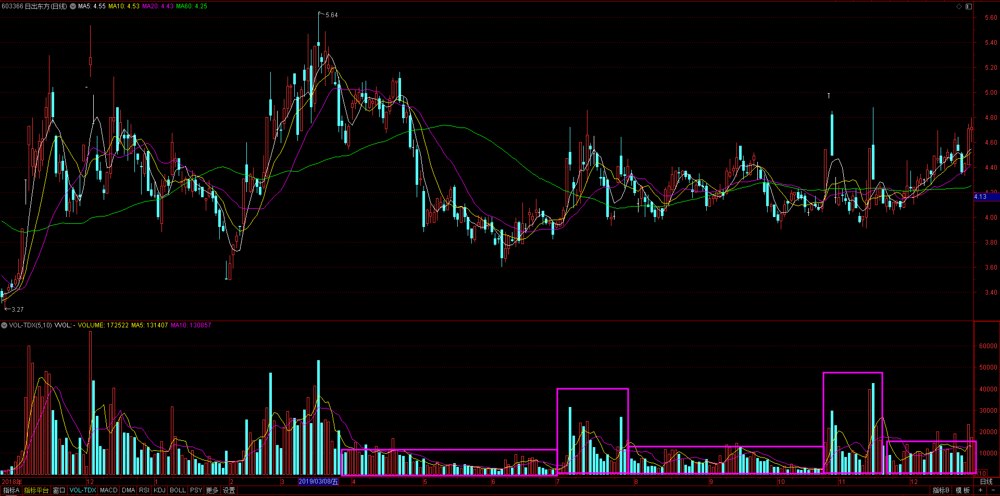

# 量价逻辑

## 堆量

量的核心：谁买了？谁卖了？

哪些人可能会买？

- 抄底资金：一路腰斩下来，价格、空间都是相当合适的
- 高位进入补仓的资金：高位被套，现在构双低止跌了，肯定想补仓把成本拉低，好及时解套
- 主力建仓资金
- 高位主力还未出完的资金：主力重新补仓，再反复拉升出货

比如下面三一重工的例子，虽然放量了，但经过分析是散户补仓和抄底，最终股价还是下跌。

**不要认为跌多了就是底部，放量就是底部**，直到高位买的、抄底资金买的通通交代了，主力才能拿到筹码，股价才能拉升。

看2018~2019年上证指数的例子，从3500多点跌倒2400。

什么样的堆量是可以买的？

1. 时间：跌的时间够长了，或者盘整时间够长了
2. 空间：跌幅要够大
3. 量：单日放量不要看，要看阶段性堆量

## 单日放量

### 单日放量的风险

上图是非常标准的放量上涨缩量回调再次放量突破，但最后是急速下跌，这种走势错在哪里？

走势太过于完美了，走势太过于完美需要注意：

- 注意前期已经出现过大幅拉升的票，特别是一些已经拉升脱离主力成本区的票，是不知道干什么的
- 盘整时间过长的票，主力在洗盘？
- 拉升向上突破是否伴随的利好，当所有人都知道的利好就不是利好了，当所有人都知道的利空不一定是利空

:::tip

这种风险票的特点：

- 有单日放量
- 之前都有一波较大的涨幅
- 在高位盘整的时间比较长
- 走势都太完美

:::

### 重点关注的单日放量

如何快速的把短线客清出局？长时间缩量调整，即清理了短线筹码，又吸到不少低位廉价筹码。因为他们如果不出局，那就会影响主力的出货节奏。

## 缩量

交易不活跃，观察市场品种。

什么情况下会出现缩量？

- 连续下跌以后，市场变得非常低迷，多空双方都不想交易了。
- 主力经过长时间吸筹洗盘，将大部分筹码都集中到自己手里，那么这时候流通盘一少，自然会出现逐渐缩量的情况。

### 注意风险的缩量

低位缩量是不是就好呢？低位缩量肯定是好的，但**低位是很难判断的**，所以才借助其他辅助指标。

1.缩量长时间（10天以上）收在一根直线上，而且套牢盘很多，这种缩量就不一定好。

这种横盘走势，主力显然是无法收集筹码的，主力想要收集筹码，那就需要让股价上下波动。所有可以看到下图在横盘后，股价继续下跌。

2.高位缩量

原先看好这个市场的人开始不看好了，一旦大家看不到希望，资金就会开始转移。

### 重点关注的缩量

放量后缩量，然后放量，然后再缩量。

缩量的本质：**重点是有主力资金在参与**，无论阴跌几波，之后都会有一波短暂快速拉高，让阴跌中抄底的资金获利出局，让之前追涨的资金割肉或解套离场。

主力为何要让抄底资金赚钱，不砸盘更狠些？有时候大势没有系统性风险，不可能砸的更深，它只会采取反复拉扯，在下跌中收集筹码，还有在下跌过程中主力不可能完全买完了，肯定有抄底资金入场。抄底的短期资金反弹10个点，在震荡中就会卖掉筹码，这样就变相让你帮主力收集到筹码了。主力不在乎这点，因为它知道以后会走的更高。

## 爆量

爆量往往是在市场最热的时候，很多人都想参与。爆量也是强分歧的一种表现，因为分歧越大，成交量就越大。

爆量的三种情况：

- 情绪爆量：经过连续拉升后
- 阶段性爆量，一般发生在趋势票上
- 利空造成的连续性下跌，然后突然有大资金抄底入场

